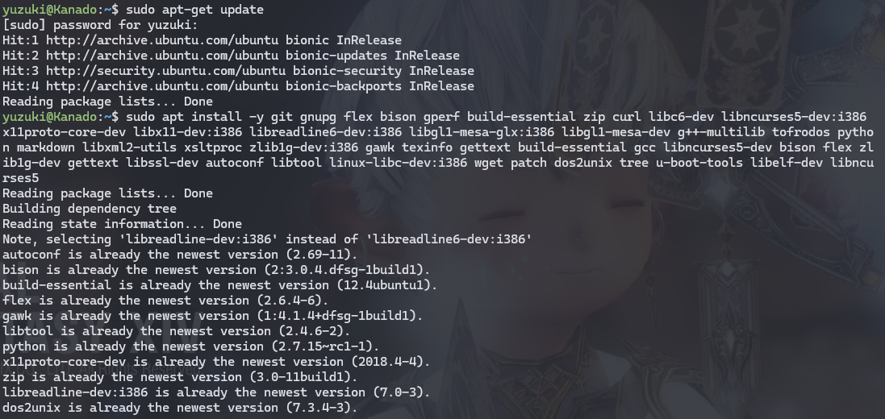

# 开发环境准备

## 硬件要求

构建整个 Android SDK 项目对开发主机的要求相对较高。要求开发主机的处理器至少为 4 核，内存容量为 32GB 或更高，硬盘容量为 500GB 或更高。

| 组件         | 最低配置            | 推荐配置                                         |
| ------------ | ------------------- | ------------------------------------------------ |
| 处理器 (CPU) | Intel Core i3-6100U | AMD Ryzen 9 5950X 或 Intel Core i9-12900K        |
| 内存 (RAM)   | 16GB DDR4           | 64GB                                             |
| 硬盘 (存储)  | 512GB HDD           | 2TB NVMe SSD                                     |
| 图形处理器   | 微软基本图形        | NVIDIA GeForce RTX 3090 或 AMD Radeon RX 6900 XT |

## 操作系统

构建 Android 项目的主机操作系统可以有很多种选择，一般选择在安装 Fedora, open SUSE, Debian, Ubuntu, RHEL 或者 CentOS 等 Linux 发行版的本地主机上进行构建，这 里推荐的是 Ubuntu20.04 64bit WSL2 系统，后续开发也是以此系统为例进行介绍。

## 安装软件包

```shell
sudo apt-get update
sudo apt install -y git gnupg flex bison gperf build-essential zip curl libc6-dev libncurses5-dev:i386 x11proto-core-dev libx11-dev:i386 libreadline6-dev:i386 libgl1-mesa-glx:i386 libgl1-mesa-dev g++-multilib tofrodos python markdown libxml2-utils xsltproc zlib1g-dev:i386 gawk texinfo gettext build-essential gcc libncurses5-dev bison flex zlib1g-dev gettext libssl-dev autoconf libtool linux-libc-dev:i386 wget patch dos2unix tree u-boot-tools libelf-dev libncurses5
```



如果出现

```
E: Unable to locate package libncurses5-dev:i386
E: Unable to locate package libx11-dev:i386
E: Unable to locate package libreadline6-dev:i386
E: Unable to locate package libgl1-mesa-glx:i386
E: Unable to locate package zlib1g-dev:i386
E: Unable to locate package linux-libc-dev:i386
```


请安装 i386 支持，如下：

```
sudo dpkg --add-architecture i386
sudo apt-get update
sudo apt install gcc-multilib 
sudo apt install libc6:i386 libstdc++6:i386 lib32z1
```

## 演示

import AsciinemaWidget from '/src/components/AsciinemaWidget';

<AsciinemaWidget src={require('./assets/01-env-prev/env.docx').default} rows={30} idleTimeLimit={1} preload={true} />

