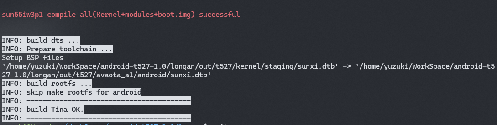
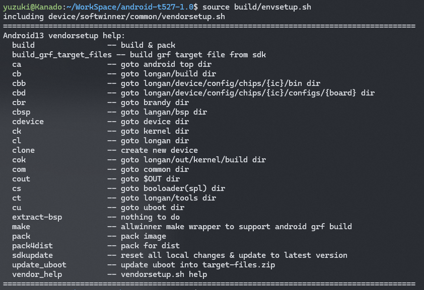
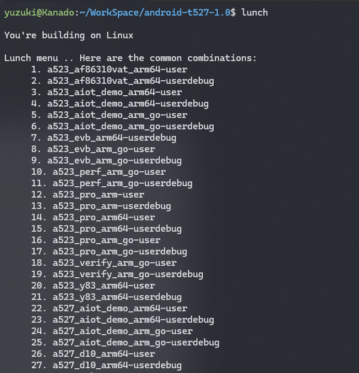
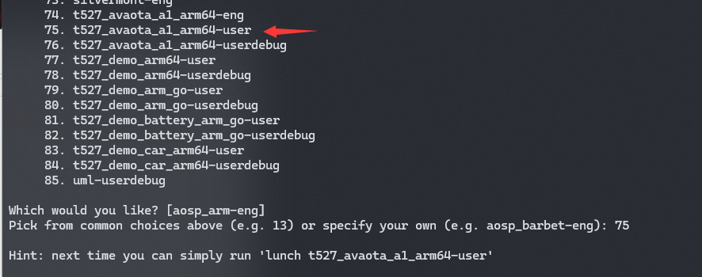
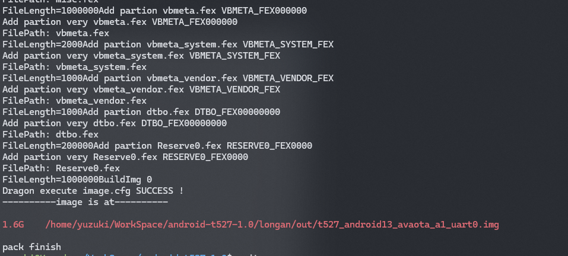

# 编译 Android 系统

获取 SDK 并解压后，即可进行开发。

## 编译 Linux 内核

首先进入 longan 目录，编译 Linux 内核，先对内核进行配置：

```shell
cd longan
./build.sh config
```

选择项如下所示：

```
========ACTION List: mk_config ;========
options :
All available platform:
   0. android
   1. linux
Choice [android]: 0
All available ic:
   0. a523
   1. a527
   2. t527
Choice [t527]: 2
All available board:
   0. avaota_a1
   1. demo
   2. demo_battery
   3. demo_car
   4. demo_fastboot
   5. demo_linux_aiot
   6. demo_linux_car
Choice [avaota_a1]: 0
All available flash:
   0. default
   1. nor
Choice [default]: 0
```

然后进行内核的编译

```shell
./build.sh
```

之后编译完成，如图所示：



### 构建内核演示

import AsciinemaWidget from '/src/components/AsciinemaWidget';

<AsciinemaWidget src={require('./assets/03-build/build-kernel.docx').default} rows={30} idleTimeLimit={1} preload={true} />

## 编译 Android

回到主目录，初始化环境

```
source build/envsetup.sh
```



载入方案

```
lunch
```



在这里可以选择方案，有三个方案可供选择：

1. `t527_avaota_a1_arm64-eng`：开发版，开放串口控制台，ROOT等。内核适配时使用。
2. `t527_avaota_a1_arm64-user`：用户使用版，关闭串口控制台，加快启动速度，adb调试需要授权。产品固件使用。
3. `t527_avaota_a1_arm64-userdebug`：用户调试版本：默认开启用户调试。调试APP使用。

在这里我们选择 75，也就是用户使用版作为演示。



开始编译（这里演示使用的是部分预编译完成的，从零编译大约需要2小时）

```
make
```

<AsciinemaWidget src={require('./assets/03-build/build-android.docx').default} rows={30} idleTimeLimit={1} preload={true} />

## 打包固件

在内核和安卓都编译完成后，运行 `pack` 命令对固件进行打包。

```
pack
```



打包后的固件在 `longan/out` 目录下
