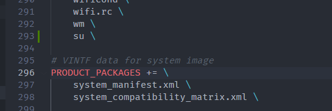
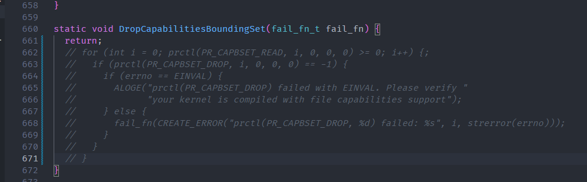
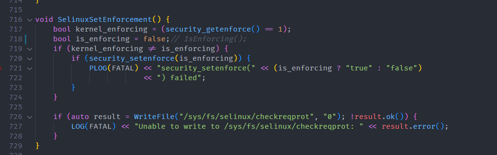
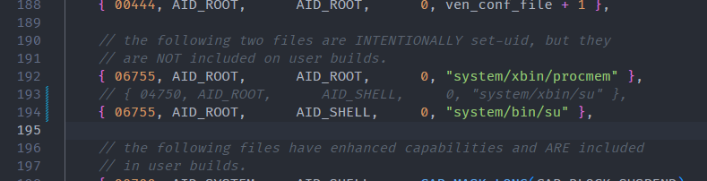
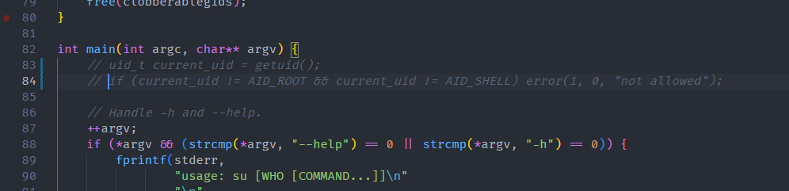
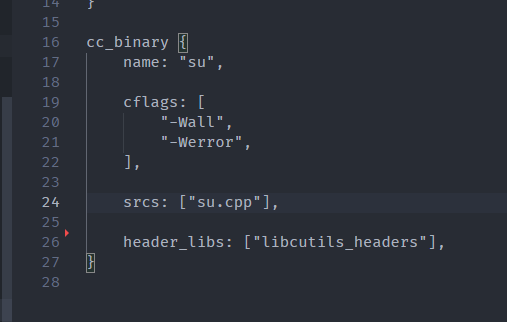

# APP 启用 ROOT 

在默认情况下，Android 13 并未开启 ROOT 功能，如需要启用 ROOT 需要做如下修改：

- `build/make/target/product/base_system.mk`

在 `PRODUCT_PACKAGES` 最后增加字段

```
su \
```



- `frameworks/base/core/jni/com_android_internal_os_Zygote.cpp` 

找到 `DropCapabilitiesBoundingSet` 函数，将其功能废除

```
static void DropCapabilitiesBoundingSet(fail_fn_t fail_fn) {
  return;
  // for (int i = 0; prctl(PR_CAPBSET_READ, i, 0, 0, 0) >= 0; i++) {;
  //   if (prctl(PR_CAPBSET_DROP, i, 0, 0, 0) == -1) {
  //     if (errno == EINVAL) {
  //       ALOGE("prctl(PR_CAPBSET_DROP) failed with EINVAL. Please verify "
  //             "your kernel is compiled with file capabilities support");
  //     } else {
  //       fail_fn(CREATE_ERROR("prctl(PR_CAPBSET_DROP, %d) failed: %s", i, strerror(errno)));
  //     }
  //   }
  // }
}
```



- `system/core/init/selinux.cpp`

找到 `SelinuxSetEnforcement` 函数，配置 `is_enforcing` 为 `false`



- `system/core/libcutils/fs_config.cpp`

找到 `{ 04750, AID_ROOT,    AID_SHELL,   0, "system/xbin/su" },`  改为

```c
{ 06755, AID_ROOT,      AID_SHELL,     0, "system/bin/su" },
```



- `system/extras/su/su.cpp`

找到 `main` 函数，注释检测



- `system/extras/su/Android.bp`

找到 `install_in_xbin: true,` 将其删除

