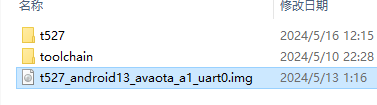
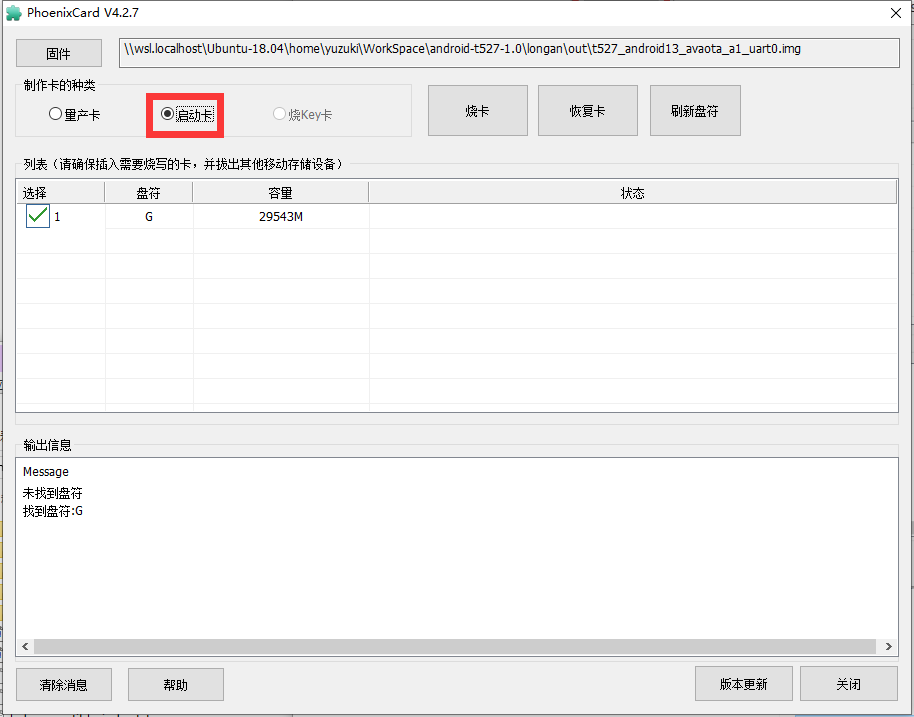

# 刷写安卓镜像

## 刷写到 TF 卡启动

由于安卓镜像打包的特殊性，首先需要去下载原厂的TF卡烧卡芯片

前往 https://www.aw-ol.com/downloads?cat=5

找到 `PhoenixCardv4.2.7.7z` 并点击下载。下载需要全志在线账号，可以注册一个。


下载后解压文件


找到可执行文件运行


点击固件按钮


选择需要烧录的固件



选择启动卡



点击恢复卡，先格式化一下SD卡


点击烧卡，开始烧录


烧录过程中


烧录结束


TF卡插入开发板，即可从 TF 卡启动

## 刷写到 eMMC 启动

由于安卓镜像打包的特殊性，首先需要去下载原厂的TF卡烧卡芯片

前往 https://www.aw-ol.com/downloads?cat=5

找到 `PhoenixCardv4.2.7.7z` 并点击下载。下载需要全志在线账号，可以注册一个。


下载后解压文件


找到可执行文件运行


点击固件按钮


选择需要烧录的固件


选择量产卡


点击 恢复卡 格式化卡


点击 烧卡，开始烧卡


烧卡中


烧卡完成，将TF卡插入开发板上电，TF卡加载烧录程序进行eMMC的刷写，开发板串口LOG如下

```
[116]HELLO! BOOT0 is starting!
[119]BOOT0 commit : 1cbb5ea8b3
[123]periph0 has been enabled
[126]set pll end
[128]PL gpio voltage : 3.3V
[132][pmu]: bus read error
[135]PMU: AXP2202
[140]PMU: AXP1530
[144]power mode:33, sys_vol:920
[148]vaild para:1  select dram para0
[151]board init ok
[174]enable_jtag
[176]card no is 0
[178]sdcard 0 line count 4
[181][mmc]: mmc driver ver 2023-03-24 16:23
[191][mmc]: Wrong media type 0x0
[194][mmc]: ***Try SD card 0***
[205][mmc]: HSSDR52/SDR25 4 bit
[208][mmc]: 50000000 Hz
[211][mmc]: 29544 MB
[213][mmc]: ***SD/MMC 0 init OK!!!***
[223]boot param - magic error
[227]DRAM BOOT DRIVE INFO: V0.67
[231]DRAM_VCC set to 1160 mv
[357]DRAM retraining ten
[483]DRAM retraining ten
[500][AUTO DEBUG]32bit,1 ranks training success!
[530]Soft Training Version: T2.0
[8237][SOFT TRAINING] CLK=1200M Stable memtest pass
[8242]DRAM CLK =1200 MHZ
[8245]DRAM Type =8 (3:DDR3,4:DDR4,7:LPDDR3,8:LPDDR4)
[8255]DRAM SIZE =2048 MBytes, para1 = 310a, para2 = 8000000, tpr13 = 6461
[8286]DRAM simple test OK.
[8288]dram size =2048
[8295]nsi init 2023-2-23
[8390]Loading boot-pkg Succeed(index=0).
[8394]Entry_name        = u-boot
[8401]Entry_name        = monitor
[8405]Entry_name        = scp
[8409]Entry_name        = dtb
[8413]mmc not para
[8415]Jump to second Boot.
NOTICE:  BL31: v2.5(debug):9241004a9
NOTICE:  BL31: Built : 13:37:46, Nov 16 2023
NOTICE:  BL31: No DTB found.
nsi init ok 2022-11-08
ERROR:   Error initializing runtime service opteed_fast


U-Boot 2018.07-g0aaed9e-dirty (Dec 14 2023 - 12:43:57 +0000) Allwinner Technology

[08.450]CPU:   Allwinner Family
[08.453]Model: sun55iw3
I2C:   ready
[08.463]DRAM:  2 GiB
[08.467]Relocation Offset is: 75ecd000
[08.502]secure enable bit: 0
[08.505]PMU: AXP2202
[08.507]PMU: pmu_axp2202 found
[08.510]BMU: AXP2202
[08.512]BMU: bmu_axp2202 found
[08.515][AXP2202] comm status : 0x0 = 0x20, 0x1 = 0x90
[08.520][AXP2202] onoff status: 0x20 = 0x4, 0x21 = 0x0
[08.524][AXP2202] reboot/charge status: 0xf0 = 0x0
[08.529]AXP2202_IIN_LIM:28
[08.532]AXP2202_IIN_LIM:28
[08.536]AXP2202_IIN_LIM:28
[08.539]AXP2202_IIN_LIM:28
[08.541]
b12_mode: 0
[08.543]AXP2202_IIN_LIM:28
[08.546]gpio_bias, pc_bias: 1800, pc_supply: not set
[08.551]gpio_bias, pl_bias:   -1, pl_supply: aldo3_vol
[08.556]bldo1_vol = 0, onoff=0
[08.559]bldo2_vol = 1800, onoff=1
[08.563]bldo3_vol = 1800, onoff=1
[08.566]cldo2_vol = 1800, onoff=1
[08.570]cldo4_vol = 0, onoff=0
bias_name:pc_bias        bias_vol:1800
[08.576]bat not exist.
[08.579]PMU: AXP1530
[08.581]PMU_EXT: pmu_axp1530 found
[08.585]CPU=1296 MHz,PLL6=600 Mhz,AHB=200 Mhz, APB1=100Mhz  MBus=600Mhz
[08.591]gic: sec monitor mode
[08.593]sunxi flash type@1 not support fast burn key
sunxi flash map init
[08.601]init_clocks:finish
[08.603]flash init start
[08.605]workmode = 17,storage type = 1
try card 2
set card number 2
get card number 2
[08.613][mmc]: mmc driver ver uboot2018:2023-07-4 16:18:00
[08.619][mmc]: Is not Boot mode!
[08.622][mmc]: SUNXI SDMMC Controller Version:0x50500
[08.633][mmc]: ************Try SD card 2************
[08.638][mmc]: mmc 2 cmd timeout 100 status 100
[08.642][mmc]: smc 2 err, cmd 8,  RTO
[08.646][mmc]: mmc 2 close bus gating and reset
[08.650][mmc]: mmc 2 cmd timeout 100 status 100
[08.654][mmc]: smc 2 err, cmd 55,  RTO
[08.658][mmc]: mmc 2 close bus gating and reset
[08.662][mmc]: ************Try MMC card 2************
[08.705][mmc]: mmc 2 cmd timeout 100 status 100
[08.709][mmc]: smc 2 err, cmd 8,  RTO
[08.713][mmc]: mmc 2 close bus gating and reset
[08.717][mmc]: mmc 2 cmd timeout 100 status 100
[08.722][mmc]: smc 2 err, cmd 55,  RTO
[08.725][mmc]: mmc 2 close bus gating and reset
[08.741][mmc]: gen_tuning_blk_bus8: total blk 10
[08.745][mmc]: gen_tuning_blk_bus4: total blk 6
[08.750][mmc]: Using 8 bit tuning now
[08.755][mmc]: write_tuning_try_freq: write ok
[08.759][mmc]: Pattern compare ok
[08.762][mmc]: Write tuning pattern ok
[08.766][mmc]: ================== HSSDR52_SDR25...
[08.770][mmc]: skip freq 400000
[08.773][mmc]: skip freq 25000000
[08.776][mmc]: freq: 2-50000000-64-4
[08.987][mmc]: [0-63|64]
[08.989][mmc]: ================== HS200_SDR104...
[08.994][mmc]: skip freq 400000
[08.997][mmc]: skip freq 25000000
[09.000][mmc]: freq: 2-50000000-64-4
[09.193][mmc]: freq: 3-100000000-64-4
[09.331][mmc]: freq: 4-150000000-64-4
[09.441][mmc]: skip freq 200000000
[09.444][mmc]: [0-63|64]
[09.447][mmc]: [0-63|64]
[09.449][mmc]: [0-6|7] [12-63|52]
[09.452][mmc]: ================== HSDDR52_DDR50...
[09.457][mmc]: skip freq 400000
[09.460][mmc]: freq: 1-25000000-64-4
[09.654][mmc]: freq: 2-50000000-64-4
[09.793][mmc]: [0-63|64]
[09.795][mmc]: [0-45|46] [47-63|17]
[09.798][mmc]: ================== HS400...
[09.803][mmc]: skip freq 400000
[09.806][mmc]: skip freq 25000000
[09.809][mmc]: freq: 2-50000000
[09.825][mmc]: freq: 3-100000000
[09.840][mmc]: freq: 4-150000000
[09.855][mmc]: skip freq 200000000
[09.858][mmc]: speed mode: HS400
[09.860][mmc]: [0-63|64]
[09.863][mmc]: [0-63|64]
[09.865][mmc]: [0-8|9] [11-63|53]
[09.868][mmc]: skip freq 400000
[09.871][mmc]: skip freq 25000000
[09.874][mmc]: freq: 2-50000000-64-4
[10.012][mmc]: freq: 3-100000000-64-4
[10.076][mmc]: freq: 4-150000000-64-4
[10.120][mmc]: skip freq 200000000
[10.123][mmc]: [2-63|62]
[10.125][mmc]: [2-39|38]
[10.127][mmc]: [2-23|22]
[10.131][mmc]: DS26/SDR12: 0xffffffff 0xffffffff
[10.135][mmc]: HSSDR52/SDR25: 0xff20ffff 0xffffffff
[10.140][mmc]: HSDDR52/DDR50: 0xff1720ff 0xffffffff
[10.145][mmc]: HS200/SDR104: 0x2020ffff 0xffffff26
[10.149][mmc]: HS400: 0x1521ffff 0xffffff0d
[10.153][mmc]: HS400: 0x2020ffff 0xffffff25
[10.158][mmc]: Best spd md: 4-HS400, freq: 4-150000000, Bus width: 8
[10.164][mmc]: mmc driver ver uboot2018:2023-07-4 16:18:00
[10.169][mmc]: get sdc_type fail and use default host:tm1.
[10.175][mmc]: can't find node "mmc0",will add new node
[10.180][mmc]: fdt err returned <no error>
[10.184][mmc]: Using default timing para
[10.187][mmc]: SUNXI SDMMC Controller Version:0x50500
[10.205][mmc]: card_caps:0x3000000a
[10.208][mmc]: host_caps:0x3000003f
[10.211]drv_disp_init
[10.249]not support more than 1 wb at present
** Unable to read file lcd_compatible_index.txt **
[10.261]disp_fat_load for lcd config failed
[10.266]lvds_clk_index = 0, disp = 0
[10.280]request pwm success, pwm1:pwm1:0x2000c00.
[10.285][DEBUG] primary_key: lcd0
[10.288]lcd->hwdev_index: 0
[10.303][DEBUG] primary_key: lcd1
[10.306]skip lcd1
[10.307][DEBUG] primary_key: lcd4
[10.310]skip lcd4
[10.322]drv_disp_init finish
[10.325]boot_gui_init:start
[10.328]get lcd2 fail
[10.331]get lcd2 fail
disp_devices_open start: 0 end: 1 dev_num: 1 actual_dev_num: 2
[10.341]disp 0, clk: pll(306000000),clk(306000000),dclk(51000000) dsi_rate(306000000)
     clk real:pll(300000000),clk(300000000),dclk(50000000) dsi_rate(0)
[10.355]enable power dcdc4, ret=0
[10.360]switch device: sel=0, type=1, mode=4, format=0, bits=0, eotf=4, cs=260
[10.369]boot_gui_init:finish
[10.374]Loading Environment from SUNXI_FLASH... OK
[10.378]try to burn key
[10.380]out of usb burn from boot: not boot mode
[10.388]LCD open finish
Hit any key to stop autoboot:  0
sunxi work mode=0x11
run card sprite
MYD_LT527 login:
>>>[97]{"step":"firmware","PN":"xxx","SN":"xxx","CN":"xxx","plan":{"num":"1","modules":{"image":"0"}}}
[12.416]sunxi sprite begin
bar x1: 256 y1: 260
bar x2: 768 y2: 340
firmware name <NULL>
img start = 0x18000
try to read mmc start 98304
read mmc ok
[12.439]firmware probe ok
[12.441]fetch download map
*************DOWNLOAD MAP DUMP************
total download part 12

download part[0] name          :bootloader_a
download part[0] download file :BOOT-RESOURCE_FE
download part[0] verify file   :VBOOT-RESOURCE_F
download part[0] lenlo         :0x10000
download part[0] addrlo        :0x8000
download part[0] encrypt       :0x0
download part[0] verify        :0x1

download part[1] name          :env_a
download part[1] download file :ENV_FEX000000000
download part[1] verify file   :VENV_FEX00000000
download part[1] lenlo         :0x200
download part[1] addrlo        :0x28000
download part[1] encrypt       :0x0
download part[1] verify        :0x1

download part[2] name          :boot_a
download part[2] download file :BOOT_FEX00000000
download part[2] verify file   :VBOOT_FEX0000000
download part[2] lenlo         :0x20000
download part[2] addrlo        :0x28400
download part[2] encrypt       :0x0
download part[2] verify        :0x1

download part[3] name          :vendor_boot_a
download part[3] download file :VENDOR_BOOT_FEX0
download part[3] verify file   :VVENDOR_BOOT_FEX
download part[3] lenlo         :0x10000
download part[3] addrlo        :0x68400
download part[3] encrypt       :0x0
download part[3] verify        :0x1

download part[4] name          :init_boot_a
download part[4] download file :INIT_BOOT_FEX000
download part[4] verify file   :VINIT_BOOT_FEX00
download part[4] lenlo         :0x4000
download part[4] addrlo        :0x88400
download part[4] encrypt       :0x0
download part[4] verify        :0x1

download part[5] name          :super
download part[5] download file :SUPER_FEX0000000
download part[5] verify file   :VSUPER_FEX000000
download part[5] lenlo         :0x700000
download part[5] addrlo        :0x90400
download part[5] encrypt       :0x0
download part[5] verify        :0x1

download part[6] name          :misc
download part[6] download file :MISC_FEX00000000
download part[6] verify file   :VMISC_FEX0000000
download part[6] lenlo         :0x8000
download part[6] addrlo        :0x790400
download part[6] encrypt       :0x0
download part[6] verify        :0x1

download part[7] name          :vbmeta_a
download part[7] download file :VBMETA_FEX000000
download part[7] verify file   :VVBMETA_FEX00000
download part[7] lenlo         :0x100
download part[7] addrlo        :0x798400
download part[7] encrypt       :0x0
download part[7] verify        :0x1

download part[8] name          :vbmeta_system_a
download part[8] download file :VBMETA_SYSTEM_FE
download part[8] verify file   :VVBMETA_SYSTEM_F
download part[8] lenlo         :0x80
download part[8] addrlo        :0x798600
download part[8] encrypt       :0x0
download part[8] verify        :0x1

download part[9] name          :vbmeta_vendor_a
download part[9] download file :VBMETA_VENDOR_FE
download part[9] verify file   :VVBMETA_VENDOR_F
download part[9] lenlo         :0x80
download part[9] addrlo        :0x798700
download part[9] encrypt       :0x0
download part[9] verify        :0x1

download part[10] name          :dtbo_a
download part[10] download file :DTBO_FEX00000000
download part[10] verify file   :VDTBO_FEX0000000
download part[10] lenlo         :0x1000
download part[10] addrlo        :0x7e0400
download part[10] encrypt       :0x0
download part[10] verify        :0x1

download part[11] name          :Reserve0
download part[11] download file :RESERVE0_FEX0000
download part[11] verify file   :VRESERVE0_FEX000
download part[11] lenlo         :0x20000
download part[11] addrlo        :0x7ea400
download part[11] encrypt       :0x0
download part[11] verify        :0x1

[12.764]fetch mbr
the 0 mbr table is ok
the 1 mbr table is ok
the 2 mbr table is ok
the 3 mbr table is ok
*************MBR DUMP***************
total mbr part 28

part[0] name      :bootloader_a
part[0] classname :DISK
part[0] addrlo    :0x8000
part[0] lenlo     :0x10000
part[0] user_type :32768
part[0] keydata   :0
part[0] ro        :0

part[1] name      :bootloader_b
part[1] classname :DISK
part[1] addrlo    :0x18000
part[1] lenlo     :0x10000
part[1] user_type :32768
part[1] keydata   :0
part[1] ro        :0

part[2] name      :env_a
part[2] classname :DISK
part[2] addrlo    :0x28000
part[2] lenlo     :0x200
part[2] user_type :32768
part[2] keydata   :0
part[2] ro        :0

part[3] name      :env_b
part[3] classname :DISK
part[3] addrlo    :0x28200
part[3] lenlo     :0x200
part[3] user_type :32768
part[3] keydata   :0
part[3] ro        :0

part[4] name      :boot_a
part[4] classname :DISK
part[4] addrlo    :0x28400
part[4] lenlo     :0x20000
part[4] user_type :32768
part[4] keydata   :0
part[4] ro        :0

part[5] name      :boot_b
part[5] classname :DISK
part[5] addrlo    :0x48400
part[5] lenlo     :0x20000
part[5] user_type :32768
part[5] keydata   :0
part[5] ro        :0

part[6] name      :vendor_boot_a
part[6] classname :DISK
part[6] addrlo    :0x68400
part[6] lenlo     :0x10000
part[6] user_type :32768
part[6] keydata   :0
part[6] ro        :0

part[7] name      :vendor_boot_b
part[7] classname :DISK
part[7] addrlo    :0x78400
part[7] lenlo     :0x10000
part[7] user_type :32768
part[7] keydata   :0
part[7] ro        :0

part[8] name      :init_boot_a
part[8] classname :DISK
part[8] addrlo    :0x88400
part[8] lenlo     :0x4000
part[8] user_type :32768
part[8] keydata   :0
part[8] ro        :0

part[9] name      :init_boot_b
part[9] classname :DISK
part[9] addrlo    :0x8c400
part[9] lenlo     :0x4000
part[9] user_type :32768
part[9] keydata   :0
part[9] ro        :0

part[10] name      :super
part[10] classname :DISK
part[10] addrlo    :0x90400
part[10] lenlo     :0x700000
part[10] user_type :32768
part[10] keydata   :0
part[10] ro        :0

part[11] name      :misc
part[11] classname :DISK
part[11] addrlo    :0x790400
part[11] lenlo     :0x8000
part[11] user_type :32768
part[11] keydata   :0
part[11] ro        :0

part[12] name      :vbmeta_a
part[12] classname :DISK
part[12] addrlo    :0x798400
part[12] lenlo     :0x100
part[12] user_type :32768
part[12] keydata   :0
part[12] ro        :0

part[13] name      :vbmeta_b
part[13] classname :DISK
part[13] addrlo    :0x798500
part[13] lenlo     :0x100
part[13] user_type :32768
part[13] keydata   :0
part[13] ro        :0

part[14] name      :vbmeta_system_a
part[14] classname :DISK
part[14] addrlo    :0x798600
part[14] lenlo     :0x80
part[14] user_type :32768
part[14] keydata   :0
part[14] ro        :0

part[15] name      :vbmeta_system_b
part[15] classname :DISK
part[15] addrlo    :0x798680
part[15] lenlo     :0x80
part[15] user_type :32768
part[15] keydata   :0
part[15] ro        :0

part[16] name      :vbmeta_vendor_a
part[16] classname :DISK
part[16] addrlo    :0x798700
part[16] lenlo     :0x80
part[16] user_type :32768
part[16] keydata   :0
part[16] ro        :0

part[17] name      :vbmeta_vendor_b
part[17] classname :DISK
part[17] addrlo    :0x798780
part[17] lenlo     :0x80
part[17] user_type :32768
part[17] keydata   :0
part[17] ro        :0

part[18] name      :frp
part[18] classname :DISK
part[18] addrlo    :0x798800
part[18] lenlo     :0x400
part[18] user_type :32768
part[18] keydata   :32768
part[18] ro        :0

part[19] name      :empty
part[19] classname :DISK
part[19] addrlo    :0x798c00
part[19] lenlo     :0x7800
part[19] user_type :32768
part[19] keydata   :0
part[19] ro        :0

part[20] name      :metadata
part[20] classname :DISK
part[20] addrlo    :0x7a0400
part[20] lenlo     :0x8000
part[20] user_type :32768
part[20] keydata   :0
part[20] ro        :0

part[21] name      :treadahead
part[21] classname :DISK
part[21] addrlo    :0x7a8400
part[21] lenlo     :0x30000
part[21] user_type :32768
part[21] keydata   :0
part[21] ro        :0

part[22] name      :private
part[22] classname :DISK
part[22] addrlo    :0x7d8400
part[22] lenlo     :0x8000
part[22] user_type :32768
part[22] keydata   :0
part[22] ro        :0

part[23] name      :dtbo_a
part[23] classname :DISK
part[23] addrlo    :0x7e0400
part[23] lenlo     :0x1000
part[23] user_type :32768
part[23] keydata   :0
part[23] ro        :0

part[24] name      :dtbo_b
part[24] classname :DISK
part[24] addrlo    :0x7e1400
part[24] lenlo     :0x1000
part[24] user_type :32768
part[24] keydata   :0
part[24] ro        :0

part[25] name      :media_data
part[25] classname :DISK
part[25] addrlo    :0x7e2400
part[25] lenlo     :0x8000
part[25] user_type :32768
part[25] keydata   :0
part[25] ro        :0

part[26] name      :Reserve0
part[26] classname :DISK
part[26] addrlo    :0x7ea400
part[26] lenlo     :0x20000
part[26] user_type :32768
part[26] keydata   :0
part[26] ro        :0

part[27] name      :UDISK
part[27] classname :DISK
part[27] addrlo    :0x80a400
part[27] lenlo     :0x0
part[27] user_type :33024
part[27] keydata   :0
part[27] ro        :0

*************MBR DUMP***************
total mbr part 28

part[0] name      :bootloader_a
part[0] classname :DISK
part[0] addrlo    :0x8000
part[0] lenlo     :0x10000
part[0] user_type :0x8000
part[0] keydata   :0x0
part[0] ro        :0x0

part[1] name      :bootloader_b
part[1] classname :DISK
part[1] addrlo    :0x18000
part[1] lenlo     :0x10000
part[1] user_type :0x8000
part[1] keydata   :0x0
part[1] ro        :0x0

part[2] name      :env_a
part[2] classname :DISK
part[2] addrlo    :0x28000
part[2] lenlo     :0x200
part[2] user_type :0x8000
part[2] keydata   :0x0
part[2] ro        :0x0

part[3] name      :env_b
part[3] classname :DISK
part[3] addrlo    :0x28200
part[3] lenlo     :0x200
part[3] user_type :0x8000
part[3] keydata   :0x0
part[3] ro        :0x0

part[4] name      :boot_a
part[4] classname :DISK
part[4] addrlo    :0x28400
part[4] lenlo     :0x20000
part[4] user_type :0x8000
part[4] keydata   :0x0
part[4] ro        :0x0

part[5] name      :boot_b
part[5] classname :DISK
part[5] addrlo    :0x48400
part[5] lenlo     :0x20000
part[5] user_type :0x8000
part[5] keydata   :0x0
part[5] ro        :0x0

part[6] name      :vendor_boot_a
part[6] classname :DISK
part[6] addrlo    :0x68400
part[6] lenlo     :0x10000
part[6] user_type :0x8000
part[6] keydata   :0x0
part[6] ro        :0x0

part[7] name      :vendor_boot_b
part[7] classname :DISK
part[7] addrlo    :0x78400
part[7] lenlo     :0x10000
part[7] user_type :0x8000
part[7] keydata   :0x0
part[7] ro        :0x0

part[8] name      :init_boot_a
part[8] classname :DISK
part[8] addrlo    :0x88400
part[8] lenlo     :0x4000
part[8] user_type :0x8000
part[8] keydata   :0x0
part[8] ro        :0x0

part[9] name      :init_boot_b
part[9] classname :DISK
part[9] addrlo    :0x8c400
part[9] lenlo     :0x4000
part[9] user_type :0x8000
part[9] keydata   :0x0
part[9] ro        :0x0

part[10] name      :super
part[10] classname :DISK
part[10] addrlo    :0x90400
part[10] lenlo     :0x700000
part[10] user_type :0x8000
part[10] keydata   :0x0
part[10] ro        :0x0

part[11] name      :misc
part[11] classname :DISK
part[11] addrlo    :0x790400
part[11] lenlo     :0x8000
part[11] user_type :0x8000
part[11] keydata   :0x0
part[11] ro        :0x0

part[12] name      :vbmeta_a
part[12] classname :DISK
part[12] addrlo    :0x798400
part[12] lenlo     :0x100
part[12] user_type :0x8000
part[12] keydata   :0x0
part[12] ro        :0x0

part[13] name      :vbmeta_b
part[13] classname :DISK
part[13] addrlo    :0x798500
part[13] lenlo     :0x100
part[13] user_type :0x8000
part[13] keydata   :0x0
part[13] ro        :0x0

part[14] name      :vbmeta_system_a
part[14] classname :DISK
part[14] addrlo    :0x798600
part[14] lenlo     :0x80
part[14] user_type :0x8000
part[14] keydata   :0x0
part[14] ro        :0x0

part[15] name      :vbmeta_system_b
part[15] classname :DISK
part[15] addrlo    :0x798680
part[15] lenlo     :0x80
part[15] user_type :0x8000
part[15] keydata   :0x0
part[15] ro        :0x0

part[16] name      :vbmeta_vendor_a
part[16] classname :DISK
part[16] addrlo    :0x798700
part[16] lenlo     :0x80
part[16] user_type :0x8000
part[16] keydata   :0x0
part[16] ro        :0x0

part[17] name      :vbmeta_vendor_b
part[17] classname :DISK
part[17] addrlo    :0x798780
part[17] lenlo     :0x80
part[17] user_type :0x8000
part[17] keydata   :0x0
part[17] ro        :0x0

part[18] name      :frp
part[18] classname :DISK
part[18] addrlo    :0x798800
part[18] lenlo     :0x400
part[18] user_type :0x8000
part[18] keydata   :0x8000
part[18] ro        :0x0

part[19] name      :empty
part[19] classname :DISK
part[19] addrlo    :0x798c00
part[19] lenlo     :0x7800
part[19] user_type :0x8000
part[19] keydata   :0x0
part[19] ro        :0x0

part[20] name      :metadata
part[20] classname :DISK
part[20] addrlo    :0x7a0400
part[20] lenlo     :0x8000
part[20] user_type :0x8000
part[20] keydata   :0x0
part[20] ro        :0x0

part[21] name      :treadahead
part[21] classname :DISK
part[21] addrlo    :0x7a8400
part[21] lenlo     :0x30000
part[21] user_type :0x8000
part[21] keydata   :0x0
part[21] ro        :0x0

part[22] name      :private
part[22] classname :DISK
part[22] addrlo    :0x7d8400
part[22] lenlo     :0x8000
part[22] user_type :0x8000
part[22] keydata   :0x0
part[22] ro        :0x0

part[23] name      :dtbo_a
part[23] classname :DISK
part[23] addrlo    :0x7e0400
part[23] lenlo     :0x1000
part[23] user_type :0x8000
part[23] keydata   :0x0
part[23] ro        :0x0

part[24] name      :dtbo_b
part[24] classname :DISK
part[24] addrlo    :0x7e1400
part[24] lenlo     :0x1000
part[24] user_type :0x8000
part[24] keydata   :0x0
part[24] ro        :0x0

part[25] name      :media_data
part[25] classname :DISK
part[25] addrlo    :0x7e2400
part[25] lenlo     :0x8000
part[25] user_type :0x8000
part[25] keydata   :0x0
part[25] ro        :0x0

part[26] name      :Reserve0
part[26] classname :DISK
part[26] addrlo    :0x7ea400
part[26] lenlo     :0x20000
part[26] user_type :0x8000
part[26] keydata   :0x0
part[26] ro        :0x0

part[27] name      :UDISK
part[27] classname :DISK
part[27] addrlo    :0x80a400
part[27] lenlo     :0x0
part[27] user_type :0x8100
part[27] keydata   :0x0
part[27] ro        :0x0

[13.706]begin to erase flash
[13.709]erase all part start
need erase flash: 1
[13.713]read item0 copy0
[13.723]the secure storage item0 copy0 is good
[13.727]no item name set-active-boot-slot in the map
erase secure storage failed
private part exist
GPT:bootloader_a: 12000         21fff
GPT:bootloader_b: 22000         31fff
GPT:env_a       : 32000         321ff
GPT:env_b       : 32200         323ff
GPT:boot_a      : 32400         523ff
GPT:boot_b      : 52400         723ff
GPT:vendor_boot_a: 72400         823ff
GPT:vendor_boot_b: 82400         923ff
GPT:init_boot_a : 92400         963ff
GPT:init_boot_b : 96400         9a3ff
GPT:super       : 9a400         79a3ff
GPT:misc        : 79a400        7a23ff
GPT:vbmeta_a    : 7a2400        7a24ff
GPT:vbmeta_b    : 7a2500        7a25ff
GPT:vbmeta_system_a: 7a2600        7a267f
GPT:vbmeta_system_b: 7a2680        7a26ff
GPT:vbmeta_vendor_a: 7a2700        7a277f
GPT:vbmeta_vendor_b: 7a2780        7a27ff
GPT:frp         : 7a2800        7a2bff
GPT:empty       : 7a2c00        7aa3ff
GPT:metadata    : 7aa400        7b23ff
GPT:treadahead  : 7b2400        7e23ff
GPT:private     : 7e2400        7ea3ff
GPT:dtbo_a      : 7ea400        7eb3ff
GPT:dtbo_b      : 7eb400        7ec3ff
GPT:media_data  : 7ec400        7f43ff
GPT:Reserve0    : 7f4400        8143ff
GPT:userdata    : 814400        1d59fde
begin to store data
part 0 name bootloader_a
keydata = 0x0
part 1 name bootloader_b
keydata = 0x0
part 2 name env_a
keydata = 0x0
part 3 name env_b
keydata = 0x0
part 4 name boot_a
keydata = 0x0
part 5 name boot_b
keydata = 0x0
part 6 name vendor_boot_a
keydata = 0x0
part 7 name vendor_boot_b
keydata = 0x0
part 8 name init_boot_a
keydata = 0x0
part 9 name init_boot_b
keydata = 0x0
part 10 name super
keydata = 0x0
part 11 name misc
keydata = 0x0
part 12 name vbmeta_a
keydata = 0x0
part 13 name vbmeta_b
keydata = 0x0
part 14 name vbmeta_system_a
keydata = 0x0
part 15 name vbmeta_system_b
keydata = 0x0
part 16 name vbmeta_vendor_a
keydata = 0x0
part 17 name vbmeta_vendor_b
keydata = 0x0
part 18 name frp
keydata = 0x1
find keypart frp
keypart read start: 0x798800, sectors 0x400
keypart part frp read  0x798800, sectors 0x400
part 19 name empty
keydata = 0x0
part 20 name metadata
keydata = 0x0
part 21 name treadahead
keydata = 0x0
part 22 name private
keydata = 0x0
find keypart private
keypart read start: 0x7d8400, sectors 0x8000
keypart part private read  0x7d8400, sectors 0x8000
part 23 name dtbo_a
keydata = 0x0
part 24 name dtbo_b
keydata = 0x0
part 25 name media_data
keydata = 0x0
part 26 name Reserve0
keydata = 0x0
part 27 name userdata
keydata = 0x0
begin to erase
[14.041]erase all part start
card2 erase boot0
erase bootloader_b part
[14.098][mmc]: erase from: 139264, to: 204799, cnt: 65536, erase_group: 1024
[14.150][mmc]: sunxi_mmc_do_send_cmd_common: cmd 38 wait rsp busy 0x2c ms
erase env_a part
[14.158][mmc]: after adjust nr, no more space need to erase!!
[14.164][mmc]: after align erase group, no space need to erase, erase failed
[14.170][mmc]: mmc_mmc_erase: erase emmc fail!
[14.174][mmc]: mmc_mmc_erase: some sectors in emmc are ignored!
[14.180][mmc]: --0: from204800  nr512
erase env_b part
[14.189][mmc]: after adjust start addr, no more space need to erase!!
[14.195][mmc]: Erase addr is not erase group alignment!
[14.200][mmc]: erase failed, range 205824 - 206336
[14.205][mmc]: mmc_mmc_erase: erase emmc fail!
[14.209][mmc]: mmc_mmc_erase: some sectors in emmc are ignored!
[14.214][mmc]: --0: from205312  nr512
erase boot_a part
[14.223][mmc]: erase from: 205824, to: 336895, cnt: 131072, erase_group: 1024
[14.235][mmc]: sunxi_mmc_do_send_cmd_common: cmd 38 wait rsp busy 0x5 ms
erase boot_b part
[14.243][mmc]: erase from: 336896, to: 467967, cnt: 131072, erase_group: 1024
[14.253][mmc]: sunxi_mmc_do_send_cmd_common: cmd 38 wait rsp busy 0x3 ms
erase vendor_boot_a part
[14.262][mmc]: erase from: 467968, to: 533503, cnt: 65536, erase_group: 1024
[14.272][mmc]: sunxi_mmc_do_send_cmd_common: cmd 38 wait rsp busy 0x3 ms
erase vendor_boot_b part
[14.281][mmc]: erase from: 533504, to: 599039, cnt: 65536, erase_group: 1024
[14.291][mmc]: sunxi_mmc_do_send_cmd_common: cmd 38 wait rsp busy 0x3 ms
erase init_boot_a part
[14.299][mmc]: erase from: 599040, to: 615423, cnt: 16384, erase_group: 1024
[14.308][mmc]: sunxi_mmc_do_send_cmd_common: cmd 38 wait rsp busy 0x2 ms
erase init_boot_b part
[14.317][mmc]: erase from: 615424, to: 631807, cnt: 16384, erase_group: 1024
[14.326][mmc]: sunxi_mmc_do_send_cmd_common: cmd 38 wait rsp busy 0x2 ms
erase super part
[14.334][mmc]: erase from: 631808, to: 7971839, cnt: 7340032, erase_group: 1024
[14.396][mmc]: sunxi_mmc_do_send_cmd_common: cmd 38 wait rsp busy 0x37 ms
erase misc part
[14.404][mmc]: erase from: 7971840, to: 8004607, cnt: 32768, erase_group: 1024
[14.414][mmc]: sunxi_mmc_do_send_cmd_common: cmd 38 wait rsp busy 0x3 ms
erase vbmeta_a part
[14.422][mmc]: after adjust nr, no more space need to erase!!
[14.428][mmc]: after align erase group, no space need to erase, erase failed
[14.435][mmc]: mmc_mmc_erase: erase emmc fail!
[14.439][mmc]: mmc_mmc_erase: some sectors in emmc are ignored!
[14.444][mmc]: --0: from8004608  nr256
erase vbmeta_b part
[14.452][mmc]: after adjust start addr, no more space need to erase!!
[14.458][mmc]: Erase addr is not erase group alignment!
[14.463][mmc]: erase failed, range 8005632 - 8005888
[14.468][mmc]: mmc_mmc_erase: erase emmc fail!
[14.472][mmc]: mmc_mmc_erase: some sectors in emmc are ignored!
[14.478][mmc]: --0: from8004864  nr256
erase vbmeta_system_a part
[14.486][mmc]: after adjust start addr, no more space need to erase!!
[14.492][mmc]: Erase addr is not erase group alignment!
[14.497][mmc]: erase failed, range 8005632 - 8005760
[14.502][mmc]: mmc_mmc_erase: erase emmc fail!
[14.506][mmc]: mmc_mmc_erase: some sectors in emmc are ignored!
[14.511][mmc]: --0: from8005120  nr128
erase vbmeta_system_b part
[14.519][mmc]: after adjust start addr, no more space need to erase!!
[14.525][mmc]: Erase addr is not erase group alignment!
[14.530][mmc]: erase failed, range 8005632 - 8005760
[14.534][mmc]: mmc_mmc_erase: erase emmc fail!
[14.539][mmc]: mmc_mmc_erase: some sectors in emmc are ignored!
[14.544][mmc]: --0: from8005248  nr128
erase vbmeta_vendor_a part
[14.552][mmc]: after adjust start addr, no more space need to erase!!
[14.558][mmc]: Erase addr is not erase group alignment!
[14.563][mmc]: erase failed, range 8005632 - 8005760
[14.568][mmc]: mmc_mmc_erase: erase emmc fail!
[14.572][mmc]: mmc_mmc_erase: some sectors in emmc are ignored!
[14.578][mmc]: --0: from8005376  nr128
erase vbmeta_vendor_b part
[14.585][mmc]: after adjust start addr, no more space need to erase!!
[14.591][mmc]: Erase addr is not erase group alignment!
[14.596][mmc]: erase failed, range 8005632 - 8005760
[14.601][mmc]: mmc_mmc_erase: erase emmc fail!
[14.605][mmc]: mmc_mmc_erase: some sectors in emmc are ignored!
[14.610][mmc]: --0: from8005504  nr128
erase frp part
[14.617][mmc]: erase from: 8005632, to: 8006655, cnt: 1024, erase_group: 1024
[14.626][mmc]: sunxi_mmc_do_send_cmd_common: cmd 38 wait rsp busy 0x2 ms
erase empty part
[14.634][mmc]: erase from: 8006656, to: 8037375, cnt: 30720, erase_group: 1024
[14.644][mmc]: sunxi_mmc_do_send_cmd_common: cmd 38 wait rsp busy 0x3 ms
erase metadata part
[14.652][mmc]: erase from: 8037376, to: 8070143, cnt: 32768, erase_group: 1024
[14.662][mmc]: sunxi_mmc_do_send_cmd_common: cmd 38 wait rsp busy 0x3 ms
erase treadahead part
[14.670][mmc]: erase from: 8070144, to: 8266751, cnt: 196608, erase_group: 1024
[14.684][mmc]: sunxi_mmc_do_send_cmd_common: cmd 38 wait rsp busy 0x7 ms
erase private part
[14.692][mmc]: erase from: 8266752, to: 8299519, cnt: 32768, erase_group: 1024
[14.702][mmc]: sunxi_mmc_do_send_cmd_common: cmd 38 wait rsp busy 0x3 ms
erase dtbo_a part
[14.710][mmc]: erase from: 8299520, to: 8303615, cnt: 4096, erase_group: 1024
[14.719][mmc]: sunxi_mmc_do_send_cmd_common: cmd 38 wait rsp busy 0x2 ms
erase dtbo_b part
[14.727][mmc]: erase from: 8303616, to: 8307711, cnt: 4096, erase_group: 1024
[14.736][mmc]: sunxi_mmc_do_send_cmd_common: cmd 38 wait rsp busy 0x2 ms
erase media_data part
[14.744][mmc]: erase from: 8307712, to: 8340479, cnt: 32768, erase_group: 1024
[14.754][mmc]: sunxi_mmc_do_send_cmd_common: cmd 38 wait rsp busy 0x3 ms
erase Reserve0 part
[14.762][mmc]: erase from: 8340480, to: 8471551, cnt: 131072, erase_group: 1024
[14.772][mmc]: sunxi_mmc_do_send_cmd_common: cmd 38 wait rsp busy 0x3 ms
erase UDISK part
sunxi_sprite_mmc_phyerase: @nr is 0, erase from @from to end
[14.786][mmc]: erase from: 8471552, to: 30776319, cnt: 22304768, erase_group: 1024
[14.810][mmc]: sunxi_mmc_do_send_cmd_common: cmd 38 wait rsp busy 0x10 ms
[14.816][mmc]: mmc_mmc_erase: some sectors in emmc are ignored!
[14.822][mmc]: --0: from30776320  nr1023
card erase all
finish erase
rewrite
write primary GPT success
write Backup GPT success
[14.843]update partition map
keypart write start: 0x798800, sectors 0x400
keypart write start: 0x7d8400, sectors 0x8000
flash exit
[15.084]successed in erasing flash
write primary GPT success
write Backup GPT success
[15.093]update partition map
[15.097]begin to download part
[15.100]begin to download part bootloader_a
partdata hi 0x0
partdata lo 0x1547400
sparse: bad magic
[16.315]successed in writting part bootloader_a
origin_verify value = f81e1df7, active_verify value = f81e1df7
[16.445]successed in verify part bootloader_a
[16.449]successed in download part bootloader_a
[16.453]begin to download part env_a
partdata hi 0x0
partdata lo 0x20000
sparse: bad magic
[16.471]successed in writting part env_a
origin_verify value = ff036e71, active_verify value = ff036e71
[16.483]successed in verify part env_a
[16.487]successed in download part env_a
[16.490]begin to download part boot_a
partdata hi 0x0
partdata lo 0x4000000
sparse: bad magic
[20.131]successed in writting part boot_a
origin_verify value = 69e43282, active_verify value = 69e43282
[20.478]successed in verify part boot_a
[20.481]successed in download part boot_a
[20.485]begin to download part vendor_boot_a
partdata hi 0x0
partdata lo 0x2000000
sparse: bad magic
[22.311]successed in writting part vendor_boot_a
origin_verify value = ff325334, active_verify value = ff325334
[22.495]successed in verify part vendor_boot_a
[22.499]successed in download part vendor_boot_a
[22.504]begin to download part init_boot_a
partdata hi 0x0
partdata lo 0x800000
sparse: bad magic
[22.971]successed in writting part init_boot_a
origin_verify value = 6fc2a089, active_verify value = 6fc2a089
[23.024]successed in verify part init_boot_a
[23.028]successed in download part init_boot_a
[23.032]begin to download part super
partdata hi 0x0
partdata lo 0x4c0be24c
chunk 0(44)
chunk 1(44)
chunk 2(44)
chunk 3(44)
chunk 4(44)
chunk 5(44)
chunk 6(44)
chunk 7(44)
chunk 8(44)
chunk 9(44)
chunk 10(44)
chunk 11(44)
chunk 12(44)
chunk 13(44)
chunk 14(44)
chunk 15(44)
chunk 16(44)
chunk 17(44)
chunk 18(44)
chunk 19(44)
chunk 20(44)
chunk 21(44)
chunk 22(44)
chunk 23(44)
chunk 24(44)
chunk 25(44)
chunk 26(44)
chunk 27(44)
chunk 28(44)
chunk 29(44)
chunk 30(44)
chunk 31(44)
chunk 32(44)
chunk 33(44)
chunk 34(44)
chunk 35(44)
chunk 36(44)
chunk 37(44)
chunk 38(44)
chunk 39(44)
chunk 40(44)
chunk 41(44)
chunk 42(44)
chunk 43(44)
[103.478]successed in writting part super
origin_verify value = e46137ef, active_verify value = e46137ef
[103.487]successed in verify part super
[103.491]successed in download part super
[103.495]begin to download part misc
partdata hi 0x0
partdata lo 0x1000000
sparse: bad magic
[104.410]successed in writting part misc
origin_verify value = b961f417, active_verify value = b961f417
[104.506]successed in verify part misc
[104.510]successed in download part misc
[104.513]begin to download part vbmeta_a
partdata hi 0x0
partdata lo 0x2000
sparse: bad magic
[104.524]successed in writting part vbmeta_a
origin_verify value = c3d7e49a, active_verify value = c3d7e49a
[104.535]successed in verify part vbmeta_a
[104.539]successed in download part vbmeta_a
[104.543]begin to download part vbmeta_system_a
partdata hi 0x0
partdata lo 0x1000
sparse: bad magic
[104.554]successed in writting part vbmeta_system_a
origin_verify value = 30bae828, active_verify value = 30bae828
[104.566]successed in verify part vbmeta_system_a
[104.571]successed in download part vbmeta_system_a
[104.575]begin to download part vbmeta_vendor_a
partdata hi 0x0
partdata lo 0x1000
sparse: bad magic
[104.586]successed in writting part vbmeta_vendor_a
origin_verify value = ef358d71, active_verify value = ef358d71
[104.598]successed in verify part vbmeta_vendor_a
[104.602]successed in download part vbmeta_vendor_a
[104.607]begin to download part dtbo_a
partdata hi 0x0
partdata lo 0x200000
sparse: bad magic
[104.729]successed in writting part dtbo_a
origin_verify value = 9f801cad, active_verify value = 9f801cad
[104.753]successed in verify part dtbo_a
[104.757]successed in download part dtbo_a
[104.761]begin to download part Reserve0
partdata hi 0x0
partdata lo 0x1000000
sparse: bad magic
[105.677]successed in writting part Reserve0
origin_verify value = 0, active_verify value = 0
[105.774]successed in verify part Reserve0
[105.778]successed in download part Reserve0
[105.785]successed in downloading part
uboot size = 0x14c000
storage type = 2
sunxi_sprite_deal_uboot ok
[105.888]successed in downloading uboot
[105.896][mmc]: write mmc 2 info ok
storage type = 2
[105.910]successed in downloading boot0
CARD OK
[105.914]sprite success
>>>[144]{"step":"firmware","PN":"xxx","SN":"xxx","CN":"xxx","result":{"module":"image","progress":"20", "state":"0","message":"write image succuess"}}
sprite_next_work=3
next work 3
SUNXI_UPDATE_NEXT_ACTION_SHUTDOWN
[108.936][mmc]: mmc exit start
[108.954][mmc]: mmc 2 exit ok
```


