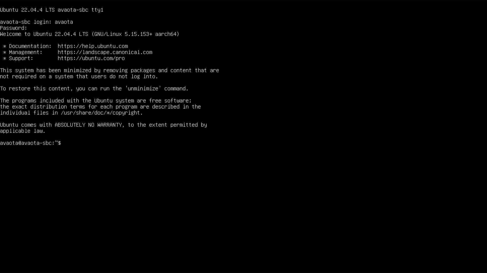

# 刷写固件

## 安装准备

### 材料准备

  首先需要准备的材料有: 

- **SD-Card Formatter** 
- **balenaEtcher** 
- **Avaota Pi - A1开发板 x1**
- **TF-card ( 不小于4Gb ) x1** 
- **12V-DC电源适配器 x1** 
- **TF读卡器 x1** 
- USBTTL Splitter x1（可选）
- HDMI 采集卡 x1 （可选）
- USB 数据线

### 获取镜像

在安装开始前，您需要获取 AvaotaOS 发布的镜像及其校验文件。

-  点击打开此链接 [Releases · AvaotaSBC/AvaotaOS (github.com)](https://github.com/AvaotaSBC/AvaotaOS/releases) 。
- 下载选取如 **ubuntu-jammy-cli-aarch64-avaota-a1.img.xz** 的镜像包。
  
## 安装步骤


1 , 先使用 SD-Card Formatter 格式化内存卡 。


2 , 烧录到 SD 卡。


3 ,取出 SD 卡，插入 Avaota A1 然后接入电源

## 启动设备

### 使用采集卡登录

- 用户名 : `avaota`
- 密码  :  `avaota`



**可以使用 ``` sudo nmtui ``` 连接 WIFI , 或者直接连接 *以太网* 。**

### 使用串口登录

- 登录使用波特率 ：```115200```


## 问题答疑

*A.* 烧录失败怎么办？

- 下载的镜像文件不完整，请确保该镜像**通过完整性校验**，重新格式化SD卡后，下载镜像包，重新烧录尝试。

*B.* 串口无法读取数据

- 反转 **Type-C 线**后重新连接，看到**橙色LED灯闪烁**则可以正常使用。

