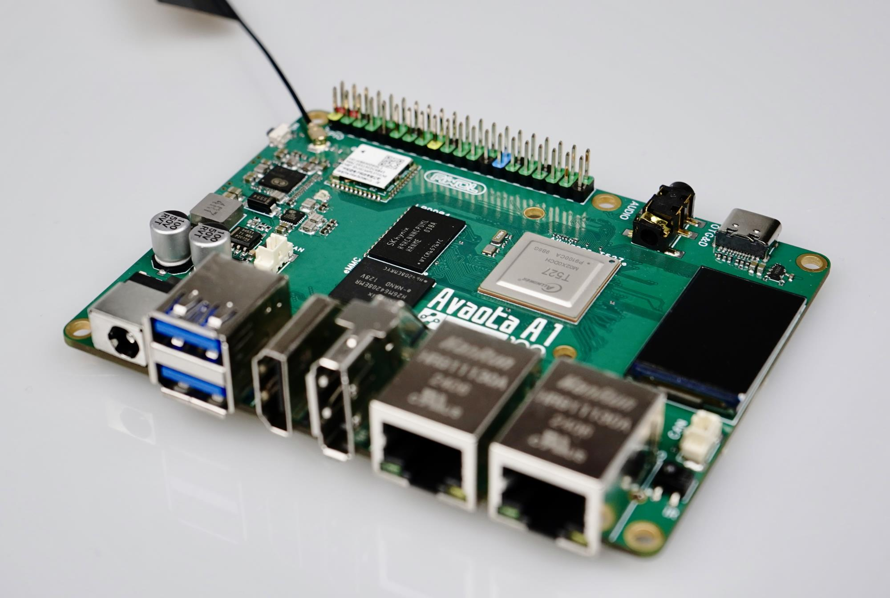

# 硬件参数


## 参数规格

Avaota-A1 - A Powerful SBC with Allwinner T527 Octa-Core A55 SoC



- CPU: 八核 Cortex-A55，最高可达 2.0GHz
- GPU: Mali G57，支持 OpenGL ES 3.2/2.0/1.1，Vulkan 1.1/1.2/1.3，OpenCL 2.2
- RCPU: XuanTie E906 RISC-V @ 200MHz
- DSP: HIFI4 DSP @ 600MHz
- NPU: 可选最高可达 2TOPS 的计算能力
- 内存芯片: 支持 LPDDR4，可选 1/2/4GB
- 存储芯片: 支持 eMMC 5.1，可选 16/32/64/128GB
- 相机: MIPI CSI 接口，支持 1300 万像素，4 路 MIPI CSI
- 网络通信接口: 2 x 千兆以太网，WIFI6 2.4G + 5G，BT5.4
- USB 接口: 包括 USB OTG，USB3.0 OTG，USB2.0 HOST
- 音频接口: 3.5mm 音频接口，具有录音功能
- 显示接口: 包括 RGB 接口，MIPI DSI 接口，DP 接口，HDMI2.0 接口，LVDS 接口，MIPI DBI 接口
- 其他接口模块: 包括调试串口，TF 卡槽，CAN 接口，RGB LED，红外(IR)，UART，IIC，I2S，SPI，PWM

## 详细参数

<table>
   <tbody><tr>
    <td rowspan="14" x:str="">主控芯片 T527</td>
    <td x:str="">CPU</td>
    <td x:str="">采用八核 Cortex-A55</td>
   </tr>
   <tr>
    <td rowspan="5" x:str="">GPU</td>
    <td x:str="">Mali G57</td>
   </tr>
   <tr>
    <td x:str="">OpenGL ES 3.2/2.0/1.1</td>
   </tr>
   <tr>
    <td x:str="">Vulkan1.1/1.2/1.3</td>
   </tr>
   <tr>
    <td x:str="">OpenCL2.2</td>
   </tr>
   <tr>
    <td x:str="">主线 Panforst/Mali</td>
   </tr>
   <tr>
    <td x:str="">RCPU</td>
    <td x:str="">XuanTie E906 RISC-V @ 200MHz</td>
   </tr>
   <tr>
    <td x:str="">DSP</td>
    <td x:str="">HIFI4 DSP @ 600MHz</td>
   </tr>
   <tr>
    <td x:str="">频率</td>
    <td x:str="">最高可达 1.8GHz</td>
   </tr>
   <tr>
    <td x:str="">制造工艺</td>
    <td x:str="">22nm</td>
   </tr>
   <tr>
    <td x:str="">NPU</td>
    <td x:str="">高达 2TOPS 算力</td>
   </tr>
   <tr>
    <td x:str="">视频解码</td>
    <td x:str="">H.265/VP9@4K，H.264@4K</td>
   </tr>
   <tr>
    <td x:str="">视频编码</td>
    <td x:str="">H.264@60fps 1080p</td>
   </tr>
   <tr>
    <td x:str="">ISP</td>
    <td x:str="">800万像素在线ISP，1300万像素离线ISP</td>
   </tr>
   <tr>
    <td x:str="">内存芯片</td>
    <td x:str="">LPDDR4</td>
    <td x:str="">1/2/4GB</td>
   </tr>
   <tr>
    <td x:str="">储存芯片</td>
    <td x:str="">eMMC 5.1</td>
    <td x:str="">16/32/64/128GB</td>
   </tr>
   <tr>
    <td x:str="">电源</td>
    <td x:str="">DC接口</td>
    <td x:str="">12V@2A/9V3A</td>
   </tr>
   <tr>
    <td rowspan="7" x:str="">显示接口</td>
    <td x:str="">RGB 接口</td>
    <td x:str="">1080p@60fps</td>
   </tr>
   <tr>
    <td x:str="">MIPI DSI接口</td>
    <td x:str="">2560 x 1600@60fps</td>
   </tr>
   <tr>
    <td x:str="">DP 接口</td>
    <td x:str="">2.5K@60fps</td>
   </tr>
   <tr>
    <td x:str="">HDMI2.0 接口</td>
    <td x:str="">3840 x 2160@60fps</td>
   </tr>
   <tr>
    <td x:str="">LVDS 接口</td>
    <td x:str="">1920 x 1080@60fps</td>
   </tr>
   <tr>
    <td x:str="">MIPI DBI 接口</td>
    <td x:str="">320 x 240@60fps</td>
   </tr>
   <tr>
    <td x:str="">IIC 接口</td>
    <td x:str="">IIC 显示屏</td>
   </tr>
   <tr>
    <td x:str="">摄像头</td>
    <td x:str="">MIPI CSI 接口</td>
    <td x:str="">4lane MIPI CSI, 1300万像素</td>
   </tr>
   <tr>
    <td rowspan="3" x:str="">网络通讯接口</td>
    <td x:str="">有线以太网</td>
    <td x:str="">2 x 千兆以太网</td>
   </tr>
   <tr>
    <td x:str="">WIFI 模块</td>
    <td x:str="">WIFI6 2.4G + 5G</td>
   </tr>
   <tr>
    <td x:str="">BT</td>
    <td x:str="">BT5.4</td>
   </tr>
   <tr>
    <td rowspan="3" x:str="">USB接口</td>
    <td x:str="">USB OTG</td>
    <td x:str="">1 x USB2.0 OTG</td>
   </tr>
   <tr>
    <td x:str="">USB3.0 OTG</td>
    <td x:str="">1 x USB3.0 OTG</td>
   </tr>
   <tr>
    <td x:str="">USB HOST</td>
    <td x:str="">1 x USB2.0 HOST</td>
   </tr>
   <tr>
    <td x:str="">音频接口</td>
    <td x:str="">3.5mm 音频接口</td>
    <td x:str="">极为先进, 支持录音功能</td>
   </tr>
   <tr>
    <td x:str="">板载 LCD TFT</td>
    <td x:str="">LCD屏</td>
    <td x:str="">240 x 135@60fps 1.14寸 IPS 屏</td>
   </tr>
   <tr>
    <td x:str="">GPIO</td>
    <td x:str="">40Pin GPIO</td>
    <td x:str="">40Pin GPIO</td>
   </tr>
   <tr>
    <td rowspan="9" x:str="">其他接口模块</td>
    <td x:str="">调试串口</td>
    <td x:str="">复用于 40Pin GPIO, Type-C, 支持</td>
   </tr>
   <tr>
    <td x:str="">TF 卡座</td>
    <td x:str="">SD3.0, 自动协商</td>
   </tr>
   <tr>
    <td rowspan="3" x:str="">按键</td>
    <td x:str="">开机键</td>
   </tr>
   <tr>
    <td x:str="">刷机键</td>
   </tr>
   <tr>
    <td x:str="">复位键</td>
   </tr>
   <tr>
    <td x:str="">CAN</td>
    <td x:str="">板载 CAN 接口</td>
   </tr>
   <tr>
    <td x:str="">RGB LED</td>
    <td x:str="">板载 4 颗 WS2812</td>
   </tr>
   <tr>
    <td x:str="">IR</td>
    <td x:str="">板载红外接收器</td>
   </tr>
   <tr>
    <td x:str="">BIOS</td>
    <td x:str="">板载 128M SPI NAND 作为 BIOS</td>
   </tr>
   <tr>
    <td rowspan="5" x:str="">信号扩展接口</td>
    <td x:str="">UART</td>
    <td x:str="">4 x UART</td>
   </tr>
   <tr>
    <td x:str="">IIC</td>
    <td x:str="">1 x IIC</td>
   </tr>
   <tr>
    <td x:str="">I2S</td>
    <td x:str="">1 x I2S</td>
   </tr>
   <tr>
    <td x:str="">SPI</td>
    <td x:str="">2 x SPI</td>
   </tr>
   <tr>
    <td x:str="">PWM</td>
    <td>19 x PWM</td>
   </tr>
  </tbody></table>
## DC 插孔规格


## 板载 SPI 显示屏

特性


设计图


信号定义


时序参数


初始化代码：

```c
LCD_Set_RES(0);
mdelay(100);
LCD_Set_RES(1);
mdelay(100);

LCD_WR_REG(0x11);
mdelay(120);
LCD_WR_REG(0x36);
LCD_WR_DATA8(0xA0);

LCD_WR_REG(0x3A);
LCD_WR_DATA8(0x05);

LCD_WR_REG(0xB2);
LCD_WR_DATA8(0x0C);
LCD_WR_DATA8(0x0C);
LCD_WR_DATA8(0x00);
LCD_WR_DATA8(0x33);
LCD_WR_DATA8(0x33);

LCD_WR_REG(0xB7);
LCD_WR_DATA8(0x35);

LCD_WR_REG(0xBB);
LCD_WR_DATA8(0x19);

LCD_WR_REG(0xC0);
LCD_WR_DATA8(0x2C);

LCD_WR_REG(0xC2);
LCD_WR_DATA8(0x01);

LCD_WR_REG(0xC3);
LCD_WR_DATA8(0x12);

LCD_WR_REG(0xC4);
LCD_WR_DATA8(0x20);

LCD_WR_REG(0xC6);
LCD_WR_DATA8(0x0F);

LCD_WR_REG(0xD0);
LCD_WR_DATA8(0xA4);
LCD_WR_DATA8(0xA1);

LCD_WR_REG(0xE0);
LCD_WR_DATA8(0xD0);
LCD_WR_DATA8(0x04);
LCD_WR_DATA8(0x0D);
LCD_WR_DATA8(0x11);
LCD_WR_DATA8(0x13);
LCD_WR_DATA8(0x2B);
LCD_WR_DATA8(0x3F);
LCD_WR_DATA8(0x54);
LCD_WR_DATA8(0x4C);
LCD_WR_DATA8(0x18);
LCD_WR_DATA8(0x0D);
LCD_WR_DATA8(0x0B);
LCD_WR_DATA8(0x1F);
LCD_WR_DATA8(0x23);

LCD_WR_REG(0xE1);
LCD_WR_DATA8(0xD0);
LCD_WR_DATA8(0x04);
LCD_WR_DATA8(0x0C);
LCD_WR_DATA8(0x11);
LCD_WR_DATA8(0x13);
LCD_WR_DATA8(0x2C);
LCD_WR_DATA8(0x3F);
LCD_WR_DATA8(0x44);
LCD_WR_DATA8(0x51);
LCD_WR_DATA8(0x2F);
LCD_WR_DATA8(0x1F);
LCD_WR_DATA8(0x1F);
LCD_WR_DATA8(0x20);
LCD_WR_DATA8(0x23);

LCD_WR_REG(0x21);

LCD_WR_REG(0x29);
```

