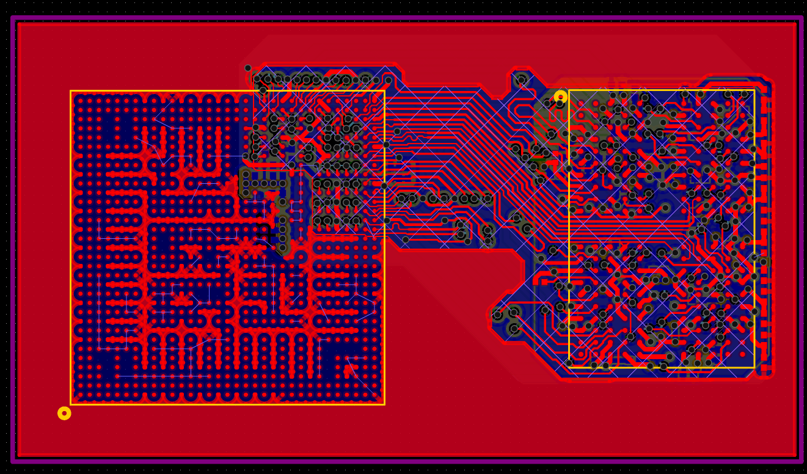
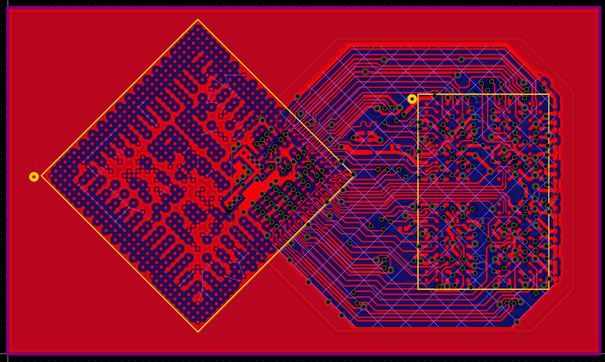

# 硬件文档

## 在线 BOM

- https://docs.avaota.fun/online_bom/avaota-a1.html

## 相关资源

- AvaotaA1 使用的 8 层 LPDDR4 模板：
  - SCH：https://github.com/AvaotaSBC/Avaota-A1/tree/master/resource/dram_8l/01_SCH
  - PCB：https://github.com/AvaotaSBC/Avaota-A1/tree/master/resource/dram_8l/02_PCB
  - 工程文件：https://github.com/AvaotaSBC/Avaota-A1/tree/master/resource/dram_8l/03_EDA
  - 转换后的AD工程：https://github.com/AvaotaSBC/Avaota-A1/tree/master/resource/dram_8l/04_ADPCB
- 国内镜像
  - SCH：https://gitee.com/avaotasbc/avaota-a1/tree/master/resource/dram_8l/01_SCH
  - PCB：https://gitee.com/avaotasbc/avaota-a1/tree/master/resource/dram_8l/02_PCB
  - 工程文件：https://gitee.com/avaotasbc/avaota-a1/tree/master/resource/dram_8l/03_EDA
  - 转换后的AD工程：https://gitee.com/avaotasbc/avaota-a1/tree/master/resource/dram_8l/04_ADPCB

- AvaotaA1 未使用的 4 层 LPDDR4 模板：
  - SCH：https://github.com/AvaotaSBC/Avaota-A1/tree/master/resource/dram_4l/01_SCH
  - PCB：https://github.com/AvaotaSBC/Avaota-A1/tree/master/resource/dram_4l/02_PCB
  - 工程文件：https://github.com/AvaotaSBC/Avaota-A1/tree/master/resource/dram_4l/03_EDA
  - 转换后的AD工程：https://github.com/AvaotaSBC/Avaota-A1/tree/master/resource/dram_4l/04_ADPCB
- 国内镜像
  - SCH：https://gitee.com/avaotasbc/avaota-a1/tree/master/resource/dram_4l/01_SCH
    - PCB：https://gitee.com/avaotasbc/avaota-a1/tree/master/resource/dram_4l/02_PCB
    - 工程文件：https://gitee.com/avaotasbc/avaota-a1/tree/master/resource/dram_4l/03_EDA
    - 转换后的AD工程：https://gitee.com/avaotasbc/avaota-a1/tree/master/resource/dram_4l/04_ADPCB

- IBIS 仿真数据：https://github.com/AvaotaSBC/Avaota-A1/tree/master/resource/ibis
- 国内镜像
  - IBIS 仿真数据：https://gitee.com/avaotasbc/avaota-a1/tree/master/resource/ibis

## v1.7 版本

### 更新记录

1. Modify DP to top layer
2. Optimized impedance

### 相关资料

- 原理图：https://github.com/AvaotaSBC/Avaota-A1/tree/master/hardware/v1.7/01_SCH
- PCB：https://github.com/AvaotaSBC/Avaota-A1/tree/master/hardware/v1.7/02_PCB
- GERBER：https://github.com/AvaotaSBC/Avaota-A1/tree/master/hardware/v1.7/03_GERBER
- BOM：https://github.com/AvaotaSBC/Avaota-A1/tree/master/hardware/v1.7/04_BOM
- 点位：https://github.com/AvaotaSBC/Avaota-A1/tree/master/hardware/v1.7/05_PICKANDPLACE
- 3D：https://github.com/AvaotaSBC/Avaota-A1/tree/master/hardware/v1.7/06_3D
- AD转换版PCB：https://github.com/AvaotaSBC/Avaota-A1/tree/master/hardware/v1.7/07_ADPCB
- EasyEDA工程：https://github.com/AvaotaSBC/Avaota-A1/tree/master/hardware/v1.7/08_JLCEDA
- 国内镜像
  - 原理图：https://gitee.com/avaotasbc/avaota-a1/tree/master/hardware/v1.7/01_SCH
  - PCB：https://gitee.com/avaotasbc/avaota-a1/tree/master/hardware/v1.7/02_PCB
  - GERBER：https://gitee.com/avaotasbc/avaota-a1/tree/master/hardware/v1.7/03_GERBER
  - BOM：https://gitee.com/avaotasbc/avaota-a1/tree/master/hardware/v1.7/04_BOM
  - 点位：https://gitee.com/avaotasbc/avaota-a1/tree/master/hardware/v1.7/05_PICKANDPLACE
  - 3D：https://gitee.com/avaotasbc/avaota-a1/tree/master/hardware/v1.7/06_3D
  - AD转换版PCB：https://gitee.com/avaotasbc/avaota-a1/tree/master/hardware/v1.7/07_ADPCB
  - EasyEDA工程：https://gitee.com/avaotasbc/avaota-a1/tree/master/hardware/v1.7/08_JLCEDA

## v1.6 版本

### 更新记录

1. **Fix SoC 3V3 Digital power domain error !!important**
2. Add Dioid for USB VBUS to Avoid Power switch abnormal working
3. Modify HDMI reference layer
4. Modify RF reference layer

### 相关资料

- 原理图：https://github.com/AvaotaSBC/Avaota-A1/tree/master/hardware/v1.6/01_SCH
- PCB：https://github.com/AvaotaSBC/Avaota-A1/tree/master/hardware/v1.6/02_PCB
- GERBER：https://github.com/AvaotaSBC/Avaota-A1/tree/master/hardware/v1.6/03_GERBER
- BOM：https://github.com/AvaotaSBC/Avaota-A1/tree/master/hardware/v1.6/04_BOM
- 点位：https://github.com/AvaotaSBC/Avaota-A1/tree/master/hardware/v1.6/05_PICKANDPLACE
- 3D：https://github.com/AvaotaSBC/Avaota-A1/tree/master/hardware/v1.6/06_3D
- AD转换版PCB：https://github.com/AvaotaSBC/Avaota-A1/tree/master/hardware/v1.6/07_ADPCB
- EasyEDA工程：https://github.com/AvaotaSBC/Avaota-A1/tree/master/hardware/v1.6/08_JLCEDA
- 国内镜像
  - 原理图：https://gitee.com/avaotasbc/avaota-a1/tree/master/hardware/v1.6/01_SCH
  - PCB：https://gitee.com/avaotasbc/avaota-a1/tree/master/hardware/v1.6/02_PCB
  - GERBER：https://gitee.com/avaotasbc/avaota-a1/tree/master/hardware/v1.6/03_GERBER
  - BOM：https://gitee.com/avaotasbc/avaota-a1/tree/master/hardware/v1.6/04_BOM
  - 点位：https://gitee.com/avaotasbc/avaota-a1/tree/master/hardware/v1.6/05_PICKANDPLACE
  - 3D：https://gitee.com/avaotasbc/avaota-a1/tree/master/hardware/v1.6/06_3D
  - AD转换版PCB：https://gitee.com/avaotasbc/avaota-a1/tree/master/hardware/v1.6/07_ADPCB
  - EasyEDA工程：https://gitee.com/avaotasbc/avaota-a1/tree/master/hardware/v1.6/08_JLCEDA

## v1.5 版本 PINE64 修改

### 更新记录

1. Modify R30 to 4K3, R33 to 6K8 to Support boot from SPI NOR in PJ bank
2. Mount SPI NOR

### 相关资料

- 原理图：https://github.com/AvaotaSBC/Avaota-A1/tree/master/hardware/v1.5/01_SCH	
- 国内镜像
  - 原理图：https://gitee.com/avaotasbc/avaota-a1/tree/master/hardware/v1.5/01_SCH

## v1.4 版本

### 更新记录

1. Adjust SPI LCD BLK level.
2. Adjust DP AUX pd and pm

### 相关资料

- 原理图：https://github.com/AvaotaSBC/Avaota-A1/tree/master/hardware/v1.4/01_SCH
- PCB：https://github.com/AvaotaSBC/Avaota-A1/tree/master/hardware/v1.4/02_PCB
- GERBER：https://github.com/AvaotaSBC/Avaota-A1/tree/master/hardware/v1.4/03_GERBER
- BOM：https://github.com/AvaotaSBC/Avaota-A1/tree/master/hardware/v1.4/04_BOM
- 点位：https://github.com/AvaotaSBC/Avaota-A1/tree/master/hardware/v1.4/05_PICKANDPLACE
- 3D：https://github.com/AvaotaSBC/Avaota-A1/tree/master/hardware/v1.4/06_3D
- AD转换版PCB：https://github.com/AvaotaSBC/Avaota-A1/tree/master/hardware/v1.4/07_ADPCB
- EasyEDA工程：https://github.com/AvaotaSBC/Avaota-A1/tree/master/hardware/v1.4/08_JLCEDA
- 国内镜像
  - 原理图：https://gitee.com/avaotasbc/avaota-a1/tree/master/hardware/v1.4/01_SCH
  - PCB：https://gitee.com/avaotasbc/avaota-a1/tree/master/hardware/v1.4/02_PCB
  - GERBER：https://gitee.com/avaotasbc/avaota-a1/tree/master/hardware/v1.4/03_GERBER
  - BOM：https://gitee.com/avaotasbc/avaota-a1/tree/master/hardware/v1.4/04_BOM
  - 点位：https://gitee.com/avaotasbc/avaota-a1/tree/master/hardware/v1.4/05_PICKANDPLACE
  - 3D：https://gitee.com/avaotasbc/avaota-a1/tree/master/hardware/v1.4/06_3D
  - AD转换版PCB：https://gitee.com/avaotasbc/avaota-a1/tree/master/hardware/v1.4/07_ADPCB
  - EasyEDA工程：https://gitee.com/avaotasbc/avaota-a1/tree/master/hardware/v1.4/08_JLCEDA

## v1.3 版本

### 更新记录

1. Modify DP section wiring.
2. Change R17 to 5.1K.
3. Adjust button position to prevent accidental touch.
4. Adjust LED level.
5. Modify PHY IO configuration.
6. Adjust FAN interface wiring sequence.
7. Modify FAN connector size.
8. Revise PMU capacitor layout.
9. Optimize VBUS routing.
10. Modify silk screen logo.

### 相关资料

- 原理图：https://github.com/AvaotaSBC/Avaota-A1/tree/master/hardware/v1.3/01_SCH
- PCB：https://github.com/AvaotaSBC/Avaota-A1/tree/master/hardware/v1.3/02_PCB
- GERBER：https://github.com/AvaotaSBC/Avaota-A1/tree/master/hardware/v1.3/03_GERBER
- BOM：https://github.com/AvaotaSBC/Avaota-A1/tree/master/hardware/v1.3/04_BOM
- 点位：https://github.com/AvaotaSBC/Avaota-A1/tree/master/hardware/v1.3/05_PICKANDPLACE
- 3D：https://github.com/AvaotaSBC/Avaota-A1/tree/master/hardware/v1.3/06_3D
- AD转换版PCB：https://github.com/AvaotaSBC/Avaota-A1/tree/master/hardware/v1.3/07_ADPCB
- EasyEDA工程：https://github.com/AvaotaSBC/Avaota-A1/tree/master/hardware/v1.3/08_JLCEDA
- 国内镜像
  - 原理图：https://gitee.com/avaotasbc/avaota-a1/tree/master/hardware/v1.3/01_SCH
  - PCB：https://gitee.com/avaotasbc/avaota-a1/tree/master/hardware/v1.3/02_PCB
  - GERBER：https://gitee.com/avaotasbc/avaota-a1/tree/master/hardware/v1.3/03_GERBER
  - BOM：https://gitee.com/avaotasbc/avaota-a1/tree/master/hardware/v1.3/04_BOM
  - 点位：https://gitee.com/avaotasbc/avaota-a1/tree/master/hardware/v1.3/05_PICKANDPLACE
  - 3D：https://gitee.com/avaotasbc/avaota-a1/tree/master/hardware/v1.3/06_3D
  - AD转换版PCB：https://gitee.com/avaotasbc/avaota-a1/tree/master/hardware/v1.3/07_ADPCB
  - EasyEDA工程：https://gitee.com/avaotasbc/avaota-a1/tree/master/hardware/v1.3/08_JLCEDA

## v1.2 版本

### 相关资料

- 原理图：https://github.com/AvaotaSBC/Avaota-A1/tree/master/hardware/v1.2/01_SCH
- PCB：https://github.com/AvaotaSBC/Avaota-A1/tree/master/hardware/v1.2/02_PCB
- GERBER：https://github.com/AvaotaSBC/Avaota-A1/tree/master/hardware/v1.2/03_GERBER
- BOM：https://github.com/AvaotaSBC/Avaota-A1/tree/master/hardware/v1.2/04_BOM
- AD转换PCB：https://github.com/AvaotaSBC/Avaota-A1/tree/master/hardware/v1.2/06_ADPCB
- 国内镜像
  - 原理图：https://gitee.com/avaotasbc/avaota-a1/tree/master/hardware/v1.2/01_SCH
  - PCB：https://gitee.com/avaotasbc/avaota-a1/tree/master/hardware/v1.2/02_PCB
  - GERBER：https://gitee.com/avaotasbc/avaota-a1/tree/master/hardware/v1.2/03_GERBER
  - BOM：https://gitee.com/avaotasbc/avaota-a1/tree/master/hardware/v1.2/04_BOM
  - AD转换PCB：https://gitee.com/avaotasbc/avaota-a1/tree/master/hardware/v1.2/06_ADPCB

## 物料支持列表

### DRAM 支持列表

下面列出的是经过测试的 DRAM 物料，在此支持列表以外的未经过测试，需要自行测试。

| 厂家        | 容量Bit | 型号                  | 类型   | 封装    | 类型            | 时钟频率 |
| ----------- | ------- | --------------------- | ------ | ------- | --------------- | -------- |
| Biwin       | 16Gb    | BWMZEX32H2A-16G-X     | LPDDR4 | FBGA200 | 512Mx32x2CH     | 1200     |
| CXMT        | 16Gb    | CXDB4CBAM-ML-A        | LPDDR4 | FBGA200 | 512Mx16x2CHx1CS | 1200     |
| CXMT        | 16Gb    | CXDB4CBAM-MK-A        | LPDDR4 | FBGA200 | 512Mx16x2CHx1CS | 1200     |
| CXMT        | 16Gb    | CXDB4CBAM-MJ-A        | LPDDR4 | FBGA200 | 512Mx16x2CHx1CS | 1200     |
| CXMT        | 32Gb    | CXDB5CCBM-MA-A        | LPDDR4 | FBGA200 | 512Mx16x2CHx2CS | 1200     |
| CXMT        | 32Gb    | CXDB5CCBM-MK-A        | LPDDR4 | FBGA200 | 512Mx16x2CHx2CS | 1200     |
| CXMT        | 32Gb    | CXDB5CCBM-MJ-A        | LPDDR4 | FBGA200 | 512Mx16x2CHx2CS | 1200     |
| CXMT        | 24Gb    | CXDBBCCBM-MK-B        | LPDDR4 | FBGA200 | 384Mx16x2CHx2CS | 1200     |
| CXMT        | 8Gb     | CXDB3ABAM-MK-A        | LPDDR4 | FBGA200 | 256M×16×2CH     | 1200     |
| CXMT        | 24Gb    | CXDBBCCBM-MA-B        | LPDDR4 | FBGA200 | 384Mx16x2CHx2CS | 1200     |
| GCAI        | 32Gb    | GDB2D32MJ0-42M7       | LPDDR4 | FBGA200 | 1G×16×2CH       | 1200     |
| HOSINGLOBAL | 32Gb    | HG4XD04G-C2JA         | LPDDR4 | FBGA200 | 512M×32×2CH     | 1200     |
| Hynix       | 16Gb    | H9HCNNNBKUMLXR-NEX    | LPDDR4 | FBGA200 | 512Mx16×2CH     | 1200     |
| Hynix       | 32Gb    | H9HCNNNCPUML-HRNME    | LPDDR4 | FBGA200 | 512Mx32×2CH     | 1200     |
| JSC         | 16Gb    | JSL4BAG329ZAMF-05     | LPDDR4 | FBGA200 | 512M×16×2CH     | 1200     |
| JSC         | 24Gb    | LPL4A4E329ZAMF-05     | LPDDR4 | FBGA200 | 768Mx16x2CH     | 1200     |
| Kazoom      | 32Gb    | KZDB42CAM-MD          | LPDDR4 | FBGA200 | 512Mx32x2CS     | 1200     |
| Kazoom      | 32Gb    | KZDB42CAM-MF          | LPDDR4 | FBGA200 | 512Mx32x2CS     | 936      |
| Konka Kowin | 32Gb    | KALXX5S43AY2-T40      | LPDDR4 | FBGA200 | 512M×16×2CH×2CS | 1200     |
| Konka Kowin | 16Gb    | KALXX4S43AY2-T40      | LPDDR4 | FBGA200 | 256M×16×2CH×2CS | 1200     |
| Longsys     | 32Gb    | FLXC2004G-N1          | LPDDR4 | FBGA200 | 1024Mx16x2ch    | 1200     |
| Longsys     | 32Gb    | FLXC2004G-30          | LPDDR4 | FBGA200 | 1024Mx16x2ch    | 1200     |
| Longsys     | 16Gb    | FLXC2002G-N2          | LPDDR4 | FBGA200 | 512Mx16x2CH     | 1200     |
| Longsys     | 32Gb    | FLXC4004G-W6          | LPDDR4 | FBGA200 | 1Gx16x2CH       | 1200     |
| Micron      | 32Gb    | SM1G32Z32MD2DNQ-PG    | LPDDR4 | FBGA200 | 1G×32           | 1200     |
| Micron      | 32Gb    | SM1G32Z42MD2DNQ-PG    | LPDDR4 | FBGA200 | 1G×32           | 1200     |
| Nanya       | 8Gb     | NT6AN256T32AV-J2      | LPDDR4 | FBGA200 | 256Mx16x2ch     | 1200     |
| Nanya       | 16Gb    | NT6AN512T32AV-J2      | LPDDR4 | FBGA200 | 512Mx16x2ch     | 1200     |
| Nanya       | 32Gb    | NT6AN1024F32AV-J2     | LPDDR4 | FBGA200 | 1G×16×2CH       | 1200     |
| Rayson      | 16Gb    | RS512M32LM4D2BDS-53BT | LPDDR4 | FBGA200 | 512M×16x2CH     | 1200     |
| Rayson      | 32Gb    | RS1G32LV4D2BDS-53BT   | LPDDR4 | FBGA200 | 1Gb×16x2CH      | 1200     |
| Rayson      | 16Gb    | RS512M32LO4D1BDS-53BT | LPDDR4 | FBGA200 | 512Mx16x2CH     | 1200     |
| Rayson      | 24Gb    | RS768M32LP4D2BDS-53BT | LPDDR4 | FBGA200 | 768Mx16x2CH     | 1200     |
| SCY         | 32Gb    | DL4A32G32T4V-EC       | LPDDR4 | FBGA200 | 1Gx32           | 1200     |
| Zentel      | 8Gb     | A8N8GH52ABF-PK        | LPDDR4 | FBGA200 | 256Mx16x2CH     | 1200     |

### eMMC 支持列表

| Vendor     | Capacity | Part Number                      | EMMC/SD | Cell&Process | Pkg Size               | Grade&Operating temperature |
| ---------- | -------- | -------------------------------- | ------- | ------------ | ---------------------- | --------------------------- |
| AcSip      | 16G      | NCMMCS16G                        | v4.5    |              | 12×16-BGA169           |                             |
| Artmem     | 64G      | AT70B64G4Y01F                    | v5.1    |              | 11.5×13-BGA153         | -25 ~ +85                   |
| Artmem     | 64G      | AT70B64G4S09F                    | v5.1    |              | 11.5×13-BGA153         | -25 ~ +85                   |
| Barun      | 8G       | BEM08S1B60XA-A3CT                | v4.51   | TLC/19nm     | 11.5×13-BGA153         |                             |
| Barun      | 16G      | BSB16GCDRS4EM-01                 | v4.51   | TLC/16nm     | 11.5×13-BGA153         | -25~+85                     |
| Biwin      | 16G      | BWCTAK611G16G                    | V5.0    |              | 11.5×13-BGA153         |                             |
| Biwin      | 64G      | BWCTARV11X64G                    | V5.1    |              | 11.5×13-BGA153         | -25 ~ +85                   |
| Biwin      | 128G     | BWCTAKJ21X128G                   | V5.1    |              | 11.5×13×0.9mm          | -25 ~ +85                   |
| Biwin      | 32GB     | BWCTARJ11X32G                    | v5.1    |              | 11.5×13×0.9mm          | -25~85                      |
| Dosilicon  | 16G      | FMR16C1D0A-SB                    | v5.0    | H3D V2 MLC   | 11.5×13-BGA153         |                             |
| FDI        | 4G       | MC1M04M1L3AB                     | v4.51   | MLC          | 11.5×13-BGA153         |                             |
| FDI        | 8G       | MC1M08M2L3AB                     | v4.51   | MLC          | 11.5×13-BGA153         |                             |
| FORESEE    | 4G       | NCEFEM48-04G                     | v4.5    | MLC/20nm     | 11.5×13.5-BGA153       |                             |
| FORESEE    | 8G       | NCEMAD7B-08G                     | v5.0    | TLC/15nm     | 11.5×13-BGA153         |                             |
| FORESEE    | 8G       | NCEMAM6G-08G                     | v5.1    | MLC/16nm     | 11.5×13-BGA153         |                             |
| FORESEE    | 32G      | FEMDNN032G-A3A55                 | v5.1    |              | FBGA 11.5×13×0.8       | -25~+85                     |
| FORESEE    | 64G      | FEMDNN064G-58A44                 | v5.1    |              | 153FBGA 11.5×13×1      | -25~+85                     |
| FORESEE    | 64G      | FEMDNN064G-A3A56                 | v5.1    |              | FBGA 11.5×13×0.8       | -25~+85                     |
| FORESEE    | 128G     | FEMDNN128G-A3A56                 | v5.1    |              | FBGA 11.5×13×0.8       | -25~+85                     |
| FORESEE    | 128G     | FEMDNN128G-A3A44                 | v5.1    |              | FBGA 11.5×13.5×1.0     | -25~+85                     |
| FORESEE    | 8GB      | FEMDMW008G-88A39                 | v5.1    |              | 1.5×13-153 FBGA        | A3(-40~85)                  |
| Gigadevice | 8G       | GD9E8T00GNM-05                   | v5.1    | TLC/T16nm    | 11.5×13-BGA153         |                             |
| ISOCOM     | 128GB    | MEMDNN128G                       | v5.1    |              | 11.5×13.0×0.8          | -25~85                      |
| JSC        | 32G      | JSMC32BUA2HYAEA                  | v5.0    | H3D V2 MLC   | 11.5×13-BGA153         |                             |
| KIOXIA     | 4G       | THGBMTG5D1LBAIL                  | v5.0    |              | 11.5×13-BGA153         | C(-25~+85)                  |
| KIOXIA     | 32GB     | THGAMRG8T13BAA7                  | v5.1    |              | 11.5mm×13mm×1.0mm(max) | -40~85                      |
| Kingston   | 8G       | EMMC08G-V100                     | v5.0    |              | 11.5×13-BGA153         |                             |
| Kingston   | 4G       | EMMC04G-M627                     | v5.1    | MLC/15nm     | 11.5×13-BGA153         | -25~+85                     |
| Kingston   | 8G       | EMMC08G-M728                     | v5.0    | 3D MLC       | 11.5×13-BGA153         |                             |
| Kingston   | 16G      | EMMC16G-W525                     | v5.0    | MLC/T15nm    | 11.5×13-BGA153         | I(-40 ~ +85)                |
| Kingston   | 32G      | EMMC32G-W525                     | v5.0    | MLC/T15nm    | 11.5×13-BGA153         | I(-40 ~ +85)                |
| Kingston   | 64G      | EMMC64G-W525                     | v5.0    | MLC/T15nm    | 11.5×13-BGA153         | I(-40 ~ +85)                |
| Micron     | 8G       | 2GA28-JW686 (MTFC8GLSEA-IT)      | v4.41   |              | 11.5×13-BGA153         |                             |
| Micron     | 8G       | 3ZA28-JWA48 (MTFC8GACAAEA-WT)    | v4.51   | MLC          | 11.5×13-BGA153         | -30 ~ +85                   |
| Micron     | 4G       | 3ZA28-JWA49 (MTFC4GACAAEA-WT)    | v4.51   | MLC          | 11.5×13-BGA153         | -30 ~ +85                   |
| Micron     | 8G       | 5QA27-JY995 (MTFC8GAKAJCN-1WMT)  | v5.0    | MLC          | 11.5×13-BGA153         |                             |
| Micron     | 16G      | 6FA28-JWB74 (MTFC16GAKAECN-2MWT) | v5.0    | MLC          | 11.5×13-BGA153         |                             |
| Ramaxel    | 8G       | REMKDM308GSBB                    | v5.0    | MLC          | 11.5×13-BGA153         |                             |
| Ramaxel    | 8G       | REMSAT408GSBB                    | v5.0    | TLC/A19nm    | 11.5×13-BGA153         |                             |
| Ramaxel    | 8G       | REMPBT808GSBB                    | v5.0    | TLC/15nm     | 11.5×13-BGA153         |                             |
| Rayson     | 64G      | RS70B64G4S09F                    | v5.1    | 3D TLC       | FBGA153                | -25~+85                     |
| Rayson     | 128G     | RS70BT7G4S09F                    | v5.1    | 3D TLC       | FBGA153                | -25~+85                     |
| SCY        | 128G     | E128CSAG2ABE00                   | v5.1    |              |                        | -25 ~ +65                   |
| SKhynix    | 32G      | H26M64208EMRQ                    | v5.1    |              | 11.5×13×1.0-153FBGA    |                             |
| SKhynix    | 32G      | H26M62002JPR                     | v5.1    |              | 11.5×13×0.8-BGA153     |                             |
| Samsung    | 16G      | KLMAG2GEND-B031                  | v5.0    | MLC/16nm     | 11.5×13-BGA153         | -25~+85                     |
| Samsung    | 32G      | KLMBG4GEND-B031                  | v5.0    | MLC/16nm     | 11.5×13-BGA153         | -25~+85                     |
| Samsung    | 8G       | KLM8G1WEPD-B031                  | v5.0    | TLC/16nm     | 11.5×13-BGA153         | -25~+85                     |
| Samsung    | 16G      | KLMAG2WEPD-B031                  | v5.0    | TLC/16nm     | 11.5×13-BGA153         | -25~+85                     |
| Samsung    | 32G      | KLMBG4WEBD-B031                  | v5.0    | TLC/16nm     | 11.5×13-BGA153         | -25~+85                     |
| Samsung    | 64G      | KLMCG8GEND-B031                  | v5.0    | MLC/16nm     | 11.5×13-BGA153         | -25~+85                     |
| Samsung    | 8G       | KLM8G1GEND-B031                  | v5.0    | MLC/16nm     | 11.5×13-BGA153         | -25~+85                     |
| Samsung    | 64G      | KLMCG8WEBD-B031                  | v5.0    | TLC/16nm     | 11.5×13-BGA153         | -25~+85                     |
| Samsung    | 4G       | KLM4G1FEPD-B031                  | v5.0    | MLC/16nm     | 11×10-BGA153           | -25~+85                     |
| Samsung    | 8G       | KLM8G1GEME-B041                  | v5.1    | MLC/14nm     | 11.5×13-BGA153         | -25~+85                     |
| Samsung    | 16G      | KLMAG1JENB-B041                  | v5.1    | MLC/14nm     | 11.5×13-BGA153         | -25~+85                     |
| Samsung    | 32G      | KLMBG2JENB-B041                  | v5.1    | MLC/14nm     | 11.5×13-BGA153         | -25~+85                     |
| Samsung    | 64G      | KLMCG4JENB-B041                  | v5.1    | MLC/14nm     | 11.5×13-BGA153         | -25~+85                     |
| Samsung    | 8G       | KLM8G1GETF-B041                  | v5.1    | MLC/14nm     | 11.5×13-BGA153         | -25~+85                     |
| Samsung    | 16G      | KLMAG1JETD-B041                  | v5.1    | MLC/14nm     | 11.5×13-BGA153         | -25~+85                     |
| Samsung    | 32G      | KLMBG2JETD-B041                  | v5.1    | MLC/14nm     | 11.5×13-BGA153         | -25~+85                     |
| Samsung    | 64G      | KLMCG4JETD-B041                  | v5.1    | MLC/14nm     | 11.5×13-BGA153         | -25~+85                     |
| Samsung    | 8G       | KLM8G1GESD-B04P                  | v5.1    | MLC/16nm     | 11.5×13-BGA153         | A3(-40 ~ +85)               |
| Samsung    | 8G       | KLM8G1GEUF-B04P                  | v5.1    |              | 11.5×13-BGA153         | A3(-40 ~ +85)               |
| Samsung    | 16G      | KLMAG2GEUF-B04P                  | v5.1    |              | 11.5×13-BGA153         | A3(-40 ~ +85)               |
| Samsung    |          | KLM4G1FETE-B041                  |         |              |                        |                             |
| Sandisk    | 8G       | SDIN8DE2-8G-A                    | v4.51   | MLC/1xnm     | 11.5×13-BGA153         | A3(-40 ~ +85)               |
| Sandisk    | 16G      | SDINBDG4-16G                     | v5.1    | MLC/1znm     | 11.5×13-BGA153         |                             |
| Sandisk    | 32G      | SDINBDG4-32G                     | v5.1    | MLC/1znm     | 11.5×13-BGA153         |                             |
| Sandisk    | 16G      | SDINBDG4-16G-H                   | v5.1    | MLC/1znm     | 11.5×13-BGA153         |                             |
| Sandisk    | 32G      | SDINBDG4-32G-H                   | v5.1    | MLC/1znm     | 11.5×13-BGA153         |                             |
| Sandisk    | 32G      | SDINBDA4-32G                     | v5.1    | 3D TLC       | 11.5×13-BGA153         |                             |
| Sandisk    | 64G      | SDINBDA4-64G                     | v5.1    | 3D TLC       | 11.5×13-BGA153         |                             |
| Sandisk    | 16G      | SDINBDG4-16G-XA                  | v5.1    | MLC          | 11.5×13-BGA153         | A3(-40 ~ +85)               |
| Sandisk    | 16G      | SDINBDA6-16G                     | v5.0    | 3D TLC       | 11.5×13-BGA153         | -25 ~ +85                   |
| SiS        | 32G      | MC032000AA                       | v5.0    | MLC/H16nm    | 11.5×13-BGA153         |                             |
| TOPDISK    | 32G      | A132-32G                         | V5.1    |              | 11.5×13-BGA153         |                             |
| Toshiba    | 16G      | THGBM5G7A2JBAIM                  | v5.0    |              | 11.5×13-BGA153         |                             |
| Toshiba    | 32G      | THGBM5G8A4JBAIM                  | v5.0    |              | 11.5×13-BGA153         |                             |
| Toshiba    | 16G      | THGBM6G7T2JBAIM                  | v4.41   |              | 11.5×13-BGA153         |                             |
| Toshiba    | 16G      | THGBMFG7C1LBAIL                  | v5.0    | MLC/15nm     | 11.5×13-BGA153         |                             |
| Toshiba    | 4G       | THGBMBG5D1KBAIL                  | v5.0    | MLC/A19nm    | 11.5×13-BGA153         | -25~+85                     |
| Toshiba    | 32G      | THGBMFG8C2LBAIL                  | v5.0    | MLC/15nm     | 11.5×13-BGA153         |                             |
| Toshiba    | 4G       | THGBMDG5D1LBAIL                  | v5.1    | MLC/15nm     | 11.5×13-BGA153         | -25~+85                     |
| Toshiba    | 8G       | THGBMHG6C1LBAIL                  | v5.1    | MLC/15nm     | 11.5×13-BGA153         | -25~+85                     |
| Toshiba    | 16G      | THGBMHG7C1LBAIL                  | v5.1    | MLC/15nm     | 11.5×13-BGA153         | -25~+85                     |
| Toshiba    | 32G      | THGBMHG8C2LBAIL                  | v5.1    | MLC/15nm     | 11.5×13-BGA153         | -25~+85                     |
| Toshiba    | 64G      | THGBMHG9C4LBAIL                  | v5.1    | MLC/15nm     | 11.5×13-BGA153         | -25~+85                     |
| Toshiba    | 16G      | THGBMAG7C2LBAW7                  | v5.1    | MLC/15nm     | 11.5×13-BGA153         | I(-40 ~ +85)                |
| Toshiba    | 8G       | THGBMHG6C1LBAWL                  | v5.1    | MLC          | 11.5×13-BGA153         | I(-40 ~ +85)                |
| Toshiba    | 16G      | THGBMHG7C2LBAW7                  | v5.1    |              | 11.5×13-BGA153         | -40 ~ +85                   |
| UniIC      | 64G      | UNMEN06GC2C31AS                  | v5.1    | 3D TLC       | 11.5×13-BGA153         | C(-25 ~ +85)                |
| YMTC       | 64G      | YMEC7A2TB2A2C3                   | v5.1    | MLC          | 11.5×13-BGA153         | -25 ~ +85                   |

| Grade | Description                          |
| ----- | ------------------------------------ |
| A3    | Automotive AEC-Q100 Grade3(-40~+85)  |
| A2    | Automotive AEC-Q100 Grade2(-40~+105) |
| A1    | Automotive AEC-Q100 Grade1(-40~+125) |
| I     | Industrial Grade                     |
| C     | Commercial Grade                     |
