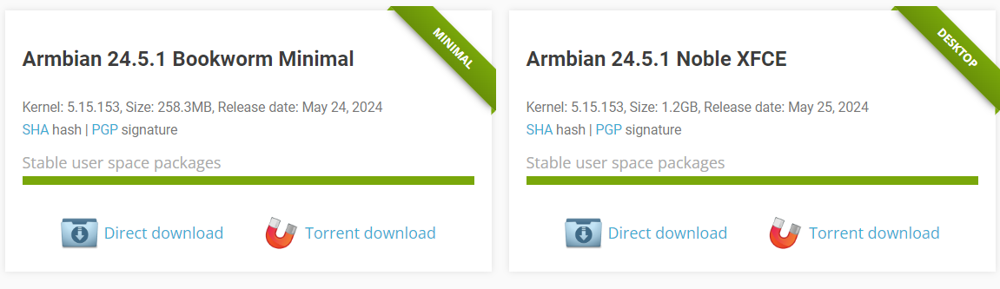

# 固件下载

## Armbian 24.5.1

### 官网下载

- https://www.armbian.com/avaota-a1/

### 镜像源下载

#### 清华大学开源软件镜像站

- [24.5.1 (Avaota-a1_jammy_legacy_5.15.153, img.xz)](https://mirrors.tuna.tsinghua.edu.cn/armbian-releases/avaota-a1/archive/Armbian_24.5.1_Avaota-a1_jammy_legacy_5.15.153.img.xz)
- [24.5.1 (Avaota-a1_bookworm_legacy_5.15.153_cinnamon_desktop, img.xz)](https://mirrors.tuna.tsinghua.edu.cn/armbian-releases/avaota-a1/archive/Armbian_24.5.1_Avaota-a1_bookworm_legacy_5.15.153_cinnamon_desktop.img.xz)
- [24.5.1 (Avaota-a1_bookworm_legacy_5.15.153_xfce_desktop, img.xz)](https://mirrors.tuna.tsinghua.edu.cn/armbian-releases/avaota-a1/archive/Armbian_24.5.1_Avaota-a1_bookworm_legacy_5.15.153_xfce_desktop.img.xz)
- [24.5.1 (Avaota-a1_noble_legacy_5.15.153_xfce_desktop, img.xz)](https://mirrors.tuna.tsinghua.edu.cn/armbian-releases/avaota-a1/archive/Armbian_24.5.1_Avaota-a1_noble_legacy_5.15.153_xfce_desktop.img.xz)
- [24.5.1 (Avaota-a1_bookworm_legacy_5.15.153_minimal, img.xz)](https://mirrors.tuna.tsinghua.edu.cn/armbian-releases/avaota-a1/archive/Armbian_24.5.1_Avaota-a1_bookworm_legacy_5.15.153_minimal.img.xz)
- [24.5.1 (Avaota-a1_noble_legacy_5.15.153_gnome_desktop, img.xz)](https://mirrors.tuna.tsinghua.edu.cn/armbian-releases/avaota-a1/archive/Armbian_24.5.1_Avaota-a1_noble_legacy_5.15.153_gnome_desktop.img.xz)
- [24.5.1 (Avaota-a1_noble_legacy_5.15.153, img.xz)](https://mirrors.tuna.tsinghua.edu.cn/armbian-releases/avaota-a1/archive/Armbian_24.5.1_Avaota-a1_noble_legacy_5.15.153.img.xz)

#### 北京外国语大学开源软件镜像站

- [24.5.1 (Avaota-a1_noble_legacy_5.15.153_xfce_desktop, img.xz)](https://mirrors.bfsu.edu.cn/armbian-releases/avaota-a1/archive/Armbian_24.5.1_Avaota-a1_noble_legacy_5.15.153_xfce_desktop.img.xz)
- [24.5.1 (Avaota-a1_noble_legacy_5.15.153_gnome_desktop, img.xz)](https://mirrors.bfsu.edu.cn/armbian-releases/avaota-a1/archive/Armbian_24.5.1_Avaota-a1_noble_legacy_5.15.153_gnome_desktop.img.xz)
- [24.5.1 (Avaota-a1_noble_legacy_5.15.153, img.xz)](https://mirrors.bfsu.edu.cn/armbian-releases/avaota-a1/archive/Armbian_24.5.1_Avaota-a1_noble_legacy_5.15.153.img.xz)
- [24.5.1 (Avaota-a1_bookworm_legacy_5.15.153_cinnamon_desktop, img.xz)](https://mirrors.bfsu.edu.cn/armbian-releases/avaota-a1/archive/Armbian_24.5.1_Avaota-a1_bookworm_legacy_5.15.153_cinnamon_desktop.img.xz)
- [24.5.1 (Avaota-a1_jammy_legacy_5.15.153, img.xz)](https://mirrors.bfsu.edu.cn/armbian-releases/avaota-a1/archive/Armbian_24.5.1_Avaota-a1_jammy_legacy_5.15.153.img.xz)
- [24.5.1 (Avaota-a1_bookworm_legacy_5.15.153_xfce_desktop, img.xz)](https://mirrors.bfsu.edu.cn/armbian-releases/avaota-a1/archive/Armbian_24.5.1_Avaota-a1_bookworm_legacy_5.15.153_xfce_desktop.img.xz)
- [24.5.1 (Avaota-a1_bookworm_legacy_5.15.153_minimal, img.xz)](https://mirrors.bfsu.edu.cn/armbian-releases/avaota-a1/archive/Armbian_24.5.1_Avaota-a1_bookworm_legacy_5.15.153_minimal.img.xz)

## Daily / Rolling releases from CI pipeline

请前往armbian官网下载，地址：https://www.armbian.com/avaota-a1/

