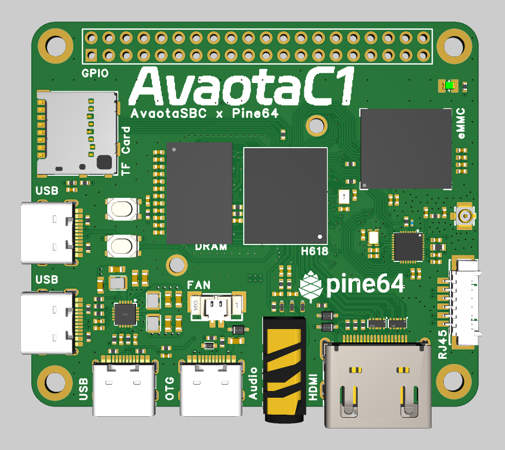

# 硬件参数

Avaota C1 is a Raspberry Pi A Shaped SBC based on Allwinner H618, It's Yuzuki Chameleon H618 Version and came to AvaotaSBC family.

## Feature

- Based on Allwinner H618 chip, 4xCortex A53
- HDMI supports 4K@60, supports up to 6K video decoding
- Up to 1GB RAM and 128GB eMMC storage
- Onboard eMMC and TF card slot
- Onboard AIC8800DC WIFI+Bluetooth chip
- 4 USB Type C, 3 HOST and one OTG, support USB camera and capture card input
- Onboard fan slot, radiator fixing hole
- Lead out RJ45 100M interface
- Onboard 40 Pin GPIO, can expand SPI LCD display, Gigabit Ethernet, microphone array, CAN transceiver, temperature and humidity sensor, acceleration sensor and so on.
- AXP313A Power Solution
- Raspberry Pi A Size
