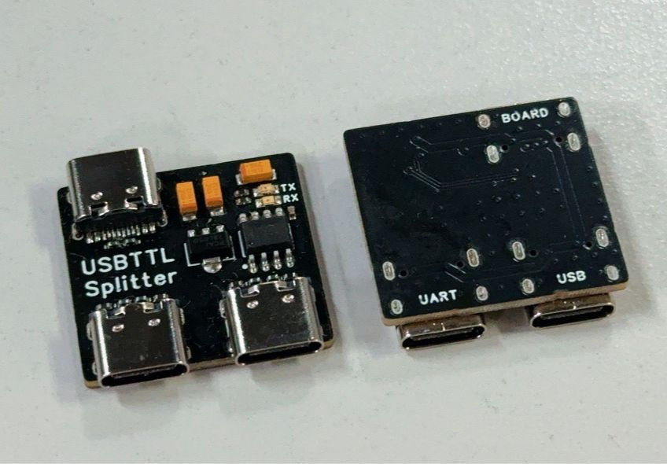

# Avaota Debugger 调试器

## 功能

将 Type C 中使用 SBU 传输的 UART 信号拆分出来

## 开源协议

Public Domain，随意商用随意修改

## 支持开发板

- TinyVision
- Avaota A1
- M28s
- SoloLinker-A

## OTG 支持情况

- 支持 OTG 功能

## UART 支持情况

- 最大3M波特率

## Type-C线支持

- 请使用能传输DP信号的全功能双C线
