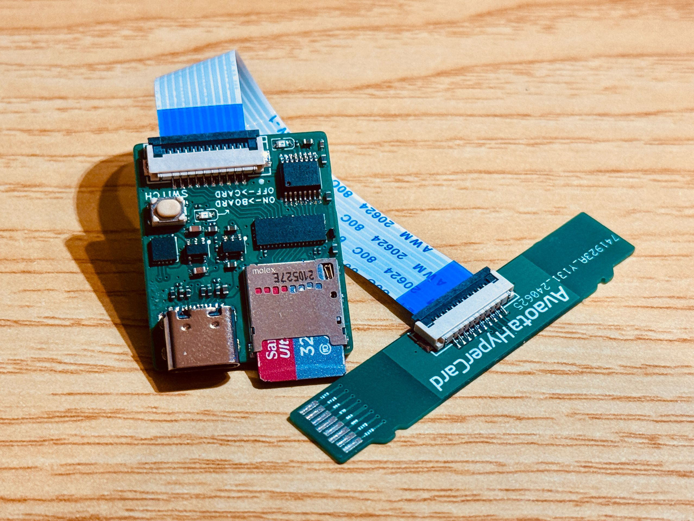

# Avaota Hyper Card

Avaota Hyper Card 系列是一个方便开发者开发的套件系列，包括 Avaota Hyper Card Reader，Avaota Hyper Card Dual Connector，Avaota Hyper Card CKLink，Avaota IP Camera Connector。

## Avaota Hyper Card 系列硬件设计

- 原理图：https://github.com/AvaotaSBC/AvaotaHyperCard/tree/main/Hardware/01_SCH
- GERBER：https://github.com/AvaotaSBC/AvaotaHyperCard/tree/main/Hardware/02_GERBER
- BOM，点位：https://github.com/AvaotaSBC/AvaotaHyperCard/tree/main/Hardware/03_BOM
- EasyEDA 工程文件：https://github.com/AvaotaSBC/AvaotaHyperCard/tree/main/Hardware/04_PRO_PROJECT
- 转换后的AD工程：https://github.com/AvaotaSBC/AvaotaHyperCard/tree/main/Hardware/05_ADPCB

## Avaota Hyper Card Reader

Avaota Hyper Card Reader 是专为解决开发过程中频繁拔插读卡器烧录系统而设计的先进设备。在开发和测试嵌入式系统时，经常需要使用读卡器进行固件烧录、数据交换或配置更新。然而，传统的读卡器经常需要物理插拔，这不仅浪费时间，还容易导致连接不稳定或损坏设备接口的风险。

Avaota Hyper Card Reader 通过其独特的多路复用器和灵活的通路切换功能，显著简化了这一过程。设备集成的TS3DV642A0RUAR多路复用器允许用户通过简单的按钮操作选择不同的连接路径：一方面，可以通过USB接口直接连接到电脑，快速进行烧录和数据传输；另一方面，可以切换至开发板通路，与嵌入式系统或开发环境进行稳定的连接。

技术上，GL823K-HCY04芯片提供了广泛的存储卡和外部设备兼容性，确保了高效的数据读取和写入操作。STC8G1K08-36I-DFN8微控制器作为控制核心，响应用户的按钮触发，智能地管理MUX的切换，确保数据流向正确的连接路径。这种设计不仅节省了时间，还减少了误操作和设备损坏的风险，极大地提升了开发效率和工作流程的稳定性。

因此，Avaota Hyper Card Reader 不仅是一款功能强大的读卡器，更是一种创新的解决方案，专门针对开发过程中频繁拔插读卡器烧录系统的问题。无论是在开发团队内部还是个人开发者的工作台上，它都能够提供高效、可靠的数据连接和操作体验，为嵌入式系统的开发和调试提供了极大的便利性和安全性保障。

## Avaota Hyper Card CKLink

Avaota Hyper Card CKLink是一款高性能的CKLink调试器，专为开发者设计，支持JTAG5和cJTAG2两种调试协议，满足多种应用需求。该设备搭载了STM32F103芯片，作为CKLink控制器，确保了稳定和高效的调试性能。同时，集成的CH343芯片则实现了串口转换功能，使得与其他设备的连接更加灵活便捷。此外，Avaota Hyper Card CKLink还配备了SL2.1 USB集线器，进一步扩展了其USB支持能力，用户能够轻松实现CKLink和串口转换的双重功能。通过配合卡口设计，该调试器为开发者提供了极大的便利，使得调试工作更加高效，极大提升了产品开发的灵活性和效率。无论是在原型开发还是产品验证阶段，Avaota Hyper Card CKLink都是开发者不可或缺的工具。

## Avaota Hyper Card Dual Connector

Avaota Hyper Card Dual Connector是一款设计精巧的双头连接器，虽然具备两个连接端口，但在实际使用中只有一头可用。这种设计旨在提供灵活性，允许用户根据不同需求选择合适的连接方式。无论是在测试、调试还是其他应用场景中，Avaota Hyper Card Dual Connector都能简化连接过程，提高工作效率。其优质材料和结构确保了稳定的信号传输和耐用性，为用户提供了可靠的解决方案。

## Avaota IP Camera Connector

Avaota IP Camera Connector是一款专为异构多核设备Avaota IP Camera设计的连接器，巧妙地通过同一个卡口引出两路cJTAG信号。这种设计不仅有效地最小化了引脚数量的占用，还实现了对异构双核调试功能的最大化利用。通过该连接器，开发者可以同时对多个核心进行调试和测试，大幅提高了开发效率和资源利用率。

Avaota IP Camera Connector的灵活性和高效性使其成为嵌入式系统开发中的理想解决方案，特别适用于需要高性能和复杂调试的应用场景。借助这一创新的连接器，开发团队能够更方便地管理和优化各个核心的性能，从而加速产品的开发和验证过程。