# Avaota Hyper Card

Avaota Hyper Card 系列是一个方便开发者开发的套件系列，包括 Avaota Hyper Card Reader，Avaota Hyper Card Connector。

## Avaota Hyper Card 系列硬件设计

- 原理图：https://github.com/AvaotaSBC/AvaotaHyperCard/tree/main/Hardware/01_SCH
- GERBER：https://github.com/AvaotaSBC/AvaotaHyperCard/tree/main/Hardware/02_GERBER
- BOM，点位：https://github.com/AvaotaSBC/AvaotaHyperCard/tree/main/Hardware/03_BOM
- EasyEDA 工程文件：https://github.com/AvaotaSBC/AvaotaHyperCard/tree/main/Hardware/04_PRO_PROJECT
- 转换后的AD工程：https://github.com/AvaotaSBC/AvaotaHyperCard/tree/main/Hardware/05_ADPCB

## Avaota Hyper Card Reader

:::info

Avaota Hyper Card Reader 使用 CERN-OHL-P-2.0 协议开源

:::

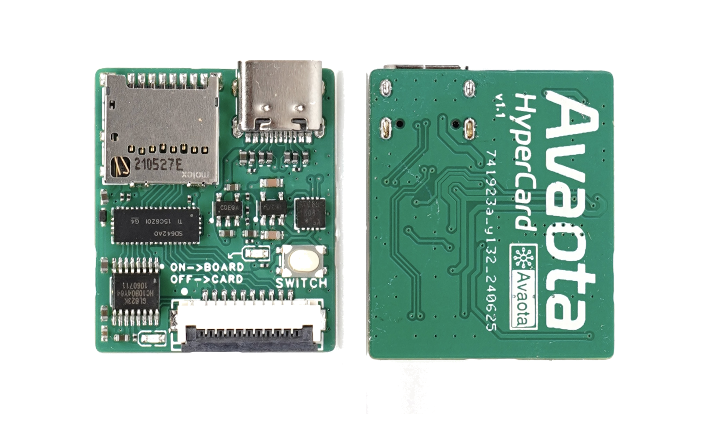

Avaota Hyper Card Reader 是专为解决开发过程中频繁拔插读卡器烧录系统而设计的先进设备。在开发和测试嵌入式系统时，经常需要使用读卡器进行固件烧录、数据交换或配置更新。然而，传统的读卡器经常需要物理插拔，这不仅浪费时间，还容易导致连接不稳定或损坏设备接口的风险。

Avaota Hyper Card Reader 通过其独特的多路复用器和灵活的通路切换功能，显著简化了这一过程。设备集成的TS3DV642A0RUAR多路复用器允许用户通过简单的按钮操作选择不同的连接路径：一方面，可以通过USB接口直接连接到电脑，快速进行烧录和数据传输；另一方面，可以切换至开发板通路，与嵌入式系统或开发环境进行稳定的连接。

技术上，GL823K-HCY04芯片提供了广泛的存储卡和外部设备兼容性，确保了高效的数据读取和写入操作。STC8G1K08-36I-DFN8微控制器作为控制核心，响应用户的按钮触发，智能地管理MUX的切换，确保数据流向正确的连接路径。这种设计不仅节省了时间，还减少了误操作和设备损坏的风险，极大地提升了开发效率和工作流程的稳定性。

因此，Avaota Hyper Card Reader 不仅是一款功能强大的读卡器，更是一种创新的解决方案，专门针对开发过程中频繁拔插读卡器烧录系统的问题。无论是在开发团队内部还是个人开发者的工作台上，它都能够提供高效、可靠的数据连接和操作体验，为嵌入式系统的开发和调试提供了极大的便利性和安全性保障。

### Avaota Hyper Card Reader 的使用

使用 Avaota Hyper Card Reader 需要以下三个部分

- Avaota Hyper Card Reader 模块
- Avaota Hyper Card Connector 模块
- 10Pin 1.0Pitch FPC 排线
- TF 卡

### Avaota Hyper Card Reader 程序烧录

:::info

默认出厂的 Avaota Hyper Card Reader 已经烧录完成固件，如果是 DIY 需要自行烧录。

:::

Avaota Hyper Card Reader 板载 STC8G1K08-36I-DFN8 微控制器作为电源管理与切换控制芯片，此芯片需要烧录才可正常工作。需要准备以下部件：

- Avaota Hyper Card Reader 模块
- Avaota Debugger 模块

#### 使用刷写器刷写固件

这里我们提供了刷写器，方便进行量产刷写固件：

- [AvaotaHyperCardFirmwareTool_v1.0.zip](https://github.com/AvaotaSBC/AvaotaHyperCard/releases/download/1.0/AvaotaHyperCardFirmwareTool_v1.0.zip)

下载后打开，选择刷写使用的串口，这里自动识别到 `COM14`

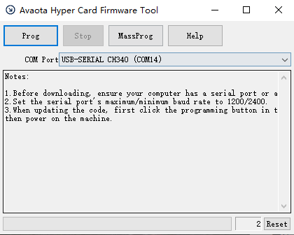

点击 `Prog` 按钮

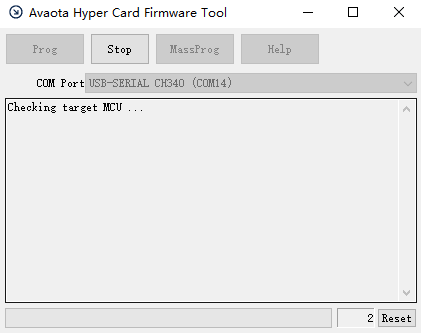

此时 Avaota Debugger 灯闪。将 Avaota Debugger 的背面朝上，使用连接线插入正面朝上的 Avaota Hyper Card Reader，方向如图所示：

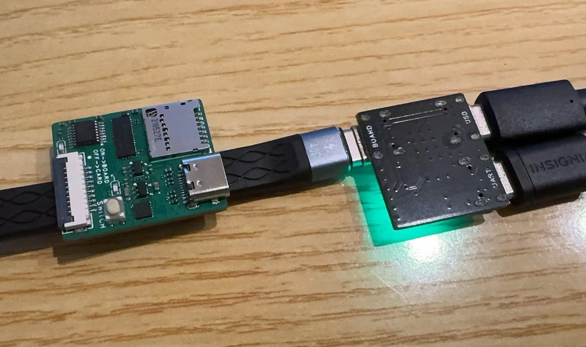

看到 `Complete !` 即刷写完成。


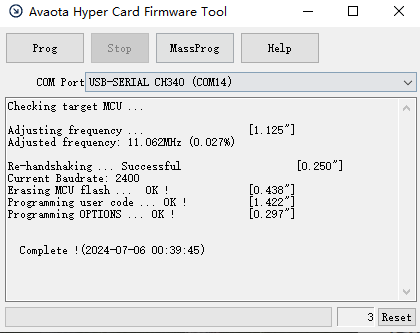

#### 使用 STC-ISP 刷写固件

固件也可以使用 STC-ISP 进行刷写，需要准备这两个东西：

- [Avaota Hyper Card Reader 固件](https://github.com/AvaotaSBC/AvaotaHyperCard/tree/main/Firmware)
- [STC-ISP 下载器](https://www.stcmicro.com/rjxz.html)

**选择芯片**

首先选择芯片，为 `STC8G1K08-8PIN`

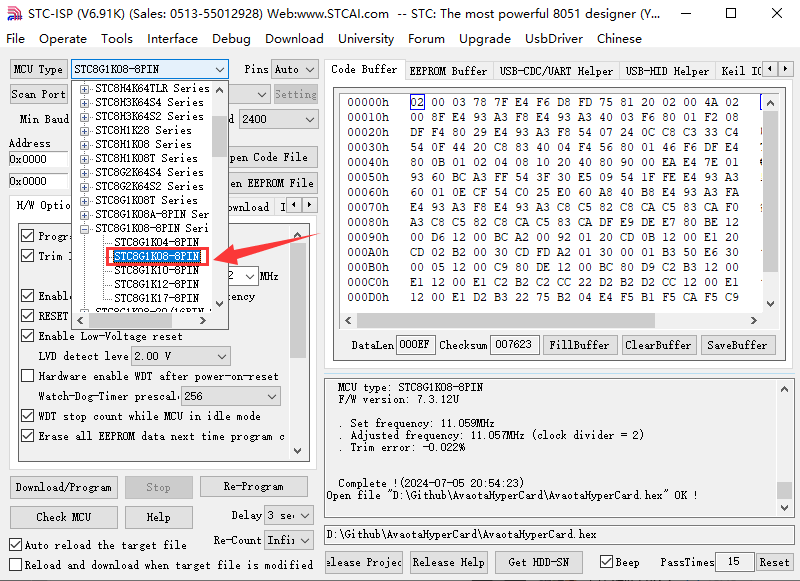

然后设置速率，最小 1200，最大 2400

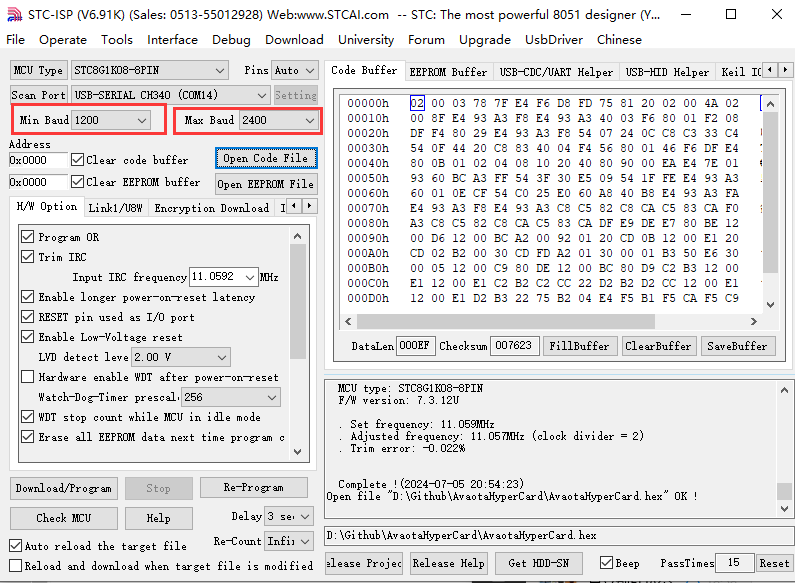

点击 Open Code File，打开 `hex` 文件

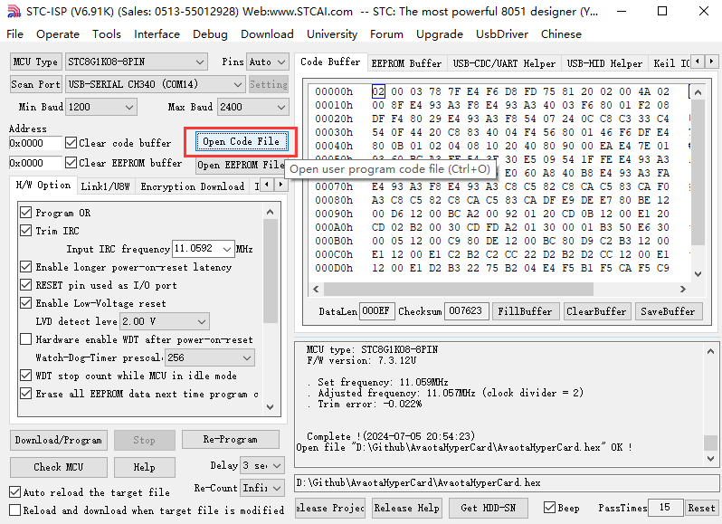

点击 `Download/Program` 进入下载模式

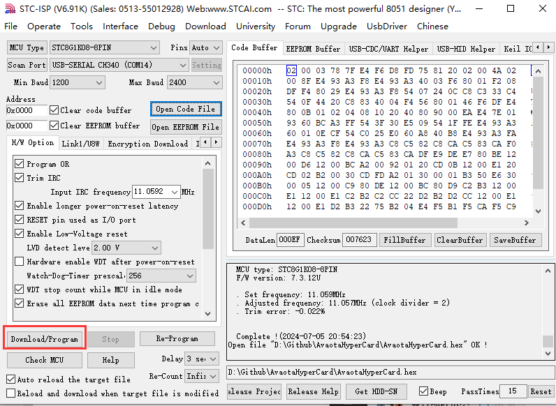

此时会显示 `Checking target MCU ... `

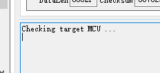

此时 Avaota Debugger 灯闪。将 Avaota Debugger 的背面朝上，使用连接线插入正面朝上的 Avaota Hyper Card Reader，方向如图所示：


开始下载

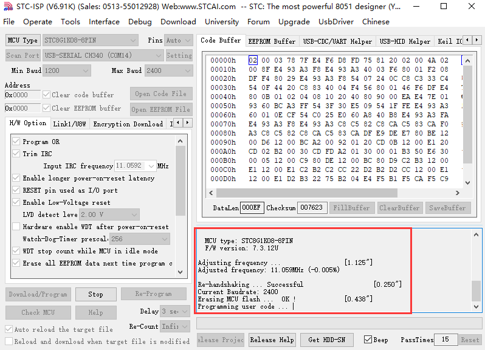

下载完毕

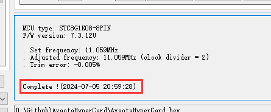

#### 程序分析

Avaota Hyper Card Reader 的主程序如下：

```c
/* 
            DO WHAT THE FUCK YOU WANT TO PUBLIC LICENSE
                    Version 2, December 2004

 Copyright (C) 2004 Sam Hocevar <sam@hocevar.net>

 Everyone is permitted to copy and distribute verbatim or modified
 copies of this license document, and changing it is allowed as long
 as the name is changed.

            DO WHAT THE FUCK YOU WANT TO PUBLIC LICENSE
   TERMS AND CONDITIONS FOR COPYING, DISTRIBUTION AND MODIFICATION

  0. You just DO WHAT THE FUCK YOU WANT TO.
*/

#include <intrins.h>
#include <reg51.h>

sfr P3M1 = 0xb1;
sfr P3M0 = 0xb2;
sfr P5M1 = 0xC9;
sfr P5M0 = 0xCA;

sbit SEL_OUT = P3^2;
sbit READ_VCC_EN = P3^3;

sfr P5   = 0xC8;
sbit SEL_LED = P5^4;
sbit SEL_BTN = P5^5;

bit BTN_STATUS = 0;
bit OLD_BTN_STATUS = 0;

void Delay20ms()		//@11.0592MHz
{
	unsigned char i, j;

	i = 36;
	j = 217;
	do
	{
			while (--j);
	} while (--i);
}

void ChangeToBoard()
{
	READ_VCC_EN = 0;
	Delay20ms();
	Delay20ms();
	SEL_OUT = 0;
	SEL_LED = 0;
}

void ChangeToRead()
{
	SEL_OUT = 1;
	SEL_LED = 1;
	Delay20ms();
	Delay20ms();
	READ_VCC_EN = 1;
}

void InitIO()
{
    P3M0 = 0x04;
    P3M1 = 0x00;
    P5M0 = 0x00;
    P5M1 = 0x00;
}

void main()
{
	InitIO();
	ChangeToBoard();

	while(1) {
		OLD_BTN_STATUS = BTN_STATUS;
			
		if(SEL_BTN == 0) {
			Delay20ms();
			if(SEL_BTN == 0)
				BTN_STATUS = ~BTN_STATUS;
			while(!SEL_BTN);
		}
		if(OLD_BTN_STATUS != BTN_STATUS){
			if(BTN_STATUS) {
				ChangeToRead();
			} else {
				ChangeToBoard();
			}
		}
	}
}
```

这段代码是基于8051单片机的嵌入式系统代码，用于控制一个设备（可能是一个读卡器或类似设备）的状态切换。以下是对代码的逐步解释：

**引用头文件和声明特殊功能寄存器（sfr）：**

```c
#include <intrins.h>
#include <reg51.h>
```

这些是引用了8051单片机的特定头文件，以及特殊功能寄存器（SFR）的声明。

**定义特殊功能寄存器（sfr）和位（sbit）：**

```c
csfr P3M1 = 0xb1;
sfr P3M0 = 0xb2;
sfr P5M1 = 0xC9;
sfr P5M0 = 0xCA;

sbit SEL_OUT = P3^2;
sbit READ_VCC_EN = P3^3;

sfr P5   = 0xC8;
sbit SEL_LED = P5^4;
sbit SEL_BTN = P5^5;
```

这里定义了几个特殊功能寄存器，以及通过sbit方式定义了几个控制引脚的位。例如，`SEL_OUT`、`READ_VCC_EN`是通过`P3`端口的第2和第3位控制的信号，`SEL_LED`和`SEL_BTN`则是通过`P5`端口的第4和第5位控制的信号。

**Delay20ms函数：**

```c
cvoid Delay20ms()		//@11.0592MHz
{
    unsigned char i, j;

    i = 36;
    j = 217;
    do
    {
        while (--j);
    } while (--i);
}
```

这个函数提供了一个大约20毫秒的延时函数，用于生成一段时间的延迟。这在嵌入式系统中常用于等待和时序控制。

**ChangeToBoard函数：**

```c
cvoid ChangeToBoard()
{
    READ_VCC_EN = 0;
    Delay20ms();
    Delay20ms();
    SEL_OUT = 0;
    SEL_LED = 0;
}
```

这个函数将系统切换到开发板模式。它首先关闭`READ_VCC_EN`信号，然后设置`SEL_OUT`和`SEL_LED`为0。

**ChangeToRead函数：**

```c
cvoid ChangeToRead()
{
    SEL_OUT = 1;
    SEL_LED = 1;
    Delay20ms();
    Delay20ms();
    READ_VCC_EN = 1;
}
```

这个函数将系统切换到读卡器模式。它首先设置`SEL_OUT`和`SEL_LED`为1，然后打开`READ_VCC_EN`信号。

**InitIO函数：**

```c
cvoid InitIO()
{
    P3M0 = 0x04;
    P3M1 = 0x00;
    P5M0 = 0x00;
    P5M1 = 0x00;
}
```

这个函数用于初始化IO端口的模式。在这里，设置了`P3`端口的模式为 `0x04` 和 `0x00`，`P5`端口的模式为`0x00`和`0x00`。也就是P33端口为推挽模式。其他为标准双向口。

**main函数：**

```c
cvoid main()
{
    InitIO();
    ChangeToBoard();

    while(1) {
        OLD_BTN_STATUS = BTN_STATUS;
            
        if(SEL_BTN == 0) {
            Delay20ms();
            if(SEL_BTN == 0)
                BTN_STATUS = ~BTN_STATUS;
            while(!SEL_BTN);
        }
        if(OLD_BTN_STATUS != BTN_STATUS){
            if(BTN_STATUS) {
                ChangeToRead();
            } else {
                ChangeToBoard();
            }
        }
    }
}
```

主函数首先调用`InitIO()`进行端口初始化，然后调用`ChangeToBoard()`函数将系统初始化为板子模式。接着进入一个无限循环，不断检测按钮状态`SEL_BTN`。如果检测到按钮被按下，将短暂延时后再次检查按钮状态，并根据按钮状态改变`BTN_STATUS`的值。然后检查`BTN_STATUS`是否发生变化，如果发生变化则调用相应的状态切换函数`ChangeToRead()`或`ChangeToBoard()`。