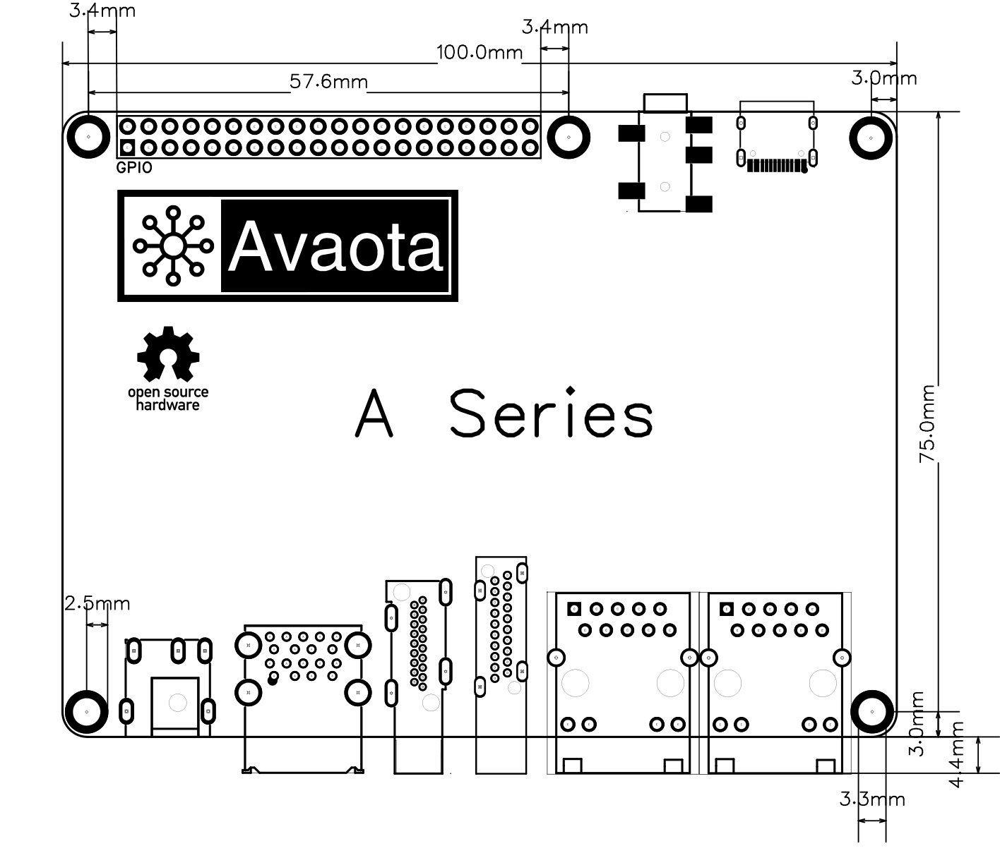
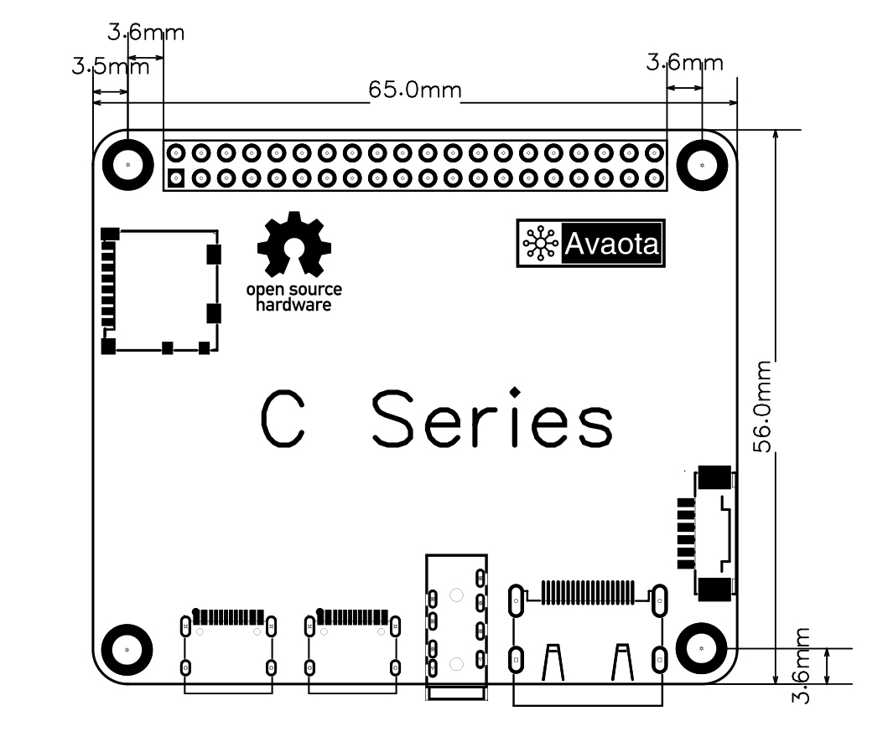
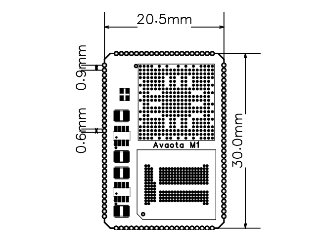

# Avaota SBC

Avaota SBC 致力于推动硬件和软件集成的开源生态系统，提供从入门级到高性能的开源单板计算机（single-board computers SBC）。

## AvaotaSBC 命名规则

### Avaota A 系列

Avaota A 系列提供中高端性能 SBC 体验，包括 PCIe、USB3.0、双千兆、HDMI、DP等丰富的接口。

:::note

Avaota A 系列硬件设计均采用 [CERN-OHL-S](https://cern-ohl.web.cern.ch/) 开源许可。

CERN-OHL-S（CERN Open Hardware License - Strongly Reciprocal）是一种由欧洲核子研究组织（CERN）开发的开源硬件许可证。它是CERN-OHL许可证的一个变体，其目的是促进硬件设计的共享和开放，以鼓励创新和合作。与许多其他开源许可证不同，CERN-OHL-S有着更严格的互惠条款，要求在对硬件设计进行修改时必须以相同的许可证方式发布修改后的设计。这意味着对CERN-OHL-S许可的硬件设计进行修改后，必须以相同的许可证方式分享修改后的设计，从而确保了硬件设计的开放性和可持续性。

:::

### Avaota C 系列

Avaota C 系列提供中低端性能 SBC 体验，包括USB，网卡，HDMI等常用接口，Avaota C 系列主打轻量化设计，整版设计更为紧凑

:::note

Avaota C 系列硬件设计均采用 [CERN-OHL-S](https://cern-ohl.web.cern.ch/) 开源许可。

CERN-OHL-S（CERN Open Hardware License - Strongly Reciprocal）是一种由欧洲核子研究组织（CERN）开发的开源硬件许可证。它是CERN-OHL许可证的一个变体，其目的是促进硬件设计的共享和开放，以鼓励创新和合作。与许多其他开源许可证不同，CERN-OHL-S有着更严格的互惠条款，要求在对硬件设计进行修改时必须以相同的许可证方式发布修改后的设计。这意味着对CERN-OHL-S许可的硬件设计进行修改后，必须以相同的许可证方式分享修改后的设计，从而确保了硬件设计的开放性和可持续性。

:::

### Avaota M 系列

Avaota M 系列提供极致的核心板，包括邮票孔，BTB，连接器核心板。方便快速产品迭代开发。

（下图演示为 Avaota M1，Avaota M 系列无固定形态，依据核心板功能而定）

:::note

Avaota M 系列采用 [CERN-OHL-W](https://cern-ohl.web.cern.ch/) 开源许可。

CERN Open Hardware Licence Version 2 - Weakly Reciprocal 是一个弱相互许可证，这意味着它要求使用该许可证的人在发布修改或衍生作品时，必须以相同的许可证类型（即CERN Open Hardware Licence）进行分发。然而，与强相互许可证不同，该许可证允许使用人在某些情况下选择其他许可证进行分发，但需遵守一些特定条件。

CERN Open Hardware Licence Version 2 - Weakly Reciprocal许可证为硬件设计师提供了一种方便的方式来共享他们的工作，并鼓励使用人对设计进行改进、修改和再利用。它鼓励合作、创新和知识共享，以推动硬件领域的发展。同时，该许可证也保护了原始设计者的权益，确保他们的工作得到适当的认可和尊重。

:::

### Avaota 配件系列

Avaota 配件系列提供基础外设配套配件，包括调试器，修改工具，模块等。

