# 搭建开发环境

Buildroot 的开发环境需要 Linux 系统，所以需要搭建开发使用的编译主机。这里提供两种方法，包括 虚拟机方法和 WSL2 方法搭建。对于安装双系统、使用 Linux 系统的主机、使用其他开发板进行开发在这里不做更多描述。

## 搭建虚拟机

### 下载 VMWare 虚拟机工具

使用浏览器打开网址 https://www.vmware.com/products/workstation-pro/workstation-pro-evaluation.html 参考下图箭头所示，点击下载安装 Windows版本的VMware Workstation ，点击 **DOWNLOAD NOW** 即可开始下载。目前需要注册登录才可下载。

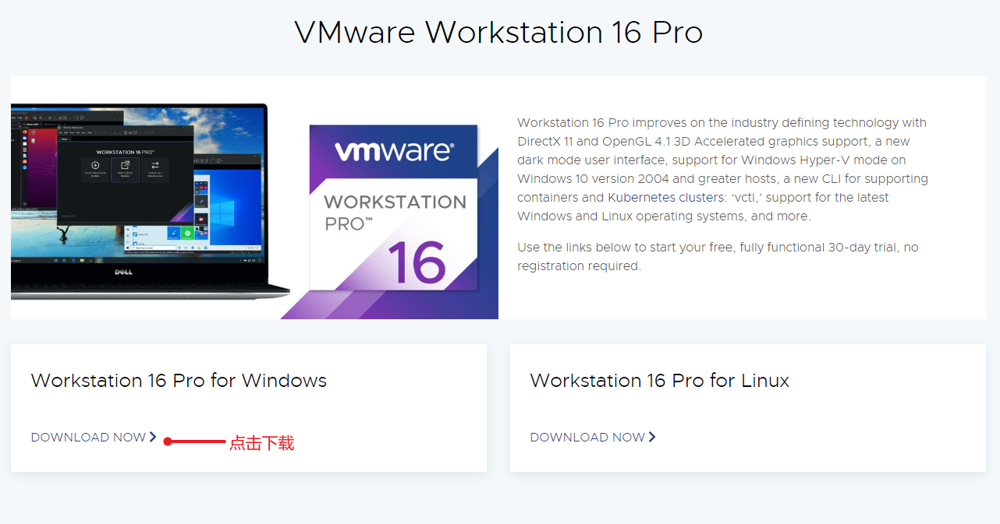

下载完成后全部使用默认配置一步步安装即可。

### 获取Ubuntu系统镜像

- 使用浏览器打开 https://www.linuxvmimages.com/images/ubuntu-2204/ 找到如下箭头所示位置，点击 **VMware Image** 下载（演示图使用的是18.04，这里已经更新22.04连接，请参考图安装22.04的系统）。

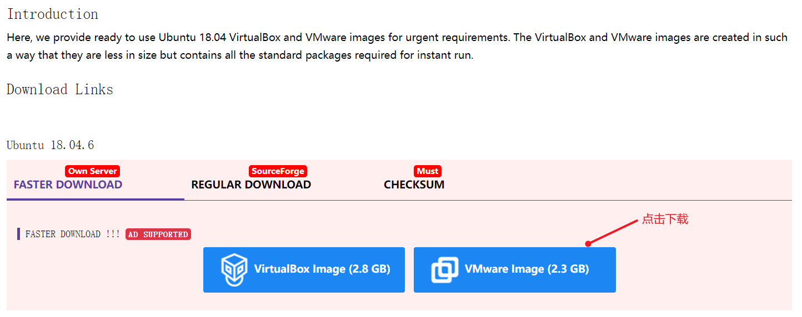

下载过程可能会持续 10 到 30 分钟，具体要依据网速而定。

### 运行虚拟机系统

- 解压缩 虚拟机系统镜像压缩包，解压缩完成后，可以看到里面有如下两个文件，接下来，我们会使用 后缀名为 .vmx 这个 配置文件。

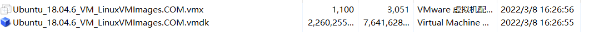

- 打开已经安装好的 vmware workstation 软件 点击左上角的 **文件** --> **打开** 找到上面的 Ubuntu_18.04.6_VM_LinuxVMImages.COM.vmx 文件，之后会弹出新的虚拟机对话框页面。

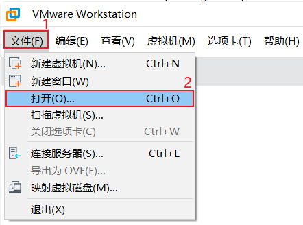

1. 如下图所示为 为我们已经虚拟机的配置界面，那面我们可以 点击 红框 2 编辑虚拟机设置 里面 去调正 我们虚拟机的 内存 大小 和处理器个数，建议 最好 内存为 4GB 及以上，处理器至少4 个。 调整好以后，就可以 点击 **开启此虚拟机** 来运行此虚拟机了

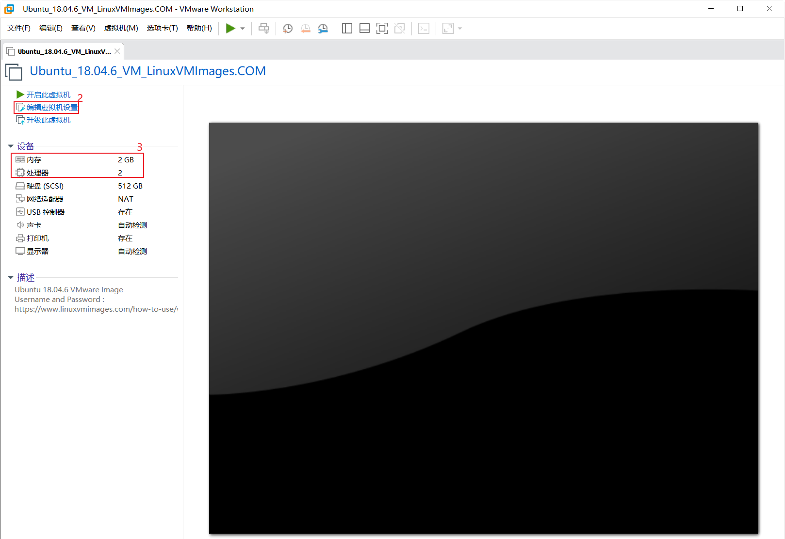

第一次打开会提示 一个 虚拟机已经复制的 对话框，我们这时，只需要 点击 我已复制虚拟机 就可以继续启动虚拟机系统了。

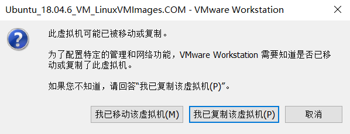

等待数秒，系统就会自动启动了，启动以后 鼠标点击 **Ubuntu** 字样，就可以进入登录对话框，输入 密码 ubuntu 即可登录进入ubuntu系统内。

注意：

:::warning

**Ubuntu默认的用户名密码分别为 ubuntu ubuntu**

**Ubuntu默认的用户名密码分别为 ubuntu ubuntu**

**Ubuntu默认的用户名密码分别为 ubuntu ubuntu**

:::


:::info

**ubuntu默认需要联网，如果你的 Windows电脑已经可以访问Internet 互联网，ubuntu系统后就会自动共享 Windows电脑的网络 进行连接internet 网络。**

:::

## 搭建 WSL2 开发平台

### 检查运行 WSL 2 的要求

若要更新到 WSL 2，需要运行 Windows 10。或 Windows 11。

- 对于 x64 系统：版本 1903 或更高版本，内部版本为 18362.1049 或更高版本。
- 对于 ARM64 系统：版本 2004 或更高版本，内部版本为 19041 或更高版本。

:::note

低于 18362 的版本不支持 WSL 2。 使用 [Windows Update 助手](https://www.microsoft.com/software-download/windows10)更新 Windows 版本。 Windows 版本 1903 支持也仅适用于 x64 系统。 如果使用的是 Arm64 版本的 Windows，则需要升级到 Windows 10 版本 2004 或更高版本才能完全访问 WSL 2。 有关详细信息，请参阅[WSL 2 即将支持 Windows 10 版本 1903 和 1909](https://devblogs.microsoft.com/commandline/wsl-2-support-is-coming-to-windows-10-versions-1903-and-1909)。

:::

若要检查 Windows 版本及内部版本号，选择 Windows 徽标键 + R，然后键入“winver”，选择“确定”。 更新到“设置”菜单中的[最新 Windows 版本](ms-settings:windowsupdate)。

:::note

如果运行的是 Windows 10 版本1903 或 1909，请在 Windows 菜单中打开“设置”，导航到“更新和安全性”，然后选择“检查更新”。 内部版本号必须是 18362.1049+ 或 18363.1049+，次要内部版本号需要高于 .1049。 阅读详细信息：[WSL 2 即将支持 Windows 10 版本 1903 和 1909](https://devblogs.microsoft.com/commandline/wsl-2-support-is-coming-to-windows-10-versions-1903-and-1909/)。

:::

### 启用适用于 Linux 的 Windows 子系统

需要先启用“适用于 Linux 的 Windows 子系统”可选功能，然后才能在 Windows 上安装 Linux 分发。

以管理员身份打开 PowerShell（“开始”菜单 >“PowerShell” >单击右键 >“以管理员身份运行”），然后输入以下命令：

```powershell
dism.exe /online /enable-feature /featurename:Microsoft-Windows-Subsystem-Linux /all /norestart
```

请等待重新启动计算机，然后继续执行下一步。

### 启用虚拟机功能

安装 WSL 2 之前，必须启用“虚拟机平台”可选功能。 计算机需要[虚拟化功能](https://learn.microsoft.com/zh-cn/windows/wsl/troubleshooting#error-0x80370102-the-virtual-machine-could-not-be-started-because-a-required-feature-is-not-installed)才能使用此功能。

以管理员身份打开 PowerShell 并运行：

```powershell
dism.exe /online /enable-feature /featurename:VirtualMachinePlatform /all /norestart
```

**重新启动**计算机，以完成 WSL 安装并更新到 WSL 2。

### 下载 Linux 内核更新包

Linux 内核更新包会安装最新版本的 [WSL 2 Linux 内核](https://github.com/microsoft/WSL2-Linux-Kernel)，以便在 Windows 操作系统映像中运行 WSL。 （若要运行 [Microsoft Store 中的 WSL](https://learn.microsoft.com/zh-cn/windows/wsl/compare-versions#wsl-in-the-microsoft-store) 并更频繁地推送更新，请使用 `wsl.exe --install` 或 `wsl.exe --update`。）

- 下载最新包：[适用于 x64 计算机的 WSL2 Linux 内核更新包](https://wslstorestorage.blob.core.windows.net/wslblob/wsl_update_x64.msi)

:::note

如果使用的是 ARM64 计算机，请下载 [ARM64 包](https://wslstorestorage.blob.core.windows.net/wslblob/wsl_update_arm64.msi)。 如果不确定自己计算机的类型，请打开命令提示符或 PowerShell，并输入：`systeminfo | find "System Type"`。  在非英文版 Windows 上，你可能必须修改搜索文本，对“System Type”字符串进行翻译。 你可能还需要对引号进行转义来用于 find 命令。 例如，在德语版中使用 `systeminfo | find '"Systemtyp"'`。

:::

- 运行上一步中下载的更新包。 （双击以运行 - 系统将提示你提供提升的权限，选择“是”以批准此安装。）

安装完成后，请继续执行下一步 - 在安装新的 Linux 分发时，将 WSL 2 设置为默认版本。 

:::note

有关详细信息，请参阅 [Windows 命令行博客](https://aka.ms/cliblog)上的文章[对更新 WSL2 Linux 内核的更改](https://devblogs.microsoft.com/commandline/wsl2-will-be-generally-available-in-windows-10-version-2004)

:::

### 将 WSL 2 设置为默认版本

打开 PowerShell，然后在安装新的 Linux 发行版时运行以下命令，将 WSL 2 设置为默认版本：

```postgresql
wsl --set-default-version 2
```

### 获取 WSL 分发

#### 微软商店获取 WSL

打开微软商店，搜索 WSL

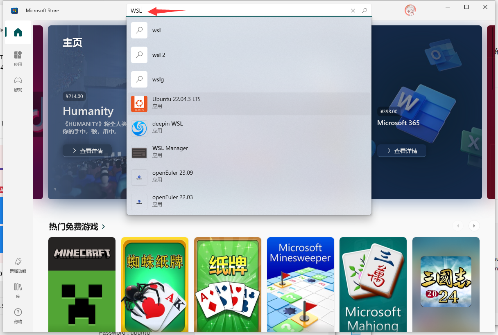

进入，点击下载 Ubuntu 22.04.3 LTS

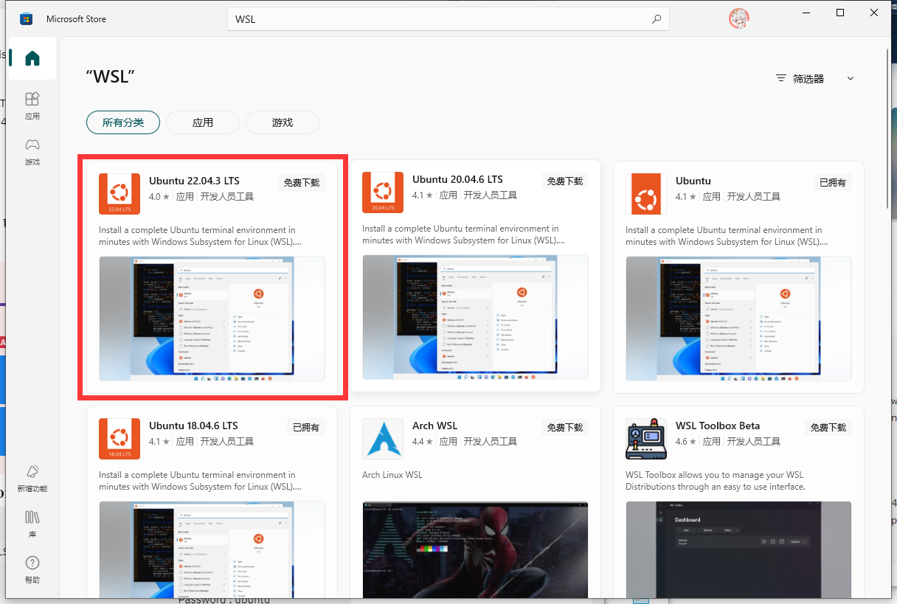

点击获取并安装

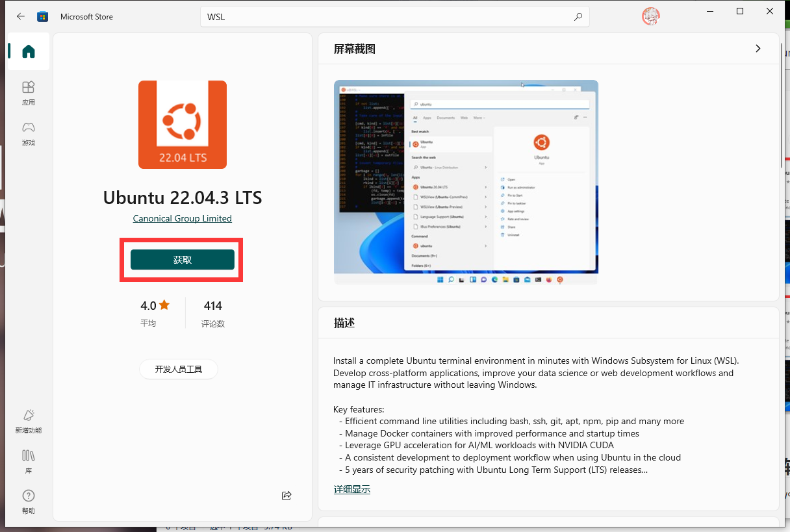

#### 自行获取 WSL

- 下载原生 WSL 安装包

这里提供一种方法，你也可以从Github、Gitlab、SourceForge下载 WSL 安装包

- 打开[微软 WSL 发行页面](https://docs.microsoft.com/zh-cn/windows/wsl/install-manual#downloading-distributions)

- 选一个你喜欢的 WSL 发行版 

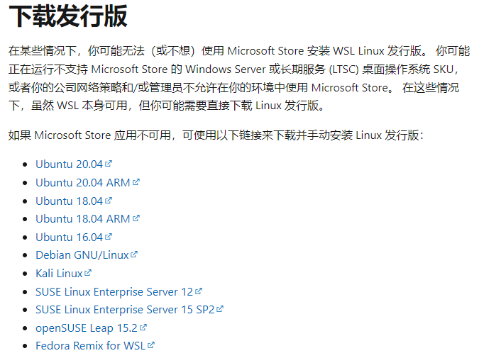

- 下载 appx 文件
- 把 appx 文件复制到 D 盘
- 重命名，把 `*.appx` 改成 `*.zip` ，例如 `Ubuntu_1804.2019.522.0_x64.appx` 改成 `Ubuntu_1804.2019.522.0_x64.zip`
- 解压缩ZIP文件

### 启动设置 WSL

首次启动新安装的 Linux 分发版时，将打开一个控制台窗口，系统会要求你等待一分钟或两分钟，以便文件解压缩并存储到电脑上。 未来的所有启动时间应不到一秒。

然后，需要[为新的 Linux 分发版创建用户帐户和密码](https://learn.microsoft.com/zh-cn/windows/wsl/setup/environment#set-up-your-linux-username-and-password)。

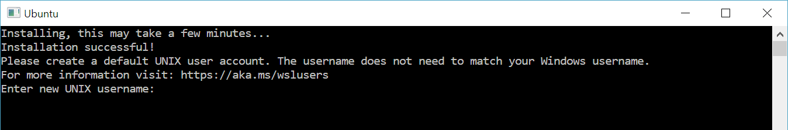

**祝贺你！ 现已成功安装并设置了与 Windows 操作系统完全集成的 Linux 分发！**

## 下载需要的软件包

:::info

这里演示使用的是 WSL2 下的 Ubuntu 22.04 Linux系统。

```shell
yuzuki@Kanado:~$ neofetch
            .-/+oossssoo+/-.               yuzuki@Kanado
        `:+ssssssssssssssssss+:`           -------------
      -+ssssssssssssssssssyyssss+-         OS: Ubuntu 22.04.4 LTS on Windows 10 x86_64
    .ossssssssssssssssssdMMMNysssso.       Kernel: 5.10.16.3-microsoft-standard-WSL2
   /ssssssssssshdmmNNmmyNMMMMhssssss/      Uptime: 19 mins
  +ssssssssshmydMMMMMMMNddddyssssssss+     Packages: 507 (dpkg)
 /sssssssshNMMMyhhyyyyhmNMMMNhssssssss/    Shell: bash 5.1.16
.ssssssssdMMMNhsssssssssshNMMMdssssssss.   Terminal: Windows Terminal
+sssshhhyNMMNyssssssssssssyNMMMysssssss+   CPU: AMD Ryzen 5 5600 (12) @ 3.493GHz
ossyNMMMNyMMhsssssssssssssshmmmhssssssso   GPU: e483:00:00.0 Microsoft Corporation Device 008e
ossyNMMMNyMMhsssssssssssssshmmmhssssssso   Memory: 142MiB / 25599MiB
+sssshhhyNMMNyssssssssssssyNMMMysssssss+
.ssssssssdMMMNhsssssssssshNMMMdssssssss.
 /sssssssshNMMMyhhyyyyhdNMMMNhssssssss/
  +sssssssssdmydMMMMMMMMddddyssssssss+
   /ssssssssssshdmNNNNmyNMMMMhssssss/
    .ossssssssssssssssssdMMMNysssso.
      -+sssssssssssssssssyyyssss+-
        `:+ssssssssssssssssss+:`
            .-/+oossssoo+/-.
```

:::

### 更新软件源，更新系统软件包

```shell
sudo apt-get update
sudo apt-get upgrade -y
```

### 安装开发依赖

```shell
sudo apt-get install build-essential subversion git libncurses5-dev zlib1g-dev gawk flex bison quilt libssl-dev xsltproc libxml-parser-perl mercurial bzr ecj cvs unzip lsof bc -y

sudo apt-get install gcc-arm-none-eabi cmake build-essential gcc-aarch64-linux-gnu mtools qemu-user-static bc pkg-config -y

sudo apt install mmdebstrap ubuntu-keyring automake autoconf gcc make pixz libconfuse2 libconfuse-common libconfuse-dev -y
```

### 安装相关工具

```shell
sudo apt-get install kconfig-frontends android-tools-mkbootimg python2 libpython3-dev 
```

### 增加架构支持

:::info

如果主机是 I386 或 ARM64 架构则不需要配置

:::

```shell
sudo dpkg --add-architecture i386
sudo apt-get update
```

### 安装相关工具

:::info

如果主机是 I386 或 ARM64 架构则不需要配置

:::

```shell
sudo apt install gcc-multilib 
sudo apt install libc6:i386 libstdc++6:i386 lib32z1
```

