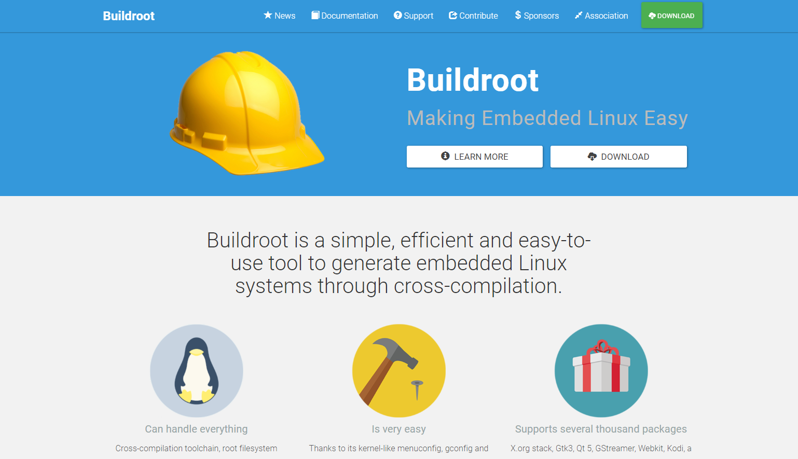
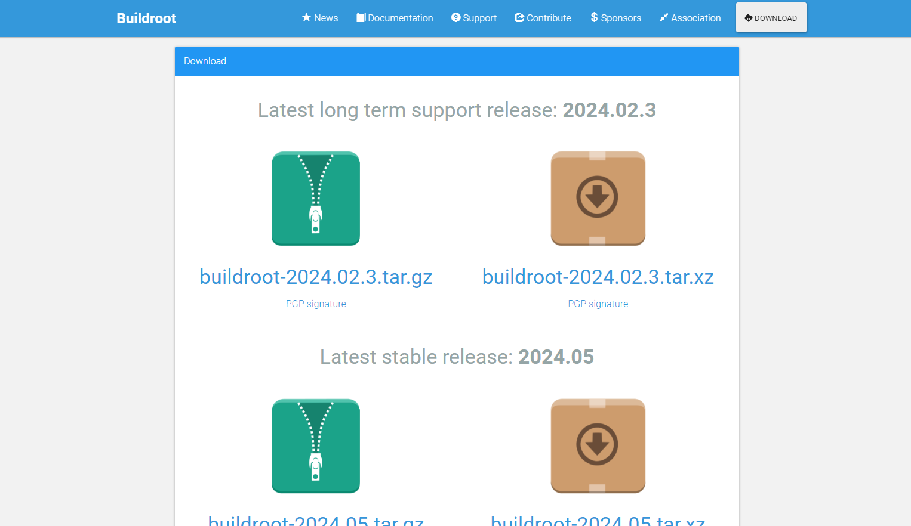
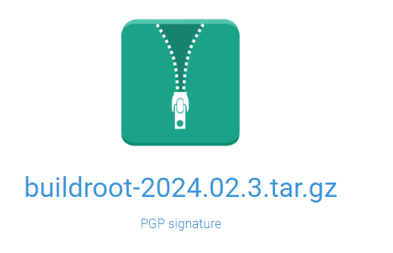
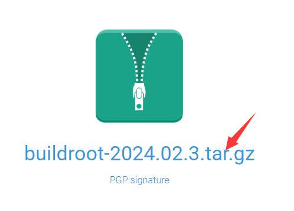
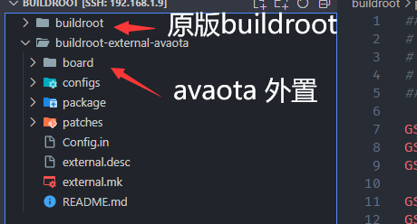

# 获取 SDK

对于 AvaotaSBC，Buildroot 软件包使用的是 `Buildroot-external` 方式提供

## Buildroot-external 

### Buildroot-external 的作用

Buildroot-external 是 Buildroot 的一种扩展模式，主要用于以下几个方面：

1. **定制化软件包的添加**：通过 Buildroot-external，开发者可以在单独的外部目录中定义和管理定制化的软件包。这些软件包可以是官方 Buildroot 仓库中未包含的、第三方的或者自己开发的软件包。这种方式避免了直接修改 Buildroot 核心代码，使得升级和维护更加容易。
2. **配置文件的管理**：除了软件包，Buildroot-external 也可以包含额外的配置文件，例如 defconfig 文件、post-build 脚本等。这些配置文件能够影响 Buildroot 构建系统的行为，使其适应特定的项目需求。
3. **功能扩展和定制化**：通过 Buildroot-external，开发者可以扩展 Buildroot 的功能，增加特定于项目或者特定于硬件平台的定制逻辑。这种扩展包括但不限于新的构建目标、特定的构建选项以及额外的构建逻辑。

### Buildroot-external 的优点

Buildroot-external 相比直接修改 Buildroot 核心代码具有多个优点，使得它成为定制化嵌入式 Linux 系统的理想选择：

1. **保持 Buildroot 核心代码的清晰性和稳定性**：
   - 使用 Buildroot-external 可以避免直接修改 Buildroot 核心代码，这样做有助于保持 Buildroot 的清晰性和稳定性。核心代码的稳定性意味着在更新 Buildroot 版本时，迁移和升级过程更为顺利，不会因为定制内容与核心代码的混合而产生冲突。
2. **灵活性与定制化**：
   - Buildroot-external 提供了高度灵活的定制化能力。开发者可以在外部目录中添加自定义的软件包、配置文件和脚本，而不会影响到 Buildroot 的基本构建逻辑。这使得针对特定项目或硬件平台的定制化需求能够得到满足，同时保持整体系统的结构清晰。
3. **维护和管理的简便性**：
   - 使用 Buildroot-external 管理定制内容使得维护和管理变得更加简便。外部目录结构的约定性和规范性确保了定制内容的可管理性，使得团队协作和版本控制更为高效。此外，这种分离也降低了出错的可能性，因为核心 Buildroot 和定制内容彼此独立。
4. **社区支持和生态系统**：
   - Buildroot-external 的使用符合 Buildroot 社区推荐的最佳实践，使得开发者能够与社区保持良好的互动和支持。这样可以获得来自社区的反馈、建议和解决方案，有助于加速定制过程中的开发和解决问题的能力。
5. **适用于复杂项目的需求**：
   - 对于需要在嵌入式系统中进行复杂定制和集成的项目，Buildroot-external 提供了一种结构化和可扩展的方法。这种方法不仅适用于添加新的软件包和功能，还可以涵盖特定于项目的构建需求，如定制的启动脚本、驱动程序和配置文件管理等。

### Buildroot-external 与 Buildroot 的关系

Buildroot-external 通过约定和结构上的规定，与 Buildroot 本身保持了清晰的分离和互操作性。具体来说：

- **目录结构约定**：Buildroot-external 的外部目录结构必须遵循特定的约定，以便 Buildroot 能够正确地识别和集成这些扩展内容。
- **配置文件约定**：Buildroot-external 使用和扩展了 Buildroot 的配置文件格式和规范，使得其配置能够无缝地整合到 Buildroot 的构建系统中。
- **独立性与互操作性**：Buildroot-external 允许用户在不干扰 Buildroot 核心功能的情况下进行灵活的扩展和定制化。这种独立性保证了 Buildroot 核心代码的稳定性和可维护性，同时通过严格的约定确保了外部扩展的互操作性。

通过 Buildroot-external，开发者能够有效地定制和扩展 Buildroot 的功能，而无需直接修改其核心代码。这种设计使得 Buildroot 能够在保持其自身简洁和稳定的同时，满足各种复杂嵌入式系统的需求。

### Buildroot-external 注意事项

关于版本管理和与最新 LTS 版本的配合使用，有几点需要注意：

1. **Buildroot-external 的独立性**：
   - Buildroot-external可以独立于 Buildroot 的版本。这意味着，即使 Buildroot 的核心版本升级到了新的 LTS 版本，Buildroot-external目录仍然可以继续使用，并且可以通过修改或添加新的分支来适配新版本的 Buildroot。
2. **版本适配与更新**：
   - 当 Buildroot 的 LTS 版本升级时，可能需要更新 Buildroot-external的内容以适应新的 Buildroot 版本。这包括检查和更新定制化软件包、配置文件和其他内容，确保它们能够与新版本的 Buildroot 兼容和正常工作。
3. **分支管理策略**：
   - 通常情况下，建议在 Buildroot-external中采用分支管理策略。例如，对于每个主要的 Buildroot 版本或者你的项目的每个发布版本，可以创建一个对应的分支。这样可以确保不同版本的 Buildroot 和相应的 Buildroot-external都能够保持兼容性和稳定性。
4. **与最新 LTS 版本的配合**：
   - 当决定升级到新的 Buildroot LTS 版本时，可以首先了解新版本的变化和更新，然后相应地更新 Buildroot-external的内容。这可能涉及到查看 Buildroot 的变更日志、更新 Buildroot 的配置和构建系统、以及测试和验证 Buildroot-external的定制内容。
5. **维护最佳实践**：
   - 在维护 Buildroot-external时，建议遵循 Buildroot 和 Buildroot-external的最佳实践，包括正确使用分支、提交清晰的变更说明以及参与 Buildroot 社区的讨论和反馈。

## 获取 Buildroot SDK

### 从官网获取 Buildroot SDK

1. **访问 Buildroot 官网**：

   - 首先，打开 Buildroot 的官方网站：https://buildroot.org/。

   

2. **下载 Buildroot**：

   - 在官网的首页或者下载页面，你可以找到最新的 Buildroot 版本。通常情况下，SDK 会包含在完整的 Buildroot 发布中。

   

3. **选择 SDK 版本**：

   - 确保你选择的是包含 SDK 的版本。在下载页面或者版本列表中，可以找到 SDK 相关的链接或者版本说明。

   

4. **下载 SDK 压缩包**：

   - 点击下载链接，会开始下载相应的压缩包文件（通常是 tar.gz 格式），这是包含 Buildroot SDK 的完整包。

   

#### 解压 Buildroot SDK 压缩包

1. **找到下载的 SDK 压缩包**：

   - 打开你的文件管理器或者命令行界面，导航到你保存 SDK 压缩包的目录。假设你已经从 Buildroot 官网或 GitHub 下载了名为 `buildroot-YYYY.MM.SDK.tar.gz` 的压缩包（其中 [YYYY.MM](http://yyyy.mm/) 是版本号）。

2. **使用命令行解压**：
   
   - 打开一个终端窗口，进入存放 SDK 压缩包的目录。你可以使用 `cd`命令切换目录，例如：
   
     ```
     cd /path/to/your/download/directory
     ```
   
   - 接下来，使用`tar`命令来解压压缩包。如果你的压缩包是
     ```
     .tar.gz
     ```
     格式的，可以使用如下命令：
     ```
     tar -xzvf buildroot-YYYY.MM.SDK.tar.gz
     ```
     - `-x` 选项：表示解压文件。
     - `-z` 选项：表示使用 gzip 解压。
     - `-v` 选项：显示详细的解压过程。
     - `-f` 选项后面接压缩文件的名称。
   
3. **等待解压完成**：

   - 解压过程可能需要一些时间，具体时间取决于你的计算机性能和文件大小。请耐心等待直到解压完毕。

4. **验证解压结果**：

   - 解压完成后，你会在当前目录中看到一个新的文件夹，其名称通常会类似于 `buildroot-YYYY.MM.SDK`。进入这个目录，你会找到包含 SDK 所需工具链、库文件和开发工具的各个子目录。

### 从 GitHub 获取 Buildroot SDK

1. **访问 Buildroot GitHub 仓库**：

   - 打开 Buildroot 的 GitHub 仓库页面：https://github.com/buildroot/buildroot。

2. **获取仓库链接**：

   - 如果你希望使用 Git 克隆的方式获取 Buildroot，复制 GitHub 仓库的 HTTPS 或者 SSH 地址。

3. **克隆仓库**：

   - 打开命令行界面，运行以下命令克隆 Buildroot 仓库：

     ```
     git clone https://github.com/buildroot/buildroot.git
     ```

     或者使用 SSH 克隆：

     ```
     git clone git@github.com:buildroot/buildroot.git
     ```

## 获取 buildroot-external-avaota 源码

当你已经获取了 Buildroot 的主源码之后，如果需要添加支持 AvaotaSBC 的 Buildroot 外部配置（BR2_EXTERNAL），你可以单独获取和集成 buildroot-external-avaota 的源码。

1.打开终端：


2.打开一个终端窗口，用于执行 Git 命令和管理文件。


3.切换到 Buildroot 源码目录：

4.假设你已经通过 Git 克隆或者下载了 Buildroot 的主源码。进入 Buildroot 源码的根目录，例如：
```
cd /path/to/buildroot
```

5.克隆 buildroot-external-avaota 仓库：

6.执行以下 Git 命令来克隆 buildroot-external-avaota 仓库。确保你使用了正确的分支（branch），这里以 main 分支为例：
```
2011git clone -b main https://github.com/AvaotaSBC/buildroot-external-avaota.git
```

7.确认克隆成功：

8.Git 会开始下载 buildroot-external-avaota 仓库的内容到当前目录。等待命令执行完毕，并确保没有出现错误信息。


9.集成到 Buildroot：

10.克隆完成后，buildroot-external-avaota 目录会被创建在当前目录下。目录如下：


