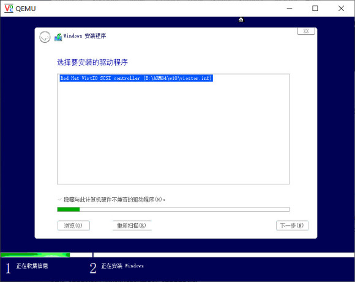

# ARM KVM安装Win10 ARM64系统

## 使用感受

------


- 使用感受 ：**网络支持不完善，开机关机30秒内可完成，无显卡驱动。流畅谈不上，但响应及时不是很卡。**

- 网络也可通过 **KDNET** 内核调试来打开


## 教程开始

------


### 1.&nbsp;下载Win10 ARM64位系统 [itellyou 镜像站](https://next.itellyou.cn/Original/Index)

最好是下载Win10系统，Win11会检测TPM（可以百度自行解决）。

### 2.&nbsp;下载 RedHaV 提供的 Virtio-win 的驱动镜像文件。


### 3,&nbsp;把得到的Win10系统和Virtio-win驱动文件拷贝到同一文件夹下备用


### 4,&nbsp;创建一个至少12G的qemu磁盘文件，安装完系统占用最少12G以上，命令如下：

```bash
qemu-img create -f vhdx -o subformat=fixed system.vhdx 20G
```

使用 qemu-img 工具创建一个名为 system.vhdx 的新的 VHDX 格式的虚拟磁盘映像文件，该文件的大小为 20GB 。

**启动Qemu虚拟机并使用KVM来加速**

**注意：**

> 如果出现报错为 

```bash 
Could not open option rom 'vgabios-ramfb.bin': No such file or directory
qemu-system-aarch64: virtio-blk failed to set guest notifier (-11), ensure -accel kvm is set.
qemu-system-aarch64: virtio_bus_start_ioeventfd: failed. Fallback to userspace (slower).
qemu-system-aarch64: ../../hw/pci/msix.c:622: msix_unset_vector_notifiers: Assertion `dev->msix_vector_use_notifier && dev->msix_vector_release_notifier' failed.
```

则需要附加安装 qume 所需依赖的包，安装命令为：

```bash
sudo apt install seabios ipxe-qemu qemu -y
```

> KVM的加速只能在同架构虚拟不同系统上起作用，如：Debian ARM64平台的KVM能加速同为ARM平台的Win10 ARM64或Centos ARM64，不能加速Win10 x86或Linux x64等

```bash
sudo qemu-system-aarch64 \
-M virt-2.12 -smp 4 -m 3G -cpu host -enable-kvm \
-bios /usr/share/qemu-efi-aarch64/QEMU_EFI.fd -device ramfb \
-device qemu-xhci,id=xhci -usb \
-device usb-kbd -device usb-mouse -device usb-tablet -k en-us \
-device virtio-blk,drive=system \
-drive if=none,id=system,format=raw,media=disk,file=system.vhdx \
-device usb-storage,drive=install \
-drive if=none,id=install,format=raw,media=cdrom,file=/home/pi/Win10/2004.iso \
-device usb-storage,drive=drivers \
-drive if=none,id=drivers,media=cdrom,file=/home/pi/Win10/virtio-win.iso \
-device virtio-net,disable-legacy=on,netdev=net0 \
-netdev user,id=net0,hostfwd=tcp::5555-:3389 -vnc :1 
```

使用 QEMU 在 ARM 64 位架构上模拟一个虚拟机，并配置其硬件设置（包括 CPU、内存、磁盘、网络等），同时加载 Windows 10 的安装 ISO 和其他必要的驱动程序 ISO，以便在虚拟机中安装或运行 Windows 10 操作系统。

<br />

**命令解析**

| 源码                                                         | 解释                                                         |
| ------------------------------------------------------------ | ------------------------------------------------------------ |
| `sudo qemu-system-aarch64 \`                                 | 以超级用户权限运行 QEMU ARM64 系统模拟器                     |
| `-M virt-2.12 -smp 4 -m 3G \`                                | 指定虚拟机的机器类型为 virt-2.12，虚拟 CPU 数量为 4，内存为 3GB |
| `-cpu host -enable-kvm \`                                    | 使用主机 CPU 配置，启用 KVM 加速                             |
| `-bios /usr/share/qemu-efi-aarch64/QEMU_EFI.fd \`            | 使用指定的 BIOS 文件启动                                     |
| `-device ramfb \`                                            | 添加 RAM 帧缓冲设备作为显示输出                              |
| `-device qemu-xhci,id=xhci -usb \`                           | 添加 USB xHCI 控制器                                         |
| `-device usb-kbd -device usb-mouse -device usb-tablet -k en-us \` | 添加 USB 键盘、鼠标、平板设备，设置键盘布局为美式英语        |
| `-device virtio-blk,drive=system \`                          | 添加 virtio 块设备，用于系统盘                               |
| `-drive if=none,id=system,format=raw,media=disk,file=system.vhdx \` | 指定系统盘文件和格式                                         |
| `-device usb-storage,drive=install \`                        | 添加 USB 存储设备，用于安装介质                              |
| `-drive if=none,id=install,format=raw,media=cdrom,file=/home/pi/Win10/2004.iso \` | 指定安装介质的 ISO 文件                                      |
| `-device usb-storage,drive=drivers \`                        | 添加 USB 存储设备，用于驱动程序介质                          |
| `-drive if=none,id=drivers,media=cdrom,file=/home/pi/Win10/virtio-win.iso \` | 指定驱动程序介质的 ISO 文件                                  |
| `-device virtio-net,disable-legacy=on,netdev=net0 \`         | 添加 virtio 网络设备                                         |
| `-netdev user,id=net0,hostfwd=tcp::5555-:3389 \`             | 设置网络设备的用户模式网络堆栈，并转发端口                   |
| `-vnc :1`                                                    | 启用 VNC 服务器监听在显示号为 1 的屏幕上                     |

<br />

### 5. &nbsp;执行完上面命令后便可使用VNC客户端通过 [IP]:5901 去查看启动界面了


### 6. &nbsp;显示 ```Press any key to boot from CD or DVD``` 时按 **空格键** 或其他按键，否则将不会从 CDROM 启动


### 7. &nbsp;等待会就会进入 Win10 安装程序界面，跟着它的步骤做就行了，密钥可跳过

### 8. &nbsp;到这一步时是找不到磁盘的，需要安装磁盘驱动


<br />

<br />

<br />

<br />

### 9. &nbsp;接着继续安装基本就可以到重启进入桌面了

<br />

<br />

<br />

<br />

### 10. &nbsp;解决联网问题（[来自知乎：](https://zhuanlan.zhihu.com/p/82165601)）


<br />
地址端口密码可乱填，例如：

```
HOSTIP:127.0.0.1 PORT:50000 KEY:1.2.3.4
bcdedit /dbgsettings NET HOSTIP:<调试宿主的IP> PORT:<端口> KEY:<KEY>
bcdedit /set {default} debug on
```

### 11. &nbsp; 关于低版本Win10 ARM64会让KVM崩溃的问题


<br />
**低版本Win10 ARM64**使用KVM运行的解决方法：**自己编译修改过的 QEMU**
<br />


### 12. &nbsp;安装完成后可以移除Win10安装盘和驱动盘，否则会再次进入安装程序

```bash
sudo qemu-system-aarch64 \
-M virt-2.12 -smp 4 -m 3G -cpu host -enable-kvm \
-bios /usr/share/qemu-efi-aarch64/QEMU_EFI.fd -device ramfb \
-device qemu-xhci,id=xhci -usb \
-device usb-kbd -device usb-mouse -device usb-tablet -k en-us \
-device virtio-blk,drive=system \
-drive if=none,id=system,format=raw,media=disk,file=system.vhdx \
-device virtio-net,disable-legacy=on,netdev=net0 \
-netdev user,id=net0,hostfwd=tcp::5555-:3389 -vnc :1 
```

开机后还可以通过微软的远程桌面连接 **（需要提前在系统内打开允许远程桌面）**，我的树莓派IP地址是：**192.168.1.1**
上面Qemu命令中有行：```hostfwd=tcp::5555-:3389``` 的意思是将树莓派的5555端口转发到Win10 ARM64系统的3389端口
<br />


### 13. &nbsp; USB设备直通虚拟机

首先树莓派通过lsusb命令查询USB设备的信息

然后可以通过`hostbus=[Bus],hostport=[Port]`或者`vendorid=xxx,productid=xxx`挂载USB设备

> **两个USB设备在虚拟机中不同的Hub中**

```bash
-device qemu-xhci -device usb-host,hostbus=2,hostport=2 \	# Kingston DataTraveler
-device nec-usb-xhci -device usb-host,vendorid=0x0bda,productid=0x8152 \	# RTL8152
```


<br />

几个USB设备在虚拟机中同一个USB 3.0 Root Hub中

```bash
-device qemu-xhci,id=xhci \
-device usb-host,bus=xhci.0,hostbus=2,hostport=2 \	# Kingston DataTraveler
-device usb-host,bus=xhci.0,vendorid=0x0bda,productid=0x8152 \	# RTL8152
-device usb-host,bus=xhci.0,vendorid=0x0b95,productid=0x1790 \	# AX88179
```


<br />

## 其他问题

------

A.如果报找不到**vgabios-ramfb.bin**的问题，那么执行下面命令：

```bash
wget https://github.com/qemu/qemu/raw/master/pc-bios/vgabios-ramfb.bin
mv vgabios-ramfb.bin /usr/share/seabios/
```

B.支持的有线网卡问题

Windows 10 ARM64只有 **Mellanox的几个网卡和若干USB 网卡的驱动** ，USB网卡**AX88179**和**RTL8152**都实测免驱。virtio-net甚至e1000等都**没驱动**。
虚拟网卡速度对比：

| **型号** |   **速率** |
| -------: | ---------: |
|  rtl8139 | 10/100Mb/s |
|    e1000 |      1Gb/s |
|   virtio |     10Gb/s |


C.QEMU参数解惑

```bash
-vnc :1					# 端口是从5900+n开始的，例如:1就是5901
hostfwd=tcp::5555-:3389	# 将宿主机的5555端口转发到客户机的3389端口
-machine usb=on -device usb-tablet	# 解决QEMU与VNC鼠标光标不同步
```

D.虚拟机无法输入：切换为英文输入，重启后再打开vnc连接则可以输入

E.安装Win10时**只安装SCSI驱动**，不要安装NetKVM驱动，它会导致安装时蓝屏

F.局域网内的一台Win10 X64电脑与虚拟机Win10 ARM64直通USB有线网卡RTL8152再通过网线让两者相连的设置
<br />


