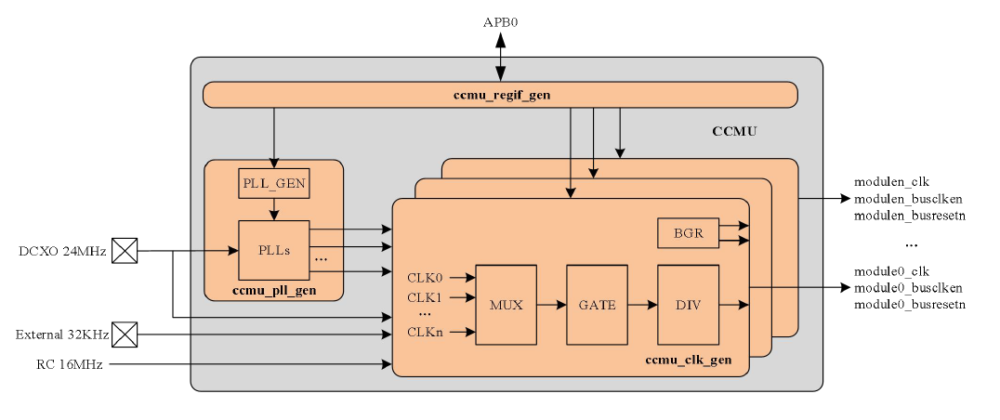
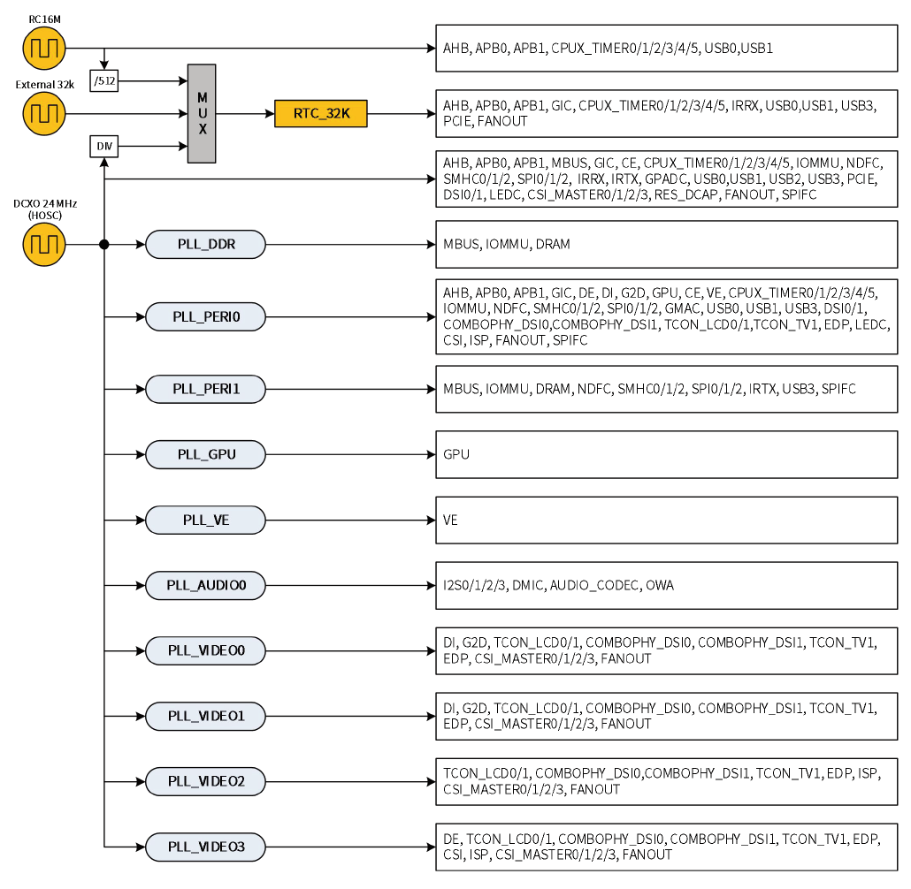
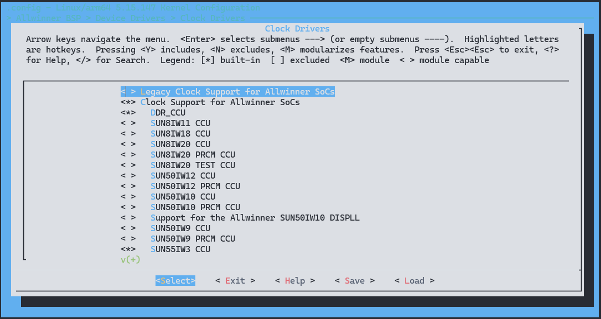

# CCU - 时钟管理模块

时钟管理模块是 Linux 系统为统一管理各硬件的时钟而实现的一套管理框架，负责所有模块的时钟调节。

时钟管理模块在 Linux 系统中扮演着关键角色，负责调节硬件模块的工作频率和管理电源切换。为了确保硬件模块正常运行，必须首先配置其工作频率、开启电源开关以及处理总线访问等操作。时钟管理模块通过为设备驱动程序提供统一的操作接口，使得驱动程序无需过多关注时钟硬件的具体实现细节。

此外，sunxi 的 clk 驱动集成了 reset 相关功能，因此涉及该驱动的文章可能包含有关 reset 子系统的使用说明。Reset 控制器在 Linux 中用于控制硬件模块的复位行为，通常与时钟管理密切相关，可确保在配置硬件设备时进行适当的复位操作，以保证设备处于正确状态。这些功能共同为系统的稳定性和各硬件模块之间的协调提供了重要支持。

## 时钟结构

系统时钟主要是指一些为其他硬件模块提供时钟源输入的时钟源，为其它硬件模块提供时钟源输入。系统时钟一般由多个硬件模块共享，不允许随意调节。



如下图所示，该平台有 10 路PLL作为系统时钟为其它模块提供时钟源，图中是 HOSC，也可以直接作为系统时钟源给给其他硬件模块提供时钟。



系统时钟来源：``32k(LOSC)``、``16M(IOSC)``、``24M(HOSC)``，`32k` 时钟也可以从`16M` 分频得来。系统在 HOSC 的基础上，增加一些锁相环电路，实现更高的时钟频率输出。为了便于控制一些模块的时钟频率，系统对时钟源进行了分组，实现较多的锁相环电路，以实现分路独立调节。

## 模块配置

### 驱动配置

```
Clock Drivers ->
	<*> Clock Support for Allwinner SoCs
	<*>   DDR_CCU
	<*>   SUN55IW3 CCU
	<*>   SUN55IW3 PRCM CCU
	<*>   SUN55IW3_MCU_CCU
```



### 设备树配置

#### CCU 模块配置

```c
ccu: ccu@2001000 {
	compatible = "allwinner,sun55iw3-ccu";
	reg = <0x0 0x02001000 0x0 0x1000>;
	clocks = <&dcxo24M>, <&rtc_ccu CLK_OSC32K>, <&rc_16m>;
	clock-names = "hosc", "losc", "iosc";
	#clock-cells = <1>;
	#reset-cells = <1>;
};
```

#### CCU 各驱动配置

各个驱动模块作为CLK的使用者，可以通过CLK子系统配置各自模块需要的时钟。通常情况下，各个驱动模块需要在各自的dts节点下配置CLK相关的节点，同时在驱动代码中调用相应的CLK接口，配置各自的时钟。

```c
g2d: g2d@6480000 {
	compatible = "allwinner,sunxi-g2d";
	reg = <0x0 0x06480000 0x0 0x3ffff>;
	interrupts = <GIC_SPI 91 IRQ_TYPE_LEVEL_HIGH>;
	clocks = <&ccu CLK_BUS_G2D>, <&ccu CLK_G2D>, <&ccu CLK_MBUS_G2D>;
	clock-names = "bus", "g2d", "mbus_g2d";
	resets = <&ccu RST_BUS_G2D>;
	reset-names = "g2d"
	iommus = <&mmu_aw 5 1>;
	assigned-clocks = <&ccu CLK_G2D>; /* 指定CLK_G2D这个时钟 */
	assigned-clock-rates = <300000000>; /* 指定时钟频率 */
	assigned-clock-parents = <&ccu xxx>; /* 指定GLK_G2D的父时钟 */
};
```

dts中配置方式有两种：

* 使用 "assigned-clock*" 关键字进行配置：如果使用这种方式配置对应的时钟，那么在模块驱动加载时，内核框架就会帮助模块进行时钟配置。

* 使用"clocks"以及"clock-names"关键字进行配置：模块需要在自己的驱动中调用相应的CLK接口进行时钟配置

## 模块使用

对于大多数模块，时钟与复位单元是必要的硬件资源。时钟单元负责为当前模块提供必要的外部时钟源，复位单元负责为当前模块提供复位信号与解复位信号。

对于一般的模块驱动来说，都需要进行如下的时钟和复位操作：

1. 获取当前模块的 CLK 句柄。
2. 调整对应时钟的时钟频率并开启对应时钟。
3. 获取当前模块的 RESET 句柄。
4. 解除当前模块的复位状态（模块在上电后一般都为复位状态，因此需要解复位后才能对模块进行寄存器操作）。

对于以上操作，CLK 以及 RESET 子系统都已经提供对应的操作接口。

Linux系统为时钟管理定义了标准的API，详见内核接口头文件`include/linux/clk.h`。

使用系统的时钟操作接口，必须引用Linux系统提供的时钟接口头文件，引用方式为：

```
#include <linux/clk.h>
```

Linux系统为时钟管理定义了一套标准的API：

### `clk_get`

* **函数原型:** 
  ```c
  struct clk *clk_get(struct device *dev, const char *id)
  ```
* **作用：** 获取指定名称的时钟。
* **参数：**
  - `dev`: 指向申请时钟的设备句柄。
  - `id`: 指向要申请的时钟名（字符串），可以为NULL。
* **返回：**
  - 成功，返回时钟句柄。
  - 失败，返回NULL。

### `clk_put`

* **函数原型:** 
  ```c
  void clk_put(struct clk *clk)
  ```
* **作用：** 释放时钟资源。
* **参数：**
  - `clk`: 要释放的时钟句柄。

### `clk_enable`

* **函数原型:** 
  ```c
  int clk_enable(struct clk *clk)
  ```
* **作用：** 启用时钟。
* **参数：**
  - `clk`: 要启用的时钟句柄。
* **返回：**
  - 成功，返回0。
  - 失败，返回负数错误代码。

### `clk_disable`

* **函数原型:** 
  ```c
  void clk_disable(struct clk *clk)
  ```
* **作用：** 禁用时钟。
* **参数：**
  - `clk`: 要禁用的时钟句柄。

### `clk_prepare`

* **函数原型:** 
  ```c
  int clk_prepare(struct clk *clk)
  ```
* **作用：** 准备时钟以便启用。
* **参数：**
  - `clk`: 要准备的时钟句柄。
* **返回：**
  - 成功，返回0。
  - 失败，返回负数错误代码。

### `clk_unprepare`

* **函数原型:** 
  ```c
  void clk_unprepare(struct clk *clk)
  ```
* **作用：** 取消准备时钟以便禁用。
* **参数：**
  - `clk`: 要取消准备的时钟句柄。

### `clk_set_rate`

* **函数原型:** 
  ```c
  int clk_set_rate(struct clk *clk, unsigned long rate)
  ```
* **作用：** 设置时钟频率。
* **参数：**
  - `clk`: 要设置频率的时钟句柄。
  - `rate`: 要设置的频率。
* **返回：**
  - 成功，返回0。
  - 失败，返回负数错误代码。

### `clk_round_rate`

* **函数原型:** 
  ```c
  long clk_round_rate(struct clk *clk, unsigned long rate)
  ```
* **作用：** 将给定频率舍入到最接近的合法频率。
* **参数：**
  - `clk`: 要舍入频率的时钟句柄。
  - `rate`: 要舍入的频率。
* **返回：**
  - 返回最接近的合法频率。

### `clk_get_rate`

* **函数原型:** 
  ```c
  unsigned long clk_get_rate(struct clk *clk)
  ```
* **作用：** 获取时钟的当前频率。
* **参数：**
  - `clk`: 要获取频率的时钟句柄。
* **返回：**
  - 当前时钟的频率。

## DEBUG 方法

### 查看 CLK 树

查看 CLK 树需要选中 `DEBUG_FS`

```
make kernel_menuconfig

---> Kernel hacking
  ---> Compile-time checks and compiler options
    ---> Debug Filesystem (选中)
```

然后挂载 `debug fs`

```
mount -t debugfs none /sys/kernel/debug
```

然后可以用 `cat /sys/kernel/debug/clk/clk_summary` 获取时钟

```
console:/ # ls /sys/kernel/debug/clk/
clk_dump            clk_orphan_dump     clk_orphan_summary  clk_summary
console:/ # cat /sys/kernel/debug/clk/clk_summary
   clock                         enable_cnt  prepare_cnt        rate   accuracy   phase
----------------------------------------------------------------------------------------
 pll_periph0div25m                        0            0    25000000          0 0
    ephy_25m                              0            0    25000000          0 0
 hoscdiv32k                               1            1       32768          0 0
    hosc32k                               1            1       32768          0 0
       losc_out                           2            2       32768          0 0
 osc48m                                   0            0    48000000          0 0
    osc48md4                              0            0    12000000          0 0
       usbohci3_12m                       0            0    12000000          0 0
       usbohci2_12m                       0            0    12000000          0 0
       usbohci1_12m                       0            0    12000000          0 0
       usbohci0_12m                       0            0    12000000          0 0
 hosc                                    20           21    24000000          0 0
    sdmmc0_mod                            0            0      800000          0 0
    cpurcir                               1            1    24000000          0 0
    dcxo_out                              0            0    24000000          0 0
    cpurapbs2                             0            0    24000000          0 0
       cpurcan                            0            0    24000000          0 0
    cpurcpus                              1            1    24000000          0 0
       cpurahbs                           1            1    24000000          0 0
          cpurapbs1                       2            2    24000000          0 0
             stwi                         1            1    24000000          0 0
             cpurpio                      1            1    24000000          0 0
    csi_master1                           0            0    24000000          0 0
    csi_master0                           0            0    24000000          0 0
    usbphy3                               2            2    24000000          0 0
    usbphy2                               2            2    24000000          0 0
    usbphy1                               2            2    24000000          0 0
    usbphy0                               1            1    24000000          0 0
    ths                                   1            1    24000000          0 0
    ts                                    0            0    24000000          0 0
    gpadc                                 0            0    24000000          0 0
    spi1                                  0            0    24000000          0 0
    spi0                                  0            0    24000000          0 0
```
