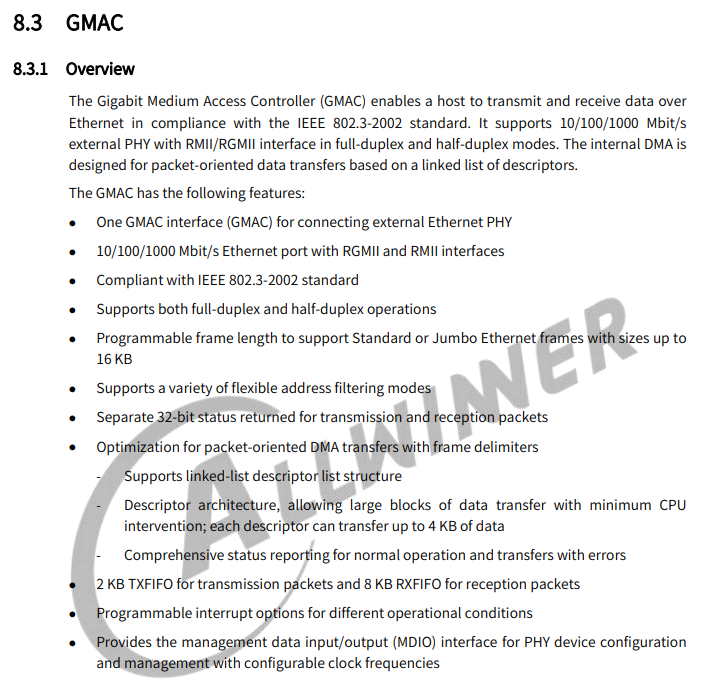

# EMAC - 以太网络

以太网是一种局域网通信技术，遵循IEEE802.3协议规范，包括10 Mbps、100 Mbps、1000 Mbps和10 Gbps等多种速率的以太网。以太网与TCP/IP协议族的物理层（L1）和数据链路层（L2）相关，其中数据链路层包括逻辑链路控制（LLC）和媒体访问控制（MAC）子层。以太网在TCP/IP协议族中的位置如下图所示：


Linux 内核中网络设备框架如下图所示：


1. 网络协议接口层：向网络协议层提供统一的数据包收发接口，通过dev_queue_xmit()发送数据，并通过netif_rx()接收数据
2. 网络设备接口层：向协议接口层提供统一的用于描述网络设备属性和操作的结构体net_device，该结构体是设备驱动层中各函数的容器。
3. 网络设备驱动层：实现net_device中定义的操作函数指针（通常不是全部），驱动硬件完成相应动作。
4. 网络设备媒介层：完成数据包发送和接收的物理实体，包括网络适配器和具体的传输媒介。

## 模块配置

### Kernel 协议栈配置

对于 Linux 系统，使用以太网需要配置以太网协议栈，包括如下配置项

```
CONFIG_PACKET
CONFIG_UNIX
CONFIG_UNIX_DIAG
CONFIG_NET_KEY
CONFIG_INET
CONFIG_IP_MULTICAST
CONFIG_IP_ADVANCED_ROUTER
CONFIG_IP_FIB_TRIE_STATS
CONFIG_IP_MULTIPLE_TABLES
```

### Kernel 驱动配置

对于 EMAC 的驱动，由于芯片存在多套以太网IP，包括 EMAC，GMAC，GMAC-200。其适配的以太网驱动为不同驱动框架。这里分开说明

#### EMAC 配置说明

EMAC 控制器描述如下图所示，其主要特点为最高支持百兆网络。


内核配置项目为

```
CONFIG_AW_EMAC
CONFIG_AW_EMAC_MDIO
```

内核设备树配置项

```c
mdio1: mdio1@1c0b080 {
	compatible = "allwinner,sun4i-mdio";
	#address-cells = <1>;
	#size-cells = <0>;
	reg = <0x0 0x01c0b080 0x0 0x14>;
	status = "okay";
	phy1: ethernet-phy@1 {
		reg = <1>;
	};
};

emac0: emac0@1c0b000 {
	compatible = "allwinner,sunxi-emac";
	reg = <0x0 0x01c0b000 0x0 0x0c000>;
	interrupts      = <GIC_SPI 55 IRQ_TYPE_LEVEL_HIGH>;
    interrupt-names = "emacirq";
	clocks   = <&ccu CLK_BUS_EMAC>;
	clock-names = "emac";
	resets = <&ccu RST_BUS_EMAC>;
    pinctrl-names = "default";
	pinctrl-0     = <&emac_pins_a>;
	phy-rst = <&pio PH 27 1 1 1 0>;
	phy-handle = <&phy1>;
	status = "disabled";
};
```

- `compatible` 表征具体的设备,用于驱动和设备的绑定；

- `reg` 设备使用的地址；

- `interrupts` 设备使用的中断；
- `clocks` 设备使用的时钟；
- `pinctrl-0` 设备active状态下的GPIO配置；
- `pinctrl-1` 设备sleep状态下的GPIO配置；
- `phy-rst`（***注：更换PHY器件需要更改此属性***） PHY复位脚；
- `phy-handle` phy器件句柄；
- phy子节点配置（***注：更换PHY器件需要更改此属性***）：
- `reg` 表征phy地址。

板级配置项目，主要是配置 emac 的 PHY RST 控制脚，和配置启用节点。

```
&mdio1 {
	status        = "okay";
};

&emac0 {
    pinctrl-names = "default";
	pinctrl-0     = <&emac_pins_a>;
	phy-rst       = <&pio PH 27 GPIO_ACTIVE_LOW>;
	status        = "okay";
};
```

#### GMAC 配置说明

GMAC 控制器描述如下图所示，其支持最高千兆网络。



内核配置项目为：

```
CONFIG_AW_GMAC
CONFIG_AW_GMAC_MDIO
```

设备树配置项目：

```c
mdio0: mdio0@4500048 {
	compatible = "allwinner,sunxi-mdio";
	#address-cells = <1>;
	#size-cells = <0>;
	reg = <0x0 0x04500048 0x0 0x8>;
	status = "disabled";
	gmac0_phy0: ethernet-phy@1 {
		/* RTL8211F (0x001cc916) */
		reg = <1>;
		max-speed = <1000>;  /* Max speed capability */
		reset-gpios = <&pio PH 19 GPIO_ACTIVE_LOW>;
		/* PHY datasheet rst time */
		reset-assert-us = <10000>;
		reset-deassert-us = <150000>;
	};
};

gmac0: gmac0@4500000 {
	compatible = "allwinner,sunxi-gmac";
	reg = <0x0 0x04500000 0x0 0x10000>,
	      <0x0 0x03000030 0x0 0x4>;
	interrupts = <GIC_SPI 46 IRQ_TYPE_LEVEL_HIGH>;
	interrupt-names = "gmacirq";
	clocks = <&ccu CLK_GMAC0>, <&ccu CLK_GMAC0_25M>;
	clock-names = "gmac", "phy25m";
	resets = <&ccu RST_BUS_GMAC0>;
	phy-handle = <&gmac0_phy0>;
	status = "disabled";
};
```

- “compatible”表征具体的设备,用于驱动和设备的绑定；
- “reg”设备使用的地址；
- “interrupts”设备使用的中断；
- “clocks”设备使用的时钟；
- “status”是否使能该设备节点；
- “phy-handle”phy器件句柄；
- phy子节点配置（***注：更换PHY器件需要更改此属性***）：
  - “reg”表征phy地址，
  - “max-speed”表征phy的最大速率，
  - “reset-gpios”表征phy硬件复位的引脚，
  - “reset-assert-us”硬件复位拉低时间，
  - “reset-deassert-us”硬件复位拉高时间。

板级设备树配置：

```c
&mdio0 {
	status = "okay";
};

&gmac0 {
	phy-mode      = "rgmii";
	pinctrl-names = "default", "sleep";
	pinctrl-0     = <&gmac0_pins_default>;
	pinctrl-1     = <&gmac0_pins_sleep>;
	sunxi,phy-clk-type = <0>;
	tx-delay      = <3>;
	rx-delay      = <4>;

	gmac3v3-supply = <&reg_cldo3>;
	status = "okay";
};
```

- “phy-mode”GMAC与PHY之间的物理接口，如MII、RMII、RGMII等；

- “pinctrl-0”设备active状态下的GPIO配置；

- “sunxi,phy-clk-type”配置phy使用的时钟，0表示使用soc内置的25 M 时钟；

- “tx-delay”tx时钟延迟，tx-delay取值0-7，一档约536 ps（皮秒）；

- “rx-delay”rx时钟延迟，rx-delay取值0-31，一档约186 ps（皮秒）；

- “gmac3v3-supply”gmac电源脚，根据实际情况配置；

- “status”是否使能该设备节点。

#### GMAC-200 配置说明

GMAC-200 控制器描述如下，其支持标准更新更丰富，其使用的是内核标准 stmmac 驱动。

内核配置项目为：

```
CONFIG_AW_STMMAC_ETH
```

设备树配置项目：

```c
gmac1: ethernet@4510000 {
	compatible = "allwinner,sunxi-gmac-200", "snps,dwmac-4.20a";
	reg = <0x0 0x04510000 0x0 0x10000>,
			<0x0 0x03000034 0x0 0x4>;
	interrupts = <GIC_SPI 47 IRQ_TYPE_LEVEL_HIGH>;
	interrupt-names = "macirq";
	clocks = <&ccu CLK_GMAC1>, <&ccu CLK_GMAC1_MBUS_GATE>, <&ccu CLK_GMAC1_25M>;
	clock-names = "stmmaceth", "pclk", "phy25m";
	resets = <&ccu RST_BUS_GMAC1>;
	reset-names = "stmmaceth";
	phy-handle = <&gmac1_phy0>;
	status = "disabled";

	snps,fixed-burst;

	snps,axi-config = <&gmac1_stmmac_axi_setup>;
	snps,mtl-rx-config = <&gmac1_mtl_rx_setup>;
	snps,mtl-tx-config = <&gmac1_mtl_tx_setup>;

	gmac1_stmmac_axi_setup: stmmac-axi-config {
		snps,wr_osr_lmt = <0xf>;
		snps,rd_osr_lmt = <0xf>;
		snps,blen = <256 128 64 32 16 8 4>;
	};

	gmac1_mtl_rx_setup: rx-queues-config {
		snps,rx-queues-to-use = <1>;
		queue0 {};
	};

	gmac1_mtl_tx_setup: tx_queues-config {
		snps,tx-queues-to-use = <1>;
		queue0 {};
	};

	mdio1: mdio1@1 {
		compatible = "snps,dwmac-mdio";
		#address-cells = <1>;
		#size-cells = <0>;
		gmac1_phy0: ethernet-phy@1 {
			compatible = "ethernet-phy-ieee802.3-c22";
			reg = <0x1>;
			max-speed = <1000>;  /* Max speed capability */
			reset-gpios = <&pio PJ 27 GPIO_ACTIVE_LOW>;
			/* PHY datasheet rst time */
			reset-assert-us = <10000>;
			reset-deassert-us = <150000>;
		};
	};
};
```

- “compatible”表征具体的设备,用于驱动和设备的绑定；
- “reg”设备使用的地址；
- “interrupts”设备使用的中断；
- “clocks”设备使用的时钟；
- “status”是否使能该设备节点；
- “phy-handle”phy器件句柄；
- phy子节点配置（***注：更换PHY器件需要更改此属性***）：
  - “reg”表征phy地址，
  - “max-speed”表征phy的最大速率，
  - “reset-gpios”表征phy硬件复位的引脚，
  - “reset-assert-us”硬件复位拉低时间，
  - “reset-deassert-us”硬件复位拉高时间；
- “snps,axi-config”AXI总线模式参数；
- “snps,mtl-rx-config”rx队列参数；
- “snps,mtl-tx-config”tx队列参数。

板级设备树配置：

```c
&gmac1 {
	phy-mode = "rgmii";
	pinctrl-names = "default", "sleep";
	pinctrl-0 = <&gmac1_pins_default>;
	pinctrl-1 = <&gmac1_pins_sleep>;
	aw,soc-phy25m;
	tx-delay = <3>;
	rx-delay = <4>;
	dwmac3v3-supply = <&reg_cldo3>;
	status = "okay";
	mdio1: mdio1@1 {
		gmac1_phy0: ethernet-phy@1 {
			reset-gpios = <&pio PI 5 GPIO_ACTIVE_LOW>;
		};
	};
};
```

- “phy-mode”GMAC与PHY之间的物理接口，如MII、RMII、RGMII等；
- “pinctrl-0”设备active状态下的GPIO配置；
- “aw,soc-phy25m”属性表示使用SOC供的25M时钟给PHY；
- “tx-delay”tx时钟延迟，tx-delay取值0-7，一档约536 ps（皮秒）；
- “rx-delay”rx时钟延迟，rx-delay取值0-31，一档约186 ps（皮秒）；
- “dwmac3v3-supply”gmac-200电源脚，根据实际情况配置；
- “status”是否使能该设备节点。

## 调试说明

常用以太网调试的软件包：

- `net-tools`
- `udhcpc`
- `ethtool`

### 常用测试方法

#### 查看网络设备信息

- 查看网口状态：`ifconfig eth0 -a`  
- 查看收发包统计：`cat /proc/net/dev`
- 查看当前速率：`cat /sys/class/net/eth0/speed`

#### 打开/关闭网络设备

- 打开网络设备：`ifconfig eth0 up`

对于 GMAC 会显示 LOG：

```
sunxi-gmac 4500000.gmac0 eth0: eth0: Type(9) PHY ID 001cc916 at 1 IRQ poll (4500048.mdio0-mii:01)
```

对于 GMAC-200，会显示LOG：

```
dwmac-sunxi 4510000.ethernet eth1: PHY [stmmac-0:01] driver [Generic PHY] (irq=POLL)
dwmac-sunxi 4510000.ethernet eth1: Register MEM_TYPE_PAGE_POOL RxQ-0
dwmac4: Master AXI performs fixed burst length
dwmac-sunxi 4510000.ethernet eth1: No Safety Features support found
dwmac-sunxi 4510000.ethernet eth1: IEEE 1588-2008 Advanced Timestamp supported
dwmac-sunxi 4510000.ethernet eth1: configuring for phy/rgmii link mode
```

插上网线

- 关闭网络设备：`ifconfig eth0 down`

```
sunxi-gmac 4500000.gmac0 eth0: Link is Down
```

### 配置网络设备

- 配置静态IP地址：`ifconfig eth0 192.168.1.110`
- 配置MAC地址：`ifconfig eth0 hw ether 00:11:22:aa:bb:cc`
- 动态获取IP地址：`udhcpc -i eth0`
- PHY强制模式：`ethtool -s eth0 speed 1000 duplex full autoneg on`（设置1000 Mbps速率、全双工、开启自协商）

### 测试网络

- 设备连通性测试

ping 对端 ip 地址，本机ip和对端ip的前三个网段需相同才能ping通。

```
ping 192.168.1.100
```

- TCP 吞吐测试

假设 Server 端 IP 为：192.168.1.100

```
Server端：iperf3 -s -i 1
Client端：iperf3 -c 192.168.1.100 -i 1 -t 60
```

- UDP 吞吐测试

假设 Server 端 IP 为：192.168.1.100

```
Server端：iperf3 -s -u -i 1
Client端：iperf3 -c 192.168.1.100 -u -b 1000M -i 1 -t 60
```

### 本地网络环路性能测试

```
iperf3 -s &;iperf3 -c 127.0.0.1
```

### delay参数节点

delay参数调试节点是GMAC驱动中提供的调整千兆RGMII接口时序的节点。

进入操作目录：

```shell
cd /sys/devices/platform/soc/gmac/
```

注：不同的目录可能会因板卡不同有差异，此处为大致路径。

调整rxdelay时序：

```shell
#rx_delay：val - rxdelay参数，0~31共32挡，每档将采样时间推迟约130ps
echo val > rx_delay; cat rx_delay
```

调整txdelay时序：

```shell
#tx_delay：val - txdelay参数，0~7共8档，每档将采样时间推迟约536ps
echo val > tx_delay; cat tx_delay
```

## 常见问题

