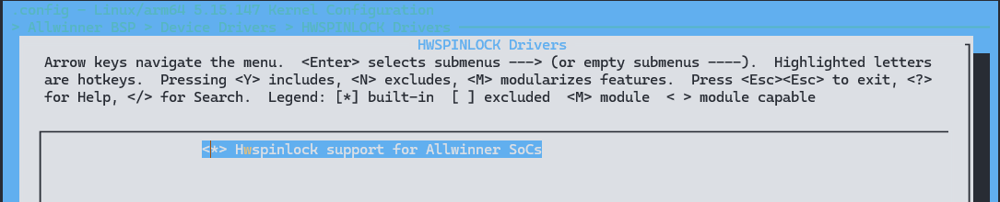
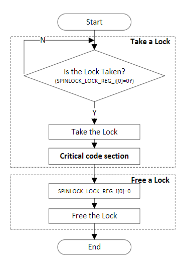
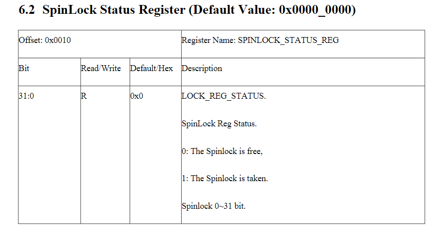
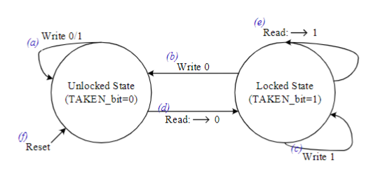

# HWSPINLOCK - 硬件自旋锁

HWSPINLOCK（硬件自旋锁）是一种锁机制，用于在多处理器系统中对共享资源进行保护，以防止多个处理器同时访问同一资源而导致数据不一致或竞争条件。硬件自旋锁通常由处理器提供支持，在硬件层面实现了对锁的获取和释放操作，以减少对操作系统的干预和加速锁操作的执行速度。

HWSPINLOCK的功能包括：
1. **忙等待**：当一个处理器尝试获取HWSPINLOCK时，如果锁已经被其他处理器持有，该处理器将会进入一个忙等待的状态，不断轮询直到获取到锁为止。
   
2. **原子操作**：HWSPINLOCK的获取和释放通常是通过硬件提供的原子操作来实现的，确保在多处理器环境下这些操作是线程安全的。
   
3. **低开销**：相较于软件自旋锁，在多处理器系统中使用HWSPINLOCK可以减少锁操作的开销，提高锁的性能和效率。

4. **可嵌入性**：HWSPINLOCK通常可以直接嵌入到处理器的指令集中，使得在应用程序中使用锁变得更加方便和高效。

总的来说，HWSPINLOCK提供了一种高效的并发控制机制，适用于对于需要频繁访问和操作的共享资源进行保护的场景。在多处理器系统中，合理使用HWSPINLOCK可以有效地避免竞争条件和提高系统的性能。

- 有32个lock单位

- 两种lock状态：Locked 和 Unlocked

- 处理器的Lock时间是可预见的（少于200cycles）

## 模块配置

### 驱动配置

```
HWSPINLOCK Drivers ->
	<*> Hwspinlock support for Allwinner SoCs
```



### 设备树配置

```c
hwspinlock: hwspinlock@3005000 {
    compatible = "allwinner,sunxi-hwspinlock";
    reg = <0x0 0x3005000 0x0 0x1000>;
    #hwlock-cells = <1>;
    clocks = <&ccu CLK_SPINLOCK>;
    clock-names = "clk_hwspinlock_bus";
    resets = <&ccu RST_BUS_SPINLOCK>;
    reset-names = "rst";
    num-locks = <32>;
    status = "okay";
};
```

- compatible: 用来匹配驱动，固定为 `allwinner,sunxi-hwspinlock`
- reg: 寄存器地址
- hwlock-cells : 用于指定其他驱动使用mbox的时候要传的参数个数
- clocks: 时钟源
- clock-names: 时钟名
- resets: reset_control控制模块复位
- resets-names: 模块复位控制器名称
- num-locks: hwspinlock锁个数

### 模块使用场景

在多核系统中，Hwspinlock提供一种硬件同步机制，lock操作可以防止多处理器同时处理共享数据。保证数据的一致性。

当某处理器lock spinlock0，状态锁定后，执行特定的代码，完成后进行解锁，释放其他处理器进行读写操作。



当处理器使用hwspinlock的时候，需要通过SPINLOCK_STATUS_REG寄存器读取hwspinlock状态。



- 读操作：读SPINLOCK_LOCK_REG返回0时，说明进入locked状态；再次读SPINLOCK_STATUS_REG该状态位，返回1，说明已经成为locked状态

- 写操作：当spinlock处于locked状态时，写SPINLOCK_LOCK_REG为0可转化为unlocked状态，其他状态写操作均无效

- reset操作：reset操作后，默认为unlocked



#### hwspinlock 状态

- 当spinlock处于unlocked状态时，写0/1均无效

- 当spinlock处于unlocked状态，读操作，返回0说明进入locked状态

- 当spinlock处于locked状态时，写0可转换为unlocked状态

- 当spinlock处于locked状态，写1无效

- 当spinlock处于locked状态时，再次读该状态位，返回1，说明已经是locked状态

- reset操作后默认为unlocked状态

>  当Free lock动作产生(即lock状态由locked变为unlocked时)，即可产生中断

#### 切换状态

- SPINLOCKN_LOCK_REG(0~31)读0，进入locked状态

- 执行应用代码，当前SPINLOCK_STATUS_REG对应位状态为1

- SPINLOCKN_LOCK_REG(0~31)写0，进入unlocked状态，释放相应的spinlock

#### 中断应用

- 首先使能中断寄存器SPINLOCK_IRQ_EN_REG;将对应的通道位置1开启中断

- 当锁n被释放，产生中断，SPINLOCK_IRQ_STA_REG的第 n bit位置1，通知其他CPU执行中断处理函数，中断处理函数中会检测32个硬件锁对应的中断状态寄存器（SPINLOCK_IRQ_STA_REG）每个bit位，如果检测到自己申请的n通道的lock已经被free释放，则拿到锁

- 执行完中断处理函数，清pending位

内核提供了一系列的hwspinlock接口，都定义在了`drivers/hwspinlock/hwspinlock_core.c`，下面介绍一些重要的hwspinlock接口。

## 驱动接口

#### hwspin_lock_register

- 函数原型：`int hwspin_lock_register(struct hwspinlock_device *bank, struct device *dev, const struct hwspinlock_ops *ops, int base_id, int num_locks)`

- 功能描述：注册一个新的硬件自旋锁设备实例

- 参数说明：

  - bank: hwspinlock 设备，通常提供大量硬件锁

  - dev：支持的设备

  - ops：此设备的 hwspinlock 处理程序

  - base_id：这个bank中第一个硬件自旋锁的id

  - num_locks：这个设备能提供的hwspinlock的数量

- 返回值：成功时返回 0，失败时返回错误码

#### hwspin_lock_unregister

- 函数原型：`int hwspin_lock_unregister(struct hwspinlock_device *bank)`

- 功能描述：注销硬件自旋锁设备

- 参数说明：

  - bank: hwspinlock 设备，通常提供大量硬件锁

- 返回值：成功时返回 0，失败时返回错误码

#### hwspin_lock_request

- 函数原型：`struct hwspinlock *hwspin_lock_request(void)`

- 功能描述：请求 hwspinlock。hwspinlock设备用户调用此函数，以便为他们动态分配未使用的 hwspinlock,**(动态申请)**。应该从进程上下文调用（可能睡眠）。

- 参数说明：无

- 返回值：返回分配的 hwspinlock 的地址，或在错误时返回 NULL

#### hwspin_lock_request_specific

- 函数原型：`struct hwspinlock *hwspin_lock_request_specific(unsigned int id)`

- 功能描述：请求特定的 hwspinlock，用户应该调用此函数，以便为他们分配特定的 hwspinlock,**(静态申请)**。应该从进程上下文调用（可能睡眠）。

- 参数说明：

  - id：请求的特定 hwspinlock 的索引

- 返回值：返回分配的 hwspinlock 的地址，或在错误时返回 NULL

#### hwspin_lock_free

- 函数原型：`int hwspin_lock_free(struct hwspinlock *hwlock)`

- 功能描述：释放特定的 hwspinlock。应该从进程上下文调用（可能睡眠）

- 参数说明：

  - hwlock：要释放的特定hwspinlock。

- 返回值：成功时返回 0，失败时返回错误码

#### sunxi_hwspinlock_trylock

- 函数原型：`static int sunxi_hwspinlock_trylock(struct hwspinlock *lock)`

- 功能描述：获取锁资源

- 参数说明：

  - lock：要获取的特定hwspinlock。

- 返回值：成功时返回 1，失败时返回0

#### sunxi_hwspinlock_unlock

- 函数原型：`static void sunxi_hwspinlock_unlock(struct hwspinlock *lock)`

- 功能描述：释放锁资源

- 参数说明：

  - lock：要释放的特定hwspinlock。

- 返回值：无

#### sunxi_hwspinlock_relax

- 函数原型：`static void sunxi_hwspinlock_relax(struct hwspinlock *lock)`

- 功能描述：获取锁资源

- 参数说明：

- 返回值：无

## 使用示例

在下述示例中，`USE_HWSPINLOCK_ID` 表示我们需要使用的 `hwspinlock` 的ID号，在上锁前先调用`hwspin_lock_request_specific()` 获取锁资源，然后调用 `__hwspin_trylock()`执行上锁行为；在解锁时需要先调用 `__hwspin_unlock()`解锁，再调用`hwspin_lock_free()`接口释放锁资源。

```c
#define	USE_HWSPINLOCK_ID	10

struct sunxi_hwspinlock_test {
        struct hwspinlock *hwlock;
        unsigned long flag;
};

static int sunxi_hwspinlock_taken(struct sunxi_hwspinlock_test *hwlock_test)
{
	int err;

	if (!hwlock_test->hwlock) {
		hwlock_test->hwlock = hwspin_lock_request_specific(USE_HWSPINLOCK_ID);
		if (!hwlock_test->hwlock) {
			pr_err("Lock request is failed!\n");
			return -EIO;
		}
	}

	err =  __hwspin_trylock(hwlock_test->hwlock, HWLOCK_IN_ATOMIC, &hwlock_test->flag);
	if (err){
		pr_err("lock is already taken!\n");
		return -EBUSY;
	}
	pr_info("lock-%d is taken successfully!\n", USE_HWSPINLOCK_ID);

	return err;
}

static int sunxi_hwspinlock_free(struct sunxi_hwspinlock_test *hwlock_test)
{
	int err;

	if (!hwlock_test->hwlock) {
		pr_err("lock is already free!\n");
		return -EIO;
	}
	__hwspin_unlock(hwlock_test->hwlock, HWLOCK_IN_ATOMIC, &hwlock_test->flag);

	err = hwspin_lock_free(hwlock_test->hwlock);
	if (err < 0) {
		pr_info("Lock release failed!\n");
		return -EIO;
	}
	pr_info("Lock-%d free successfully!\n", USE_HWSPINLOCK_ID);

	return err;
}
```

