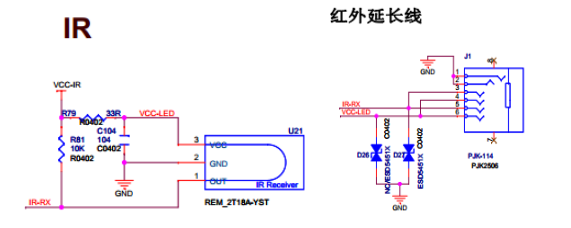
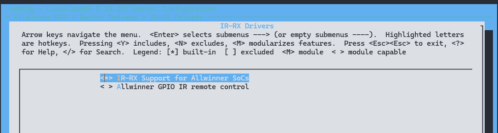

# IR RX - 红外接收

红外遥控的发射电路是采用红外发光二极管来发出经过调制的红外光波；红外接收电路由红外接收二极管、三极管或硅光电池组成，它们将红外发射器发射的红外光转换为相应的电信号，再送后置放大器。 

鉴于家用电器的品种多样化和用户的使用特点，生产厂家对进行了严格的规范编码，这些编码 各不相同，从而形成不同的编码方式，统一称为红外遥控器编码传输协议。到目前为止，红外遥控 协议已多达十种， 如：RC5、SIRCS、Sy、RECS80、Denon、NEC、Motorola、Japanese、 SAMSWNG 和 Daewoo 等。我国家用电器的红外遥控器的生产厂家，其编码方式多数是按上述 的各种协议进行编码的，而用得较多的有 NEC 协议。

## 电路原理图



IR-RX接到主控的IR-RX模块的接收管脚。当IR接收到数据后，会产生中断，软件收到中断会进行数据读取。

## 模块配置

### 驱动配置

```
IR-RX Drivers ->
	<*> IR-RX Support for Allwinner SoCs
	< > Allwinner GPIO IR remote control
```



### 设备树配置

设备树 `dtsi` 中存在的是该类芯片所有平台的模块配置，IR-RX 的设备树配置如下所示：

```c
s_cir0: s_cir@7040000 {
	compatible = "allwinner,s_cir";					// 具体的设备，用于驱动和设备的绑定
	reg = <0x0 0x07040000 0x0 0x400>;				// 设备使用的地址
	interrupts = <GIC_SPI 151 IRQ_TYPE_LEVEL_HIGH>;	// 设备使用的中断
	clocks = <&r_ccu CLK_R_APB0_BUS_IRRX>, <&dcxo24M>, <&r_ccu CLK_R_APB0_IRRX>;	// 设备使用的时钟
	clock-names = "bus", "pclk", "mclk";											// 使用的时钟名
	resets = <&r_ccu RST_R_APB0_BUS_IRRX>;			// 设备使用的复位时钟
	status = "disabled";							// 设备是否使用，dtsi中设为disabled，会被board.dts中的配置覆盖
};
```

引脚配置

```c
&pio {
	s_cir0_pins_a: s_cir0@0 {
		pins = "PB1";								// 使用的引脚,不同芯片不一样
		function = "ir";
	};

	s_cir0_pins_b: s_cir0@1 {
		pins = "PB1";
		function = "gpio_in";
	};
};
```

IR 配置

```c
&s_cir0 {
		pinctrl-names = "default", "sleep";		// 设备使用的pin脚名称
		pinctrl-0 = <&s_cir0_pins_a>;			// 设备使用的pin脚配置（default）
		pinctrl-1 = <&s_cir0_pins_b>;			// 设备使用的pin脚配置（sleep）
		status = "okay";						// 设备是否使用
};
```

## 驱动接口

### sunxi_irrx_probe

- **函数原型：** `static int sunxi_irrx_probe(struct platform_device *pdev)`
- **功能：** 初始化IR RX模块。
- **参数：** `pdev`：设备结构体。
- **返回值：** 成功返回0，失败返回错误码。

### sunxi_irrx_reg_cfg

- **函数原型：** `static void sunxi_irrx_reg_cfg(void __iomem *reg_base)`
- **功能：** irrx寄存器配置。
- **参数：** `reg_base`：irrx的基地址。
- **返回值：** 无。

### irqreturn_t sunxi_irrx_irq

- **函数原型：** `static irqreturn_t sunxi_irrx_irq(int irq, void *dev_id)`
- **功能：** 中断服务函数，读取FIFO数据，并解码。
- **参数：** `irqno`：中断号；`dev_id`：保存IR RX数据结构体。
- **返回值：** 返回IRQ_HANDLED。

### sunxi_irrx_recv

- **函数原型：** `static void sunxi_irrx_recv(u32 reg_data, struct sunxi_ir_rx *chip)`
- **功能：** 将接收的ir数据上报至input子系统。
- **参数：** `reg_data`：FIFO寄存器中的数据；`chip`：irrx数据结构体。
- **返回值：** 无。

IR-RX模块在Linux内核中是作为字符设备使用，所以可以使用相关字符设备接口来对IR-RX模块进行相应的读写和配置操作。相关定义在 `evdev.c` 文件里面。下面介绍几个比较有用的函数：

**### evdev_open()

- **函数原型：** `static int evdev_open(struct inode *inode, struct file *file)`
- **功能描述：** 调用open(file)时调用的函数。用于打开一个IR-RX模块设备。
- **参数说明：** `inode`：inode节点；`file`：file结构体。
- **返回值：** 文件描述符。

### evdev_read()

- **函数原型：** `static ssize_t evdev_read(struct file *file, char __user *buffer, size_t count, loff_t *ppos)`
- **功能描述：** 调用read()时调用的函数。用于读取IR-RX模块上报的事件数据。
- **参数说明：** `file`：file结构体；`buffer`：写数据缓冲区；`count`：读取字节数；`ppos`：文件偏移。
- **返回值：** 成功返回读取的字节数，失败返回负数。

### evdev_write()

- **函数原型：** `static ssize_t evdev_write(struct file *file, const char __user *buffer, size_t count, loff_t *ppos)`
- **功能描述：**调用write()时调用的函数。用于向IR-RX模块写入上报事件。
- **参数说明：** `file`：file结构体；`buffer`：读数据缓冲区；`count`：写入字节数；`ppos`：文件偏移。
- **返回值：** 成功返回0，失败返回负数。

### evdev_ioctl()

- **函数原型：** `static long evdev_ioctl(struct file *file, unsigned int cmd, unsigned long arg)`
- **功能描述：**调用ioctl()时调用的函数。用于管理相关的IR-RX模块功能。
- **参数说明：** `file`：file结构体；`cmd`：指令；`arg`：其他参数。
- **返回值：** 成功返回0，失败返回负数。

通过找到IR-RX模块对应的event文件，可以使用C语言的文件读写和控制函数来调用上述的接口。

## 模块 DEMO

在此示例中，我们假设IR RX输入设备的事件文件是`/dev/input/event0`，并以只读方式打开它。然后，我们循环读取事件数据，并打印每个事件的类型、代码和值。

```c
#include <linux/input.h>
#include <stdio.h>
#include <fcntl.h>
#include <unistd.h>
#include <stdlib.h>

int main() {
    int fd;
    struct input_event event;

    // 打开虚拟输入设备文件（这里使用标准输入设备stdin作为示例）
    fd = open("/dev/input/event0", O_RDONLY);
    if (fd == -1) {
        perror("open");
        exit(1);
    }

    printf("Reading from the input device...\n");

    // 循环读取事件数据
    while (1) {
        ssize_t bytes = read(fd, &event, sizeof(event));
        if (bytes == -1) {
            perror("read");
            exit(1);
        } else if (bytes != sizeof(event)) {
            fprintf(stderr, "Incomplete event read\n");
            exit(1);
        }

        // 打印事件类型和值
        printf("Event type: %u, code: %u, value: %u\n", event.type, event.code, event.value);
    }

    close(fd);

    return 0;
}
```

