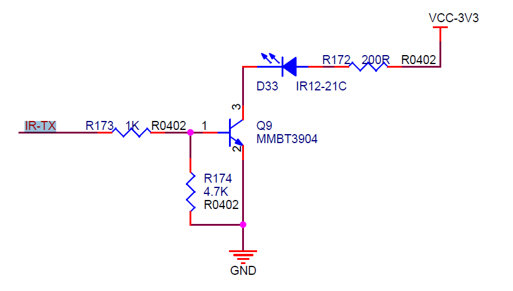
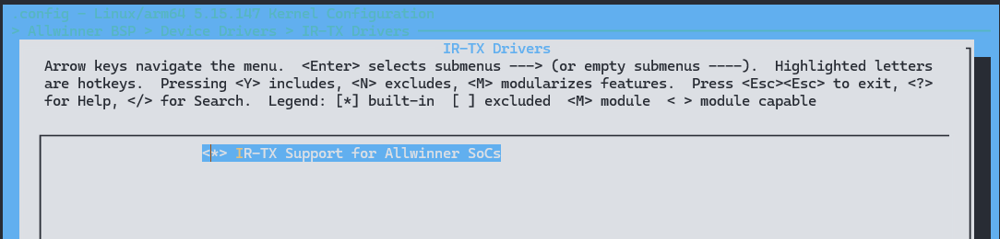

# IR TX - 红外发射

IR-TX是一种红外发送模块，其主要功能是输出红外波形。通常情况下，它采用38KHz的载波频率。该模块能够将数据转换成一系列高低电平序列，以便发送红外信号。在发送过程中，每个有效脉冲的数据都以字节为单位被缓存到TX FIFO中。在每个字节中，最高位（bit7）表示要发送波形的极性，其中1表示高电平，0表示低电平。而低7位（bit[6:0]）表示该波形的长度，其单位是参考时钟周期（Ts=Fclk/RCS）。这里，Fclk表示IR-TX模块的时钟源频率，而RCS则是参考时钟的分频系数，可由TCR寄存器（地址为0x08）的bit[3:1]来设置。



## 模块配置

### 驱动配置

```
IR-TX Drivers ->
	<*> IR-TX Support for Allwinner SoCs
```



### 设备树配置

公共配置

```c
irtx: ir@2003000 {
    compatible = "allwinner,irtx";
    reg = <0x0 0x02003000 0x0 0x400>;
    interrupts = <GIC_SPI 26 IRQ_TYPE_LEVEL_HIGH>;
    clocks = <&ccu CLK_BUS_IRTX>, <&dcxo24M>, <&ccu CLK_IRTX>;
    clock-names = "bus", "pclk", "mclk";
    resets = <&ccu RST_BUS_IRTX>;
    status = "disabled";
};
```

引脚配置

```c
&pio {
    irtx_pins_default: irtx@0 {
        pins = "PH18";
        function = "cir";
    };

    irtx_pins_sleep: irtx@1 {
        pins = "PH18";
        function = "gpio_in";
    };
};
```

模块配置

```c
&irtx {
    pinctrl-names = "default", "sleep";
    pinctrl-0 = <&irtx_pins_default>;
    pinctrl-1 = <&irtx_pins_sleep>;
    status = "okay";
};
```

## 模块接口

IR-TX模块采用通用的RC框架进行读写，所以可以使用通用的接口。

### `evdev_open()`

- 函数原型：`static int evdev_open(struct inode *inode, struct file *file)`。
- 功能描述：程序（C语言等）使用 `open(file)` 时调用的函数。打开一个IR-TX模块设备。
- 参数说明：`inode`：inode节点；`file`：file结构体。
- 返回值：文件描述符。

### `evdev_read()`

- 函数原型：`static ssize_t evdev_read(struct file *file, char __user *buffer, size_t count, loff_t *ppos)`。
- 功能描述：程序（C语言等）调用 `read()` 时调用的函数。读取IR-TX模块上报事件数据。
- 参数说明：`file`：file结构体；`buffer`：写数据缓冲区；`count`：要读取的字节数；`ppos`：文件偏移量。
- 返回值：成功返回读取的字节数，失败返回负数。

### `evdev_write()`

- 函数原型：`static ssize_t evdev_write(struct file *file, const char __user *buffer, size_t count, loff_t *ppos)`。
- 功能描述：程序（C语言等）调用 `write()` 时调用的函数。向IR-TX模块写入上报事件。
- 参数说明：`file`：file结构体；`buffer`：读数据缓冲区；`count`：要写入的字节数；`ppos`：文件偏移量。
- 返回值：成功返回0，失败返回负数。

### `evdev_ioctl()`

- 函数原型：`static long evdev_ioctl(struct file *file, unsigned int cmd, unsigned long arg)`。
- 功能描述：程序（C语言等）调用 `ioctl()` 时调用的函数。管理相关的IR-TX模块功能。
- 参数说明：`file`：file结构体；`cmd`：指令；`arg`：其他参数。
- 返回值：成功返回0，失败返回负数。

## 模块 DEMO

该 DEMO 可以用来调用TX模块发送数据信号.
测试命令：`tx 0x04 3800`
注：DEMO 采用NEC协议进行编码，设置载波占空比为33%，设置载波频率为38KHz。

```c
#include <linux/types.h>
#include <linux/ioctl.h>
#include <sys/types.h>
#include <sys/stat.h>
#include <sys/ioctl.h>
#include <fcntl.h>
#include <stdio.h>
#include <stdint.h>
#include <stdlib.h>
#include <poll.h>
#include <signal.h>
#include <sys/types.h>
#include <linux/types.h>
#include <pthread.h>
#include <unistd.h>
#include <string.h>
#include <errno.h>
#include <unistd.h>

#define PULSE_BIT       0x01000000
#define PULSE_MASK      0x00FFFFFF

#define LIRC_MODE2_SPACE     0x00000000
#define LIRC_MODE2_PULSE     0x01000000
#define LIRC_MODE2_FREQUENCY 0x02000000
#define LIRC_MODE2_TIMEOUT   0x03000000

#define LIRC_VALUE_MASK      0x00FFFFFF
#define LIRC_MODE2_MASK      0xFF000000

#define LIRC_SPACE(val) (((val)&LIRC_VALUE_MASK) | LIRC_MODE2_SPACE)
#define LIRC_PULSE(val) (((val)&LIRC_VALUE_MASK) | LIRC_MODE2_PULSE)
#define LIRC_FREQUENCY(val) (((val)&LIRC_VALUE_MASK) | LIRC_MODE2_FREQUENCY)
#define LIRC_TIMEOUT(val) (((val)&LIRC_VALUE_MASK) | LIRC_MODE2_TIMEOUT)

#define LIRC_VALUE(val) ((val)&LIRC_VALUE_MASK)
#define LIRC_MODE2(val) ((val)&LIRC_MODE2_MASK)

#define LIRC_IS_SPACE(val) (LIRC_MODE2(val) == LIRC_MODE2_SPACE)
#define LIRC_IS_PULSE(val) (LIRC_MODE2(val) == LIRC_MODE2_PULSE)
#define LIRC_IS_FREQUENCY(val) (LIRC_MODE2(val) == LIRC_MODE2_FREQUENCY)
#define LIRC_IS_TIMEOUT(val) (LIRC_MODE2(val) == LIRC_MODE2_TIMEOUT)

/* used heavily by lirc userspace */
#define lirc_t int

/*** lirc compatible hardware features ***/

#define LIRC_MODE2SEND(x) (x)
#define LIRC_SEND2MODE(x) (x)
#define LIRC_MODE2REC(x) ((x) << 16)
#define LIRC_REC2MODE(x) ((x) >> 16)

#define LIRC_MODE_RAW                  0x00000001
#define LIRC_MODE_PULSE                0x00000002
#define LIRC_MODE_MODE2                0x00000004
#define LIRC_MODE_SCANCODE             0x00000008
#define LIRC_MODE_LIRCCODE             0x00000010


#define LIRC_CAN_SEND_RAW              LIRC_MODE2SEND(LIRC_MODE_RAW)
#define LIRC_CAN_SEND_PULSE            LIRC_MODE2SEND(LIRC_MODE_PULSE)
#define LIRC_CAN_SEND_MODE2            LIRC_MODE2SEND(LIRC_MODE_MODE2)
#define LIRC_CAN_SEND_LIRCCODE         LIRC_MODE2SEND(LIRC_MODE_LIRCCODE)

#define LIRC_CAN_SEND_MASK             0x0000003f

#define LIRC_CAN_SET_SEND_CARRIER      0x00000100
#define LIRC_CAN_SET_SEND_DUTY_CYCLE   0x00000200
#define LIRC_CAN_SET_TRANSMITTER_MASK  0x00000400

#define LIRC_CAN_REC_RAW               LIRC_MODE2REC(LIRC_MODE_RAW)
#define LIRC_CAN_REC_PULSE             LIRC_MODE2REC(LIRC_MODE_PULSE)
#define LIRC_CAN_REC_MODE2             LIRC_MODE2REC(LIRC_MODE_MODE2)
#define LIRC_CAN_REC_SCANCODE          LIRC_MODE2REC(LIRC_MODE_SCANCODE)
#define LIRC_CAN_REC_LIRCCODE          LIRC_MODE2REC(LIRC_MODE_LIRCCODE)

#define LIRC_CAN_REC_MASK              LIRC_MODE2REC(LIRC_CAN_SEND_MASK)

#define LIRC_CAN_SET_REC_CARRIER       (LIRC_CAN_SET_SEND_CARRIER << 16)
#define LIRC_CAN_SET_REC_DUTY_CYCLE    (LIRC_CAN_SET_SEND_DUTY_CYCLE << 16)

#define LIRC_CAN_SET_REC_DUTY_CYCLE_RANGE 0x40000000
#define LIRC_CAN_SET_REC_CARRIER_RANGE    0x80000000
#define LIRC_CAN_GET_REC_RESOLUTION       0x20000000
#define LIRC_CAN_SET_REC_TIMEOUT          0x10000000
#define LIRC_CAN_SET_REC_FILTER           0x08000000

#define LIRC_CAN_MEASURE_CARRIER          0x02000000
#define LIRC_CAN_USE_WIDEBAND_RECEIVER    0x04000000

#define LIRC_CAN_SEND(x) ((x)&LIRC_CAN_SEND_MASK)
#define LIRC_CAN_REC(x) ((x)&LIRC_CAN_REC_MASK)

#define LIRC_CAN_NOTIFY_DECODE            0x01000000

/*** IOCTL commands for lirc driver ***/

#define LIRC_GET_FEATURES              _IOR('i', 0x00000000, __u32)

#define LIRC_GET_SEND_MODE             _IOR('i', 0x00000001, __u32)
#define LIRC_GET_REC_MODE              _IOR('i', 0x00000002, __u32)
#define LIRC_GET_REC_RESOLUTION        _IOR('i', 0x00000007, __u32)

#define LIRC_GET_MIN_TIMEOUT           _IOR('i', 0x00000008, __u32)
#define LIRC_GET_MAX_TIMEOUT           _IOR('i', 0x00000009, __u32)

/* code length in bits, currently only for LIRC_MODE_LIRCCODE */
#define LIRC_GET_LENGTH                _IOR('i', 0x0000000f, __u32)

#define LIRC_SET_SEND_MODE             _IOW('i', 0x00000011, __u32)
#define LIRC_SET_REC_MODE              _IOW('i', 0x00000012, __u32)
/* Note: these can reset the according pulse_width */
#define LIRC_SET_SEND_CARRIER          _IOW('i', 0x00000013, __u32)
#define LIRC_SET_REC_CARRIER           _IOW('i', 0x00000014, __u32)
#define LIRC_SET_SEND_DUTY_CYCLE       _IOW('i', 0x00000015, __u32)
#define LIRC_SET_TRANSMITTER_MASK      _IOW('i', 0x00000017, __u32)

/*
 * when a timeout != 0 is set the driver will send a
 * LIRC_MODE2_TIMEOUT data packet, otherwise LIRC_MODE2_TIMEOUT is
 * never sent, timeout is disabled by default
 */
#define LIRC_SET_REC_TIMEOUT           _IOW('i', 0x00000018, __u32)

/* 1 enables, 0 disables timeout reports in MODE2 */
#define LIRC_SET_REC_TIMEOUT_REPORTS   _IOW('i', 0x00000019, __u32)

/*
 * if enabled from the next key press on the driver will send
 * LIRC_MODE2_FREQUENCY packets
 */
#define LIRC_SET_MEASURE_CARRIER_MODE    _IOW('i', 0x0000001d, __u32)

/*
 * to set a range use LIRC_SET_REC_CARRIER_RANGE with the
 * lower bound first and later LIRC_SET_REC_CARRIER with the upper bound
 */
#define LIRC_SET_REC_CARRIER_RANGE     _IOW('i', 0x0000001f, __u32)

#define LIRC_SET_WIDEBAND_RECEIVER     _IOW('i', 0x00000023, __u32)

/*
 * Return the recording timeout, which is either set by
 * the ioctl LIRC_SET_REC_TIMEOUT or by the kernel after setting the protocols.
 */
#define LIRC_GET_REC_TIMEOUT           _IOR('i', 0x00000024, __u32)

/*
 * struct lirc_scancode - decoded scancode with protocol for use with
 *    LIRC_MODE_SCANCODE
 *
 * @timestamp: Timestamp in nanoseconds using CLOCK_MONOTONIC when IR
 *    was decoded.
 * @flags: should be 0 for transmit. When receiving scancodes,
 *    LIRC_SCANCODE_FLAG_TOGGLE or LIRC_SCANCODE_FLAG_REPEAT can be set
 *    depending on the protocol
 * @rc_proto: see enum rc_proto
 * @keycode: the translated keycode. Set to 0 for transmit.
 * @scancode: the scancode received or to be sent
 */
struct lirc_scancode {
    __u64    timestamp;
    __u16    flags;
    __u16    rc_proto;
    __u32    keycode;
    __u64    scancode;
};

/* Set if the toggle bit of rc-5 or rc-6 is enabled */
#define LIRC_SCANCODE_FLAG_TOGGLE    1
/* Set if this is a nec or sanyo repeat */
#define LIRC_SCANCODE_FLAG_REPEAT    2
enum rc_proto {
    RC_PROTO_UNKNOWN    = 0,
    RC_PROTO_OTHER        = 1,
    RC_PROTO_RC5        = 2,
    RC_PROTO_RC5X_20    = 3,
    RC_PROTO_RC5_SZ        = 4,
    RC_PROTO_JVC        = 5,
    RC_PROTO_SONY12        = 6,
    RC_PROTO_SONY15        = 7,
    RC_PROTO_SONY20        = 8,
    RC_PROTO_NEC        = 9,
    RC_PROTO_NECX        = 10,
    RC_PROTO_NEC32        = 11,
    RC_PROTO_SANYO        = 12,
    RC_PROTO_MCIR2_KBD    = 13,
    RC_PROTO_MCIR2_MSE    = 14,
    RC_PROTO_RC6_0        = 15,
    RC_PROTO_RC6_6A_20    = 16,
    RC_PROTO_RC6_6A_24    = 17,
    RC_PROTO_RC6_6A_32    = 18,
    RC_PROTO_RC6_MCE    = 19,
    RC_PROTO_SHARP        = 20,
    RC_PROTO_XMP        = 21,
    RC_PROTO_CEC        = 22,
    RC_PROTO_IMON        = 23,
    RC_PROTO_RCMM12        = 24,
    RC_PROTO_RCMM24        = 25,
    RC_PROTO_RCMM32        = 26,
    RC_PROTO_XBOX_DVD    = 27,
};

#define NEC_NBITS        32
#define NEC_UNIT        562500  /* ns */
#define NEC_HEADER_PULSE    (16 * NEC_UNIT) /* 9ms */
#define NECX_HEADER_PULSE    (8  * NEC_UNIT) /* Less common NEC variant */
#define NEC_HEADER_SPACE    (8  * NEC_UNIT) /* 4.5ms */
#define NEC_REPEAT_SPACE    (4  * NEC_UNIT) /* 2.25ms */
#define NEC_BIT_PULSE        (1  * NEC_UNIT)
#define NEC_BIT_0_SPACE        (1  * NEC_UNIT)
#define NEC_BIT_1_SPACE        (3  * NEC_UNIT)
#define    NEC_TRAILER_PULSE    (1  * NEC_UNIT)
#define    NEC_TRAILER_SPACE    (10 * NEC_UNIT) /* even longer in reality */

#define NS_TO_US(nsec)        ((nsec) / 1000)

#define GPIO_IR_RAW_BUF_SIZE    128
#define DEFAULT_CARRIER_FREQ    38000
#define DEFAULT_DUTY_CYCLE    33
#define NEC_ADDR_SHIFT        24
#define NEC_UNADDR_SHIFT    16
#define NEC_CMD_SHIFT        8
#define NEC_UNCMD_SHIFT        0
#define NEC_ENCODE_MASK        0xff
#define RAW_MASK        0xffffff
#define VERSION_NUM        256
#define RAW_BANK        8
#define SHIFT_MASK        8

uint32_t rx_raw_buf[GPIO_IR_RAW_BUF_SIZE];
uint32_t tx_raw_buf[GPIO_IR_RAW_BUF_SIZE];

static int fd;
static int fd1;
struct pollfd poll_fds[1];
static int int_exit;
static int kernel_flag;
pthread_t tid;

static void print_usage(const char *argv0)
{    printf("usage: %s [options]\n", argv0);
    printf("\n");
    printf("gpio ir receive test:\n");
    printf("\tgpio_ir_test rx\n");
    printf("\n");
    printf("gpio ir send test:\n");
    printf("\tgpio_ir_test tx <code>\n");
    printf("\n");
    printf("gpio ir loop test, rx&tx:\n");
    printf("\tgpio_ir_test loop\n");
    printf("\n");
}

static int nec_modulation_byte(uint32_t *buf, uint8_t code)
{
    int i = 0;
    uint8_t mask = 0x01;

    while (mask) {
        /*low bit first*/
        if (code & mask) {
            /*bit 1*/
            *(buf + i) = LIRC_PULSE(NS_TO_US(NEC_BIT_PULSE));
            *(buf + i + 1) = LIRC_SPACE(NS_TO_US(NEC_BIT_1_SPACE));
        } else {
            /*bit 0*/
            *(buf + i) = LIRC_PULSE(NS_TO_US(NEC_BIT_PULSE));
            *(buf + i + 1) = LIRC_SPACE(NS_TO_US(NEC_BIT_0_SPACE));
        }
        mask <<= 1;
        i += 2;
    }
    return i;
}

static int nec_ir_encode(uint32_t *raw_buf, uint32_t key_code)
{
    uint8_t address, not_address, command, not_command;
    uint32_t *head_p, *data_p, *stop_p;

    address    = (key_code >> NEC_ADDR_SHIFT) & NEC_ENCODE_MASK;
    not_address = (key_code >> NEC_UNADDR_SHIFT) & NEC_ENCODE_MASK;
    command    = (key_code >>  NEC_CMD_SHIFT) & NEC_ENCODE_MASK;
    not_command = (key_code >>  NEC_UNCMD_SHIFT) & NEC_ENCODE_MASK;

    /*head bit*/
    head_p = raw_buf;
    *(head_p) = LIRC_PULSE(NS_TO_US(NEC_HEADER_PULSE));
    *(head_p + 1) = LIRC_SPACE(NS_TO_US(NEC_HEADER_SPACE));

    /*data bit*/
    data_p = raw_buf + 2;
    nec_modulation_byte(data_p,  address);

    data_p += 16;
    nec_modulation_byte(data_p,  not_address);

    data_p += 16;
    nec_modulation_byte(data_p,  command);

    data_p += 16;
    nec_modulation_byte(data_p,  not_command);

    /*stop bit*/
    stop_p = data_p + 16;
    *(stop_p) = LIRC_PULSE(NS_TO_US(NEC_TRAILER_PULSE));
    *(stop_p + 1) = LIRC_SPACE(NS_TO_US(NEC_TRAILER_SPACE));

    /*return the total size of nec protocal pulse*/
    /* linux-5.4 needs 67 byte datas */
    if (kernel_flag == 1)
        return ((NEC_NBITS + 2) * 2 - 1);
    else
        return ((NEC_NBITS + 2) * 2);
}

void *ir_recv_thread(void *arg)
{
    int size = 0, size_t = 0;
    int i = 0;
    int dura;
    int ret;
    int total = 0;

    poll_fds[0].fd = fd;
    poll_fds[0].events = POLLIN | POLLERR;
    poll_fds[0].revents = 0;
    while (!int_exit) {
        ret = poll(poll_fds, 1, 12);
        if (!ret) {
            printf("\n--------------------\n");
            total = 0;
        } else {
            if (poll_fds[0].revents == POLLIN) {
                size = read(fd, (char *)(rx_raw_buf),
                        GPIO_IR_RAW_BUF_SIZE);
                size_t = size / sizeof(uint32_t);
                for (i = 0; i < size_t; i++) {
                    dura = rx_raw_buf[i] & RAW_MASK;
                    printf("%d ", dura);
                    if ((total++) % RAW_BANK == 0)
                        printf("\n");
                }
            }
        }
    }

    return NULL;
}

void gpio_ir_test_close(int sig)
{
    /* allow the stream to be closed gracefully */
    signal(sig, SIG_IGN);
    int_exit = 1;
    if (fd1 != fd)
        close(fd1);
    close(fd);
}

int main(int argc, char **argv)
{
    int ret;
    int size = 0, size_t = 0;
    int i = 0;
    int duty_cycle;
    int carrier_freq;
    int key_code = 0;
    int err = 0;
    int cnt = 0;
    /* use for check the current kernel version */
    int fd_version;
    char version_buf[VERSION_NUM];

    fd_version = open("/proc/version", O_RDONLY);
    if (fd_version < 0) {
        printf("The system is not mount proc, please check\n");
        return -1;
    }
    ret = read(fd_version, version_buf, sizeof(version_buf));
    if (ret < 0) {
        printf("Can't not read /proc/verison\n");
        return -1;
    }
    switch(version_buf[14]) {
        case '4':
            kernel_flag = 0;
            printf("This is 4.* linux kernel\n");
            break;
        case '5':
            kernel_flag = 1;
            printf("This is 5.* linux kernel\n");
            break;
        default:
            kernel_flag = 0;
            printf("This is %c.* kernel which is not support\n", version_buf[14]);
            break;
    }
    close(fd_version);

    /* catch ctrl-c to shutdown cleanly */
    signal(SIGINT, gpio_ir_test_close);

    if (argc < 2) {
        print_usage(argv[0]);
        return -1;
    }

    fd = open("/dev/lirc0", O_RDWR);
    if (fd < 0) {
        printf("can't open lirc0 recv, check driver!\n");
        return 0;
    } else {
        printf("lirc0 open succeed.\n");
    }

    fd1 = open("/dev/lirc1", O_RDWR);
    if (fd1 < 0) {
        printf("can't open lirc1 send, check driver!\n");
        fd1 = fd;
        printf("There is no lirc1, use the lirc0 as lirc1.\n");
    } else {
        printf("lirc1 open succeed.\n");
    }

    for (i = 1; i < argc; i++) {
        if (!strcmp(argv[i], "-n")) {
            if (i + 1 >= argc) {
                printf("Option -n expects an argument.\n\n");
                print_usage(argv[0]);
                goto OUT;
            }
            continue;
        }
    }

    if (!strcmp(argv[1], "rx")) {
        err = pthread_create(&tid, NULL, (void *)ir_recv_thread, NULL);
        if (err != 0) {
            printf("create pthread error: %d\n", __LINE__);
            goto OUT;
        }

        do {
            usleep(1000);
        } while (!int_exit);

    } else if (!strcmp(argv[1], "tx")) {
        if (argc < 3) {
            fprintf(stderr, "No data passed\n");
            goto OUT;
        }

        if (sscanf(argv[2], "%x", &key_code) != 1) {
            fprintf(stderr, "no input data: %s\n", argv[2]);
            goto OUT;
        }

        key_code = key_code << SHIFT_MASK;

        duty_cycle = DEFAULT_DUTY_CYCLE;
        if (ioctl(fd1, LIRC_SET_SEND_DUTY_CYCLE, &duty_cycle)) {
            fprintf(stderr,
                "lirc0: could not set carrier duty: %s\n",
                strerror(errno));
            goto OUT;
        }

        if (sscanf(argv[3], "%ul", &carrier_freq) != 1) {
            fprintf(stderr, "no input data: %s\n", argv[3]);
            goto OUT;
        }

        if (ioctl(fd1, LIRC_SET_SEND_CARRIER, &carrier_freq)) {
            fprintf(stderr,
                "lirc0: could not set carrier freq: %s\n",
                strerror(errno));
            goto OUT;
        }

        printf("irtest: send key code : 0x%x\n", key_code);

        size = nec_ir_encode(tx_raw_buf, key_code);
        /*dump the raw data*/
        for (i = 0; i < size; i++) {
            printf("%d ", *(tx_raw_buf + i) & RAW_MASK);
            if ((i + 1) % RAW_BANK == 0)
                printf("\n");
        }
        printf("\n");

        /* linux-5.4 IR core should delete bit24~bit31 */
        if (kernel_flag == 1) {
            for (i = 0; i < size; i++) {
                tx_raw_buf[i] = (tx_raw_buf[i] & RAW_MASK);
            }
        }

        if (argc > 4 && !strcmp(argv[3], "-n")) {
                        cnt = atoi(argv[4]);
                        for (i = 0; i < cnt; i++) {
                                size_t = size * sizeof(uint32_t);
                                ret = write(fd1, (char *)tx_raw_buf, size_t);
                                if (ret > 0)
                                        printf("irtest No.%d: send %d bytes ir raw data\n\n",
                                                i, ret);
                else
                    printf("irtest No.%d: send %d failed!\n", i, ret);
                usleep(100*1000);
                        }
                } else {
            size_t = size * sizeof(uint32_t);
            ret = write(fd1, (char *)tx_raw_buf, size_t);
            if (ret > 0)
                printf("irtest: send %d bytes ir raw data\n\n", ret);
            else
                printf("irtest: send %d failed\n", ret);
        }

    } else if (!strcmp(argv[1], "loop")) {

        /*code: 0x13*/
        key_code = 0x04fb13ec;
        err = pthread_create(&tid, NULL, (void *)ir_recv_thread, NULL);
        if (err != 0) {
            printf("create pthread error: %d\n", __LINE__);
            goto OUT;
        }

        duty_cycle = DEFAULT_DUTY_CYCLE;
        if (ioctl(fd1, LIRC_SET_SEND_DUTY_CYCLE, &duty_cycle)) {
            fprintf(stderr,
                "lirc0: could not set carrier duty: %s\n",
                strerror(errno));
            goto OUT;
        }
        carrier_freq = DEFAULT_CARRIER_FREQ;
        if (ioctl(fd1, LIRC_SET_SEND_CARRIER, &carrier_freq)) {
            fprintf(stderr,
                "lirc0: could not set carrier freq: %s\n",
                strerror(errno));
            goto OUT;
        }

        /*echo 50ms transmit one frame */

        if (argc > 3 && !strcmp(argv[2], "-n")) {
            cnt = atoi(argv[3]);
            for (i = 0; i < cnt; i++) {
                size = nec_ir_encode(tx_raw_buf, key_code);
                size_t = size * sizeof(uint32_t);
                /* linux-5.4 IR core should delete bit24~bit31 */
                if (kernel_flag == 1) {
                    for (i = 0; i < size; i++) {
                        tx_raw_buf[i] = (tx_raw_buf[i] & RAW_MASK);
                    }
                }
                printf("send key code : 0x%x, No.%d\n", key_code, i);
                write(fd1, (char *)tx_raw_buf, size_t);
                usleep(100*1000);
                if (int_exit)
                    break;
            }
                } else {
                        i = 0;
            do {
                size = nec_ir_encode(tx_raw_buf, key_code);
                size_t = size * sizeof(uint32_t);
                /* linux-5.4 IR core should delete bit24~bit31 */
                if (kernel_flag == 1) {
                    for (i = 0; i < size; i++) {
                        tx_raw_buf[i] = (tx_raw_buf[i] & RAW_MASK);
                    }
                }
                printf("send key code : 0x%x, %d\n", key_code, i++);
                write(fd1, (char *)tx_raw_buf, size_t);
                usleep(100*1000);
            } while (!int_exit);
        }
    } else if (!strcmp(argv[1], "-n")) {
        print_usage(argv[0]);
    }

OUT:
    if (fd1 != fd)
        close(fd1);
    close(fd);
    return 0;
}
```

