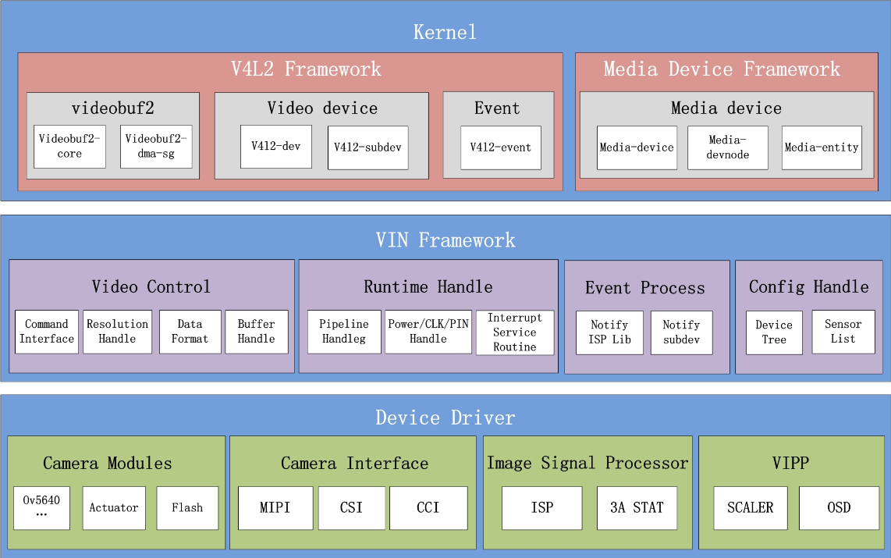
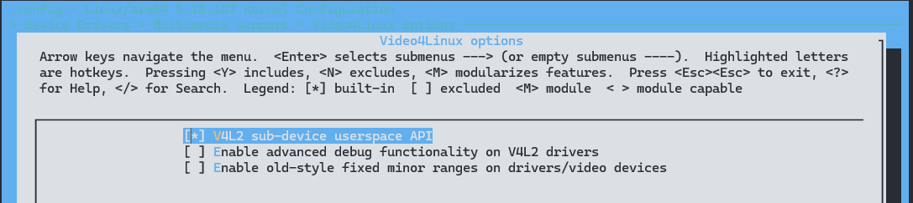
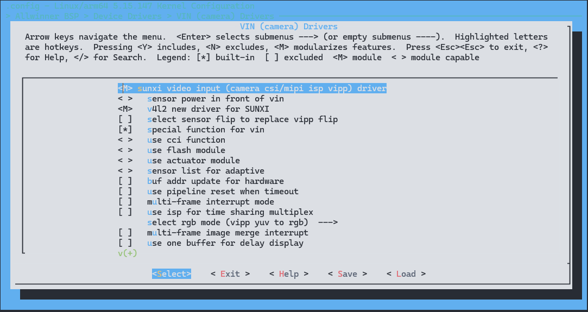
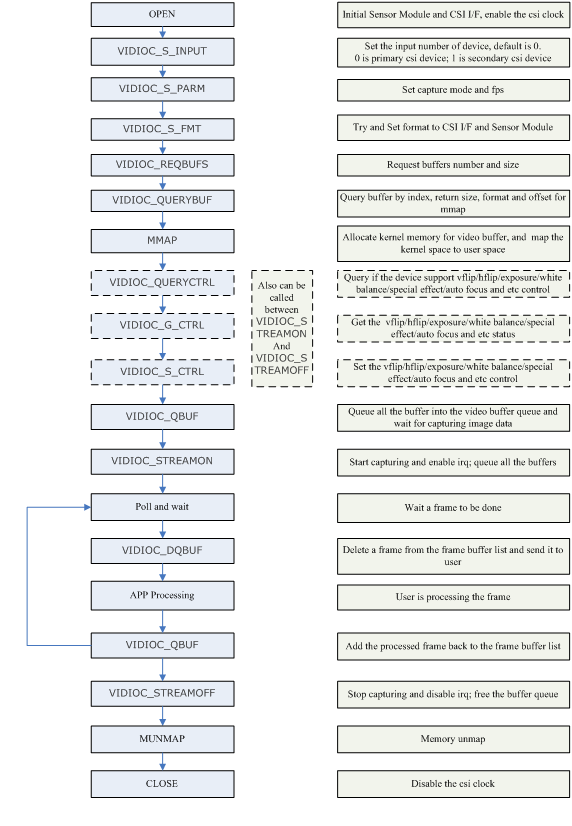
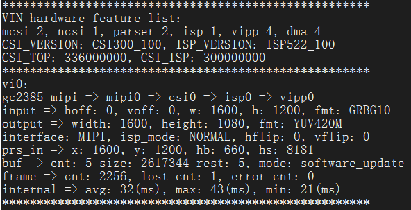
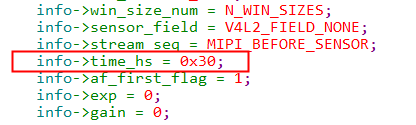
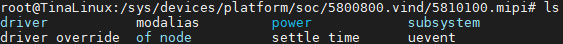
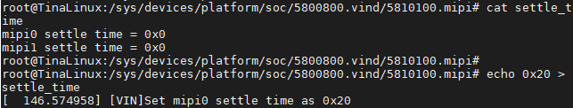
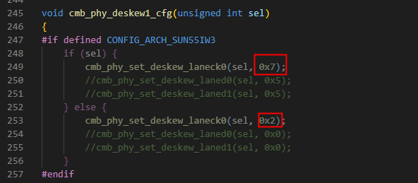

# MIPI CSI - 视频输入

1. **视频输入组成**：
   - **接口部分（CSI/MIPI）：** 负责从图像传感器中接收视频数据，并将其传输到后续处理单元。
   - **图像处理单元（ISP/VIPP）：** 对接收到的视频数据进行处理和加工。

2. **CSI/MIPI部分功能**：
   - 主要用于视频数据的捕捉，即从图像传感器获取原始图像数据并传输到后续处理单元。

3. **ISP功能**：
   - 处理sensor raw data数据，包括：
     - **镜头补偿（lens compensation）**：对图像进行修正，以消除由于镜头畸变引起的失真。
     - **坏点修复（bad pixel correction）**：识别并修复传感器中可能存在的坏点或瑕疵像素。
     - **增益（gain）和伽马校正（gamma correction）**：调整图像的亮度和对比度。
     - **去马赛克（de-mosaic）**：将单色传感器采集的数据转换为彩色图像。
     - **去噪（de-noise）**：消除图像中的噪声，提高图像质量。
     - **色彩矩阵（color matrix）等校正**：校正图像的色彩偏差。

4. **VIPP功能**：
   - 可以对图像进行缩小和打水印处理。
   - **缩小（downscaling）**：降低图像分辨率，以适应特定显示或存储要求。
   - **水印处理（watermarking）**：在图像上添加标识、文字或图形等信息。
   - 支持对bayer raw data经过ISP处理后再进行缩小，也支持对一般的YUV格式的sensor图像直接进行缩小处理。

## 模块框架



V驱动可以分为Kernel层、Video Input Framework、Device Driver层。

这是有关嵌入式 Linux 内核视频驱动层、Video Input Framework 层和设备驱动层的描述。以下是针对这些内容的一些简要解释：

### Kernel层
1) Linux内核视频驱动第二版(Video for Linux Two)是用于嵌入式 Linux 系统的视频设备驱动框架。
2) 该框架适用于管理收音机、视频编解码、视频捕获以及视频输出设备的驱动。
3) 通过提供/dev/videoX节点，应用程序可以对视频流和设备进行控制操作。
4) Media Device Framework是用于多媒体设备的管理框架。
5) 该框架用于管理设备拓扑结构，并提供/dev/mediaX节点，以便应用程序可以获取媒体设备拓扑结构，并通过 API 控制子设备间的数据流向。

### Video Input Framework层
1) Video Control处理视频命令（例如分辨率协商、数据格式处理和缓冲区管理）。
2) Runtime Handle进行运行时管理，包括管道管理、系统资源管理和中断调度等。
3) Event Process管理事件，包括上层调用和中断等事件的接收与分发。
4) Config Handle进行配置管理，包括硬件拓扑结构和模组自适应列表等。

### Device Driver层
1) Camera Modules是指图像传感器、对焦电机、闪光灯等驱动。
2) Camera Interface是指MIPI、Sub-Lvds、HiSpi、Bt656、Bt601、Bt1120、DC等接口驱动。
3) Image Signal Processor是指图像处理器驱动，包括基本处理模块驱动和3A统计驱动。
4) Video Input Post Processor是指视频输入后处理，包括缩放器、OSD等。

## 模块配置

### 驱动配置

#### Linux 内核模块配置

```
Device Drivers ->
	{*} Multimedia support  --->
		Video4Linux options  --->
			[*] V4L2 sub-device userspace API
```



#### VIN 模块配置

```
VIN (camera) Drivers ->
	<M> sunxi video input (camera csi/mipi isp vipp) driver
	< >   sensor power in front of vin
	<M>   v4l2 new driver for SUNXI
	[ ]   select sensor flip to replace vipp flip
	[*]   special function for vin
	< >   use cci function
	< >   use flash module
	< >   use actuator module
	< >   sensor list for adaptive
	[ ]   buf addr update for hardware
	[ ]   use pipeline reset when timeout
	[ ]   multi-frame interrupt mode
	[ ]   use isp for time sharing multiplex
		select rgb mode (vipp yuv to rgb)  --->
			(X) vipp yuv to rgb
			( ) sensor output rgb
	[ ]   multi-frame image merge interrupt
	[ ]   use one buffer for delay display
	[*]   use IOMMU for memery alloc
	[*]   ISP 3D denoise module
	[ ]     ISP 3D denoise long time frame
	[ ]     ISP 3D denoise reduces buf size by compression
		select d3d mode (use d3d pkg mode)  --->
			(X) use d3d pkg mode
			( ) use d3d lbc mode
	[ ]   ISP WDR module
	[ ]   sensor same i2c addr
	[ ]   use vin sdram dfs
	[ ]   use ISP server from melis
	[ ]   vin and isp init in melis
		sensor driver select  --->
			< > use rn6854m driver
			<M> use nvp6158c driver
			< > use gc02m1b driver
			< > use gc02m1 driver
			< > use gc030a driver
			...
```

这段代码是Linux内核中针对VIN（视频输入）驱动的配置选项，主要用于配置与摄像头相关的驱动和功能。

- `VIN (camera) Drivers`: VIN（视频输入）驱动程序配置
	- `<M> sunxi video input (camera csi/mipi isp vipp) driver`: 启用sunxi视频输入驱动，支持摄像头的CSI/MIPI接口以及ISP/VIPP功能。
	- `< >   sensor power in front of vin`: 关闭VIN前端的传感器供电。
	- `<M>   v4l2 new driver for SUNXI`: 启用SUNXI的v4l2新驱动程序，用于视频采集设备的通用接口。
	- `[ ]   select sensor flip to replace vipp flip`: 未选择使用传感器翻转来替代VIPP翻转功能。
	- `[*]   special function for vin`: 启用VIN的特殊功能。
	- `< >   use cci function`: 不使用CCI（Camera Control Interface）功能。
	- `< >   use flash module`: 不使用闪光灯模块。
	- `< >   use actuator module`: 不使用驱动模块。
	- `< >   sensor list for adaptive`: 未选择传感器列表自适应功能。
	- `[ ]   buf addr update for hardware`: 不更新硬件的缓冲区地址。
	- `[ ]   use pipeline reset when timeout`: 在超时时不使用管道复位。
	- `[ ]   multi-frame interrupt mode`: 未启用多帧中断模式。
	- `[ ]   use isp for time sharing multiplex`: 不使用ISP进行时间共享复用。
	- 选择RGB模式（vipp yuv to rgb）  --->
		- `(X) vipp yuv to rgb`: 使用VIPP将YUV转换为RGB模式。
		- `( ) sensor output rgb`: 传感器直接输出RGB模式。
	- `[ ]   multi-frame image merge interrupt`: 未启用多帧图像合并中断。
	- `[ ]   use one buffer for delay display`: 未使用单个缓冲区进行延迟显示。
	- `[*]   use IOMMU for memery alloc`: 使用IOMMU进行内存分配。
	- `[*]   ISP 3D denoise module`: 启用ISP 3D降噪模块。
		- `[ ]     ISP 3D denoise long time frame`: 未启用ISP 3D降噪长时间帧功能。
		- `[ ]     ISP 3D denoise reduces buf size by compression`: 未启用ISP 3D降噪通过压缩减小缓冲区大小功能。
	- 选择D3D模式（use d3d pkg mode）  --->
		- `(X) use d3d pkg mode`: 使用D3D包模式。
		- `( ) use d3d lbc mode`: 不使用D3D LBC模式。
	- `[ ]   ISP WDR module`: 未启用ISP WDR模块。
	- `[ ]   sensor same i2c addr`: 未选择传感器具有相同的I2C地址。
	- `[ ]   use vin sdram dfs`: 不使用VIN的SDRAM DFS功能。
	- `[ ]   use ISP server from melis`: 不使用来自melis的ISP服务器。
	- `[ ]   vin and isp init in melis`: VIN和ISP在melis中未初始化。
	- 传感器驱动程序选择  --->
		- `< > use rn6854m driver`: 未选择使用rn6854m驱动程序。
		- `<M> use nvp6158c driver`: 选择使用nvp6158c驱动程序。
		- `< > use gc02m1b driver`: 未选择使用gc02m1b驱动程序。
		- `< > use gc02m1 driver`: 未选择使用gc02m1驱动程序。
		- `< > use gc030a driver`: 未选择使用gc030a驱动程序。



## 设备树配置

这里以 T527 的配置举例：

在 SoC 的 `dtsi` 文件中提炼了内存基地址、中断控制、时钟等共性信息，是该类芯片所有平台的模块配置，这部分配置默认即可不需要修改。

```c
vind0: vind@5800800 {
	compatible = "allwinner,sunxi-vin-media", "simple-bus";
	#address-cells = <2>;
	#size-cells = <2>;
	ranges;
	device_id = <0>;
	csi_top = <336000000>;
	csi_isp = <327000000>;
	reg = <0x0 0x05800800 0x0 0x200>,
		<0x0 0x05800000 0x0 0x800>,
		<0x0 0x05810000 0x0 0x100>;
	interrupts = <GIC_SPI 139 IRQ_TYPE_LEVEL_HIGH>;
	clocks = <&ccu CLK_CSI>, <&ccu CLK_PLL_VIDEO3_4X>,
		<&ccu CLK_CSI_MASTER0>, <&dcxo24M>, <&ccu CLK_PLL_VIDEO3_4X>,
		<&ccu CLK_CSI_MASTER1>, <&dcxo24M>, <&ccu CLK_PLL_VIDEO3_4X>,
		<&ccu CLK_CSI_MASTER2>, <&dcxo24M>, <&ccu CLK_PLL_VIDEO3_4X>,
		<&ccu CLK_CSI_MASTER3>, <&dcxo24M>, <&ccu CLK_PLL_VIDEO3_4X>,
		<&ccu CLK_ISP>, <&ccu CLK_PLL_VIDEO2_4X>,
		<&ccu CLK_BUS_CSI>, <&ccu CLK_CSI_MBUS_GATE>, <&ccu CLK_ISP_MBUS_GATE>;
			clock-names = "csi_top", "csi_top_src",
		"csi_mclk0", "csi_mclk0_24m", "csi_mclk0_pll",
		"csi_mclk1", "csi_mclk1_24m", "csi_mclk1_pll",
		"csi_mclk2", "csi_mclk2_24m", "csi_mclk2_pll",
		"csi_mclk3", "csi_mclk3_24m", "csi_mclk3_pll",
		"csi_isp", "csi_isp_src",
		"csi_bus", "csi_mbus", "csi_isp_mbus";
	resets = <&ccu RST_BUS_CSI>, <&ccu RST_BUS_ISP>;
	reset-names = "csi_ret", "isp_ret";
	pinctrl-names = "mclk0-default", "mclk0-sleep", "mclk1-default", "mclk1-sleep",
	"mclk2-default", "mclk2-sleep", "mclk3-default", "mclk3-sleep";
	pinctrl-0 = <&csi_mclk0_pins_a>;
	pinctrl-1 = <&csi_mclk0_pins_b>;
	pinctrl-2 = <&csi_mclk1_pins_a>;
	pinctrl-3 = <&csi_mclk1_pins_b>;
	pinctrl-4 = <&csi_mclk2_pins_a>;
	pinctrl-5 = <&csi_mclk2_pins_b>;
	pinctrl-6 = <&csi_mclk3_pins_a>;
	pinctrl-7 = <&csi_mclk3_pins_b>;
	power-domains = <&pd1 A523_PCK_VI>;
	dram_dfs_time = <150>;
	status = "okay";

	csi0: csi@5820000 {
		compatible = "allwinner,sunxi-csi";
		reg = <0x0 0x05820000 0x0 0x1000>;
		interrupts = <GIC_SPI 130 IRQ_TYPE_LEVEL_HIGH>;
		device_id = <0>;
		status = "okay";
	};
	csi1: csi@5821000 {
		compatible = "allwinner,sunxi-csi";
		reg = <0x0 0x05821000 0x0 0x1000>;
		interrupts = <GIC_SPI 131 IRQ_TYPE_LEVEL_HIGH>;
		device_id = <1>;
		status = "okay";
	};
	csi2: csi@5822000 {
		compatible = "allwinner,sunxi-csi";
		reg = <0x0 0x05822000 0x0 0x1000>;
		interrupts = <GIC_SPI 132 IRQ_TYPE_LEVEL_HIGH>;
		device_id = <2>;
		status = "okay";
	};
	csi3: csi@5823000 {
		compatible = "allwinner,sunxi-csi";
		reg = <0x0 0x05823000 0x0 0x1000>;
		interrupts = <GIC_SPI 147 IRQ_TYPE_LEVEL_HIGH>;
		pinctrl-names = "default","sleep";
		pinctrl-0 = <&ncsi_bt656_pins_a>;
		pinctrl-1 = <&ncsi_bt656_pins_b>;
		device_id = <3>;
		status = "okay";
	};
	mipi0: mipi@5810100 {
		compatible = "allwinner,sunxi-mipi";
		reg = <0x0 0x05810100 0x0 0x100>,
			<0x0 0x05811000 0x0 0x400>;
		interrupts = <GIC_SPI 137 IRQ_TYPE_LEVEL_HIGH>;
		pinctrl-names = "mipi0-default","mipi0-sleep",
		"mipi1-4lane-default","mipi1-4lane-sleep";
		pinctrl-0 = <&mipia_pins_a>;
		pinctrl-1 = <&mipia_pins_b>;
		pinctrl-2 = <&mipib_4lane_pins_a>;
		pinctrl-3 = <&mipib_4lane_pins_b>;
		device_id = <0>;
		status = "okay";
	};
	mipi1: mipi@5810200 {
		compatible = "allwinner,sunxi-mipi";
		reg = <0x0 0x05810200 0x0 0x100>,
			<0x0 0x05811400 0x0 0x400>;
		pinctrl-names = "mipi1-default","mipi1-sleep";
		pinctrl-0 = <&mipib_pins_a>;
		pinctrl-1 = <&mipib_pins_b>;
		device_id = <1>;
		status = "okay";
	};
	mipi2: mipi@5810300 {
		compatible = "allwinner,sunxi-mipi";
		reg = <0x0 0x05810300 0x0 0x100>,
			<0x0 0x05811800 0x0 0x400>;
		pinctrl-names = "mipi2-default","mipi2-sleep",
		"mipi3-4lane-default","mipi3-4lane-sleep";
		pinctrl-0 = <&mipic_pins_a>;
		pinctrl-1 = <&mipic_pins_b>;
		pinctrl-2 = <&mipid_4lane_pins_a>;
		pinctrl-3 = <&mipid_4lane_pins_b>;
		device_id = <2>;
		status = "okay";
	};
	mipi3: mipi@5810400 {
		compatible = "allwinner,sunxi-mipi";
		reg = <0x0 0x05810400 0x0 0x100>,
			<0x0 0x05811C00 0x0 0x400>;
		pinctrl-names = "mipi3-default","mipi3-sleep";
		pinctrl-0 = <&mipid_pins_a>;
		pinctrl-1 = <&mipid_pins_b>;
		device_id = <3>;
		status = "okay";
	};
	tdm0: tdm@5908000 {
		compatible = "allwinner,sunxi-tdm";
		reg = <0x0 0x05908000 0x0 0x300>;
		interrupts = <GIC_SPI 138 IRQ_TYPE_LEVEL_HIGH>;
		work_mode = <0x0>;
		device_id = <0>;
		iommus = <&mmu_aw 0 0>;
		status = "okay";
	};
	isp00:isp@5900000 {
		compatible = "allwinner,sunxi-isp";
		reg = <0x0 0x05900000 0x0 0x1300>;
		interrupts = <GIC_SPI 133 IRQ_TYPE_LEVEL_HIGH>;
		work_mode = <0x0>;
		device_id = <0>;
		iommus = <&mmu_aw 0 0>;
		status = "okay";
	};
	isp01:isp@58ffffc {
		compatible = "allwinner,sunxi-isp";
		reg = <0x0 0x058ffffc 0x0 0x1304>;
		interrupts = <GIC_SPI 134 IRQ_TYPE_LEVEL_HIGH>;
		work_mode = <0xff>;
		device_id = <1>;
		iommus = <&mmu_aw 0 0>;
		status = "okay";
	};
	isp02:isp@58ffff8 {
		compatible = "allwinner,sunxi-isp";
		reg = <0x0 0x058ffff8 0x0 0x1308>;
		interrupts = <GIC_SPI 135 IRQ_TYPE_LEVEL_HIGH>;
		work_mode = <0xff>;
		device_id = <2>;
		iommus = <&mmu_aw 0 0>;
		status = "okay";
	};
	isp03:isp@58ffff4 {
		compatible = "allwinner,sunxi-isp";
		reg = <0x0 0x058ffff4 0x0 0x130c>;
		interrupts = <GIC_SPI 136 IRQ_TYPE_LEVEL_HIGH>;
		work_mode = <0xff>;
		device_id = <3>;
		iommus = <&mmu_aw 0 0>;
		status = "okay";
	};
	isp10:isp@4 {
		compatible = "allwinner,sunxi-isp";
		device_id = <4>;
		iommus = <&mmu_aw 0 0>;
		status = "okay";
	};
	isp20:isp@5 {
		compatible = "allwinner,sunxi-isp";
		device_id = <5>;
		iommus = <&mmu_aw 0 0>;
		status = "okay";
	};
	isp30:isp@6 {
		compatible = "allwinner,sunxi-isp";
		device_id = <6>;
		iommus = <&mmu_aw 0 0>;
		status = "okay";
	};
	scaler00:scaler@5910000 {
		compatible = "allwinner,sunxi-scaler";
		reg = <0x0 0x05910000 0x0 0x400>;
		interrupts = <GIC_SPI 126 IRQ_TYPE_LEVEL_HIGH>;
		work_mode = <0x0>;
		device_id = <0>;
		iommus = <&mmu_aw 1 0>;
		status = "okay";
	};
	scaler01:scaler@590fffc {
		compatible = "allwinner,sunxi-scaler";
		reg = <0x0 0x0590fffc 0x0 0x404>;
		work_mode = <0xff>;
		device_id = <1>;
		iommus = <&mmu_aw 1 0>;
		status = "okay";
	};
	scaler02:scaler@590fff8 {
		compatible = "allwinner,sunxi-scaler";
		reg = <0x0 0x0590fff8 0x0 0x408>;
		work_mode = <0xff>;
		device_id = <2>;
		iommus = <&mmu_aw 1 0>;
		status = "okay";
	};
	scaler03:scaler@590fff4 {
		compatible = "allwinner,sunxi-scaler";
		reg = <0x0 0x0590fff4 0x0 0x40c>;
		work_mode = <0xff>;
		device_id = <3>;
		iommus = <&mmu_aw 1 0>;
		status = "okay";
	};
	scaler10:scaler@5910400 {
		compatible = "allwinner,sunxi-scaler";
		reg = <0x0 0x05910400 0x0 0x400>;
		interrupts = <GIC_SPI 127 IRQ_TYPE_LEVEL_HIGH>;
		work_mode = <0x0>;
		device_id = <4>;
		iommus = <&mmu_aw 1 0>;
		status = "okay";
	};
	scaler11:scaler@59103fc {
		compatible = "allwinner,sunxi-scaler";
		reg = <0x0 0x059103fc 0x0 0x404>;
		work_mode = <0xff>;
		device_id = <5>;
		iommus = <&mmu_aw 1 0>;
		status = "okay";
	};
	scaler12:scaler@59103f8 {
		compatible = "allwinner,sunxi-scaler";
		reg = <0x0 0x059103f8 0x0 0x408>;
		work_mode = <0xff>;
		device_id = <6>;
		iommus = <&mmu_aw 1 0>;
		status = "okay";
	};
	scaler13:scaler@59103f4 {
		compatible = "allwinner,sunxi-scaler";
		reg = <0x0 0x059103f4 0x0 0x40c>;
		work_mode = <0xff>;
		device_id = <7>;
		iommus = <&mmu_aw 1 0>;
		status = "okay";
	};
	scaler20:scaler@5910800 {
		compatible = "allwinner,sunxi-scaler";
		reg = <0x0 0x05910800 0x0 0x400>;
		interrupts = <GIC_SPI 128 IRQ_TYPE_LEVEL_HIGH>;
		work_mode = <0x0>;
		device_id = <8>;
		iommus = <&mmu_aw 1 0>;
		status = "okay";
	};
	scaler21:scaler@59107fc {
		compatible = "allwinner,sunxi-scaler";
		reg = <0x0 0x059107fc 0x0 0x404>;
		work_mode = <0xff>;
		device_id = <9>;
		iommus = <&mmu_aw 1 0>;
		status = "okay";
	};
	scaler22:scaler@59107f8 {
		compatible = "allwinner,sunxi-scaler";
		reg = <0x0 0x059107f8 0x0 0x408>;
		work_mode = <0xff>;
		device_id = <10>;
		iommus = <&mmu_aw 1 0>;
		status = "okay";
	};
	scaler23:scaler@59107f4 {
		compatible = "allwinner,sunxi-scaler";
		reg = <0x0 0x059107f4 0x0 0x40c>;
		work_mode = <0xff>;
		device_id = <11>;
		iommus = <&mmu_aw 1 0>;
		status = "okay";
	};
	scaler30:scaler@5910c00 {
		compatible = "allwinner,sunxi-scaler";
		reg = <0x0 0x05910c00 0x0 0x400>;
		interrupts = <GIC_SPI 129 IRQ_TYPE_LEVEL_HIGH>;
		work_mode = <0x0>;
		device_id = <12>;
		iommus = <&mmu_aw 1 0>;
		status = "okay";
	};
	scaler31:scaler@5910bfc {
		compatible = "allwinner,sunxi-scaler";
		reg = <0x0 0x05910bfc 0x0 0x404>;
		work_mode = <0xff>;
		device_id = <13>;
		iommus = <&mmu_aw 1 0>;
		status = "okay";
	};
	scaler32:scaler@5910bf8 {
		compatible = "allwinner,sunxi-scaler";
		reg = <0x0 0x05910bf8 0x0 0x408>;
		work_mode = <0xff>;
		device_id = <14>;
		iommus = <&mmu_aw 1 0>;
		status = "okay";
	};
	scaler33:scaler@5910bf4 {
		compatible = "allwinner,sunxi-scaler";
		reg = <0x0 0x05910bf4 0x0 0x40c>;
		work_mode = <0xff>;
		device_id = <15>;
		iommus = <&mmu_aw 1 0>;
		status = "okay";
	};
	scaler40:scaler@16 {
		compatible = "allwinner,sunxi-scaler";
		device_id = <16>;
		iommus = <&mmu_aw 1 0>;
		status = "okay";
	};
	scaler50:scaler@17 {
		compatible = "allwinner,sunxi-scaler";
		device_id = <17>;
		iommus = <&mmu_aw 1 0>;
		status = "okay";
	};
	actuator0: actuator@2108180 {
		compatible = "allwinner,sunxi-actuator";
		device_type = "actuator0";
		reg = <0x0 0x02108180 0x0 0x10>;
		actuator0_name = "ad5820_act";
		actuator0_slave = <0x18>;
		actuator0_af_pwdn = <>;
		actuator0_afvdd = "afvcc-csi";
		actuator0_afvdd_vol = <2800000>;
		status = "disabled";
	};
	flash0: flash@2108190 {
		device_type = "flash0";
		compatible = "allwinner,sunxi-flash";
		reg = <0x0 0x02108190 0x0 0x10>;
		flash0_type = <2>;
		flash0_en = <>;
		flash0_mode = <>;
		flash0_flvdd = "";
		flash0_flvdd_vol = <>;
		device_id = <0>;
		status = "disabled";
	};
	sensor0: sensor@5812000 {
		reg = <0x0 0x05812000 0x0 0x10>;
		device_type = "sensor0";
		compatible = "allwinner,sunxi-sensor";
		sensor0_mname = "ov5640";
		sensor0_twi_cci_id = <2>;
		sensor0_twi_addr = <0x78>;
		sensor0_mclk_id = <0>;
		sensor0_pos = "rear";
		sensor0_isp_used = <0>;
		sensor0_fmt = <0>;
		sensor0_stby_mode = <0>;
		sensor0_vflip = <0>;
		sensor0_hflip = <0>;
		sensor0_iovdd-supply = <>;
		sensor0_iovdd_vol = <>;
		sensor0_avdd-supply = <>;
		sensor0_avdd_vol = <>;
		sensor0_dvdd-supply = <>;
		sensor0_dvdd_vol = <>;
		sensor0_power_en = <>;
		sensor0_reset = <>;
		sensor0_pwdn = <>;
		sensor0_sm_vs = <>;
		flash_handle = <&flash0>;
		act_handle = <&actuator0>;
		device_id = <0>;
		status	= "disabled";
	};
	sensor1: sensor@5812010 {
		reg = <0x0 0x05812010 0x0 0x10>;
		device_type = "sensor1";
		compatible = "allwinner,sunxi-sensor";
		sensor1_mname = "ov5647";
		sensor1_twi_cci_id = <3>;
		sensor1_twi_addr = <0x6c>;
		sensor1_mclk_id = <1>;
		sensor1_pos = "front";
		sensor1_isp_used = <0>;
		sensor1_fmt = <0>;
		sensor1_stby_mode = <0>;
		sensor1_vflip = <0>;
		sensor1_hflip = <0>;
		sensor1_iovdd-supply = <>;
		sensor1_iovdd_vol = <>;
		sensor1_avdd-supply = <>;
		sensor1_avdd_vol = <>;
		sensor1_dvdd-supply = <>;
		sensor1_dvdd_vol = <>;
		sensor1_power_en = <>;
		sensor1_reset = <>;
		sensor1_pwdn = <>;
		sensor1_sm_vs = <>;
		flash_handle = <>;
		act_handle = <>;
		device_id = <1>;
		status	= "disabled";
	};
	sensor2: sensor@5812020 {
		reg = <0x0 0x05812020 0x0 0x10>;
		device_type = "sensor2";
		compatible = "allwinner,sunxi-sensor";
		sensor2_mname = "imx386_mipi";
		sensor2_twi_cci_id = <3>;
		sensor2_twi_addr = <0x6c>;
		sensor2_mclk_id = <1>;
		sensor2_pos = "rear";
		sensor2_isp_used = <0>;
		sensor2_fmt = <0>;
		sensor2_stby_mode = <0>;
		sensor2_vflip = <0>;
		sensor2_hflip = <0>;
		sensor2_iovdd-supply = <>;
		sensor2_iovdd_vol = <>;
		sensor2_avdd-supply = <>;
		sensor2_avdd_vol = <>;
		sensor2_dvdd-supply = <>;
		sensor2_dvdd_vol = <>;
		sensor2_power_en = <>;
		sensor2_reset = <>;
		sensor2_pwdn = <>;
		sensor2_sm_vs = <>;
		flash_handle = <>;
		act_handle = <>;
		device_id = <2>;
		status= "disabled";
	};
	sensor3: sensor@5812030 {
		reg = <0x0 0x05812030 0x0 0x10>;
		device_type = "sensor3";
		compatible = "allwinner,sunxi-sensor";
		sensor3_mname = "imx317_mipi";
		sensor3_twi_cci_id = <3>;
		sensor3_twi_addr = <0x6c>;
		sensor3_mclk_id = <1>;
		sensor3_pos = "rear";
		sensor3_isp_used = <0>;
		sensor3_fmt = <0>;
		sensor3_stby_mode = <0>;
		sensor3_vflip = <0>;
		sensor3_hflip = <0>;
		sensor3_iovdd-supply = <>;
		sensor3_iovdd_vol = <>;
		sensor3_avdd-supply = <>;
		sensor3_avdd_vol = <>;
		sensor3_dvdd-supply = <>;
		sensor3_dvdd_vol = <>;
		sensor3_power_en = <>;
		sensor3_reset = <>;
		sensor3_pwdn = <>;
		sensor3_sm_vs = <>;
		flash_handle = <>;
		act_handle = <>;
		device_id = <2>;
		status= "disabled";
	};
	sensor_list0:sensor_list@5812040 {
		reg = <0x0 0x05812040 0x0 0x10>;
		device_type = "sensor_list0";
		compatible = "allwinner,sunxi-sensor-list";
		csi_sel = <0>;
		sensor00_mname = "ov5675_mipi_b";
		sensor00_twi_addr = <0x60>;
		sensor00_type = <1>;
		sensor00_hflip =  <1>;
		sensor00_vflip = <0>;
		sensor00_act_used = <1>;
		sensor00_act_name = "dw9714_act";
		sensor00_act_twi_addr = <0x18>;
		sensor01_mname = "gc05a2_mipi_b";
		sensor01_twi_addr = <0x62>;
		sensor01_type = <1>;
		sensor01_hflip =  <0>;
		sensor01_vflip = <0>;
		sensor01_act_used = <1>;
		sensor01_act_name = "d9714_act";
		sensor01_act_twi_addr = <0x18>;
		sensor02_mname = "gc5035_mipi_b";
		sensor02_twi_addr = <0x64>;
		sensor02_type = <1>;
		sensor02_hflip =  <0>;
		sensor02_vflip = <0>;
		sensor02_act_used = <1>;
		sensor02_act_name = "dw9714_act";
		sensor02_act_twi_addr = <0x18>;
		device_id = <0>;
		status	= "disabled";
	};
	sensor_list1:sensor_list@5812050 {
		reg = <0x0 0x05812050 0x0 0x10>;
		device_type = "sensor_list1";
		compatible = "allwinner,sunxi-sensor-list";
		csi_sel = <0>;
		sensor10_mname = "ov02a10_mipi_f";
		sensor10_twi_addr = <0x70>;
		sensor10_type = <1>;
		sensor10_hflip =  <1>;
		sensor10_vflip = <0>;
		sensor10_act_used = <0>;
		sensor10_act_name = "";
		sensor10_act_twi_addr = <>;
		sensor11_mname = "gc02m1_mipi_f";
		sensor11_twi_addr = <0x72>;
		sensor11_type = <1>;
		sensor11_hflip =  <1>;
		sensor11_vflip = <0>;
		sensor11_act_used = <0>;
		sensor11_act_name = "";
		sensor11_act_twi_addr = <>;
		sensor12_mname = "gc02m2_mipi_f";
		sensor12_twi_addr = <0x74>;
		sensor12_type = <1>;
		sensor12_hflip =  <0>;
		sensor12_vflip = <0>;
		sensor12_act_used = <0>;
		sensor12_act_name = "";
		sensor12_act_twi_addr = <>;
		device_id = <1>;
		status	= "disabled";
	};
	vinc00:vinc@5830000 {
		device_type = "vinc0";
		compatible = "allwinner,sunxi-vin-core";
		reg = <0x0 0x05830000 0x0 0x1000>;
		interrupts = <GIC_SPI 122 IRQ_TYPE_LEVEL_HIGH>;
		vinc0_csi_sel = <3>;
		vinc0_mipi_sel = <0xff>;
		vinc0_isp_sel = <0>;
		vinc0_isp_tx_ch = <0>;
		vinc0_tdm_rx_sel = <0>;
		vinc0_rear_sensor_sel = <0>;
		vinc0_front_sensor_sel = <0>;
		vinc0_sensor_list = <0>;
		device_id = <0>;
		work_mode = <0x0>;
		iommus = <&mmu_aw 1 0>;
		status = "okay";
	};

	vinc01:vinc@582fffc {
		device_type = "vinc1";
		compatible = "allwinner,sunxi-vin-core";
		reg = <0x0 0x0582fffc 0x0 0x1004>;
		vinc1_csi_sel = <2>;
		vinc1_mipi_sel = <0xff>;
		vinc1_isp_sel = <1>;
		vinc1_isp_tx_ch = <1>;
		vinc1_tdm_rx_sel = <1>;
		vinc1_rear_sensor_sel = <0>;
		vinc1_front_sensor_sel = <0>;
		vinc1_sensor_list = <0>;
		device_id = <1>;
		work_mode = <0xff>;
		iommus = <&mmu_aw 1 0>;
		status = "disabled";
	};
	vinc02:vinc@582fff8 {
		device_type = "vinc2";
		compatible = "allwinner,sunxi-vin-core";
		reg = <0x0 0x0582fff8 0x0 0x1008>;
		vinc2_csi_sel = <2>;
		vinc2_mipi_sel = <0xff>;
		vinc2_isp_sel = <2>;
		vinc2_isp_tx_ch = <2>;
		vinc2_tdm_rx_sel = <2>;
		vinc2_rear_sensor_sel = <0>;
		vinc2_front_sensor_sel = <0>;
		vinc2_sensor_list = <0>;
		device_id = <2>;
		work_mode = <0xff>;
		iommus = <&mmu_aw 1 0>;
		status = "disabled";
	};

	vinc03:vinc@582fff4 {
		device_type = "vinc3";
		compatible = "allwinner,sunxi-vin-core";
		reg = <0x0 0x0582fff4 0x0 0x100c>;
		vinc3_csi_sel = <0>;
		vinc3_mipi_sel = <0xff>;
		vinc3_isp_sel = <0>;
		vinc3_isp_tx_ch = <0>;
		vinc3_tdm_rx_sel = <0>;
		vinc3_rear_sensor_sel = <1>;
		vinc3_front_sensor_sel = <1>;
		vinc3_sensor_list = <0>;
		device_id = <3>;
		work_mode = <0xff>;
		iommus = <&mmu_aw 1 0>;
		status = "disabled";
	};

	vinc10:vinc@5831000 {
		device_type = "vinc4";
		compatible = "allwinner,sunxi-vin-core";
		reg = <0x0 0x05831000 0x0 0x1000>;
		interrupts = <GIC_SPI 123 IRQ_TYPE_LEVEL_HIGH>;
		vinc4_csi_sel = <3>;
		vinc4_mipi_sel = <0xff>;
		vinc4_isp_sel = <0>;
		vinc4_isp_tx_ch = <0>;
		vinc4_tdm_rx_sel = <1>;
		vinc4_rear_sensor_sel = <0>;
		vinc4_front_sensor_sel = <0>;
		vinc4_sensor_list = <0>;
		device_id = <4>;
		work_mode = <0x0>;
		iommus = <&mmu_aw 1 0>;
		status = "disabled";
	};

	vinc11:vinc@5830ffc {
		device_type = "vinc5";
		compatible = "allwinner,sunxi-vin-core";
		reg = <0x0 0x05830ffc 0x0 0x1004>;
		vinc5_csi_sel = <2>;
		vinc5_mipi_sel = <0xff>;
		vinc5_isp_sel = <1>;
		vinc5_isp_tx_ch = <1>;
		vinc5_tdm_rx_sel = <1>;
		vinc5_rear_sensor_sel = <0>;
		vinc5_front_sensor_sel = <0>;
		vinc5_sensor_list = <0>;
		device_id = <5>;
		work_mode = <0xff>;
		iommus = <&mmu_aw 1 0>;
		status = "disabled";
	};

	vinc12:vinc@5830ff8 {
		device_type = "vinc6";
		compatible = "allwinner,sunxi-vin-core";
		reg = <0x0 0x05830ff8 0x0 0x1008>;
		vinc6_csi_sel = <2>;
		vinc6_mipi_sel = <0xff>;
		vinc6_isp_sel = <0>;
		vinc6_isp_tx_ch = <0>;
		vinc6_tdm_rx_sel = <0>;
		vinc6_rear_sensor_sel = <0>;
		vinc6_front_sensor_sel = <0>;
		vinc6_sensor_list = <0>;
		device_id = <6>;
		work_mode = <0xff>;
		iommus = <&mmu_aw 1 0>;
		status = "disabled";
	};

	vinc13:vinc@5830ff4 {
		device_type = "vinc7";
		compatible = "allwinner,sunxi-vin-core";
		reg = <0x0 0x05830ff4 0x0 0x100c>;
		vinc7_csi_sel = <2>;
		vinc7_mipi_sel = <0xff>;
		vinc7_isp_sel = <0>;
		vinc7_isp_tx_ch = <0>;
		vinc7_tdm_rx_sel = <0>;
		vinc7_rear_sensor_sel = <0>;
		vinc7_front_sensor_sel = <0>;
		vinc7_sensor_list = <0>;
		device_id = <7>;
		work_mode = <0xff>;
		iommus = <&mmu_aw 1 0>;
		status = "disabled";
	};

	vinc20:vinc@5832000 {
		device_type = "vinc8";
		compatible = "allwinner,sunxi-vin-core";
		reg = <0x0 0x05832000 0x0 0x1000>;
		interrupts = <GIC_SPI 124 IRQ_TYPE_LEVEL_HIGH>;
		vinc8_csi_sel = <2>;
		vinc8_mipi_sel = <0xff>;
		vinc8_isp_sel = <4>;
		vinc8_isp_tx_ch = <3>;
		vinc8_tdm_rx_sel = <3>;
		vinc8_rear_sensor_sel = <0>;
		vinc8_front_sensor_sel = <0>;
		vinc8_sensor_list = <0>;
		device_id = <8>;
		work_mode = <0x0>;
		iommus = <&mmu_aw 1 0>;
		status = "disabled";
	};

	vinc21:vinc@5831ffc {
		device_type = "vinc9";
		compatible = "allwinner,sunxi-vin-core";
		reg = <0x0 0x05831ffc 0x0 0x1004>;
		vinc9_csi_sel = <2>;
		vinc9_mipi_sel = <0xff>;
		vinc9_isp_sel = <0>;
		vinc9_isp_tx_ch = <0>;
		vinc9_tdm_rx_sel = <0>;
		vinc9_rear_sensor_sel = <0>;
		vinc9_front_sensor_sel = <0>;
		vinc9_sensor_list = <0>;
		device_id = <9>;
		work_mode = <0xff>;
		iommus = <&mmu_aw 1 0>;
		status = "disabled";
	};

	vinc22:vinc@5831ff8 {
		device_type = "vinc10";
		compatible = "allwinner,sunxi-vin-core";
		reg = <0x0 0x05831ff8 0x0 0x1008>;
		vinc10_csi_sel = <2>;
		vinc10_mipi_sel = <0xff>;
		vinc10_isp_sel = <0>;
		vinc10_isp_tx_ch = <0>;
		vinc10_tdm_rx_sel = <0>;
		vinc10_rear_sensor_sel = <0>;
		vinc10_front_sensor_sel = <0>;
		vinc10_sensor_list = <0>;
		device_id = <10>;
		work_mode = <0xff>;
		iommus = <&mmu_aw 1 0>;
		status = "disabled";
	};

	vinc23:vinc@5831ff4 {
		device_type = "vinc11";
		compatible = "allwinner,sunxi-vin-core";
		reg = <0x0 0x05831ff4 0x0 0x100c>;
		vinc11_csi_sel = <2>;
		vinc11_mipi_sel = <0xff>;
		vinc11_isp_sel = <0>;
		vinc11_isp_tx_ch = <0>;
		vinc11_tdm_rx_sel = <0>;
		vinc11_rear_sensor_sel = <0>;
		vinc11_front_sensor_sel = <0>;
		vinc11_sensor_list = <0>;
		device_id = <11>;
		work_mode = <0xff>;
		iommus = <&mmu_aw 1 0>;
		status = "disabled";
	};

	vinc30:vinc@5833000 {
		device_type = "vinc12";
		compatible = "allwinner,sunxi-vin-core";
		reg = <0x0 0x05833000 0x0 0x1000>;
		interrupts = <GIC_SPI 125 IRQ_TYPE_LEVEL_HIGH>;
		vinc12_csi_sel = <2>;
		vinc12_mipi_sel = <0xff>;
		vinc12_isp_sel = <0>;
		vinc12_isp_tx_ch = <0>;
		vinc12_tdm_rx_sel = <0>;
		vinc12_rear_sensor_sel = <0>;
		vinc12_front_sensor_sel = <0>;
		vinc12_sensor_list = <0>;
		device_id = <12>;
		work_mode = <0x0>;
		iommus = <&mmu_aw 1 0>;
		status = "disabled";
	};

	vinc31:vinc@5832ffc {
		device_type = "vinc13";
		compatible = "allwinner,sunxi-vin-core";
		reg = <0x0 0x05832ffc 0x0 0x1004>;
		vinc13_csi_sel = <2>;
		vinc13_mipi_sel = <0xff>;
		vinc13_isp_sel = <0>;
		vinc13_isp_tx_ch = <0>;
		vinc13_tdm_rx_sel = <0>;
		vinc13_rear_sensor_sel = <0>;
		vinc13_front_sensor_sel = <0>;
		vinc13_sensor_list = <0>;
		device_id = <13>;
		work_mode = <0xff>;
		iommus = <&mmu_aw 1 0>;
		status = "disabled";
	};

	vinc32:vinc@5832ff8 {
		device_type = "vinc14";
		compatible = "allwinner,sunxi-vin-core";
		reg = <0x0 0x05832ff8 0x0 0x1008>;
		vinc14_csi_sel = <2>;
		vinc14_mipi_sel = <0xff>;
		vinc14_isp_sel = <0>;
		vinc14_isp_tx_ch = <0>;
		vinc14_tdm_rx_sel = <0>;
		vinc14_rear_sensor_sel = <0>;
		vinc14_front_sensor_sel = <0>;
		vinc14_sensor_list = <0>;
		device_id = <14>;
		work_mode = <0xff>;
		iommus = <&mmu_aw 1 0>;
		status = "disabled";
	};

	vinc33:vinc@5832ff4 {
		device_type = "vinc15";
		compatible = "allwinner,sunxi-vin-core";
		reg = <0x0 0x05832ff4 0x0 0x100c>;
		vinc15_csi_sel = <2>;
		vinc15_mipi_sel = <0xff>;
		vinc15_isp_sel = <0>;
		vinc15_isp_tx_ch = <0>;
		vinc15_tdm_rx_sel = <0>;
		vinc15_rear_sensor_sel = <0>;
		vinc15_front_sensor_sel = <0>;
		vinc15_sensor_list = <0>;
		device_id = <15>;
		work_mode = <0xff>;
		iommus = <&mmu_aw 1 0>;
		status = "disabled";
	};

	vinc40:vinc@5834000 {
		device_type = "vinc16";
		compatible = "allwinner,sunxi-vin-core";
		reg = <0x0 0x05834000 0x0 0x1000>;
		interrupts = <GIC_SPI 145 IRQ_TYPE_LEVEL_HIGH>;
		vinc16_csi_sel = <2>;
		vinc16_mipi_sel = <0xff>;
		vinc16_isp_sel = <0>;
		vinc16_isp_tx_ch = <0>;
		vinc16_tdm_rx_sel = <0>;
		vinc16_rear_sensor_sel = <0>;
		vinc16_front_sensor_sel = <0>;
		vinc16_sensor_list = <0>;
		device_id = <16>;
		work_mode = <0x0>;
		iommus = <&mmu_aw 1 0>;
		status = "disabled";
	};

	vinc50:vinc@5835000 {
		device_type = "vinc17";
		compatible = "allwinner,sunxi-vin-core";
		reg = <0x0 0x05835000 0x0 0x1000>;
		interrupts = <GIC_SPI 146 IRQ_TYPE_LEVEL_HIGH>;
		vinc17_csi_sel = <2>;
		vinc17_mipi_sel = <0xff>;
		vinc17_isp_sel = <0>;
		vinc17_isp_tx_ch = <0>;
		vinc17_tdm_rx_sel = <0>;
		vinc17_rear_sensor_sel = <0>;
		vinc17_front_sensor_sel = <0>;
		vinc17_sensor_list = <0>;
		device_id = <17>;
		work_mode = <0x0>;
		iommus = <&mmu_aw 1 0>;
		status = "disabled";
	};
};
```

以上内容为 `dtsi` 的默认配置，对于各类板子，配置如下。

```c
&csi_mclk3_pins_a {
	pins = "PK13";
	function = "ncsi";
};

&csi_mclk3_pins_b {
	pins = "PK13";
};

&mipib_4lane_pins_a {
   pins = "PK6", "PK7", "PK8", "PK9";
};

&mipib_4lane_pins_b {
   pins = "PK6", "PK7", "PK8", "PK9";
};

&vind0 {
	csi_top = <360000000>;
	csi_isp = <300000000>;
	vind_mclkpin-supply = <&reg_bldo3>; /* vcc-pe */
	vind_mclkpin_vol = <1800000>;
	vind_mcsipin-supply = <&reg_bldo3>; /* vcc-pk */
	vind_mcsipin_vol = <1800000>;
	vind_mipipin-supply = <&reg_bldo3>; /* vcc-mcsi */
	vind_mipipin_vol = <1800000>;
	status = "okay";

	csi3:csi@5823000 {
		pinctrl-names = "default","sleep";
		pinctrl-0 = <&ncsi_bt1120_pins_a>;
		pinctrl-1 = <&ncsi_bt1120_pins_b>;
		status = "okay";
	};

	tdm0:tdm@5908000 {
		work_mode = <0>;
	};

	isp00:isp@5900000 {
		work_mode = <0>;
	};

	isp01:isp@58ffffc {
		status = "disabled";
	};

	isp02:isp@58ffff8 {
		status = "disabled";
	};

	isp03:isp@58ffff4 {
		status = "disabled";
	};

	isp10:isp@4 {
		status = "okay";
	};

	isp20:isp@5 {
		status = "okay";
	};

	scaler00:scaler@5910000 {
		work_mode = <0>;
	};

	scaler01:scaler@590fffc {
		status = "disabled";
	};

	scaler02:scaler@590fff8 {
		status = "disabled";
	};

	scaler03:scaler@590fff4 {
		status = "disabled";
	};

	scaler10:scaler@5910400 {
		work_mode = <0>;
	};

	scaler11:scaler@59103fc {
		status = "disabled";
	};

	scaler12:scaler@59103f8 {
		status = "disabled";
	};

	scaler13:scaler@59103f4 {
		status = "disabled";
	};

	scaler20:scaler@5910800 {
		work_mode = <0>;
	};

	scaler21:scaler@59107fc {
		status = "disabled";
	};

	scaler22:scaler@59107f8 {
		status = "disabled";
	};

	scaler23:scaler@59107f4 {
		status = "disabled";
	};

	scaler30:scaler@5910c00 {
		work_mode = <0>;
	};

	scaler31:scaler@5910bfc {
		status = "disabled";
	};

	scaler32:scaler@5910bf8 {
		status = "disabled";
	};

	scaler33:scaler@5910bf4 {
		status = "disabled";
	};
	scaler40:scaler@16 {
		status = "okay";
	};
	scaler50:scaler@17 {
		status = "okay";
	};

	actuator0: actuator@2108180 {
		device_type = "actuator0";
		actuator0_name = "dw9714_act";
		actuator0_slave = <0x18>;
		actuator0_af_pwdn = <>;
		actuator0_afvdd = "afvcc-csi";
		actuator0_afvdd_vol = <2800000>;
		status = "disabled";
	};

	flash0: flash@2108190 {
		device_type = "flash0";
		flash0_type = <2>;
		flash0_en = <&r_pio PL 11 GPIO_ACTIVE_LOW>;
		flash0_mode = <>;
		flash0_flvdd = "";
		flash0_flvdd_vol = <>;
		device_id = <0>;
		status = "disabled";
	};

	sensor0:sensor@5812000 {
		device_type = "sensor0";
		sensor0_mname = "tp2815_mipi";
		sensor0_twi_cci_id = <2>;
		sensor0_twi_addr = <0x88>;
		sensor0_mclk_id = <0>;
		sensor0_pos = "rear";
		sensor0_isp_used = <0>;
		sensor0_fmt = <0>;
		sensor0_stby_mode = <0>;
		sensor0_vflip = <0>;
		sensor0_hflip = <0>;
		sensor0_cameravdd-supply = <>;
		sensor0_cameravdd_vol = <>;
		sensor0_iovdd-supply = <>;
		sensor0_iovdd_vol = <>;
		sensor0_avdd-supply = <>;
		sensor0_avdd_vol = <>;
		sensor0_dvdd-supply = <>;
		sensor0_dvdd_vol = <>;
		sensor0_power_en = <>;
		sensor0_reset = <&pio PK 11 GPIO_ACTIVE_LOW>;
		sensor0_pwdn = <>;
		status = "okay";
	};

	sensor1:sensor@5812010 {
		device_type = "sensor1";
		sensor1_mname = "nvp6158";
		sensor1_twi_cci_id = <3>;
		sensor1_twi_addr = <0x64>;
		sensor1_mclk_id = <3>;
		sensor1_pos = "front";
		sensor1_isp_used = <0>;
		sensor1_fmt = <0>;
		sensor1_stby_mode = <0>;
		sensor1_vflip = <0>;
		sensor1_hflip = <0>;
		sensor1_iovdd-supply = <>;
		sensor1_iovdd_vol = <>;
		sensor1_avdd-supply = <>;
		sensor1_avdd_vol = <>;
		sensor1_dvdd-supply = <>;
		sensor1_dvdd_vol = <>;
		sensor1_power_en = <>;
		sensor1_reset = <&pio PK 10 GPIO_ACTIVE_LOW>;
		sensor1_pwdn = <>;
		status = "okay";
	};

	vinc00:vinc@5830000 {
		vinc0_csi_sel = <0>;
		vinc0_mipi_sel = <0>;
		vinc0_isp_sel = <4>;
		vinc0_isp_tx_ch = <0>;
		vinc0_tdm_rx_sel = <0>;
		vinc0_rear_sensor_sel = <0>;
		vinc0_front_sensor_sel = <0>;
		vinc0_sensor_list = <0>;
		device_id = <0>;
		work_mode = <0x0>;
		status = "okay";
	};

	vinc01:vinc@582fffc {
		vinc1_csi_sel = <1>;
		vinc1_mipi_sel = <2>;
		vinc1_isp_sel = <1>;
		vinc1_isp_tx_ch = <0>;
		vinc1_tdm_rx_sel = <1>;
		vinc1_rear_sensor_sel = <1>;
		vinc1_front_sensor_sel = <1>;
		vinc1_sensor_list = <0>;
		device_id = <1>;
		status = "disabled";
	};

	vinc02:vinc@582fff8 {
		vinc2_csi_sel = <2>;
		vinc2_mipi_sel = <0xff>;
		vinc2_isp_sel = <2>;
		vinc2_isp_tx_ch = <2>;
		vinc2_tdm_rx_sel = <2>;
		vinc2_rear_sensor_sel = <0>;
		vinc2_front_sensor_sel = <0>;
		vinc2_sensor_list = <0>;
		device_id = <2>;
		status = "disabled";
	};

	vinc03:vinc@582fff4 {
		vinc3_csi_sel = <0>;
		vinc3_mipi_sel = <0xff>;
		vinc3_isp_sel = <0>;
		vinc3_isp_tx_ch = <0>;
		vinc3_tdm_rx_sel = <0>;
		vinc3_rear_sensor_sel = <1>;
		vinc3_front_sensor_sel = <1>;
		vinc3_sensor_list = <0>;
		device_id = <3>;
		status = "disabled";
	};

	vinc10:vinc@5831000 {
		vinc4_csi_sel = <0>;
		vinc4_mipi_sel = <0>;
		vinc4_isp_sel = <4>;
		vinc4_isp_tx_ch = <1>;
		vinc4_tdm_rx_sel = <0>;
		vinc4_rear_sensor_sel = <0>;
		vinc4_front_sensor_sel = <0>;
		vinc4_sensor_list = <0>;
		device_id = <4>;
		work_mode = <0x0>;
		status = "okay";
	};

	vinc11:vinc@5830ffc {
		vinc5_csi_sel = <2>;
		vinc5_mipi_sel = <0xff>;
		vinc5_isp_sel = <1>;
		vinc5_isp_tx_ch = <1>;
		vinc5_tdm_rx_sel = <1>;
		vinc5_rear_sensor_sel = <0>;
		vinc5_front_sensor_sel = <0>;
		vinc5_sensor_list = <0>;
		device_id = <5>;
		status = "disabled";
	};

	vinc12:vinc@5830ff8 {
		vinc6_csi_sel = <2>;
		vinc6_mipi_sel = <0xff>;
		vinc6_isp_sel = <0>;
		vinc6_isp_tx_ch = <0>;
		vinc6_tdm_rx_sel = <0>;
		vinc6_rear_sensor_sel = <0>;
		vinc6_front_sensor_sel = <0>;
		vinc6_sensor_list = <0>;
		device_id = <6>;
		status = "disabled";
	};

	vinc13:vinc@5830ff4 {
		vinc7_csi_sel = <2>;
		vinc7_mipi_sel = <0xff>;
		vinc7_isp_sel = <0>;
		vinc7_isp_tx_ch = <0>;
		vinc7_tdm_rx_sel = <0>;
		vinc7_rear_sensor_sel = <0>;
		vinc7_front_sensor_sel = <0>;
		vinc7_sensor_list = <0>;
		device_id = <7>;
		status = "disabled";
	};

	vinc20:vinc@5832000 {
		vinc8_csi_sel = <0>;
		vinc8_mipi_sel = <0>;
		vinc8_isp_sel = <4>;
		vinc8_isp_tx_ch = <2>;
		vinc8_tdm_rx_sel = <0>;
		vinc8_rear_sensor_sel = <0>;
		vinc8_front_sensor_sel = <0>;
		vinc8_sensor_list = <0>;
		device_id = <8>;
		work_mode = <0x0>;
		status = "okay";
	};

	vinc21:vinc@5831ffc {
		vinc9_csi_sel = <2>;
		vinc9_mipi_sel = <0xff>;
		vinc9_isp_sel = <0>;
		vinc9_isp_tx_ch = <0>;
		vinc9_tdm_rx_sel = <0>;
		vinc9_rear_sensor_sel = <0>;
		vinc9_front_sensor_sel = <0>;
		vinc9_sensor_list = <0>;
		device_id = <9>;
		status = "disabled";
	};

	vinc22:vinc@5831ff8 {
		vinc10_csi_sel = <2>;
		vinc10_mipi_sel = <0xff>;
		vinc10_isp_sel = <0>;
		vinc10_isp_tx_ch = <0>;
		vinc10_tdm_rx_sel = <0>;
		vinc10_rear_sensor_sel = <0>;
		vinc10_front_sensor_sel = <0>;
		vinc10_sensor_list = <0>;
		device_id = <10>;
		status = "disabled";
	};

	vinc23:vinc@5831ff4 {
		vinc11_csi_sel = <2>;
		vinc11_mipi_sel = <0xff>;
		vinc11_isp_sel = <0>;
		vinc11_isp_tx_ch = <0>;
		vinc11_tdm_rx_sel = <0>;
		vinc11_rear_sensor_sel = <0>;
		vinc11_front_sensor_sel = <0>;
		vinc11_sensor_list = <0>;
		device_id = <11>;
		status = "disabled";
	};

	vinc30:vinc@5833000 {
		vinc12_csi_sel = <0>;
		vinc12_mipi_sel = <0>;
		vinc12_isp_sel = <4>;
		vinc12_isp_tx_ch = <3>;
		vinc12_tdm_rx_sel = <0>;
		vinc12_rear_sensor_sel = <0>;
		vinc12_front_sensor_sel = <0>;
		vinc12_sensor_list = <0>;
		device_id = <12>;
		work_mode = <0x0>;
		status = "okay";
	};

	vinc31:vinc@5832ffc {
		vinc13_csi_sel = <2>;
		vinc13_mipi_sel = <0xff>;
		vinc13_isp_sel = <0>;
		vinc13_isp_tx_ch = <0>;
		vinc13_tdm_rx_sel = <0>;
		vinc13_rear_sensor_sel = <0>;
		vinc13_front_sensor_sel = <0>;
		vinc13_sensor_list = <0>;
		device_id = <13>;
		status = "disabled";
	};

	vinc32:vinc@5832ff8 {
		vinc14_csi_sel = <2>;
		vinc14_mipi_sel = <0xff>;
		vinc14_isp_sel = <0>;
		vinc14_isp_tx_ch = <0>;
		vinc14_tdm_rx_sel = <0>;
		vinc14_rear_sensor_sel = <0>;
		vinc14_front_sensor_sel = <0>;
		vinc14_sensor_list = <0>;
		device_id = <14>;
		status = "disabled";
	};

	vinc33:vinc@5832ff4 {
		vinc15_csi_sel = <2>;
		vinc15_mipi_sel = <0xff>;
		vinc15_isp_sel = <0>;
		vinc15_isp_tx_ch = <0>;
		vinc15_tdm_rx_sel = <0>;
		vinc15_rear_sensor_sel = <0>;
		vinc15_front_sensor_sel = <0>;
		vinc15_sensor_list = <0>;
		device_id = <15>;
		status = "disabled";
	};

	vinc40:vinc@5834000 {
		vinc16_csi_sel = <3>;
		vinc16_mipi_sel = <0xff>;
		vinc16_isp_sel = <5>;
		vinc16_isp_tx_ch = <0>;
		vinc16_tdm_rx_sel = <0>;
		vinc16_rear_sensor_sel = <1>;
		vinc16_front_sensor_sel = <1>;
		vinc16_sensor_list = <0>;
		device_id = <16>;
		status = "okay";
	};

	vinc50:vinc@5835000 {
		vinc17_csi_sel = <3>;
		vinc17_mipi_sel = <0xff>;
		vinc17_isp_sel = <5>;
		vinc17_isp_tx_ch = <1>;
		vinc17_tdm_rx_sel = <0>;
		vinc17_rear_sensor_sel = <1>;
		vinc17_front_sensor_sel = <1>;
		vinc17_sensor_list = <0>;
		device_id = <17>;
		status = "okay";
	};
};
```

**VIN驱动配置：**

- `status`：VIN驱动的总开关，对应媒体设备。使用VIN时必须设置为"okay"。

**时钟配置：**

- `csi_top`：VIN模块的时钟，可根据传感器帧率和分辨率进行调整。
- `csi_isp`：ISP模块的时钟，可根据传感器帧率和分辨率进行调整。

- `csi_top`：公式为帧率 x VTS x HTS x 位宽 x 1（WDR则为2） / 8 / 1（双像素则为2） / 1000000，向上取整，单位为MHz。
- `csi_isp`：公式为帧率 x 宽 x 高 x 1.2 / 1000000，向上取整，单位为MHz。

- 一些 IC 没有`isp_clk`。`csi_clk`和`isp_clk`都设置在`csi_top`中。因此，将`csi_top`设置为`csi_clk`和`isp_clk`中的最大值。

**工作模式：**

- `work_mode`：0表示在线模式，1表示离线模式。根据使用需求进行配置。

**闪光灯配置：**

- `flash0_type`：闪光灯类型（0：相关闪光灯，1：独立使能闪光灯，2：电源驱动闪光灯）。
- `flash0_en`：闪光灯使能GPIO（类型为0或1）。
- `flash0_mode`：闪光灯模式GPIO（类型为0或1）。
- `flash0_flvdd`：闪光灯模块I/O电源处理字符串，PMU电源供应（类型为2）。
- `flash0_flvdd_vol`：闪光灯模块I/O电源电压，PMU电源供应（类型为2）。
- `status`：表示是否启用闪光灯。"disable"表示关闭，"okay"表示开启。

**对焦器配置：**

- `actuator0_name`：对焦器名称。
- `actuator0_slave`：对焦器的IIC从设备地址。
- `actuator0_af_pwdn`：对焦器的电源关闭GPIO。
- `actuator0_afvdd`：对焦器的电源句柄字符串，PMU电源供应。
- `actuator0_afvdd_vol`：对焦器的电源电压，PMU电源供应。
- `status`：表示是否使用对焦器。"disable"代表关闭，"okay"代表开启。

**传感器配置：**

- `device_type`：传感器类型。
- `sensor0_mname`：传感器名称。
- `sensor0_twi_cci_id`：传感器使用的TWI或者CCI ID。
- `sensor0_twi_addr`：传感器的TWI地址。
- `sensor0_mclk_id`：传感器使用的MCLK ID。
- `sensor0_pos`：传感器的位置，前置或后置。
- `sensor0_isp_used`：是否使用ISP。
- `sensor0_fmt`：传感器数据格式。
- `sensor0_stby_mode`：待机模式下是否关闭电源。
- `sensor0_vflip`：垂直翻转设置。
- `sensor0_hflip`：水平翻转设置。
- `sensor0_iovdd-supply`：摄像头模块IO电源处理字符串，PMU电源供应。
- `sensor0_iovdd_vol`：摄像头模块IO电源电压，PMU电源供应。
- `sensor0_avdd-supply`：摄像头模块模拟电源处理字符串，PMU电源供应。
- `sensor0_avdd_vol`：摄像头模块模拟电源电压，PMU电源供应。
- `sensor0_dvdd-supply`：摄像头模块核心电源处理字符串，PMU电源供应。
- `sensor0_dvdd_vol`：摄像头模块核心电源电压，PMU电源供应。
- `sensor0_power_en`：摄像头模块电源使能GPIO。
- `sensor0_reset`：摄像头模块复位GPIO。
- `sensor0_pwdn`：摄像头模块PWDN GPIO。
- `sensor0_sm_hs`：摄像头模块SM_HS GPIO。
- `sensor0_sm_vs`：摄像头模块SM_VS GPIO。
- `status`：打开或关闭传感器设备。

以上配置需要根据具体的方案原理图和外设数据手册进行设置。

**VIPP配置：**

- `vinc0_csi_sel`：表示pipeline上parser的id，必须为有效id。
- `vinc0_mipi_sel`：表示pipeline上mipi（sublvds/hispi）的id，如果不使用时配置为0xff。
- `vinc0_isp_sel`：表示pipeline上isp的id，必须配置。当isp为空时，这个isp只是表示路由不做isp的效果处理。
- `vinc0_isp_tx_ch`：表示pipeline上isp的ch，必须配置，默认为0。当sensor是bt656多通道或者WDR出RAW时，该ch可以配置为0～3的值。
- `vinc0_tdm_rx_sel`：表示pipeline上tdm rx的ch，必须配置，默认为0。当不使用tdm功能时，配置为0xff。
- `vinc0_rear_sensor_sel`：表示使用的后置sensor的id。
- `vinc0_front_sensor_sel`：表示使用的前置sensor的id。
- `vinc0_sensor_list`：表示是否使用sensor_list来适配不同的模组，1表示使用，0表示不使用。
- `work_mode`：工作模式，0代表在线模式，1代表离线模式，根据使用需求进行配置；只有vinc0/4/8/12可以配置。
- `status`：vipp的使能开关，"okay"表示开启，"disable"表示关闭。

## 模块驱动

驱动的源代码位于BSP独立仓库的 `drivers/vin` 目录下，具体的路径如下所示：

```c
.
├── Kconfig
├── Makefile
├── modules
│   ├── actuator
│   │   ├── actuator.c               ；vcm driver的一般行为
│   │   ├── actuator.h               ；vcm driver的头文件
│   │   ├── ad5820_act.c             ；具体vcm driver型号实现
│   │   ├── an41908a_act.c           ；具体vcm driver型号实现
│   │   ├── dw9714_act.c             ；具体vcm driver型号实现
│   │   ├── Makefile                 ；编译文件
│   ├── flash
│   │   ├── flash.c                  ；led补光灯控制实现
│   │   ├── flash.h                  ；led补光灯驱动头文件
│   └── sensor
│       ├── ar0238.c                 ；具体的sensor驱动         
│       ├── camera_cfg.h             ；camera ioctl扩展命令头文件
│       ├── camera.h                 ；camera公用结构体头文件
│       ├── gc030a_mipi.c            ；具体的sensor驱动
│       ├── gc0310_mipi.c            ；具体的sensor驱动
│       ├── gc5024_mipi.c            ；具体的sensor驱动
│       ├── imx179_mipi.c            ；具体的sensor驱动
│       ├── imx214.c                 ；具体的sensor驱动
│       ├── imx219.c                 ；具体的sensor驱动
│       ├── imx317_mipi.c            ；具体的sensor驱动
│       ├── Makefile                 ；驱动的编译文件
│       ├── nvp6134                  ；具体的dvp sensor驱动
│       │   ├── acp.c
│       │   ├── acp_firmup.c
│       │   ├── acp_firmup.h
│       │   ├── acp.h
│       │   ├── common.h
│       │   ├── csi_dev_nvp6134.c
│       │   ├── csi_dev_nvp6134.h
│       │   ├── eq.c
│       │   ├── eq_common.c
│       │   ├── eq_common.h
│       │   ├── eq.h
│       │   ├── eq_recovery.c
│       │   ├── eq_recovery.h
│       │   ├── Makefile
│       │   ├── nvp6134c.c             ；具体的sensor驱动实现
│       │   ├── type.h
│       │   ├── video.c
│       │   └── video.h
│       ├── nvp6158                    ；具体的dvp sensor驱动
│       │   ├── audio.c                ；音频部分实现
│       │   ├── audio.h                ；音频部分头文件接口
│       │   ├── coax_protocol.c
│       │   ├── coax_protocol.h
│       │   ├── coax_table.h
│       │   ├── common.h
│       │   ├── Makefile
│       │   ├── modules.builtin
│       │   ├── modules.order
│       │   ├── motion.c
│       │   ├── motion.h
│       │   ├── nvp6158c.c             ；具体的sensor驱动实现
│       │   ├── nvp6158_drv.c
│       │   ├── nvp6158_drv.h
│       │   ├── nvp6168_eq_table.h
│       │   ├── video_auto_detect.c
│       │   ├── video_auto_detect.h
│       │   ├── video.c
│       │   ├── video_eq.c
│       │   ├── video_eq.h
│       │   ├── video_eq_table.h
│       │   ├── video.h
│       ├── rn6854m_mipi.c             ；具体的sensor驱动实现
│       ├── sensor-compat-ioctl32.c
│       ├── sensor_helper.c            ；驱动函数接口的实现
│       ├── sensor_helper.h            ；驱动函数接口的定义
├── modules.builtin
├── modules.order
├── platform
│   ├── platform_cfg.h                 ；vin平台配置文件
│   ├── sun50iw10p1_vin_cfg.h          ；不同平台配置文件
│   ├── sun50iw3p1_vin_cfg.h           ；不同平台配置文件
│   ├── sun50iw6p1_vin_cfg.h           ；不同平台配置文件
│   ├── sun50iw9p1_vin_cfg.h           ；不同平台配置文件
│   ├── sun8iw12p1_vin_cfg.h           ；不同平台配置文件
│   ├── sun8iw15p1_vin_cfg.h            ；不同平台配置文件
│   ├── sun8iw16p1_vin_cfg.h           ；不同平台配置文件
│   └── sun8iw19p1_vin_cfg.h           ；不同平台配置文件
├── top_reg.c
├── top_reg.h
├── top_reg_i.h
├── top_reg.o
├── utility
│   ├── bsp_common.c
│   ├── bsp_common.h
│   ├── bsp_common.o
│   ├── cfg_op.c                       ;读取ini文件的实现函数
│   ├── cfg_op.h                       ;读取ini文件的实现函数
│   ├── config.c                       ;sensor电压、通道选择、twi地址等信息读取函数
│   ├── config.h                       ;sensor电压、通道选择、twi地址等信息读取函数头文件
│   ├── vin_io.h                       ;vin模块寄存器操作头文件
│   ├── vin_os.c
│   ├── vin_os.h
│   ├── vin_supply.c
│   ├── vin_supply.h
├── vin.c
├── vin-cci
│   ├── bsp_cci.c                     ；底层cci bsp函数 
│   ├── bsp_cci.h                     ；底层cci bsp函数头文件
│   ├── cci_helper.c                  ；cci 帮助函数，供sensor驱动调用
│   ├── cci_helper.h                  ；cci 帮助函数头文件
│   ├── csi_cci_reg.c                 ；cci硬件底层实现
│   ├── csi_cci_reg.h                 ；cci硬件底层实现头文件
│   ├── csi_cci_reg_i.h               ；cci 寄存器资源头文件
│   ├── Kconfig
│   ├── sunxi_cci.c                   ；cci 平台驱动源文件
│   ├── sunxi_cci.h                   ；cci 平台驱动头文件
├── vin-csi
│   ├── parser_reg.c                  ；CSI控制函数
│   ├── parser_reg.h                  ；CSI控制函数头文件
│   ├── parser_reg_i.h                ；CSI 寄存器值
│   ├── sunxi_csi.c                   ；csi 子模块驱动原文件
│   ├── sunxi_csi.h                   ；csi 子模块驱动头文件
├── vin.h
├── vin-isp
│   ├── isp500
│   │   ├── isp500_reg_cfg.c
│   │   ├── isp500_reg_cfg.h
│   │   ├── isp500_reg_cfg.o
│   │   └── isp500_reg.h
│   ├── isp520
│   │   ├── isp520_reg_cfg.c
│   │   ├── isp520_reg_cfg.h
│   │   └── isp520_reg.h
│   ├── isp521
│   │   ├── isp521_reg_cfg.c
│   │   ├── isp521_reg_cfg.h
│   │   └── isp521_reg.h
│   ├── isp522
│   │   ├── isp522_reg_cfg.c
│   │   ├── isp522_reg_cfg.h
│   │   └── isp522_reg.h
│   ├── isp_default_tbl.h
│   ├── sunxi_isp.c
│   ├── sunxi_isp.h
│   └── sunxi_isp.o
├── vin-mipi
│   ├── bsp_mipi_csi.c              ；底层mipi bsp函数
│   ├── bsp_mipi_csi.h              ；底层mipi bsp函数头文件
│   ├── bsp_mipi_csi_null.c         ；底层mipi bsp空函数
│   ├── bsp_mipi_csi_v1.c           ；底层mipi bsp函数--v1
│   ├── combo_common.h
│   ├── combo_csi
│   │   ├── combo_csi_reg.c
│   │   ├── combo_csi_reg.h
│   │   └── combo_csi_reg_i.h
│   ├── combo_rx
│   │   ├── combo_rx_reg.c
│   │   ├── combo_rx_reg.h
│   │   ├── combo_rx_reg_i.h
│   │   └── combo_rx_reg_null.c
│   ├── dphy
│   │   ├── dphy.h                  ；mipi dphy头文件
│   │   ├── dphy_reg.c              ；mipi dphy底层实现函数
│   │   ├── dphy_reg.h              ；mipi dphy底层实现函数头文件
│   │   └── dphy_reg_i.h            ；mipi dphy 寄存器资源头文件
│   ├── protocol
│   │   ├── protocol.h              ；mipi协议层头文件
│   │   ├── protocol_reg.c          ；mipi协议层底层实现
│   │   ├── protocol_reg.h          ；mipi协议层底层实现头文件
│   │   └── protocol_reg_i.h
│   ├── protocol.h
│   ├── sunxi_mipi.c
│   ├── sunxi_mipi.h
├── vin-stat
│   ├── vin_h3a.c                   ；3A控制接口函数
│   ├── vin_h3a.h                   ；3A控制接口函数头文件
├── vin-tdm
│   ├── tdm_reg.c                   ；TDM寄存器控制函数
│   ├── tdm_reg.h
│   ├── tdm_reg_i.h
│   ├── vin_tdm.c
│   └── vin_tdm.h
├── vin_test
│   ├── mplane_image                          
│   │   ├── csi_test_mplane.c       ；camera抓图测试用例
│   │   └── Makefile                ；测试用例编译文件
│   ├── sunxi_camera_v2.h
│   └── sunxi_display2.h
├── vin-video
│   ├── dma_reg.c                   ；csi dma寄存器控制函数
│   ├── dma_reg.h                   ；csi dma寄存器控制函数
│   ├── dma_reg_i.h                 ；csi dma 寄存器值定义头文件
│   ├── vin_core.c                  ；vin模块核心
│   ├── vin_core.h                  ；vin模块核心头文件
│   ├── vin_video.c                 ； 数据格式处理、pipe通道选择、Buffer管理等函数
│   ├── vin_video.h                 ；数据格式处理、pipe通道选择、Buffer管理等函数头文件
└── vin-vipp
    ├── sunxi_scaler.c              ；图像压缩处理函数
    ├── sunxi_scaler.h              ；图像压缩处理函数头文件
    ├── vipp_reg.c                  ；vipp寄存器控制函数
    ├── vipp_reg.h                  ；vipp寄存器控制函数头文件
    ├── vipp_reg_i.h                ；vipp寄存器具体描述头文件
```

## V4L2接口描述

### VIDIOC_QUERYCAP

#### 参数

```c
struct v4l2_capability {
    __u8    driver[16];    /* 驱动程序名称，例如 "bttv" */
    __u8    card[32];    /* 设备名称，例如 "Hauppauge WinTV" */
    __u8    bus_info[32];    /* 总线信息，例如 "PCI:" + pci_name(pci_dev) */
    __u32   version;        /* 驱动程序版本，应使用 KERNEL_VERSION() */
    __u32    capabilities;    /* 设备能力 */
    __u32    reserved[4];
};
```

#### 返回值

成功：0；失败：失败代码

#### 描述

获取CSI驱动的名称、版本、支持的功能等信息，如V4L2_CAP_STREAMIN、V4L2_BUF_TYPE_VIDEO_CAPTURE_MPLANE等。

### VIDIOC_ENUM_INPUT

#### 参数

```c
struct v4l2_input {
    __u32         index;        /* 输入的索引 */
    __u8         name[32];        /* 标签 */
    __u32         type;        /* 输入类型 */
    __u32         audioset;        /* 关联的音频设备（位字段） */
    __u32        tuner;             /* 关联的调谐器 */
    v4l2_std_id  std;
    __u32         status;
    __u32         capabilities;
    __u32         reserved[3];
};
```

#### 返回值

成功：0；失败：失败代码

#### 描述

获取驱动支持的输入索引。目前驱动仅支持输入索引为0或1。
- 索引为0表示主要的CSI设备。
- 索引为1表示次要的CSI设备。

应用输入的索引参数，驱动将返回相应的类型。对于VIN设备来说，类型为V4L2_INPUT_TYPE_CAMERA。

### VIDIOC_S_INPUT

#### 参数

```
input(struct v4l2_input *inp)
与 VIDIOC_ENUM_INPUT 相同
```

#### 返回值

成功：0；失败：失败代码

#### 描述

通过 `inp.index` 设置当前要访问的 CSI 设备为主要设备（primary device）还是次要设备（secondary device）。
- 索引为 0：一般对应后置摄像头。如果只有一个摄像头设备，则索引固定为 0。
- 索引为 1：一般对应前置摄像头。

调用此接口后，实际上会对 CSI 设备进行初始化工作。

>  在 A133 平台中：当在 video0 或 video1 上时，索引应固定为 0；当在 video2 或 video3 上时，索引应设置为 1。

### VIDIOC_G_INPUT

#### 参数

```
input(struct v4l2_input *inp)
与 VIDIOC_ENUM_INPUT 相同
```

#### 返回值

成功：0；失败：失败代码

#### 描述

获取 `inp.index`，判断当前设置的 CSI 设备为主要设备（primary device）还是次要设备（secondary device）。
- 索引为 0：一般对应后置摄像头。如果只有一个摄像头设备，则索引固定为 0。
- 索引为 1：一般对应前置摄像头。

### VIDIOC_S_PARM

#### 参数

```c
struct v4l2_streamparm {
    enum v4l2_buf_type type;
    union {
        struct v4l2_captureparm    capture;
        struct v4l2_outputparm    output;
        __u8    raw_data[200];  /* 用户自定义 */
    } parm;
};

struct v4l2_captureparm {
    __u32           capability;      /* 支持的模式 */
    __u32           capturemode;      /* 当前模式 */
    struct v4l2_fract  timeperframe;  /* 每帧的时间，单位为0.1微秒 */
    __u32           extendedmode;  /* 驱动程序特定的扩展 */
    __u32              readbuffers;   /* 读取缓冲区的数量 */
    __u32           reserved[4];
};
```

#### 返回值

成功：0；失败：失败代码

#### 描述

CSI 作为输入设备，只关注 `parms.type` 和 `parms.capture`。
应用使用时，`parms.type = V4L2_BUF_TYPE_VIDEO_CAPTURE_MPLANE`；  
通过设置 `parms->capture.capturemode`（`V4L2_MODE_VIDEO` 或 `V4L2_MODE_IMAGE`），实现视频或图片的采集。
通过设置 `parms->capture.timeperframe`，可以设置帧率。

### VIDIOC_G_PARM

#### 参数

```
Parameter(struct v4l2_streamparm *parms)
与 VIDIOC_S_PARM 相同
```

#### 返回值

成功：0；失败：失败代码

#### 描述

应用使用时，`parms.type = V4L2_BUF_TYPE_VIDEO_CAPTURE_MPLANE`；  
通过 `parms->capture.capturemode` 返回当前是 `V4L2_MODE_VIDEO` 或 `V4L2_MODE_IMAGE`；  
通过 `parms->capture.timeperframe` 返回当前设置的帧率。

### VIDIOC_ENUM_FMT

#### 参数

```c
struct v4l2_fmtdesc {
    __u32            index;             /* 格式编号 */
    enum v4l2_buf_type  type;              /* 缓冲区类型 */
    __u32               flags;
    __u8            description[32];   /* 描述字符串 */
    __u32            pixelformat;       /* 格式的 FourCC 值 */
    __u32            reserved[4];
};
```

#### 返回值

成功：0；失败：失败代码

#### 描述

获取驱动支持的 V4L2 格式。  
应用输入 `type`、`index` 参数，驱动返回 `pixelformat`。对于 VIN 设备来说，`type` 为 `V4L2_BUF_TYPE_VIDEO_CAPTURE_MPLANE`。

### VIDIOC_TRY_FMT

#### 参数

```c
struct v4l2_format {
    enum v4l2_buf_type type;
    union {
        struct v4l2_pix_format        pix;    
        struct v4l2_pix_format_mplane    pix_mp;
        struct v4l2_window        win;    
        struct v4l2_vbi_format        vbi;
        struct v4l2_sliced_vbi_format    sliced;
        __u8    raw_data[200];                  
    } fmt;
};

struct v4l2_pix_format {
    __u32                 width;
    __u32            height;
    __u32            pixelformat;
    enum v4l2_field      field;
    __u32                bytesperline;    /* 用于填充，如果未使用则为零 */
    __u32                  sizeimage;
    enum v4l2_colorspace    colorspace;
    __u32            priv;        /* 私有数据，取决于像素格式 */
};
```

#### 返回值

成功：0；失败：失败代码

#### 描述

根据捕捉视频的类型、格式和大小，判断模式、格式等是否被驱动支持。不会改变任何硬件设置。  
对于 VIN 设备，`type` 为 `V4L2_BUF_TYPE_VIDEO_CAPTURE_MPLANE`。使用 `struct v4l2_pix_format_mplane` 进行参数传递。  
应用程序输入 `struct v4l2_pix_format_mplane` 结构体中的 `width`、`height`、`pixelformat`、`field` 等参数，驱动返回最接近的 `width`、`height`；若 `pixelformat`、`field` 不支持，则默认选择驱动支持的第一种格式。

### VIDIOC_S_FMT

#### 参数

```
视频类型、格式和大小（struct v4l2_format * fmt）
与 VIDIOC_TRY_FMT 相同
```

#### 返回值

成功：0；失败：失败代码

#### 描述

设置捕捉视频的类型、格式和大小，设置之前会调用 VIDIOC_TRY_FMT。  
对于 VIN 设备，`type` 为 `V4L2_BUF_TYPE_VIDEO_CAPTURE_MPLANE`。使用 `struct v4l2_pix_format_mplane` 进行参数传递。  
应用程序输入 `width`、`height`、`pixelformat`、`field` 等，驱动返回最接近的 `width`、`height`；若 `pixelformat`、`field` 不支持，则默认选择驱动支持的第一种格式。  
应用程序应该以驱动返回的 `width`、`height`、`pixelformat`、`field` 等作为后续使用传递的参数。  
对于 OSD 设备，`type` 为 `V4L2_BUF_TYPE_VIDEO_OVERLAY`。使用 `struct v4l2_window` 进行参数传递。  
应用程序输入水印的个数、窗口位置和大小、bitmap 地址、bitmap 格式以及 global_alpha 等。驱动保存这些参数，并在 `VIDIOC_OVERLAY` 命令传递使能命令时生效。

### VIDIOC_G_FMT

#### 参数

```
视频类型、格式和大小（struct v4l2_format * fmt）
与 VIDIOC_TRY_FMT 相同
```

#### 返回值

成功：0；失败：失败代码

#### 描述

获取捕捉视频的 `width`、`height`、`pixelformat`、`field`、`bytesperline`、`sizeimage` 等参数。

### VIDIOC_OVERLAY

#### 参数

```
覆盖开/关（unsigned int i）
```

#### 返回值

成功：0；失败：失败代码

#### 描述

传递1表示使能，0表示关闭。设置使能时，会更新 OSD 参数，使之生效。

### VIDIOC_REQBUFS

#### 参数

```c
缓冲类型、数量和内存映射类型（struct v4l2_requestbuffers *req）
struct v4l2_requestbuffers {
    __u32 count;
    enum v4l2_buf_type type;
    enum v4l2_memory memory;
    __u32 reserved[2];
};
```

#### 返回值

成功：0；失败：失败代码

#### 描述

`struct v4l2_requestbuffers` 定义了缓冲区的数量，驱动程序将根据此数量申请相应数量的视频缓冲区。多个缓冲区可用于建立 FIFO，以提高视频采集效率。这些缓冲区是通过内核分配的，分配后需要通过 `mmap` 方法映射到用户空间。  
- Count：定义需要申请的视频缓冲区数量；
- Type：对于 VIN 设备，为 `V4L2_BUF_TYPE_VIDEO_CAPTURE_MPLANE`；
- Memory：目前支持 `V4L2_MEMORY_MMAP`、`V4L2_MEMORY_USERPTR`、`V4L2_MEMORY_DMABUF` 方式。  
应用程序传递上述三个参数，驱动程序将根据 `VIDIOC_S_FMT` 设置的格式计算所需缓冲区的大小，并返回指定数量的缓冲区。

### VIDIOC_QUERYBUF

#### 参数

```c
缓冲类型、索引和内存映射类型（struct v4l2_buffer *buf）
struct v4l2_buffer {
    __u32 index;
    enum v4l2_buf_type type;
    __u32 bytesused;
    __u32 flags;
    enum v4l2_field field;
    struct timeval timestamp;
    struct v4l2_timecode timecode;
    __u32 sequence;

    /* 内存位置 */
    enum v4l2_memory memory;
    union {
        __u32 offset;
        unsigned long userptr;
        struct v4l2_plane *planes;
    } m;
    __u32 length;
    __u32 input;
    __u32 reserved;
};
```

#### 返回值

成功：0；失败：失败代码

#### 描述

通过 `struct v4l2_buffer` 结构体中的索引，访问对应序号的缓冲区，并获取该缓冲区的信息。主要利用 `length` 信息和 `m.offset` 信息来完成 `mmap` 操作。

### VIDIOC_DQBUF

#### 参数

```
缓冲类型、索引和内存映射类型（struct v4l2_buffer *buf）
struct v4l2_buffer 与 VIDIOC_QUERYBUF 中的结构相同
```

#### 返回值

成功：0；失败：失败代码

#### 描述

此操作将驱动程序中已经填充好数据的缓冲区出列，以供应用程序使用。应用程序根据索引来识别缓冲区，此时 `m.offset` 表示缓冲区对应的物理地址。

### VIDIOC_QBUF

#### 参数

```
缓冲类型、索引和内存映射类型（struct v4l2_buffer *buf）
```

#### 返回值

成功：0；失败：失败代码

#### 描述

此操作将用户空间中已经处理过的缓冲区重新入队，交由驱动程序填充数据。应用程序根据索引来识别缓冲区。

### VIDIOC_STREAMON

#### 参数

```
缓冲区类型（enum v4l2_buf_type *type）
```

#### 返回值

成功：0；失败：失败代码

#### 描述

在这里，缓冲区类型应为V4L2_BUF_TYPE_VIDEO_CAPTURE_MPLANE。运行此ioctl命令将所有缓冲区入队列，并启动CSIC DMA硬件中断，每次中断表示一帧缓冲区数据已填充完毕。

### VIDIOC_STREAMOFF

#### 参数

```
缓冲区类型（enum v4l2_buf_type *type）
```

#### 返回值

成功：0；失败：失败代码

#### 描述

在这里，缓冲区类型应为V4L2_BUF_TYPE_VIDEO_CAPTURE_MPLANE。运行此ioctl命令将停止视频捕获，清空帧缓冲区队列，并释放视频缓冲区。

### VIDIOC_QUERYCTRL

#### 参数

```c
控制ID和值（struct v4l2_queryctrl *qc）
struct v4l2_queryctrl {
    __u32             id;  // 控制ID
    enum v4l2_ctrl_type  type;  // 控制类型
    __u8             name[32];  // 控制名称
    __s32             minimum;  // 最小值（有符号）
    __s32             maximum;  // 最大值
    __s32             step;  // 步进值
    __s32             default_value;  // 默认值
    __u32                flags;  // 标志位
    __u32             reserved[2];  // 保留字段
};
```

#### 返回值

成功：0；失败：失败代码

#### 描述

该ioctl命令用于通过控制ID获取需要调节参数的相关信息，包括参数名称、最小值、最大值、默认值以及步进值。应用程序通过传入的控制ID，驱动程序会返回对应参数的详细信息。

在内部，驱动程序会通过v4l2控制框架完成对参数的查询，判断传入的控制ID是否受支持，并返回该参数的具体信息。

### VIDIOC_S_CTRL

#### 参数

```
控制ID和值（struct v4l2_queryctrl *qc）
与VIDIOC_QUERYCTRL相同
```

#### 返回值

成功：0；失败：失败代码

#### 描述

该ioctl命令用于通过控制ID和值对摄像头驱动程序的参数进行设置。应用程序通过传入的控制ID和值等参数，来对摄像头驱动程序的对应参数进行设置。

驱动程序在内部会首先调用`VIDIOC_QUERYCTRL`命令，判断传入的控制ID是否受支持，并且检查传入的值是否在最小值和最大值之间（这个判断由v4l2控制框架完成）。

### VIDIOC_G_CTRL

#### 参数

```c
控制ID和值（struct v4l2_queryctrl *qc）
与VIDIOC_QUERYCTRL相同
```

#### 返回值

成功：0；失败：失败代码

#### 描述

该ioctl命令用于通过控制ID获取驱动程序当前设置的对应值。应用程序通过传入的控制ID，驱动程序会返回该控制ID对应的当前设置数值。

### VIDIOC_ENUM_FRAMESIZES

#### 参数

```c
index: 帧大小索引
pixel_format: 像素格式
type: 设备支持的帧大小类型（struct v4l2_frmsizetypes）

enum v4l2_frmsizetypes {
    V4L2_FRMSIZE_TYPE_DISCRETE = 1,  // 离散型
    V4L2_FRMSIZE_TYPE_CONTINUOUS = 2,  // 连续型
    V4L2_FRMSIZE_TYPE_STEPWISE = 3,  // 步进型
};

struct v4l2_frmsize_discrete {
    __u32 width;  // 帧宽度 [像素]
    __u32 height;  // 帧高度 [像素]
};

struct v4l2_frmsize_stepwise {
    __u32 min_width;  // 最小帧宽度 [像素]
    __u32 max_width;  // 最大帧宽度 [像素]
    __u32 step_width;  // 帧宽度步进大小 [像素]
    __u32 min_height;  // 最小帧高度 [像素]
    __u32 max_height;  // 最大帧高度 [像素]
    __u32 step_height;  // 帧高度步进大小 [像素]
};

struct v4l2_frmsizeenum {
    __u32 index;  // 帧大小编号
    __u32 pixel_format;  // 像素格式
    __u32 type;  // 设备支持的帧大小类型

    union {
        struct v4l2_frmsize_discrete discrete;  // 离散型
        struct v4l2_frmsize_stepwise stepwise;  // 步进型
    };

    __u32 reserved[2];  // 保留字段，未来使用
};
```

#### 返回值

成功：0；失败：失败代码

#### 描述

该ioctl命令用于获取视频设备支持的帧大小信息。根据传入的 `index` 和 `pixel_format`，驱动程序返回支持的帧大小的类型，并填充具体的帧大小信息。其中：
- `Discrete` 表示支持固定分辨率的帧大小。
- `Continuous` 表示支持连续范围内的帧大小。
- `Stepwise` 表示支持一定步进的帧大小范围。

如果支持步进式的帧大小范围，应用程序可以获取最小宽度、最大宽度、宽度步进值、最小高度、最大高度和高度步进值等信息。这个命令的目的是让应用程序能够了解视频设备支持的不同帧大小的选项，以便进行适当的设置和配置。

### VIDIOC_ENUM_FRAMEINTERVALS

#### 参数

```c
Index，format，size，type（struct v4l2_frmivalenum）

enum v4l2_frmivaltypes {
    V4L2_FRMIVAL_TYPE_DISCRETE    = 1,
    V4L2_FRMIVAL_TYPE_CONTINUOUS    = 2,
    V4L2_FRMIVAL_TYPE_STEPWISE    = 3,
};

struct v4l2_frmival_stepwise {
    struct v4l2_fract    min;        /* 最小帧间隔 [s] */
    struct v4l2_fract    max;        /* 最大帧间隔 [s] */
    struct v4l2_fract    step;        /* 帧间隔步进大小 [s] */
};

struct v4l2_frmivalenum {
    __u32            index;        /* 帧格式索引 */
    __u32            pixel_format;    /* 像素格式 */
    __u32            width;        /* 帧宽度 */
    __u32            height;        /* 帧高度 */
    __u32            type;        /* 设备支持的帧间隔类型。 */

    union {                    /* 帧间隔 */
        struct v4l2_fract        discrete;  /* 离散型 */
        struct v4l2_frmival_stepwise    stepwise;  /* 步进型 */
    };

    __u32    reserved[2];            /* 保留空间，供将来使用 */
};
```

#### 返回值

成功：0；失败：失败代码

#### 描述

应用程序通过指定的 `pixel_format`、`width`、`height` 来获取帧间隔信息。驱动程序返回帧间隔的类型，并根据类型填写 `V4L2_FRMIVAL_TYPE_DISCRETE`、`V4L2_FRMIVAL_TYPE_CONTINUOUS` 或 `V4L2_FRMIVAL_TYPE_STEPWISE`。其中：
- `Discrete` 表示支持离散的帧率。
- `Continuous` 表示支持连续的帧率。
- `Stepwise` 表示支持步进的帧率。

如果支持步进的帧率，应用程序可以进一步获取帧间隔的最小值、最大值和步进大小。

### VIDIOC_ISP_EXIF_REQ

作用: 得到当前照片的EXIF信息，填写到相应的编码域中。
目的：对于raw sensor尽量填写正规的EXIF信息，yuv sensor该IOCTRL也可以使用，不过驱动中填写的也是固定值。
相关参数：

```c
struct v4l2_fract {
    __u32   numerator;
    __u32   denominator;
};

struct isp_exif_attribute {
    struct v4l2_fract exposure_time;
    struct v4l2_fract shutter_speed;
    __u32 aperture;
    __u32 focal_length;
    __s32 exposure_bias;
    __u32 iso_speed;
    __u32 flash_fire;
    __u32 brightness;
};
```

1. 曝光时间 (`exposure_time`)：分数类型，表示曝光时间。
2. 快门速度 (`shutter_speed`)：分数类型，表示快门速度，与曝光时间数值相同。
3. 光圈大小 (`aperture`)：FNumber，表示光圈大小。
4. 焦距 (`focal_length`)：单位为 mm 的焦距。
5. 曝光补偿 (`exposure_bias`)：范围为 -4 到 4 的曝光补偿值。
6. 感光速度 (`iso_speed`)：感光速度值，范围为 50 到 3200。
7. 闪光灯是否开启 (`flash_fire`)：1 表示开启，0 表示未开启。
8. 图像亮度 (`brightness`)：范围为 0 到 255 的图像亮度值。

#### 使用示例：

```cpp
isp_exif_attribute exif_info;
int ret = V4L2CameraDevice::getExifInfo(&exif_info);
if (ret >= 0) {
    // 成功获取 Exif 信息，可进一步处理
} else {
    // 获取失败，处理错误情况
}
```

#### 注意事项：

- 在调用函数之前，确保摄像头文件描述符 `mCameraFd` 有效。
- 确保传入的 `exif_attri` 指针指向有效的 `isp_exif_attribute` 结构体。

#### 返回值说明：

- 返回值为正整数时，表示成功获取 Exif 信息，可根据需要进行进一步处理。
- 返回特殊错误码 `0xFF000000` 时，表示获取失败或摄像头文件描述符无效，需进行错误处理。

## 模块 DEMO

源码位于 `drivers/vin/vin_test/mplane_image/csi_test_mplane.c`，功能是获取指定Video节点的图像。

demo参数说明：

- `video0`：表示视频输入设备的名称或者路径，通常是 `/dev/video0` 这样的设备节点。
- `set_input index0`：设置输入源的索引，这个参数可能用于指定从视频输入设备中的哪个输入源进行采集。`index0` 可能是一个具体的输入源索引。
- `目标分辨率宽`：指定目标图像的宽度，以像素为单位。
- `目标分辨率高`：指定目标图像的高度，以像素为单位。
- `./result`：表示 bin 文件保存的路径，`./` 表示当前目录，`result` 可能是一个文件名或者文件夹名称。
- `图像格式`：这个参数指定了图像的格式，例如 NV21，这是一种 YUV 格式的图像格式。
- `采集帧数`：指定采集的帧数，这里设置为 20000，表示采集 20000 帧图像。
- `目标帧率`：指定处理后图像的目标帧率，这里设置为 60 帧每秒。
- `是否开启wdr`：这个参数可能是一个布尔值，用于指示是否开启宽动态范围（WDR）功能。如果是 `1`，则表示开启 WDR，如果是 `0`，则表示不开启。

测试参数：`./mplane_image 0 0 1920 1080 ./result 1 20000 60 0` 则代表：

- 视频输入设备：`video0`
- 设置输入源索引：`index0`
- 目标分辨率宽度：1920 像素
- 目标分辨率高度：1080 像素
- bin 文件保存路径：`./result`
- 图像格式：NV21
- 采集帧数：20000 帧
- 目标帧率：60 帧每秒
- 是否开启 WDR：否（0）

```c
#include <stdio.h>
#include <stdlib.h>
#include <string.h>
#include <assert.h>
#include <time.h>
#include <signal.h>
#include <linux/fb.h>
#include <linux/input.h>
#include <linux/version.h>
#include <getopt.h>
#include <fcntl.h>
#include <unistd.h>
#include <errno.h>
#include <malloc.h>
#include <signal.h>
#include <sys/stat.h>
#include <sys/types.h>
#include <sys/time.h>
#include <sys/mman.h>
#include <sys/ioctl.h>
#include <poll.h>
#include <pthread.h>
#include <sys/socket.h>
#include <linux/netlink.h>

#include <asm/types.h>

#include "sunxi_camera_v2.h"
#include "sunxi_display2.h"

#define CLEAR(x) (memset(&(x), 0, sizeof(x)))
#define ALIGN_4K(x) (((x) + (4095)) & ~(4095))
#define ALIGN_16B(x) (((x) + (15)) & ~(15))

//#define DEBUG
#define display_frame 0
#define video_s_ctrl 0
#define SET_PHY2VIR 0
#define	BK_INT_POOL 0

#ifdef DEBUG
#define ASSERT(f)	assert(f)
#else
#define ASSERT(f)	((void)0)
#endif

#define DP_IN_SUPPORT 0
#define SENSOR_NAME "lt7911d_mipi"

#define RV_SUPPORT 0

struct size {
	int width;
	int height;
};
struct buffer {
	void *start[3];
	int length[3];
};

typedef enum {
	TVD_PL_YUV420 = 0,
	TVD_MB_YUV420 = 1,
	TVD_PL_YUV422 = 2,
} TVD_FMT_T;

struct disp_screen {
	int x;
	int y;
	int w;
	int h;
};

struct test_layer_info {
	int screen_id;
	int layer_id;
	int mem_id;
	disp_layer_config layer_config;
	int addr_map;
	int width, height;/* screen size */
	int dispfh;/* device node handle */
	int fh;/* picture resource file handle */
	int mem;
	int clear;/* is clear layer */
	char filename[32];
	int full_screen;
	unsigned int pixformat;
	disp_output_type output_type;
};

/**
 * tvd_dev info
 */
struct tvd_dev {
	unsigned int ch_id;
	unsigned int height;
	unsigned int width;
	unsigned int interface;
	unsigned int system;
	unsigned int row;
	unsigned int column;
	unsigned int ch0_en;
	unsigned int ch1_en;
	unsigned int ch2_en;
	unsigned int ch3_en;
	unsigned int pixformat;
	struct test_layer_info layer_info;
	int frame_no_to_grap;
	FILE *raw_fp;
};
struct tvd_dev dev;

static char path_name[20];
static char dev_name[20];
static int fd = -1;
static int isp0_fd = -1;
static int isp1_fd = -1;
static int sensor_fd = -1;

struct buffer *buffers;
static unsigned int n_buffers;

struct size input_size;

unsigned int req_frame_num = 5;
unsigned int read_num = 20;
unsigned int count;
unsigned int nplanes;
unsigned int save_flag;
int dev_id;
unsigned int fps = 30;
unsigned int wdr_mode;
unsigned int osd_mode;
int wait_exit;

#define ROT_90 0

static void yuv_r90(char *dst, char *src, int width, int height)
{
	int i = 0, j = 0;

	for (i = 0; i < width; i++) {
		for (j = 0; j < height; j++)
			*(char *)(dst + j + i * height) = *(char *)(src + (height - j - 1) * width + i);
	}
}

static void uv_r90(char *dst, char *src, int width, int height)
{
	int i = 0, j = 0;

	for (i = 0; i < width/2; i++) {
		for (j = 0; j < height/2; j++)
			*(char *)(dst + j * 2 + i * height) = *(char *)(src + (height/2 - j - 1) * width + i * 2);
	}

	for (i = 0; i < width/2; i++) {
		for (j = 0; j < height/2; j++)
			*(char *)(dst + j * 2 + 1 + i * height) = *(char *)(src + (height/2 - j - 1) * width + i * 2 + 1);
	}
}

static int disp_set_addr(int width, int height, struct v4l2_buffer *buf)

{
	unsigned long arg[6];
	int ret;

	if (dev.layer_info.pixformat == TVD_PL_YUV420) {
		/* printf("******YUV420!\n"); */
		dev.layer_info.layer_config.info.fb.size[0].width = width;
		dev.layer_info.layer_config.info.fb.size[0].height = height;
		dev.layer_info.layer_config.info.fb.size[1].width = width / 2;
		dev.layer_info.layer_config.info.fb.size[1].height = height / 2;
		dev.layer_info.layer_config.info.fb.size[2].width = width / 2;
		dev.layer_info.layer_config.info.fb.size[2].height = height / 2;
		dev.layer_info.layer_config.info.fb.crop.width =
		    (unsigned long long)width << 32;
		dev.layer_info.layer_config.info.fb.crop.height =
		    (unsigned long long)height << 32;

		dev.layer_info.layer_config.info.fb.addr[0] = buf->m.planes[0].m.mem_offset;
		dev.layer_info.layer_config.info.fb.addr[1] = buf->m.planes[1].m.mem_offset;
		dev.layer_info.layer_config.info.fb.addr[2] = buf->m.planes[2].m.mem_offset;

		/* dev.layer_info.layer_config.info.fb.addr[0] = (*addr);
		dev.layer_info.layer_config.info.fb.addr[1] =
		    (dev.layer_info.layer_config.info.fb.addr[0] + width * height);
		dev.layer_info.layer_config.info.fb.addr[2] =
		    dev.layer_info.layer_config.info.fb.addr[0] +
		    width * height * 5 / 4;
		dev.layer_info.layer_config.info.fb.trd_right_addr[0] =
		    (dev.layer_info.layer_config.info.fb.addr[0] +
		     width * height * 3 / 2);
		dev.layer_info.layer_config.info.fb.trd_right_addr[1] =
		    (dev.layer_info.layer_config.info.fb.addr[0] + width * height);
		dev.layer_info.layer_config.info.fb.trd_right_addr[2] =
		    (dev.layer_info.layer_config.info.fb.addr[0] +
		     width * height * 5 / 4); */
	} else {
		dev.layer_info.layer_config.info.fb.size[0].width = width;
		dev.layer_info.layer_config.info.fb.size[0].height = height;
		dev.layer_info.layer_config.info.fb.size[1].width = width / 2;
		dev.layer_info.layer_config.info.fb.size[1].height = height;
		dev.layer_info.layer_config.info.fb.size[2].width = width / 2;
		dev.layer_info.layer_config.info.fb.size[2].height = height;
		dev.layer_info.layer_config.info.fb.crop.width =
		    (unsigned long long)width << 32;
		dev.layer_info.layer_config.info.fb.crop.height =
		    (unsigned long long)height << 32;

		dev.layer_info.layer_config.info.fb.addr[0] = buf->m.planes[0].m.mem_offset;
		dev.layer_info.layer_config.info.fb.addr[1] = buf->m.planes[1].m.mem_offset;
		dev.layer_info.layer_config.info.fb.addr[2] = buf->m.planes[2].m.mem_offset;

		/* dev.layer_info.layer_config.info.fb.addr[0] = (*addr);
		dev.layer_info.layer_config.info.fb.addr[1] =
		    (dev.layer_info.layer_config.info.fb.addr[0] + width * height);
		dev.layer_info.layer_config.info.fb.addr[2] =
		    dev.layer_info.layer_config.info.fb.addr[0] +
		    width * height * 2 / 2;
		dev.layer_info.layer_config.info.fb.trd_right_addr[0] =
		    (dev.layer_info.layer_config.info.fb.addr[0] +
		     width * height * 2);
		dev.layer_info.layer_config.info.fb.trd_right_addr[1] =
		    (dev.layer_info.layer_config.info.fb.addr[0] + width * height); */
	}

	dev.layer_info.layer_config.enable = 1;

	arg[0] = dev.layer_info.screen_id;
	arg[1] = (unsigned long)&dev.layer_info.layer_config;
	arg[2] = 1;
	arg[3] = 0;
	ret = ioctl(dev.layer_info.dispfh, DISP_LAYER_SET_CONFIG, (void *)arg);
	if (ret != 0)
		printf("disp_set_addr fail to set layer info\n");

	return 0;
}

static int read_frame(int mode)
{
	struct v4l2_buffer buf;
	struct v4l2_plane *v4l2_plane_size;
	char fdstr[50];
	FILE *file_fd = NULL;
	char *dst = NULL;

	CLEAR(buf);
	buf.type = V4L2_BUF_TYPE_VIDEO_CAPTURE_MPLANE;
	buf.memory = V4L2_MEMORY_MMAP;
	buf.length = nplanes;
	buf.m.planes =
	    (struct v4l2_plane *)calloc(nplanes, sizeof(*v4l2_plane_size));

	if (-1 == ioctl(fd, VIDIOC_DQBUF, &buf)) {
		free(buf.m.planes);
		printf("VIDIOC_DQBUF failed\n");
		return -1;
	}

	ASSERT(buf.index < n_buffers);

	if (save_flag == 0) {
		if ((count == read_num / 2) || ((count > 0) && (nplanes == 1))) {
			printf("file length = %d %d %d\n", buffers[buf.index].length[0],
			       buffers[buf.index].length[1],
			       buffers[buf.index].length[2]);
			printf("file start = %p %p %p\n", buffers[buf.index].start[0],
			       buffers[buf.index].start[1],
			       buffers[buf.index].start[2]);

			switch (nplanes) {
			case 1:
				sprintf(fdstr, "%s/fb%d_y%d_%d_%d_%u.bin", path_name, dev_id, mode, input_size.width, input_size.height, count);
				file_fd = fopen(fdstr, "w");
				fwrite(buffers[buf.index].start[0], buffers[buf.index].length[0], 1, file_fd);
				fclose(file_fd);
				break;
			case 2:
#if ROT_90
				dst = (char *)malloc(buffers[buf.index].length[0]);
				yuv_r90(dst, buffers[buf.index].start[0], input_size.width, input_size.height);
				sprintf(fdstr, "%s/fb%d_y%d_%d_%d.bin", path_name, dev_id, mode, input_size.height, input_size.width);
				file_fd = fopen(fdstr, "w");
				fwrite(dst, buffers[buf.index].length[0], 1, file_fd);
				fclose(file_fd);
				free(dst);

				dst = (char *)malloc(buffers[buf.index].length[1]);
				uv_r90(dst, buffers[buf.index].start[1], input_size.width, input_size.height);
				sprintf(fdstr, "%s/fb%d_uv%d_%d_%d.bin", path_name, dev_id, mode, input_size.height, input_size.width);
				file_fd = fopen(fdstr, "w");
				fwrite(dst, buffers[buf.index].length[1], 1, file_fd);
				fclose(file_fd);
				free(dst);
#else
				sprintf(fdstr, "%s/fb%d_y%d_%d_%d.bin", path_name, dev_id, mode, input_size.width, input_size.height);
				file_fd = fopen(fdstr, "w");
				fwrite(buffers[buf.index].start[0], buffers[buf.index].length[0], 1, file_fd);
				fclose(file_fd);
				sprintf(fdstr, "%s/fb%d_uv%d_%d_%d.bin", path_name, dev_id, mode, input_size.width, input_size.height);
				file_fd = fopen(fdstr, "w");
				fwrite(buffers[buf.index].start[1], buffers[buf.index].length[1], 1, file_fd);
				fclose(file_fd);
#endif
				break;
			case 3:
#if ROT_90
				dst = (char *)malloc(buffers[buf.index].length[0]);
				yuv_r90(dst, buffers[buf.index].start[0], input_size.width, input_size.height);
				sprintf(fdstr, "%s/fb%d_y%d_%d_%d.bin", path_name, dev_id, mode, input_size.height, input_size.width);
				file_fd = fopen(fdstr, "w");
				fwrite(dst, buffers[buf.index].length[0], 1, file_fd);
				fclose(file_fd);
				free(dst);

				dst = (char *)malloc(buffers[buf.index].length[1]);
				yuv_r90(dst, buffers[buf.index].start[1], input_size.width/2, input_size.height/2);
				sprintf(fdstr, "%s/fb%d_u%d_%d_%d.bin", path_name, dev_id, mode, input_size.height, input_size.width);
				file_fd = fopen(fdstr, "w");
				fwrite(dst, buffers[buf.index].length[1], 1, file_fd);
				fclose(file_fd);
				free(dst);

				dst = (char *)malloc(buffers[buf.index].length[2]);
				yuv_r90(dst, buffers[buf.index].start[2], input_size.width/2, input_size.height/2);
				sprintf(fdstr, "%s/fb%d_v%d_%d_%d.bin", path_name, dev_id, mode, input_size.height, input_size.width);
				file_fd = fopen(fdstr, "w");
				fwrite(dst, buffers[buf.index].length[2], 1, file_fd);
				fclose(file_fd);
				free(dst);
#else
				sprintf(fdstr, "%s/fb%d_y%d_%d_%d.bin", path_name, dev_id, mode, input_size.width, input_size.height);
				file_fd = fopen(fdstr, "w");
				fwrite(buffers[buf.index].start[0], buffers[buf.index].length[0], 1, file_fd);
				fclose(file_fd);

				sprintf(fdstr, "%s/fb%d_u%d_%d_%d.bin", path_name, dev_id, mode, input_size.width, input_size.height);
				file_fd = fopen(fdstr, "w");
				fwrite(buffers[buf.index].start[1], buffers[buf.index].length[1], 1, file_fd);
				fclose(file_fd);

				sprintf(fdstr, "%s/fb%d_v%d_%d_%d.bin", path_name, dev_id, mode, input_size.width, input_size.height);
				file_fd = fopen(fdstr, "w");
				fwrite(buffers[buf.index].start[2], buffers[buf.index].length[2], 1, file_fd);
				fclose(file_fd);
#endif
				break;
			default:
				break;
			}
		}
	} else if (save_flag == 1) {
		/* if ((count > 0) && (count % 4 == 0)) { */
		if ((count > 0)) {
			switch (nplanes) {
			case 1:
				sprintf(fdstr, "%s/fb%d_yuv%d_%d_%d.bin", path_name, dev_id, mode, input_size.width, input_size.height);
				file_fd = fopen(fdstr, "ab");
				fwrite(buffers[buf.index].start[0], buffers[buf.index].length[0], 1, file_fd);
				fclose(file_fd);
				break;
			case 2:
				sprintf(fdstr, "%s/fb%d_yuv%d_%d_%d.bin", path_name, dev_id, mode, input_size.width, input_size.height);
				file_fd = fopen(fdstr, "ab");
				fwrite(buffers[buf.index].start[0], buffers[buf.index].length[0], 1, file_fd);
				fclose(file_fd);
				file_fd = fopen(fdstr, "ab");
				fwrite(buffers[buf.index].start[1], buffers[buf.index].length[1], 1, file_fd);
				fclose(file_fd);
				break;
			case 3:
				sprintf(fdstr, "%s/fb%d_yuv%d_%d_%d.bin", path_name, dev_id, mode, input_size.width, input_size.height);
				file_fd = fopen(fdstr, "ab");
				fwrite(buffers[buf.index].start[0], buffers[buf.index].length[0], 1, file_fd);
				fclose(file_fd);
				file_fd = fopen(fdstr, "ab");
				fwrite(buffers[buf.index].start[1], buffers[buf.index].length[1], 1, file_fd);
				fclose(file_fd);
				file_fd = fopen(fdstr, "ab");
				fwrite(buffers[buf.index].start[2], buffers[buf.index].length[2], 1, file_fd);
				fclose(file_fd);
				break;
			default:
				break;
			}
		}
	} else if (save_flag == 2) {
		if (count <= 1)
		count = read_num;
#if display_frame
		disp_set_addr(input_size.width, input_size.height, &buf);
#endif
	} else {
		count = 0;
	}

	if (-1 == ioctl(fd, VIDIOC_QBUF, &buf)) {
		printf("VIDIOC_QBUF buf.index %d failed\n", buf.index);
		free(buf.m.planes);
		return -1;
	}

	free(buf.m.planes);

	return 0;
}

static struct disp_screen get_disp_screen(int w1, int h1, int w2, int h2)
{
	struct disp_screen screen;
	float r1, r2;

	r1 = (float)w1/(float)w2;
	r2 = (float)h1/(float)h2;
	if (r1 < r2) {
		screen.w = w2*r1;
		screen.h = h2*r1;
	} else {
		screen.w = w2*r2;
		screen.h = h2*r2;
	}

	screen.x = (w1 - screen.w)/2;
	screen.y = (h1 - screen.h)/2;

	return screen;
}

static int disp_disable(void)
{
#if display_frame
	int ret;
	unsigned long arg[6];
	struct disp_layer_config disp;

	/* release memory && clear layer */
	arg[0] = 0;
	arg[1] = 0;
	arg[2] = 0;
	arg[3] = 0;
	ioctl(dev.layer_info.dispfh, DISP_LAYER_DISABLE, (void *)arg);

	/* close channel 0 */
	memset(&disp, 0, sizeof(disp_layer_config));
	disp.channel = 0;
	disp.layer_id = 0;
	disp.enable = 0;
	arg[0] = dev.layer_info.screen_id;
	arg[1] = (unsigned long)&disp;
	arg[2] = 1;
	arg[3] = 0;
	ret = ioctl(dev.layer_info.dispfh, DISP_LAYER_SET_CONFIG, (void *)arg);
	if (ret != 0)
		printf("disp_disable:disp_set_addr fail to set layer info\n");

	/* close channel 2 */
	memset(&disp, 0, sizeof(disp_layer_config));
	disp.channel = 2;
	disp.layer_id = 0;
	disp.enable = 0;
	arg[0] = dev.layer_info.screen_id;
	arg[1] = (unsigned long)&disp;
	arg[2] = 1;
	arg[3] = 0;
	ret = ioctl(dev.layer_info.dispfh, DISP_LAYER_SET_CONFIG, (void *)arg);
	if (ret != 0)
		printf("disp_disable:disp_set_addr fail to set layer info\n");

	return ret;
#else
	return 0;
#endif
}

static int disp_init(int width, int height, unsigned int pixformat)
{
#if display_frame
	/* display_handle* disp = (display_handle*)display; */
	unsigned int arg[6] = {0};
	int layer_id = 0;

	dev.layer_info.screen_id = 0;

	if (dev.layer_info.screen_id < 0)
		return 0;

	/* open device /dev/disp */
	dev.layer_info.dispfh = open("/dev/disp", O_RDWR);
	if (dev.layer_info.dispfh == -1) {
		printf("open display device fail!\n");
		return -1;
	}

	/* open disp */
	arg[0] = dev.layer_info.screen_id;
	arg[1] = 1;
	arg[2] = 4;
	ioctl(
	    dev.layer_info.dispfh, DISP_DEVICE_SWITCH, (void *)arg);

	/* get current output type */
	arg[0] = dev.layer_info.screen_id;
	dev.layer_info.output_type = (disp_output_type)ioctl(
	    dev.layer_info.dispfh, DISP_GET_OUTPUT_TYPE, (void *)arg);
	if (dev.layer_info.output_type == DISP_OUTPUT_TYPE_NONE) {
		printf("the output type is DISP_OUTPUT_TYPE_NONE %d\n",
		       dev.layer_info.output_type);
		return -1;
	}

	disp_disable();

	dev.layer_info.pixformat = pixformat;
	dev.layer_info.layer_config.channel = 0;
	dev.layer_info.layer_config.layer_id = layer_id;
	dev.layer_info.layer_config.info.zorder = 1;
	dev.layer_info.layer_config.info.alpha_mode = 1;
	dev.layer_info.layer_config.info.alpha_value = 0xff;
	dev.layer_info.width =
	    ioctl(dev.layer_info.dispfh, DISP_GET_SCN_WIDTH, (void *)arg);
	dev.layer_info.height =
	    ioctl(dev.layer_info.dispfh, DISP_GET_SCN_HEIGHT, (void *)arg);

	dev.layer_info.layer_config.info.mode = LAYER_MODE_BUFFER;

	if (dev.layer_info.pixformat == TVD_PL_YUV420)
		dev.layer_info.layer_config.info.fb.format = DISP_FORMAT_YUV420_P;  /* DISP_FORMAT_YUV420_P ---- V4L2_PIX_FMT_YUV420M */
		    /* DISP_FORMAT_YUV420_SP_UVUV;  /* DISP_FORMAT_YUV420_SP_UVUV ---- V4L2_PIX_FMT_NV12 */
	else
		dev.layer_info.layer_config.info.fb.format =
		    DISP_FORMAT_YUV422_SP_VUVU;

	if (dev.layer_info.full_screen == 0 && width < dev.layer_info.width &&
	    height < dev.layer_info.height) {
		dev.layer_info.layer_config.info.screen_win.x =
		    (dev.layer_info.width - width) / 2;
		dev.layer_info.layer_config.info.screen_win.y =
		    (dev.layer_info.height - height) / 2;
		if (!dev.layer_info.layer_config.info.screen_win.width) {
			dev.layer_info.layer_config.info.screen_win.width = width;
			dev.layer_info.layer_config.info.screen_win.height =
			    height;
		}
	} else {
		/* struct disp_screen screen; */
		get_disp_screen(dev.layer_info.width, dev.layer_info.height,
				width, height);
		dev.layer_info.layer_config.info.screen_win.x = 0; /* screen.x; */
		dev.layer_info.layer_config.info.screen_win.y = 0; /* screen.y; */
		dev.layer_info.layer_config.info.screen_win.width =
		    dev.layer_info.width;
		dev.layer_info.layer_config.info.screen_win.height =
		    dev.layer_info.height;
		/* printf("x: %d, y: %d, w: %d, h: %d\n",screen.x,screen.y,screen.w,screen.h); */
	}
#endif
	return 0;
}

static void terminate(int sig_no)
{
	printf("Got signal %d, exiting ...\n", sig_no);

#if display_frame
	disp_disable();
	usleep(20*1000);
#endif

	exit(1);
}

static void install_sig_handler(void)
{
	signal(SIGBUS, terminate);
	signal(SIGFPE, terminate);
	signal(SIGHUP, terminate);
	signal(SIGILL, terminate);
	signal(SIGKILL, terminate);
	signal(SIGINT, terminate);
	signal(SIGIOT, terminate);
	signal(SIGPIPE, terminate);
	signal(SIGQUIT, terminate);
	signal(SIGSEGV, terminate);
	signal(SIGSYS, terminate);
	signal(SIGTERM, terminate);
	signal(SIGTRAP, terminate);
	signal(SIGUSR1, terminate);
	signal(SIGUSR2, terminate);
}

static int req_frame_buffers(void)
{
	unsigned int i;
	struct v4l2_requestbuffers req;
	struct v4l2_exportbuffer exp;
	struct v4l2_plane *v4l2_plane_size;
	CLEAR(req);
	req.count = req_frame_num;
	req.type = V4L2_BUF_TYPE_VIDEO_CAPTURE_MPLANE;
	req.memory = V4L2_MEMORY_MMAP;
	if (-1 == ioctl(fd, VIDIOC_REQBUFS, &req)) {
		printf("VIDIOC_REQBUFS error\n");
		return -1;
	}

	if (buffers) {
		free(buffers);
		buffers = NULL;
	}
	buffers = calloc(req.count, sizeof(*buffers));

	for (n_buffers = 0; n_buffers < req.count; ++n_buffers) {
		struct v4l2_buffer buf;

		CLEAR(buf);
		buf.type = V4L2_BUF_TYPE_VIDEO_CAPTURE_MPLANE;
		buf.memory = V4L2_MEMORY_MMAP;
		buf.index = n_buffers;
		buf.length = nplanes;
		buf.m.planes =
		    (struct v4l2_plane *)calloc(nplanes,
						sizeof(*v4l2_plane_size));
		if (buf.m.planes == NULL) {
			printf("buf.m.planes calloc failed!\n");
			return -1;
		}
		if (-1 == ioctl(fd, VIDIOC_QUERYBUF, &buf)) {
			printf("VIDIOC_QUERYBUF error\n");
			free(buf.m.planes);
			return -1;
		}

		for (i = 0; i < nplanes; i++) {
			buffers[n_buffers].length[i] = buf.m.planes[i].length;
			buffers[n_buffers].start[i] =
			    mmap(NULL,/* start anywhere */
				 buf.m.planes[i].length,
				 PROT_READ | PROT_WRITE,/* required */
				 MAP_SHARED, /* recommended */
				 fd, buf.m.planes[i].m.mem_offset);

			if (buffers[n_buffers].start[i] == MAP_FAILED) {
				printf("mmap failed\n");
				free(buf.m.planes);
				return -1;
			}
/*
			CLEAR(exp);
			exp.type = V4L2_BUF_TYPE_VIDEO_CAPTURE_MPLANE;
			exp.index = n_buffers;
			exp.plane = i;
			exp.flags = O_CLOEXEC;
			if (-1 == ioctl(fd, VIDIOC_EXPBUF, &exp)) {
				printf("VIDIOC_EXPBUF error\n");
				return -1;
			}
			printf("buffer %d plane %d DMABUF fd is %d\n", n_buffers, i, exp.fd);
*/
		}
		free(buf.m.planes);
	}

	for (i = 0; i < n_buffers; ++i) {
		struct v4l2_buffer buf;

		CLEAR(buf);
		buf.type = V4L2_BUF_TYPE_VIDEO_CAPTURE_MPLANE;
		buf.memory = V4L2_MEMORY_MMAP;
		buf.index = i;
		buf.length = nplanes;
		buf.m.planes =
		    (struct v4l2_plane *)calloc(nplanes,
						sizeof(*v4l2_plane_size));

		if (-1 == ioctl(fd, VIDIOC_QBUF, &buf)) {
			printf("VIDIOC_QBUF failed\n");
			free(buf.m.planes);
			return -1;
		}
		free(buf.m.planes);
	}
	return 0;
}

static int free_frame_buffers(void)
{
	unsigned int i, j;

	for (i = 0; i < n_buffers; ++i) {
		for (j = 0; j < nplanes; j++)
			if (-1 ==
			    munmap(buffers[i].start[j], buffers[i].length[j])) {
				printf("munmap error");
				return -1;
			}
	}
	free(buffers);
	return 0;
}

static int subdev_open(int *sub_fd, char *str)
{
	char subdev[20] = {'\0'};
	char node[50] = {'\0'};
	char data[20] = {'\0'};
	int i, fs = -1;

	for (i = 0; i < 255; i++) {
		sprintf(node, "/sys/class/video4linux/v4l-subdev%d/name", i);
		fs = open(node, O_RDONLY/* required */| O_NONBLOCK, 0);
		if (fs < 0) {
			printf("open %s falied\n", node);
			continue;
		}
		/* data_length = lseek(fd, 0, SEEK_END); */
		lseek(fs, 0L, SEEK_SET);
		read(fs, data, 20);
		close(fs);
		if (!strncmp(str, data, strlen(str))) {
			sprintf(subdev, "/dev/v4l-subdev%d", i);
			printf("find %s is %s\n", str, subdev);
			*sub_fd = open(subdev, O_RDWR | O_NONBLOCK, 0);
			if (*sub_fd < 0) {
				printf("open %s falied\n", str);
				return -1;
			}
			printf("open %s fd = %d\n", str, *sub_fd);
			return 0;
		}
	}
	printf("can not find %s!\n", str);
	return -1;
}

#if DP_IN_SUPPORT
static int subdev_set_subscribe_event(void)
{
	struct v4l2_event_subscription event_sub;

	CLEAR(event_sub);
	event_sub.id = 0;
	event_sub.type = V4L2_EVENT_SOURCE_CHANGE;
	if (-1 == ioctl(sensor_fd, VIDIOC_SUBSCRIBE_EVENT, &event_sub)) {
		printf("VIDIOC_SUBSCRIBE_EVENT V4L2_EVENT_SOURCE_CHANGE error!\n");
		return -1;
	}

	CLEAR(event_sub);
	event_sub.id = V4L2_CID_DV_TX_HOTPLUG;
	event_sub.type = V4L2_EVENT_CTRL;
	if (-1 == ioctl(sensor_fd, VIDIOC_SUBSCRIBE_EVENT, &event_sub)) {
		printf("VIDIOC_SUBSCRIBE_EVENT V4L2_EVENT_CTRL error!\n");
		return -1;
	}
}

static int subdev_set_unsubscribe_event(void)
{
	struct v4l2_event_subscription event_sub;

	CLEAR(event_sub);
	event_sub.id = 0;
	event_sub.type = V4L2_EVENT_SOURCE_CHANGE;
	if (-1 == ioctl(sensor_fd, VIDIOC_UNSUBSCRIBE_EVENT, &event_sub)) {
		printf("VIDIOC_UNSUBSCRIBE_EVENT V4L2_EVENT_SOURCE_CHANGE error!\n");
		return -1;
	}

	CLEAR(event_sub);
	event_sub.id = V4L2_CID_DV_TX_HOTPLUG;
	event_sub.type = V4L2_EVENT_CTRL;
	if (-1 == ioctl(sensor_fd, VIDIOC_UNSUBSCRIBE_EVENT, &event_sub)) {
		printf("VIDIOC_UNSUBSCRIBE_EVENT V4L2_EVENT_CTRL error!\n");
		return -1;
	}
}

static void *subdev_wait_event(void *arg)
{
	struct v4l2_event *event = arg;
	struct pollfd arg_fd;
	int ms_timeout;
	int r;

	arg_fd.fd = sensor_fd;
	arg_fd.events = POLLPRI | POLLIN;
	arg_fd.revents = 0;

	if (!event) {
		printf("error param(event) input!\n");
		return NULL;
	}

	while (!wait_exit) {
		ms_timeout = 2000;
		r = poll(&arg_fd, 1, ms_timeout);

		if (-1 == r) {
			printf("select err\n");
			return NULL;
		}
		if (0 == r) {
			//printf("subdev wait event timeout\n");
			continue;
		}

		if (-1 == ioctl(sensor_fd, VIDIOC_DQEVENT, event)) {
			printf("VIDIOC_DQEVENT error!\n");
			continue;
		}
		if (event->type == V4L2_EVENT_CTRL) {
			if (event->u.ctrl.value == HOTPLUT_DP_OUT)
				printf("subdev wait event until type:%d come, id is 0x%x, DP out(ctrl value is %d)\n", event->type, event->id, event->u.ctrl.value);
			else if (event->u.ctrl.value == HOTPLUT_DP_IN)
				printf("subdev wait event until type:%d come, id is 0x%x, DP in(ctrl value is %d)\n", event->type, event->id, event->u.ctrl.value);
			else
				printf("subdev wait event until type:%d come, id is 0x%x, resolution not support(ctrl value is %d)\n", event->type, event->id, event->u.ctrl.value);
		} else
			printf("subdev wait event until type:%d come, id is 0x%x, resolution change(changes is %d)\n", event->type, event->id, event->u.src_change.changes);
	}

	return 0;
}
#endif

#if RV_SUPPORT
#define UEVENT_MSG_LEN 2048

static int open_uevent_socket(void);
static void parse_uevent(const char *msg);

static int open_uevent_socket(void)
{
	struct sockaddr_nl addr;
	int sz = 64*1024;
	int s = 0;

	memset(&addr, 0, sizeof(addr));
	addr.nl_family = AF_NETLINK;
	addr.nl_pid = getpid();
	addr.nl_groups = 0xffffffff;

	s = socket(PF_NETLINK, SOCK_DGRAM, NETLINK_KOBJECT_UEVENT);
	if (s < 0) {
		return -1;
	}

	setsockopt(s, SOL_SOCKET, SO_RCVBUFFORCE, &sz, sizeof(sz));

	if (bind(s, (struct sockaddr *) &addr, sizeof(addr)) < 0) {
		close(s);
		return -1;
	}

	return s;
}

static void parse_uevent(const char *msg)
{
	while (*msg) {
		if (!strncmp(msg, "NAME=", 5)) {
			msg += 5;
			if (!strncmp(msg, "RV_START", 8)) {
				printf("risc-v car_reverse start, need exit!!!\n");
				terminate(SIGKILL);
			}
		}

		do {
			msg++;
		} while (*msg);
		msg++;
	}
}

static void *video_wait_event(void *arg)
{
	int socket_fd = -1;
	char msg[UEVENT_MSG_LEN+2];
	int n;

	socket_fd = open_uevent_socket();

	do {
		while ((n = recv(socket_fd, msg, UEVENT_MSG_LEN, 0)) > 0) {
			if (n == UEVENT_MSG_LEN)
				continue;

			msg[n] = '\0';
			msg[n+1] = '\0';

			parse_uevent(msg);
		}
	} while (1);

	return 0;
}
#endif

static int camera_init(int sel, int mode)
{
	struct v4l2_input inp;
	struct v4l2_streamparm parms;
	struct sensor_isp_cfg sensor_isp_cfg;

	fd = open(dev_name, O_RDWR /* required */  | O_NONBLOCK, 0);

	if (fd < 0) {
		printf("open falied\n");
		return -1;
	}
	printf("open %s fd = %d\n", dev_name, fd);

#ifdef SUBDEV_TEST
	if (-1 == subdev_open(&isp0_fd, "sunxi_isp.0"))
		return -1;
	if (-1 == subdev_open(&isp1_fd, "sunxi_isp.1"))
		return -1;
#endif

#if BK_INT_POOL
	struct mrg_int_ch_cfg cfg;
	CLEAR(cfg);
	cfg.trig_level = 4;
	cfg.mrg_ch_sel = MRG_VIDEO0_CH | MRG_VIDEO4_CH;
	if (-1 == ioctl(fd, VIDIOC_MERGE_INT_CH_CFG, &cfg)) {
		printf("VIDIOC_MERGE_INT_CH_CFG %d error!\n", sel);
		return -1;
	} else {
		printf("VIDIOC_MERGE_INT_CH_CFG %d ok!\n", sel);
	}
#endif

	inp.index = sel;
	if (-1 == ioctl(fd, VIDIOC_S_INPUT, &inp)) {
		printf("VIDIOC_S_INPUT %d error!\n", sel);
		return -1;
	}

#if DP_IN_SUPPORT
	struct v4l2_dv_timings timings;
	int fps;

	CLEAR(timings);
	if (-1 == ioctl(fd, VIDIOC_QUERY_DV_TIMINGS, &timings)) {
		printf("VIDIOC_G_DV_TIMINGS error!\n");
		return -1;
	}
	fps = (timings.bt.pixelclock + V4L2_DV_BT_FRAME_HEIGHT(&timings.bt) * V4L2_DV_BT_FRAME_WIDTH(&timings.bt) / 2) /
				(V4L2_DV_BT_FRAME_HEIGHT(&timings.bt) * V4L2_DV_BT_FRAME_WIDTH(&timings.bt));
	printf("width is %d, height is %d, fps is %d\n", timings.bt.width, timings.bt.height, fps);

	if (-1 == subdev_open(&sensor_fd, SENSOR_NAME))
		return -1;
	subdev_set_subscribe_event();
#endif

	CLEAR(parms);
	parms.type = V4L2_BUF_TYPE_VIDEO_CAPTURE_MPLANE;
	parms.parm.capture.timeperframe.numerator = 1;
	parms.parm.capture.timeperframe.denominator = fps;
	parms.parm.capture.capturemode = V4L2_MODE_VIDEO;
	/* parms.parm.capture.capturemode = V4L2_MODE_IMAGE; */
	/* when different video have the same sensor source, 1:use sensor current win, 0:find the nearest win */
	parms.parm.capture.reserved[0] = 0;
	parms.parm.capture.reserved[1] = wdr_mode;/* 2:command, 1: wdr, 0: normal */

	if (-1 == ioctl(fd, VIDIOC_S_PARM, &parms)) {
		printf("VIDIOC_S_PARM error\n");
		return -1;
	}
	CLEAR(sensor_isp_cfg);
	sensor_isp_cfg.isp_wdr_mode = wdr_mode;/* 2:command, 1: wdr, 0: normal */
	if (-1 == ioctl(fd, VIDIOC_SET_SENSOR_ISP_CFG, &sensor_isp_cfg)) {
		printf("VIDIOC_SET_SENSOR_ISP_CFG error\n");
	}
#if SET_PHY2VIR
	char fdstr[50];
	FILE *file_fd = NULL;
	struct isp_memremap_cfg isp_memremap;
	isp_memremap.en = 1;
	if (-1 == ioctl(fd, VIDIOC_SET_PHY2VIR, &isp_memremap)) {
		printf("VIDIOC_SET_PHY2VIR error\n");
	} else {
		sprintf(fdstr, "%s/pic.bin", path_name);
		file_fd = fopen(fdstr, "w");
		fwrite(isp_memremap.vir_addr, isp_memremap.size, 1, file_fd);
		fclose(file_fd);
		printf("vir_addr is 0x%lx\n", (unsigned long)isp_memremap.vir_addr);

		isp_memremap.en = 0;
		if (-1 == ioctl(fd, VIDIOC_SET_PHY2VIR, &isp_memremap)) {
			printf("VIDIOC_SET_PHY2VIR error\n");
		}
	}
#endif
	return 0;
}

#define OSD
#define ORL_CNT 16

static int osd_update(void)
{
	int on_off;

	on_off = 1;
	if (-1 == ioctl(fd, VIDIOC_OVERLAY, &on_off)) {
		printf("VIDIOC_OVERLAY on error!\n");
		return -1;
	}
	}

/*osd disable will close all overlay ,cover and orl*/
static int osd_disable(void)
{
	int on_off;

	on_off = 0;
	if (-1 == ioctl(fd, VIDIOC_OVERLAY, &on_off)) {
		printf("VIDIOC_OVERLAY on error!\n");
		return -1;
	}
}

static int orl_fmt_set(void)
{
	struct v4l2_format fmt;
	struct v4l2_clip clips[ORL_CNT*2];
	int i;

	for (i = 0; i < ORL_CNT; i++) {
		clips[i].c.height = 50;
		clips[i].c.width = 50;
		clips[i].c.left = 50*i;
		clips[i].c.top = 50*i;

		clips[ORL_CNT + i].c.top = 0xff0000 >> ((i % 3)*8);
	}
	clips[ORL_CNT].c.width = 4;

	CLEAR(fmt);
	fmt.type = V4L2_BUF_TYPE_VIDEO_OVERLAY;
	fmt.fmt.win.clips = &clips[0];
	fmt.fmt.win.clipcount = ORL_CNT * 2;
	fmt.fmt.win.bitmap = NULL;
	//fmt.fmt.win.chromakey = 0xff5566;
	fmt.fmt.win.field = V4L2_FIELD_NONE;
	fmt.fmt.win.global_alpha = 16;
	printf("fmt.fmt.win.clipcount:%d\n", fmt.fmt.win.clipcount);
	if (-1 == ioctl(fd, VIDIOC_S_FMT, &fmt)) {
		printf("VIDIOC_S_FMT overlay error!\n");
		return -1;
	}
}

/*only close cover/orl*/
static int cover_disable(void)
{
	struct v4l2_format fmt;

	CLEAR(fmt);
	fmt.type = V4L2_BUF_TYPE_VIDEO_OVERLAY;
	fmt.fmt.win.clipcount = 0;
	fmt.fmt.win.bitmap = NULL;

	if (-1 == ioctl(fd, VIDIOC_S_FMT, &fmt)) {
		printf("VIDIOC_S_FMT overlay error!\n");
		return -1;
	}
	osd_update();
}

static int camera_fmt_set(int mode)
{
	struct v4l2_format fmt;

	CLEAR(fmt);
	fmt.type = V4L2_BUF_TYPE_VIDEO_CAPTURE_MPLANE;
	fmt.fmt.pix_mp.width = input_size.width;
	fmt.fmt.pix_mp.height = input_size.height;
	switch (mode) {
	case 0:
		fmt.fmt.pix_mp.pixelformat = V4L2_PIX_FMT_SBGGR8;
		break;
	case 1:
		fmt.fmt.pix_mp.pixelformat = V4L2_PIX_FMT_YUV420M;
		break;
	case 2:
		fmt.fmt.pix_mp.pixelformat = V4L2_PIX_FMT_YUV420;
		break;
	case 3:
		fmt.fmt.pix_mp.pixelformat = V4L2_PIX_FMT_NV12M;
		break;
	case 4:
		fmt.fmt.pix_mp.pixelformat = V4L2_PIX_FMT_NV12;
		break;
	case 5:
		fmt.fmt.pix_mp.pixelformat = V4L2_PIX_FMT_SBGGR10;
		break;
	case 6:
		fmt.fmt.pix_mp.pixelformat = V4L2_PIX_FMT_SBGGR12;
		break;
	case 7:
		fmt.fmt.pix_mp.pixelformat = V4L2_PIX_FMT_LBC_2_5X;
		break;
	case 8:
		fmt.fmt.pix_mp.pixelformat = V4L2_PIX_FMT_RGB24;
		break;
	case 9:
		fmt.fmt.pix_mp.pixelformat = V4L2_PIX_FMT_RGB565;
		break;
	default:
		fmt.fmt.pix_mp.pixelformat = V4L2_PIX_FMT_YUV420M;
		break;
	}
	fmt.fmt.pix_mp.field = V4L2_FIELD_NONE;

	if (-1 == ioctl(fd, VIDIOC_S_FMT, &fmt)) {
		printf("VIDIOC_S_FMT error!\n");
		return -1;
	}

	if (-1 == ioctl(fd, VIDIOC_G_FMT, &fmt)) {
		printf("VIDIOC_G_FMT error!\n");
		return -1;
	} else {
		nplanes = fmt.fmt.pix_mp.num_planes;
		printf("resolution got from sensor = %d*%d num_planes = %d\n",
		       fmt.fmt.pix_mp.width, fmt.fmt.pix_mp.height,
		       fmt.fmt.pix_mp.num_planes);
	}

	return 0;
}

static int video_set_control(int cmd, int value)
{
	struct v4l2_control control;

	control.id = cmd;
	control.value = value;
	if (-1 == ioctl(fd, VIDIOC_S_CTRL, &control)) {
		printf("VIDIOC_S_CTRL failed\n");
		return -1;
	}
	return 0;
}

static int video_get_control(int cmd)
{
	struct v4l2_control control;

	control.id = cmd;
	if (-1 == ioctl(fd, VIDIOC_G_CTRL, &control)) {
		printf("VIDIOC_G_CTRL failed\n");
		return -1;
	}
	return control.value;
}

static int main_test(int sel, int mode)
{
	enum v4l2_buf_type type = V4L2_BUF_TYPE_VIDEO_CAPTURE_MPLANE;
	struct v4l2_ext_control ctrls[4];
	struct v4l2_ext_controls ext_ctrls;
	struct v4l2_control control;
	unsigned int pixformat;
	int ret;
	int i, j = 0;

	if (-1 == camera_init(sel, mode))
		return -1;
	if (-1 == camera_fmt_set(mode))
		return -1;
	if (-1 == req_frame_buffers())
		return -1;

#ifdef OSD
	if (osd_mode == 5) {
		orl_fmt_set();
		osd_update();
	}
#endif

#if DP_IN_SUPPORT
	pthread_t sensor_wait_thread;
	struct v4l2_event subdev_event;

	wait_exit = 0;
	CLEAR(subdev_event);
	ret = pthread_create(&sensor_wait_thread, NULL, subdev_wait_event, &subdev_event);
	if (ret < 0) {
		printf("pthread_create v4l2 failed\n");
		return -1;
	}
	printf("sensor_wait_thread wait to exit\n");
#endif

#if RV_SUPPORT
	pthread_t video_wait_thread;

	wait_exit = 0;
	ret = pthread_create(&video_wait_thread, NULL, video_wait_event, NULL);
	if (ret < 0) {
		printf("pthread_create v4l2 failed\n");
		return -1;
	}
	printf("video_wait_thread wait to exit\n");
#endif

	pixformat = TVD_PL_YUV420;
	ret = disp_init(input_size.width, input_size.height, pixformat);

	if (-1 == ioctl(fd, VIDIOC_STREAMON, &type)) {
		printf("VIDIOC_STREAMON failed\n");
		return -1;
	} else
		printf("VIDIOC_STREAMON ok\n");

	count = read_num;
	while (count-- > 0) {
		for (;;) {
			fd_set fds;
			struct timeval tv;
			int r;

			FD_ZERO(&fds);
			FD_SET(fd, &fds);

			tv.tv_sec = 2; /* Timeout. */
			tv.tv_usec = 0;
#if video_s_ctrl
			if (count%3 == 0) {
				if (j == 0) {
					video_set_control(V4L2_CID_VFLIP, 0);
					video_set_control(V4L2_CID_HFLIP, 0);
					j = 1;
					printf("V4L2_CID_VFLIP done, j = %d, count = %d\n", j, count);
				} else {
					video_set_control(V4L2_CID_VFLIP, 1);
					video_set_control(V4L2_CID_HFLIP, 1);
					j = 0;
					printf("V4L2_CID_VFLIP no done, j = %d, count = %d\n", j, count);
				}
			}
#endif
#ifdef SUBDEV_TEST
			for (i = 0; i < 4; i++) {
				ctrls[i].id = V4L2_CID_R_GAIN + i;
				ctrls[i].value = count % 256;
			}
			memset(&ext_ctrls, 0, sizeof(ext_ctrls));
			ext_ctrls.ctrl_class = V4L2_CID_R_GAIN;
			ext_ctrls.count = 4;
			ext_ctrls.controls = ctrls;
			ioctl(isp0_fd, VIDIOC_S_EXT_CTRLS, &ext_ctrls);

			for (i = 0; i < 4; i++) {
				ctrls[i].id = V4L2_CID_AE_WIN_X1 + i;
				ctrls[i].value = count*16 % 256;
			}
			memset(&ext_ctrls, 0, sizeof(ext_ctrls));
			ext_ctrls.ctrl_class = V4L2_CID_AE_WIN_X1;
			ext_ctrls.count = 4;
			ext_ctrls.controls = ctrls;
			ioctl(isp0_fd, VIDIOC_S_EXT_CTRLS, &ext_ctrls);

			for (i = 0; i < 4; i++) {
				ctrls[i].id = V4L2_CID_AF_WIN_X1 + i;
				ctrls[i].value = count*16 % 256;
			}
			memset(&ext_ctrls, 0, sizeof(ext_ctrls));
			ext_ctrls.ctrl_class = V4L2_CID_AF_WIN_X1;
			ext_ctrls.count = 4;
			ext_ctrls.controls = ctrls;
			ioctl(isp0_fd, VIDIOC_S_EXT_CTRLS, &ext_ctrls);

			if (count == read_num / 4) {
				control.id = V4L2_CID_VFLIP;
				control.value = 1;
				if (-1 == ioctl(fd, VIDIOC_S_CTRL, &control)) {
					printf("VIDIOC_S_CTRL failed\n");
					return -1;
				} else
					printf("VIDIOC_S_CTRL ok\n");
			}

			if (count == read_num / 2) {
				control.id = V4L2_CID_HFLIP;
				control.value = 1;
				if (-1 == ioctl(fd, VIDIOC_S_CTRL, &control)) {
					printf("VIDIOC_S_CTRL failed\n");
					return -1;
				} else
					printf("VIDIOC_S_CTRL ok\n");
			}
#endif

#ifdef OSD
			if (osd_mode == 5) {
				if (count == read_num / 2) {
					cover_disable();
				} else if (count == read_num / 3) {
					orl_fmt_set();
					osd_update();
				}
			}
#endif

			r = select(fd + 1, &fds, NULL, NULL, &tv);

			if (-1 == r) {
				if (errno == EINTR)
					continue;
				printf("select err\n");
			}
			if (r == 0) {
				fprintf(stderr, "select timeout\n");
#ifdef TIMEOUT
				if (-1 == ioctl(fd, VIDIOC_STREAMOFF, &type))
					printf("VIDIOC_STREAMOFF failed\n");
				else
					printf("VIDIOC_STREAMOFF ok\n");
				free_frame_buffers();
				return -1;
#else
				continue;
#endif
			}

			if (!read_frame(mode))
				break;
			else
				return -1;
		}
	}
#if display_frame
	disp_disable();
	usleep(20*1000);
#endif

	wait_exit = 1;
#if DP_IN_SUPPORT
	pthread_join(sensor_wait_thread, NULL);
#endif
#if RV_SUPPORT
	pthread_kill(video_wait_thread, SIGKILL);
	pthread_join(video_wait_thread, NULL);
#endif
#ifdef OSD
	osd_disable();
#endif

	if (-1 == ioctl(fd, VIDIOC_STREAMOFF, &type)) {
		printf("VIDIOC_STREAMOFF failed\n");
		return -1;
	} else
		printf("VIDIOC_STREAMOFF ok\n");

	if (-1 == free_frame_buffers())
		return -1;
#if SUBDEV_TEST
	close(isp0_fd);
	close(isp1_fd);
#endif
#if DP_IN_SUPPORT
	subdev_set_unsubscribe_event();
	close(sensor_fd);
#endif
	return 0;
}

int main(int argc, char *argv[])
{
	int i, test_cnt = 1;
	int sel = 0;
	int width = 640;
	int height = 480;
	int mode = 1;
	struct timeval tv1, tv2;
	float tv;

	install_sig_handler();

	CLEAR(dev_name);
	CLEAR(path_name);
	if (argc == 1) {
		sprintf(dev_name, "/dev/video0");
		sprintf(path_name, "/mnt/sdcard");
	} else if (argc == 3) {
		dev_id = atoi(argv[1]);
		sprintf(dev_name, "/dev/video%d", dev_id);
		sel = atoi(argv[2]);
		sprintf(path_name, "/mnt/sdcard");
	} else if (argc == 5) {
		dev_id = atoi(argv[1]);
		sprintf(dev_name, "/dev/video%d", dev_id);
		sel = atoi(argv[2]);
		width = atoi(argv[3]);
		height = atoi(argv[4]);
		sprintf(path_name, "/mnt/sdcard");
	} else if (argc == 6) {
		dev_id = atoi(argv[1]);
		sprintf(dev_name, "/dev/video%d", dev_id);
		sel = atoi(argv[2]);
		width = atoi(argv[3]);
		height = atoi(argv[4]);
		sprintf(path_name, "%s", argv[5]);
	} else if (argc == 7) {
		dev_id = atoi(argv[1]);
		sprintf(dev_name, "/dev/video%d", dev_id);
		sel = atoi(argv[2]);
		width = atoi(argv[3]);
		height = atoi(argv[4]);
		sprintf(path_name, "%s", argv[5]);
		mode = atoi(argv[6]);
	} else if (argc == 8) {
		dev_id = atoi(argv[1]);
		sprintf(dev_name, "/dev/video%d", dev_id);
		sel = atoi(argv[2]);
		width = atoi(argv[3]);
		height = atoi(argv[4]);
		sprintf(path_name, "%s", argv[5]);
		mode = atoi(argv[6]);
		test_cnt = atoi(argv[7]);
	} else if (argc == 9) {
		dev_id = atoi(argv[1]);
		sprintf(dev_name, "/dev/video%d", dev_id);
		sel = atoi(argv[2]);
		width = atoi(argv[3]);
		height = atoi(argv[4]);
		sprintf(path_name, "%s", argv[5]);
		mode = atoi(argv[6]);
		test_cnt = atoi(argv[7]);
		fps = atoi(argv[8]);
		/* osd test use */
		/* osd_mode = atoi(argv[8]); */
	} else if (argc == 10) {
		dev_id = atoi(argv[1]);
		sprintf(dev_name, "/dev/video%d", dev_id);
		sel = atoi(argv[2]);
		width = atoi(argv[3]);
		height = atoi(argv[4]);
		sprintf(path_name, "%s", argv[5]);
		mode = atoi(argv[6]);
		test_cnt = atoi(argv[7]);
		fps = atoi(argv[8]);
		wdr_mode = atoi(argv[9]);
	} else {
		printf("please select the video device: 0-video0 1-video1 ......\n");
		scanf("%d", &dev_id);
		sprintf(dev_name, "/dev/video%d", dev_id);

		printf("please select the camera: 0-dev0 1-dev1 ......\n");
		scanf("%d", &sel);

		printf("please input the resolution: width height......\n");
		scanf("%d %d", &width, &height);

		printf("please input the frame saving path......\n");
		scanf("%15s", path_name);

		printf("please input the test mode: 0~3......\n");
		scanf("%d", &mode);

		printf("please input the test_cnt: >=1......\n");
		scanf("%d", &test_cnt);
	}

	input_size.width = width;
	input_size.height = height;

	if (test_cnt < read_num) {
		read_num = test_cnt;
		save_flag = 0;
		test_cnt = 1;
	} else if (test_cnt < 1000) {
		read_num = test_cnt;
		/* if output is raw then save one frame */
		if (mode < 4)
			save_flag = 1;
		else
			save_flag = 0;
		test_cnt = 1;
	} else if (test_cnt < 10000) {
		read_num = test_cnt;
		save_flag = 3;
		test_cnt = 10;
	} else {
		read_num = test_cnt;
		save_flag = 2;
		test_cnt = 1;
	}

	for (i = 0; i < test_cnt; i++) {
		gettimeofday(&tv1, NULL);
		if (0 == main_test(sel, mode))
			printf("mode %d test done at the %d time!!\n", mode, i);
		else
			printf("mode %d test failed at the %d time!!\n", mode, i);
		close(fd);
		gettimeofday(&tv2, NULL);
		tv = (float)((tv2.tv_sec - tv1.tv_sec) * 1000000 + tv2.tv_usec - tv1.tv_usec) / 1000000;
		printf("time cost %f(s)\n", tv);
	}
	return 0;
}
```

demo的调用流程如下图：



## 模块调试

### 信息节点

VI节点状态查看及关键信息说明：
- 状态查看路径：当系统打开 DEBUG_FS 编译宏时，可以使用 `cat /sys/kernel/debug/mpp/vi`；否则可以使用 `cat /sys/devices/platform/soc@2900000/2000800.vind/vi`。
- VI节点保存的是当前或上一次工作的状态信息。

VI节点关键信息说明：
1. CSI_TOP、CSI_ISP：分别对应CSI和ISP的工作频率。
2. Input行：表示CSI接收到的图片尺寸，fmt表示输入数据的格式。
3. Output行：表示CSI输出尺寸。如果使用了缩放或裁剪，输入输出尺寸可能不一致。fmt表示数据的输出格式。
4. 最后一行：包含平均帧间隔、最大帧间隔和最小帧间隔。根据这些信息可以计算得出帧率，在调试帧率时可以参考。



### Settle Time 调整方法

#### 方式一：在 Sensor 驱动中修改
在对应的 Sensor 驱动中的 sensor_probe 函数中，可以添加或修改 `info->time_hs` 的值来调整 Settle Time。



#### 方式二：通过 MIPI 子设备的 Settle Time 节点在线进行修改
Settle Time 节点路径为：`/sys/devices/platform/soc/5800800.vind/5810100.mipi`。进入节点路径后，可以看到当前目录下存在 settle_time 节点：



通过使用 `cat` 和 `echo` 命令，可以对 settle_time 节点进行读写操作：



#### 调整策略
逐渐增大 Settle Time 的值，直到图像无法正常输出，然后取一个略低于最大值的数值即可。调整范围为 0x00-0xff。

### Deskew（数据时序校准）调整方法

#### 方法一：在 `vin-mipi/combo_csi/combo_csi_reg.c` 中修改
可以通过修改 `vin-mipi/combo_csi/combo_csi_reg.c` 文件中对应通道的 deskew 默认值来调整 Deskew。



#### 方法二：通过直接设置寄存器进行修改
可以通过使用 `echo` 命令将修改后的值写入相应的寄存器，示例命令如下：

```bash
echo [寄存器地址] [寄存器的值] > /sys/class/sunxi_dump/write
```

#### 调整策略
建议尝试将值设置为 0、2、5、7，然后根据实际情况选择最适合的值。调整范围为 0x0 到 0xf。

### 观测 SOC 主控接收数据信号状态方法

#### MIPI

MIPI 传输模式分为 LP（Low-Power）模式和 HS（High-Speed）模式。可以通过以下步骤观测 SOC 对 MIPI 接收数据信号的状态：

1. **LP 模式观测**：
   - 查阅 MIPI PHY 部分的用户手册，寻找与识别 clock lane 和 data lane 的 LP 状态相关的寄存器信息。
   - 通过读取相应的寄存器值，可以观测 SOC 是否识别到了 MIPI 的 LP 模式信号。

2. **HS 模式观测**：
   - 同样，在 MIPI PHY 部分的用户手册中查找与 HS 模式相关的寄存器信息。
   - 通过读取这些寄存器的值，可以观测 SOC 是否识别到了 MIPI 的 HS 模式数据信号。

#### 并口

对于并口接口的 sensor，可以通过以下步骤观测 SOC 对并口接收数据信号的状态：

1. 查阅 CSI PARSER 部分的用户手册，寻找与 PCLK 和 DATA 信号状态相关的寄存器信息。
2. 通过读取这些寄存器的值，可以观测 SOC 是否识别到了 sensor 端发送的 PCLK 和 DATA 信号。

## FAQ

### TWI 不通，找不到摄像头

根据您提供的信息，您遇到了 TWI 不通的问题。为了解决这个问题，您可以按照以下步骤逐步排查：

#### 1. 检查 DTS 配置：

- 确保引脚配置正确，包括 MCLK、TWI、MIPI、RESET/PWDN 引脚及其功能配置。
- 检查 sensor AVDD、DVDD、IOVDD 电压配置是否符合 datasheet 要求范围内。
- 验证 TWI 地址配置是否与 sensor datasheet 一致，并尝试更换 TWI 地址以确认。
- 确认 sensor 节点中 twi_cci_id 属性配置与实际硬件使用一致。

#### 2. 确认 Sensor 驱动配置：

- 检查 sensor 上电时序与 datasheet 要求是否一致，包括三路电上电顺序、PWDN、RESET 上电时序。
- 确认 Chip ID 与 sensor datasheet 一致，确保读取的寄存器地址正确。
- 验证 CCI Driver 结构体中地址位宽与数据位宽配置。

#### 3. 硬件检查：

- 检查 sensor 子板原理图与实物对照，确认焊接正确。
- 确保 sensor 与开发板接触良好。
- 测量 sensor AVDD、DVDD、IOVDD 供电电压是否与配置一致。
- 测量 PWDN/RESET 引脚上电时序符合 datasheet 要求，确认电压变化符合要求并且引脚是否有上拉电阻。
- 确认 TWI 引脚是否有上拉电阻。
- 测量 TWI 波形是否正确，是否有回应。

#### 4. 其他考虑：

- 考虑 sensor 是否损坏。
- 确认开发板接口是否正常以及该 CSI 通道是否正常。
- 确认 sensor 是否存在多个 TWI 地址，并根据 datasheet 或者询问模组厂确认 TWI 地址。

### Sensor 不出图

#### DTS配置

- 检查video节点配置与实际硬件连接的通道相同
- 确保csi_sel与mipi_sel配置为相同ID

#### Sensor驱动检查

1. 确认寄存器配置正确并已配置到sensor中
2. 检查mclk频率配置和使能
3. 使用示波器检测mclk波形和频率
4. 确认mbus_code位宽与寄存器配置匹配

根据您提供的信息，您似乎在进行MIPI和Parser的检查和调试工作。以下是您列出的每个步骤的简要说明：

#### MIPI 检查

1. **时钟模式检查**：
   - 区分连续时钟模式和非连续时钟模式。
   - 大多数 MIPI sensor 使用非连续时钟模式。
   
2. **初始化配置**：
   - 对于连续时钟模式，需要在传感器驱动的 `sensor_probe()` 中配置 `info->stream_seq = MIPI_BEFORE_SENSOR`。
   
3. **状态检测**：
   - 通过检查SOC识别到的 LP、HS 模式状态是否在不断切换，间接判断MIPI接收状态。

4. **寄存器观测**：
   - 观测 MIPI PHY 部分寄存器（如 0xf0 寄存器），检查时钟和数据 lane 的 LP、HS 状态是否在不断切换。
   - 如果没有切换，则检查传感器与开发板接触是否良好，并使用示波器测量传感器端 MIPI 数据 lane 和时钟 lane 波形。

5. **Payload 寄存器检查**：
   - 检查 `port mipi channel0 interrupt Pending (0x118)` 寄存器，观察是否有报错。
   - 如果有报错，检查 MIPI 寄存器配置是否正确，尝试修改 deskew 解决报错。

6. **MIPI 寄存器配置检查**：
   - 检查 MIPI PHY 寄存器 (0xf0 寄存器)。
   - 检查 `port control (0x000)` 寄存器配置。
   - 检查 `port lane mapp (0x004)` 寄存器，确保 MIPI lane 使用正确。
   - 检查 `port mipi data identity (0x108)` 寄存器，确保数据位宽设置正确。
   - 检查 `port mipi channel0 interrupt Pending (0x118)` 寄存器，确保最低四位正常。

#### Parser 检查

1. **输入参数检查**：
   - 检查 `csic parser channel_0 input parameter1 (0x34)` 寄存器，确保与设置的图像宽高一致。

2. **Parser 寄存器检查**：
   - 检查使能位是否打开以及 `parser mode (0x00)` 设置是否正确。
   - 检查 `csic parser channel_0 output horizontal size (0x28)` 和 `csic parser channel_0 output vertical size (0x2c)` 寄存器设置的图像分辨率与 sensor 驱动中设置的是否一致。
   - 检查 `csic parser channel_0 interrupt status (0x44)` 寄存器，如果有值，表示接收数据不稳定。

#### 其他

1. 向原厂确认寄存器配置并检查sensor驱动中寄存器配置 
2. 更换sensor进行尝试 
3. 更换开发板进行尝试

### 已出图但画面是绿色或者粉红色

一般是YUYV顺序反了，可以修改 `sensor` 驱动中 `sensor_formats` 结构体的 `mbus_code`参数，修改YUV顺序即可。

### TWI 已通，但是读所有Sensor寄存器值都为0

1. 检查twi通讯addr和data的位宽。                      
   检查sensor驱动中cci_drv结构体中定义的值是否符合datasheet要求。

2. 检查twi通讯数据大小端是否不一致。                
   可以在读sensor id时把地址高低位相反来快速验证一下。

### 画面旋转180度

可以修改board.dts里面的hflip和vflip来解决，如果画面和人眼成90度的话，只能通过修改sensor配置来解决（只有部分sensor支持）。

