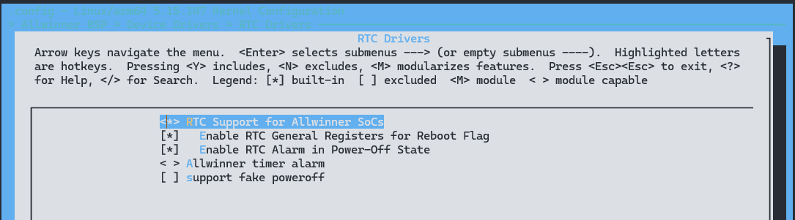

# RTC - 实时时钟

在 Linux 内核中，RTC（Real Time Clock）驱动负责管理和操作系统中的实时时钟硬件设备，以便系统可以获取当前的实时时间。RTC 驱动通常涉及到与硬件设备进行交互，包括读取当前时间、设置时间、处理中断等功能。

下面是 RTC 驱动在 Linux 内核中的一些重要方面和功能：

1. **硬件抽象层（Hardware Abstraction Layer）**：Linux 内核为不同类型的实时时钟硬件提供了通用的抽象接口，使得不同类型的 RTC 设备可以通过统一的接口进行访问和操作。

2. **设备驱动接口**：RTC 驱动程序通常将其表示为字符设备，并通过 `/dev/rtc` 设备节点向用户空间提供实时时钟的访问接口。用户空间的程序可以通过读写该设备节点来获取或设置系统时间。

3. **中断处理**：RTC 驱动通常会注册一个中断处理程序，以处理实时时钟硬件产生的中断。这样，在每秒钟更新时间的时候，RTC 可以生成一个中断信号，通知内核来更新系统时间。

4. **电源管理**：RTC 驱动可能还涉及到系统的电源管理，特别是在系统进入低功耗模式时，RTC 可能需要保持运行以继续跟踪时间。

5. **Sysfs 接口**：除了字符设备接口外，Linux 内核还提供了 Sysfs 接口，通过 `/sys/class/rtc` 目录下的文件可以查看和修改 RTC 驱动的一些配置参数和信息。

6. **RTC 子系统**：Linux 内核中还有一个 RTC 子系统，用于管理系统中所有 RTC 设备的注册和操作。RTC 驱动程序通过注册到 RTC 子系统来与其他部分进行交互。

## 模块配置

### 驱动配置

```c
RTC Drivers ->
     <*> RTC Support for Allwinner SoCs  
     [*]   Enable RTC General Registers for Reboot Flag
     [*]   Enable RTC Alarm in Power-Off State
     < > Allwinner timer alarm
     [ ] support fake poweroff
```



### 设备树配置

在 `Device Tree` 中对每一个`RTC`控制器进行配置,一个`RTC`控制器对应一个`RTC`节点,节点属性的含义见注释。

```c
rtc: rtc@7090000 {
	compatible = "allwinner,rtc-v201";
	device_type = "rtc";
	wakeup-source; // 表示RTC是具备休眠唤醒能力的中断唤醒源
	reg = <0x0 0x07090000 0x0 0x320>;// RTC寄存器基地址和映射范围
	interrupts = <GIC_SPI 157 IRQ_TYPE_LEVEL_HIGH>; // RTC硬件中断号
	clocks = <&r_ccu CLK_BUS_R_RTC>, <&rtc_ccu CLK_RTC_1K>, <&rtc_ccu CLK_RTC_SPI>;  // RTC所用到的时钟
	clock-names = "r-ahb-rtc", "rtc-1k", "rtc-spi"; // 上述时钟的名字
	resets = <&r_ccu RST_R_RTC>;
	gpr_cur_pos = <6>; // 当前被用作reboot-flag的通用寄存器的序号
	gpr_bootcount_pos = <7>; // 用于存储启动原因，如冷启动，热启动
};
```

## 模块驱动

RTC 驱动的源代码位于BSP独立仓库的 `drivers/rtc` 目录下，具体的路径如下所示：

```c
.
├── Kconfig
├── Makefile
├── rtc-jxr160.c
├── rtc-sd2059.c
├── rtc-sunxi.c
├── rtc-sunxi.h
└── sunxi_timer_alarm.c
```

### 用户层接口

RTC驱动加载成功后会注册生成串口设备`/dev/rtcN`，应用层的使用只需遵循Linux系统中的标准RTC编程方法即可。

## 确认RTC驱动正确加载

小机端执行命令:

```shell
ls /dev/rtc*
```

能够查询到RTC设备，表明内核RTC驱动正确加载。

RTC驱动支持 `ioctl` 指令功能描述:

| 指令         | 功能描述        |
| ------------ | --------------- |
| RTC_ALM_READ | 读取闹钟时间    |
| RTC_ALM_SET  | 设置闹钟时间    |
| RTC_SET_TIME | 设置时间与日期  |
| RTC_PIE_ON   | 开RTC 全局中断  |
| RTC_PIE_OFF  | 关RTC 全局中断  |
| RTC_AIE_ON   | 使能RTC闹钟中断 |
| RTC_AIE_OFF  | 禁止RTC闹钟中断 |
| RTC_UIE_ON   | 使能RTC更新中断 |
| RTC_UIE_OFF  | 禁止RTC更新中断 |
| RTC_IRQP_SET | 设置中断的频率  |

## 打开/关闭`RTC`设备

使用标准的文件打开函数：

```c
int open(const char *pathname, int flags);
int close(int fd);
```

需要引用头文件：

```c
#include <sys/types.h>
#include <sys/stat.h>
#include <fcntl.h>
#include <unistd.h>
```

## 设置和获取`RTC`时间

同样使用标准的`ioctl`函数：

```c
int ioctl(int d, int request, ...);
```

需要引用头文件：

```c
#include <sys/ioctl.h>
#include <linux/rtc.h>
```

设置RTC时间：

```c
ioctl(fd, RTC_SET_TIME, &rtc_tm)
```

获取RTC时间：

```c
ioctl(fd, RTC_RD_TIME, &rtc_tm)
```

此`demo`程序是打开一个`RTC`设备，然后设置和获取`RTC`时间以及设置闹钟功能。

```c
#include <stdio.h>      /*标准输入输出定义*/
#include <stdlib.h>     /*标准函数库定义*/
#include <unistd.h>     /*Unix 标准函数定义*/
#include <sys/types.h>
#include <sys/stat.h>
#include <fcntl.h>      /*文件控制定义*/
#include <linux/rtc.h>  /*RTC支持的CMD*/
#include <errno.h>      /*错误号定义*/
#include <string.h>

#define RTC_DEVICE_NAME   "/dev/rtc0"

int set_rtc_timer(int fd)
{
  struct rtc_time rtc_tm = {0};
  struct rtc_time rtc_tm_temp = {0};

  rtc_tm.tm_year = 2020 - 1900;   /* 需要设置的年份，需要减1900 */
  rtc_tm.tm_mon = 11 - 1;         /* 需要设置的月份,需要确保在0-11范围 */
  rtc_tm.tm_mday = 21;      /* 需要设置的日期 */
  rtc_tm.tm_hour = 10;      /* 需要设置的时间 */
  rtc_tm.tm_min = 12;       /* 需要设置的分钟时间 */
  rtc_tm.tm_sec = 30;       /* 需要设置的秒数 */

  /* 设置RTC时间 */
  if (ioctl(fd, RTC_SET_TIME, &rtc_tm) < 0) {
    printf("RTC_SET_TIME failed\n");
    return -1;
  }

  /* 获取RTC时间 */
  if (ioctl(fd, RTC_RD_TIME, &rtc_tm_temp) < 0) {
    printf("RTC_RD_TIME failed\n");
    return -1;
  }
  printf("RTC_RD_TIME return %04d-%02d-%02d %02d:%02d:%02d\n",
          rtc_tm_temp.tm_year + 1900, rtc_tm_temp.tm_mon + 1, rtc_tm_temp.tm_mday,
          rtc_tm_temp.tm_hour, rtc_tm_temp.tm_min, rtc_tm_temp.tm_sec);
  return 0;
}

int set_rtc_alarm(int fd)
{
  struct rtc_time rtc_tm = {0};
  struct rtc_time rtc_tm_temp = {0};

  rtc_tm.tm_year = 0;   /* 闹钟忽略年设置 */
  rtc_tm.tm_mon = 0;    /* 闹钟忽略月设置 */
  rtc_tm.tm_mday = 0;   /* 闹钟忽略日期设置 */
  rtc_tm.tm_hour = 10;  /* 需要设置的时间 */
  rtc_tm.tm_min = 12;   /* 需要设置的分钟时间 */
  rtc_tm.tm_sec = 30;   /* 需要设置的秒数 */

  /* set alarm time */
  if (ioctl(fd, RTC_ALM_SET, &rtc_tm) < 0) {
    printf("RTC_ALM_SET failed\n");
    return -1;
  }

  if (ioctl(fd, RTC_AIE_ON) < 0) {
    printf("RTC_AIE_ON failed!\n");
    return -1;
  }

  if (ioctl(fd, RTC_ALM_READ, &rtc_tm_temp) < 0) {
    printf("RTC_ALM_READ failed\n");
    return -1;
  }

  printf("RTC_ALM_READ return %04d-%02d-%02d %02d:%02d:%02d\n",
              rtc_tm_temp.tm_year + 1900, rtc_tm_temp.tm_mon + 1, rtc_tm_temp.tm_mday,
              rtc_tm_temp.tm_hour, rtc_tm_temp.tm_min, rtc_tm_temp.tm_sec);
  return 0;
}

int main(int argc, char *argv[])
{
    int fd;
    int ret;

    /* open rtc device */
    fd = open(RTC_DEVICE_NAME, O_RDWR);
    if (fd < 0) {
      printf("open rtc device %s failed\n", RTC_DEVICE_NAME);
      return -ENODEV;
    }

  /* 设置RTC时间 */
  ret = set_rtc_timer(fd);
  if (ret < 0) {
    printf("set rtc timer error\n");
    return -EINVAL;
  }

  /* 设置闹钟 */
  ret = set_rtc_alarm(fd);
  if (ret < 0) {
    printf("set rtc alarm error\n");
    return -EINVAL;
  }

  close(fd);
  return 0;
}
```

## 模块 DEMO 

### 读取设置系统时间

以下是一个简单的 Linux RTC 的 DEMO，它演示了如何在 Linux 中使用 RTC 设备来读取当前时间和设置系统时间：

```c
#include <stdio.h>
#include <stdlib.h>
#include <fcntl.h>
#include <unistd.h>
#include <sys/ioctl.h>
#include <linux/rtc.h>

int main() {
    int fd, ret;
    struct rtc_time rtc_tm;

    // 打开 RTC 设备
    fd = open("/dev/rtc0", O_RDONLY);
    if (fd == -1) {
        perror("Failed to open RTC device");
        return EXIT_FAILURE;
    }

    // 读取当前时间
    ret = ioctl(fd, RTC_RD_TIME, &rtc_tm);
    if (ret == -1) {
        perror("Failed to read RTC time");
        close(fd);
        return EXIT_FAILURE;
    }

    // 打印当前时间
    printf("Current RTC time: %02d-%02d-%02d %02d:%02d:%02d\n",
           rtc_tm.tm_year + 1900, rtc_tm.tm_mon + 1, rtc_tm.tm_mday,
           rtc_tm.tm_hour, rtc_tm.tm_min, rtc_tm.tm_sec);

    // 关闭 RTC 设备
    close(fd);

    return EXIT_SUCCESS;
}
```

编译这个程序：

```bash
gcc rtc_demo.c -o rtc_demo
```

然后运行生成的可执行文件：

```bash
./rtc_demo
```

该程序将打开 RTC 设备 `/dev/rtc0`，读取当前时间并将其打印出来。

### 设置闹钟

以下是一个简单的 Linux RTC 的 DEMO，演示如何设置 RTC 设备的闹钟功能：

```c
#include <stdio.h>
#include <stdlib.h>
#include <fcntl.h>
#include <unistd.h>
#include <sys/ioctl.h>
#include <linux/rtc.h>

int main() {
    int fd, ret;
    struct rtc_wkalrm alarm;

    // 打开 RTC 设备
    fd = open("/dev/rtc0", O_RDWR);
    if (fd == -1) {
        perror("Failed to open RTC device");
        return EXIT_FAILURE;
    }

    // 设置闹钟时间为10秒后
    alarm.time.tm_sec = 10;
    alarm.time.tm_min = 0;
    alarm.time.tm_hour = 0;
    alarm.time.tm_mday = 0;
    alarm.time.tm_mon = 0;
    alarm.time.tm_year = 0;
    ret = ioctl(fd, RTC_WKALM_SET, &alarm);
    if (ret == -1) {
        perror("Failed to set RTC alarm");
        close(fd);
        return EXIT_FAILURE;
    }

    printf("Alarm set for 10 seconds from now.\n");

    // 关闭 RTC 设备
    close(fd);

    return EXIT_SUCCESS;
}
```

编译这个程序：

```bash
gcc rtc_alarm.c -o rtc_alarm
```

然后运行生成的可执行文件：

```bash
./rtc_alarm
```

该程序将打开 RTC 设备 `/dev/rtc0`，设置一个闹钟，使其在当前时间的10秒后触发。

## FAQ

### 时间不准

1. 如果使用的时钟源为RC16M，则确认一下有没有启用校准功能，因为RC16M有正负50%的偏差。
2. 如果使用外部晶体，则确认一下外部晶体的震荡频率是否正确。

### 时间不走

1. 请查看RTC时钟源图，确认一下使用的时钟源。

2. 当RTC时钟源为外部32K时，请确认一下外部32k晶体的起振情况。

3. 当排查完时钟源，确认时钟源没有问题后，通过以下命令`dump rtc`相关寄存器，查看偏移0x0寄存器的状态位`bit7和bit8`是否异常置1了，如下所示：

```
/ # echo 0x07000000,0x07000200 > /sys/class/sunxi_dump/dump; cat /sys/class/sunxi_dump/dump
0x0000000007000000: 0x00004010 0x00000004 0x0000000f 0x7a000000
......
```

每款SoC的模块首地址是不一样的，具体根据`spec`或`data sheet`确认模块首地址。

