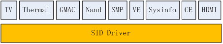
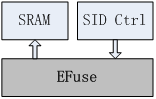
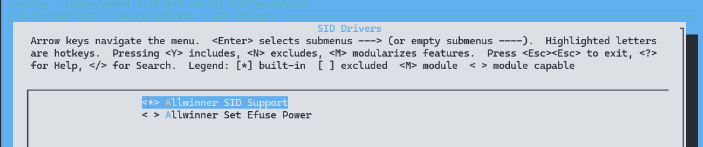

# Security ID - 芯片ID

SID提供的功能可以分为四大部分：ChipID、SoC Version、efuse功能、一些状态位。

SID是一个比较独立的模块，在Linux内核中没有依赖其他子系统，在 sunxi 平台默认是 ko 方式
SID为其他模块提供API的调用方式。关系如下图：



- TV、Thermal、GMAC的校准参数保存在SID中；

- Nand、SMP、VE需要读取 `SoC Version`；
- CE和HDMI会用到SID中的一些Key；
- `Sysinfo` 比较特殊，为了方便用户空间获取、调试SID信息，专门设计的一个字符型设备驱动。

### Chip ID功能

对于全志的SoC来说，ChipID用于该SoC的唯一标识

ChipID由4个word（16个byte）组成，共128bit，通常放在efuse的起始4个word

### SoC Version功能

严格讲SoC Version包含两部分信息：

1. Bonding ID，表示不同封装。

2. Version，表示改版编号。

BSP会返回这两个信息的组合值，由应用去判断和做出相应的处理。

### efuse功能

对软件来说，efuse中提供了一个可编程的永久存储空间，特点是每一位只能写一次（从0到1）。efuse接口方式：efuse容量大于512bit采用SRAM方式。带有SRAM的硬件结构示意图如下：




### 一些状态位

Secure Enable标志位。

1. 标明当前系统的 `Security` 属性是否打开，即是否运行了 `SecureBoot` 和 `SecureOS`。
2. 芯片 `SecureEnable` 状态位保存在SID模块的 `0xa0` 寄存器。

## 模块配置

### 驱动配置

驱动位于

```
SID Drivers ->
	<*> Allwinner SID Support
	< > Allwinner Set Efuse Power
```



### 设备树配置

```c
sid@3006000 {
	compatible = "allwinner,sun55iw3p1-sid", "allwinner,sunxi-sid";
	reg = <0x0 0x03006000 0 0x1000>;
	#address-cells = <1>;
	#size-cells = <1>;
	non-secure-maxoffset = <0x80>;
	non-secure-maxlen = <0x20>;

	secure_status {
		reg = <0x0 0>;
		offset = <0xa0>;
		size = <0x4>;
	};
            
	chipid {
		reg = <0x0 0>;
		offset = <0x200>;
		size = <0x10>;
	};
            
	rotpk {
		reg = <0x0 0>;
		offset = <0x140>;
		size = <0x20>;
	};
};

sram_ctrl: sram_ctrl@3000000 {
	compatible = "allwinner,sram_ctrl";
	reg = <0x0 0x03000000 0 0x184>;
	soc_ver {
		offset = <0x24>;
		mask = <0x7>;
		shift = <0>;
		ver_a = <0x00000000>;
		ver_b = <0x00000001>;
		ver_c = <0x00000002>;
	};

	soc_id {
		offset = <0x200>;
		mask = <0x1>;
		shift = <22>;
	};

	soc_bin {
		offset = <0x0>;
		mask = <0x3ff>;
		shift = <0x0>;
	};
};
```

## 驱动接口

在获取 Key 的时候，调用者需要知道 Key 的名称，以此作为索引的依据。Key名称详见 `sunxi-sid.h`

```c
#define efuse_CHIPID_NAME            "chipid"
#define efuse_BROM_CONF_NAME         "brom_conf"
#define efuse_BROM_TRY_NAME          "brom_try"
#define efuse_THM_SENSOR_NAME        "thermal_sensor"
#define efuse_FT_ZONE_NAME           "ft_zone"
#define efuse_TV_OUT_NAME            "tvout"
#define efuse_OEM_NAME               "oem"

#define efuse_WR_PROTECT_NAME        "write_protect"
#define efuse_RD_PROTECT_NAME        "read_protect"
#define efuse_IN_NAME                "in"
#define efuse_ID_NAME                "id"
#define efuse_ROTPK_NAME             "rotpk"
#define efuse_SSK_NAME               "ssk"
#define efuse_RSSK_NAME              "rssk"
#define efuse_HDCP_HASH_NAME         "hdcp_hash"
#define efuse_HDCP_PKF_NAME          "hdcp_pkf"
#define efuse_HDCP_DUK_NAME          "hdcp_duk"
#define efuse_EK_HASH_NAME           "ek_hash"
#define efuse_SN_NAME                "sn"
#define efuse_NV1_NAME               "nv1"
#define efuse_NV2_NAME               "nv2"
#define efuse_BACKUP_KEY_NAME        "backup_key"
#define efuse_RSAKEY_HASH_NAME       "rsakey_hash"
#define efuse_RENEW_NAME             "renewability"
#define efuse_OPT_ID_NAME            "operator_id"
#define efuse_LIFE_CYCLE_NAME        "life_cycle"
#define efuse_JTAG_SECU_NAME         "jtag_security"
#define efuse_JTAG_ATTR_NAME         "jtag_attr"
#define efuse_CHIP_CONF_NAME         "chip_config"
#define efuse_RESERVED_NAME          "reserved"
#define efuse_RESERVED2_NAME         "reserved2"
/* For KeyLadder */
#define efuse_KL_SCK0_NAME           "keyladder_sck0"
#define efuse_KL_KEY0_NAME           "keyladder_master_key0"
#define efuse_KL_SCK1_NAME           "keyladder_sck1"
#define efuse_KL_KEY1_NAME           "keyladder_master_key1"
```

## 使用 DEMO 

- 读取SoC信息节点 `/sys/class/sunxi_info/sys_info` 

```
# cat /sys/class/sunxi_info/sys_info
sunxi_platform    : sun50iw10p1
sunxi_secure      : secure
sunxi_chipid      : 00000000000000000000000000000000
sunxi_chiptype    : 00000400
sunxi_batchno     : 0x1
```

- 获取 Key 的信息 `/sys/class/sunxi_info/key_info`

先写入 Key 的名称,再读取.

```c
# echo chipid > /sys/class/sunxi_info/key_info ; cat /sys/class/sunxi_info/key_info
0xf1c1b200: 0x00000400
0xf1c1b204: 0x00000000
0xf1c1b208: 0x00000000
0xf1c1b20c: 0x00000000
```

以下是一个简单的C语言程序示例，用于读取SoC信息节点和获取Key信息：

```c
#include <stdio.h>
#include <stdlib.h>
#include <string.h>

#define MAX_BUF 256

void read_soc_info() {
    FILE *file = fopen("/sys/class/sunxi_info/sys_info", "r");
    if (file) {
        char buffer[MAX_BUF];
        while (fgets(buffer, sizeof(buffer), file)) {
            printf("%s", buffer);
        }
        fclose(file);
    } else {
        printf("无法打开/sys/class/sunxi_info/sys_info\n");
    }
}

void get_key_info(const char *key_name) {
    char key_path[MAX_BUF];
    char command[MAX_BUF];

    snprintf(key_path, sizeof(key_path), "/sys/class/sunxi_info/key_info");
    FILE *file = fopen(key_path, "w");
    if (file) {
        fprintf(file, "%s", key_name);
        fclose(file);

        snprintf(command, sizeof(command), "cat %s", key_path);
        system(command);
    } else {
        printf("无法打开%s\n", key_path);
    }
}

int main() {
    printf("SoC信息：\n");
    read_soc_info();

    printf("\nKey信息：\n");
    get_key_info("chipid");

    return 0;
}
```

这个程序包含了两个函数：`read_soc_info` 用于读取SoC信息节点，并将内容打印到控制台；`get_key_info` 用于获取Key信息，首先写入Key名称，然后读取并显示Key的信息。

## FAQ

当启用安全系统后，Non-Secure 空间将无法访问大部分的 efuse 信息，这个时候需要通过SMC指令来读取这些Key信息。此时不能再使用普通的寄存器读接口，而是调用的SMC接口：`int sunxi_smc_readl(phys_addr_t addr)`。目前，`sunxi_smc_readl()`的实现在`bsp/drivers/smc/sunxi-smc.c`。
