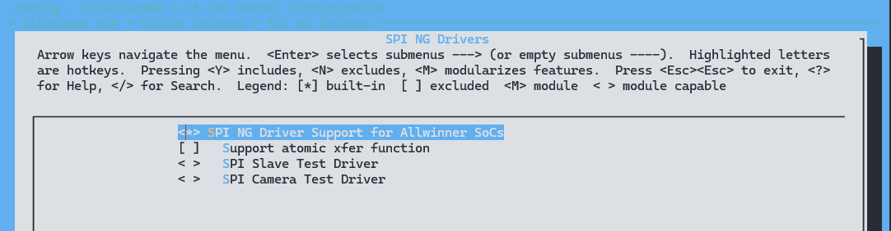
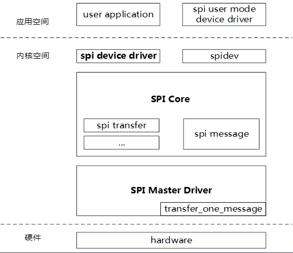
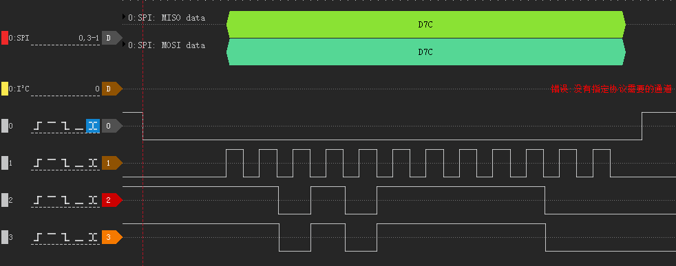

# SPI - 同步串行外设接口

SPI是一种高速、高效率的串行外围设备接口。由Motorola公司提出，是一种高速、全双工、同步通信总线。SPI以主从方式工作，通常是有一个主设备和一个或多个从设备，无应答机制。

- 全双工同步串行接口
- Master/Slave模式可配置
- 支持最大100MHz时钟频率
- 支持SPI Mode0/1/2/3
- 支持多片选
- 片选和时钟的极性和相位可配置
- 支持CPU(中断)或DMA模式传输
- 支持TX/RX FIFO缓存
- 支持Standard Single/Dual/Quad数据模式（Slave模式不支持Dual/Quad）
- 支持BIT模式，用于3Wire场景，支持可编程0~32bits帧长度（仅支持Master模式，且不支持DMA和FIFO功能）
- 支持DBI模式，用于显示设备场景，用于传输视频数据

## 模块配置

### 驱动配置

驱动位于

```
SPI NG Drivers ->
	<*> SPI NG Driver Support for Allwinner SoCs
	[ ]   Support atomic xfer function
	< >   SPI Slave Test Driver
	< >   SPI Camera Test Driver
```



### 设备树配置

```c
spi0: spi@4025000 {
	#address-cells = <1>;
	#size-cells = <0>;
	compatible = "allwinner,sunxi-spi-v1.3";		// 具体的设备，用于驱动和设备的绑定
	reg = <0x0 0x04025000 0x0 0x1000>;				// 模块寄存器地址
	interrupts = <GIC_SPI 16 IRQ_TYPE_LEVEL_HIGH>;	// 总线中断号、中断类型
	clocks = <&ccu CLK_PLL_PERI0_300M>, <&ccu CLK_SPI0>, <&ccu CLK_BUS_SPI0>;	// 设备使用的时钟
	clock-names = "pll", "mod", "bus";				// 设备使用的时钟名称
	resets = <&ccu RST_BUS_SPI0>;					// 设备的reset时钟
	dmas = <&dma 22>, <&dma 22>;					// 控制器使用的dma通道号
	dma-names = "tx", "rx";							// 控制器使用通道号对应的名字
	clock-frequency = <100000000>;					// 控制器支持的最大时钟频率（通常为100MHz）
	sunxi,spi-num-cs = <1>;							// 控制器支持的最大片选数量（一般CS0默认引出，CS1~3根据IC平台决定）
	status = "disabled";							// 控制器是否使能
};
```

为了在SPI总线驱动代码中区分每一个SPI控制器，需要在设备树中为每个SPI控制器指定别名：

```c
aliases {
	spi0 = &spi0;
};
```

别名形式为字符串 "spi" 加连续编号的数字，在 SPI 总线驱动程序中可以通过 `of_alias_get_id` 函数获取对应SPI控制器的数字编号，从而区别每一个SPI控制器。

在设备端，配置了 SPI 的引脚，配置位于 `pio` 节点下


```c
&pio {
	spi0_pins_default: spi0@0 {
        pins = "PC12", "PC2", "PC4"; /* clk, mosi, miso */
        function = "spi0";
        drive-strength = <10>;
    };

    spi0_pins_cs: spi0@1 {
        pins = "PC3";
        function = "spi0";
        drive-strength = <10>;
        bias-pull-up;   /* cs, hold, wp should be pulled up */
    };

    spi0_pins_sleep: spi0@2 {
        pins = "PC12", "PC2", "PC4", "PC3";
        function = "gpio_in";
        drive-strength = <10>;
    };
};
```

配置设备节点

```c
&spi0 {
	pinctrl-0 = <&spi0_pins_default &spi0_pins_cs>;
	pinctrl-1 = <&spi0_pins_sleep>;
	pinctrl-names = "default", "sleep";
	sunxi,spi-bus-mode = <SUNXI_SPI_BUS_NOR>;
	sunxi,spi-cs-mode = <SUNXI_SPI_CS_SOFT>;
	status = "okay";

	spi_board0 {
		device_type = "spi_board0";
		compatible = "spi-nor";
		spi-max-frequency = <100000000>;
		m25p,fast-read = <1>;
		/*individual_lock;*/
		reg = <0x0>; //CS0
		spi-rx-bus-width = <4>;
		spi-tx-bus-width = <4>;
		status = "okay";
	};
};
```

- `sunxi,spi-num-cs`：定义该 SPI 控制器最多支持多少个片选。
- `sunxi,spi-bus-mode`：定义 SPI 控制器所处的状态，可配置为如下几种模式。
  - `SUNXI_SPI_BUS_MASTER`：处于 Master 模式，外接 SPI Device。
  - `SUNXI_SPI_BUS_SLAVE`：处于 Slave 模式，被其他 Master 访问。
  - `SUNXI_SPI_BUS_DBI`：处于 DBI 模式，外接 DBI 屏幕。
  - `SUNXI_SPI_BUS_BIT`：处于 BIT 模式，使用 3Wire 方式进行数据传输。
  - `SUNXI_SPI_BUS_NOR`：处于 NOR 模式，用于外接 SPI Nor Flash 的情况。
  - `SUNXI_SPI_BUS_NAND`：处于 NAND 模式，用于外接 SPI Nand Flash 的情况。
- `sunxi,spi-cs-mode`：定义 SPI 控制器对片选的控制方式，可配置为如下几种模式。
  - `SUNXI_SPI_CS_AUTO`：硬件自动控制，不需要驱动或软件介入。
  - `SUNXI_SPI_CS_SOFT`：软件手动控制，由驱动完成相关操作。
- 当 `sunxi,spi-bus-mode` 配置为`SUNXI_SPI_BUS_NOR`/`SUNXI_SPI_BUS_NAND`时，`sunxi,spi-cs-mode`会强制使用`SUNXI_SPI_CS_SOFT`模式。
- `spi-max-frequency` 是该SPI外设的最大输出时钟频率，配置时不可超过dtsi中配置的SPI控制器最大时钟频率

## 模块驱动

SPI 总线驱动位于 `drivers/spi-ng` 下

```
├── bit
│   ├── spi-sunxi-bit.h		# bit模式头文件，包括BIT模式所使用的寄存器信息
│   └── spi-sunxi-bit.c		# bit模式源文件，包括BIT模式功能配置的寄存器读写配置等实现
├── dbi
│   ├── spi-sunxi-dbi-api.h	# dbi模式API头文件，提供对应API给上层驱动调用
│   ├── spi-sunxi-dbi.h		# dbi模式头文件，包括DBI模式所使用的寄存器信息
│   └── spi-sunxi-dbi.c		# dbi模式源文件，包括DBI模式功能配置的寄存器读写配置等实现
├── spi-sunxi-debug.h		# debug相关定义，包括打印寄存器和数据的接口
├── spi-sunxi.h				# 头文件，包括Linux框架种的spi_controller定义和BYTE模式的各个寄存器信息
├── spi-sunxi.c				# 驱动源文件，包括Linux框架要求实现的控制器接口和Master/Slave两种模式的具体实现
└── spi-sunxi-slave-test.c	# AW SPI从模式设备驱动示例，模拟一个可读写的内存设备，类似于EEPROM
```

### SPI 内核框架

Linux中SPI体系结构分为三个层次



#### 用户空间

包括所有使用SPI设备的应用程序，在这一层用户可以根据自己的实际需求，将spi设备进行一些特殊的处理，此时控制器驱动程序并不清楚和关注设备的具体功能，SPI设备的具体功能是由用户层程序完成的。例如，和MTD层交互以便把SPI接口的存储设备实现为某个文件系统，和TTY子系统交互把SPI设备实现为一个TTY设备，和网络子系统交互以便把一个SPI设备实现为一个网络设备，等等。当然，如果是一个专有的SPI设备，我们也可以按设备的协议要求，实现自己的专有协议驱动。同时这部分我们不用关注。

#### 内核空间

内核空间我们同样的会分为一下三部分：

##### SPI驱动核心层（SPI Core）

SPI Core是Linux内核用来维护和管理spi的核心部分，SPI Core提供操作接口函数，允许一个spi master，spi driver和spi device初始化时在SPI Core中进行注册，以及退出时进行注销。

##### SPI设备驱动层（SPI Device Driver）

SPI Driver是对应于spi设备端的驱动程序，通过接口函数向SPI Core进行注册，SPI Driver的作用是将spi设备挂接到spi总线上。

##### SPI控制器驱动层（SPI Master Driver）

SPI Master针对不同类型的spi控制器硬件，实现spi总线的硬件访问操作。SPI Master通过接口函数向SPI Core注册一个控制器。

#### 硬件

这一层是实际的物理器件，其中包括我们的spi控制器以及与控制器相连的各个spi子设备，通过spi总线能够与cpu进行数据的交互。

### 驱动框架

根据SPI控制器集成了BYTE/BIT/DBI三个IP的特性，将驱动分3个IP域和5个功能逻辑块：

`master/slave/flash/dbi/bit`。其中BIT/DBI为一一对应关系，BYTE则对应Master/Flash/Slave三个不同功能逻辑块。


#### Master

该模式属于BYTE模式的一种，数据的最小单位为BYTE，即一次发送会产生8个CLK将一个Byte数据全部发送出去。支持Single/Dual/Quad三种模式，常见的使用常见为通用SPI外设。

#### Flash

该模式属于BYTE模式的一种，但驱动专门针对Nor/Nand Flash传输过程做了优化，当外设连接的是Flash的情况下，可以提高读写性能。支持1-1-1，1-1-2，1-1-4三种SPI-Flash模式。只能使用于SPI-Flash外设。

#### Slave

该模式属于BYTE模式的一种，但此时控制器处于从机模式下，等待其他Master的访问，在该模式下仅支持使用Single Mode进行数据传输。
针对数据同步的问题，增加ready脚的sync机制，该机制为纯软件逻辑，需要对方的Master端的适配支持，才能正常使用。若不用ready同步机制，则需要上层应用在传输时进行相应的delay等待。

#### DBI

该模式专门针对SPI显示外设设计，使用DBI协议。支持3线或四线传输，且同时兼容多种视频数据格式。

#### BIT

该模式专门针对特殊外设设计，数据的最小单位为BIT，即可以将数据分成单个Bit在MOSI/MISO上进行发送或接受，一个CLK对应一个bit，长度为0~32可编程。常见的使用场景为3Wire模式。

### 模块接口说明

#### 设备注册接口

在 Linux 内核中，`spi_register_driver` 和 `spi_unregister_driver` 是用于注册和注销 SPI 设备驱动程序的函数。以下是它们的简要用法：

##### spi_register_driver

```c
int spi_register_driver(struct spi_driver *sdrv);
```

- **功能**：注册一个 SPI 设备驱动程序。
- **参数**：
  - `sdrv`：指向要注册的 `struct spi_driver` 结构体的指针，包含了驱动程序的各种回调函数和信息。
- **返回值**：成功注册返回 0，失败返回负数。

##### spi_unregister_driver

```c
void spi_unregister_driver(struct spi_driver *sdrv);
```

- **功能**：注销之前注册的 SPI 设备驱动程序。
- **参数**：
  - `sdrv`：指向已注册的 `struct spi_driver` 结构体的指针。
- **返回值**：无。

##### 使用示例

```c
static int my_spi_probe(struct spi_device *spi) {
    // 在此处处理 SPI 设备的初始化等操作
    return 0;
}

static int my_spi_remove(struct spi_device *spi) {
    // 在此处处理 SPI 设备的移除等操作
    return 0;
}

static struct spi_driver my_spi_driver = {
    .driver = {
        .name = "my_spi_device",
        .owner = THIS_MODULE,
    },
    .probe = my_spi_probe,
    .remove = my_spi_remove,
};

static int __init my_spi_init(void) {
    return spi_register_driver(&my_spi_driver);
}

static void __exit my_spi_exit(void) {
    spi_unregister_driver(&my_spi_driver);
}

module_init(my_spi_init);
module_exit(my_spi_exit);

MODULE_LICENSE("GPL");
```

在上面的示例中，首先定义了一个 `struct spi_driver` 结构体 `my_spi_driver`，包含了驱动程序的名称、probe 函数和 remove 函数。然后在模块初始化函数中调用 `spi_register_driver` 注册该驱动程序，在模块退出函数中调用 `spi_unregister_driver` 注销该驱动程序。

#### 数据传输接口

SPI 设备驱动使用 `struct spi_message` 向SPI总线请求读写I/O。一个 `spi_message` 中包含了一个操作序列，每一个操作称作 `spi_transfer`，这样方便SPI总线驱动中串行的执行一个个原子的序列。内核线程使用队列实现了异步传输的功能，对于同一个数据传输的发起者，既然异步方式无需等待数据传输完成即可返回，返回后，该发起者可以立刻又发起一个message，而这时上一个message还没有处理完。 对于另外一个不同的发起者来说，也有可能同时发起一次message传输请求。

```c
struct spi_transfer {
	const void	*tx_buf;
	void		*rx_buf;
	unsigned	len;

	dma_addr_t	tx_dma;
	dma_addr_t	rx_dma;

	unsigned	cs_change:1;
	u8		bits_per_word;
	u16		delay_usecs;
	u32		speed_hz;

	struct list_head transfer_list;
};

struct spi_message {
	struct list_head	transfers;
	struct spi_device	*spi;
	unsigned		is_dma_mapped:1;
	void			(*complete)(void *context);
	void			*context;
	unsigned		actual_length;
	int			status;
	struct list_head	queue;
	void			*state;
};
```

##### spi_message_init

```c
void spi_message_init(struct spi_message *msg);
```

- **功能**：初始化spi_message结构体
- **参数**：
  - `msg`：指向要初始化的spi_message结构体的指针
- **返回值**：无

##### spi_message_add_tail

```c
void spi_message_add_tail(struct spi_transfer *t, struct spi_message *m);
```

- **功能**：将一个spi_transfer结构体添加到spi_message的末尾
- **参数**：
  - `t`：指向要添加的spi_transfer结构体的指针
  - `m`：指向目标spi_message结构体的指针
- **返回值**：无

##### spi_sync

```c
int spi_sync(struct spi_device *spi, struct spi_message *message);
```

- **功能**：同步发送并接收SPI消息
- **参数**：
  - `spi`：指向对应SPI设备的spi_device结构体的指针
  - `message`：指向要发送的spi_message结构体的指针
- **返回值**：成功返回0，失败返回负数错误码

##### spi_async

```c
int spi_async(struct spi_device *spi, struct spi_message *message);
```

- **功能**：异步发送并接收SPI消息
- **参数**：
  - `spi`：指向对应SPI设备的spi_device结构体的指针
  - `message`：指向要发送的spi_message结构体的指针
- **返回值**：成功返回0，失败返回负数错误码

##### spi_slave_abort

```c
int spi_slave_abort(struct spi_device \*spi)
```

- **功能**：中止当前正在进行的SPI传输
- **参数**：
  - `spi`：指向对应SPI设备的spi_device结构体的指针
- **返回值**：成功返回0，失败返回负数错误码

##### 使用示例

```c
#include <linux/spi/spi.h>

void spi_example_usage(struct spi_device *spi) {
    struct spi_message message;
    struct spi_transfer xfer;
    u8 tx_buf[4] = {0xAA, 0xBB, 0xCC, 0xDD};
    u8 rx_buf[4];

    // 初始化spi_message
    spi_message_init(&message);

    // 配置spi_transfer
    memset(&xfer, 0, sizeof(struct spi_transfer));
    xfer.tx_buf = tx_buf;
    xfer.rx_buf = rx_buf;
    xfer.len = sizeof(tx_buf);

    // 添加spi_transfer到spi_message
    spi_message_add_tail(&message, &xfer);

    // 同步执行spi_message
    int ret_sync = spi_sync(spi, &message);
    if (ret_sync == 0) {
        // SPI消息成功发送并接收完成
        // 处理接收到的数据
    } else {
        // 发送或接收失败
        // 处理错误情况
    }

    // 异步执行spi_message
    int ret_async = spi_async(spi, &message);
    if (ret_async == 0) {
        // 异步发送成功
        // 不等待传输完成，在异步传输完成时会调用回调函数处理数据
    } else {
        // 异步发送失败
        // 处理错误情况
    }

    // 取消当前SPI从设备的传输操作
    int ret_abort = spi_slave_abort(spi);
    if (ret_abort == 0) {
        // 取消成功
    } else {
        // 取消失败
        // 处理错误情况
    }
}
```

## 使用范例

### Master 模式

在 Master 模式下，一般使用 spidev 作为驱动

在 menuconfig 中打开 SPIDEV

```
CONFIG_SPI_SPIDEV
```

设备树中增加 SPI DEV 设备

```c
&spi1 {
	sunxi,spi-bus-mode = <SUNXI_SPI_BUS_MASTER>;
	sunxi,spi-cs-mode = <SUNXI_SPI_CS_AUTO>;
	status = "okay";

	spidev0 {
		compatible = "rohm,dh2228fv";
		reg = <0x0>;
		spi-max-frequency = <100000000>;
		spi-rx-bus-width = <0x1>;
		spi-tx-bus-width = <0x1>;
		status = "okay";
	};
};
```

#### 测试

为了测试 SPI DEV，这里使用的是 `spidev_test`，硬件上使用回环自发自收进行测试，需将SPI的 `MOSI/MISO` 引脚短接

```
# spidev_test -h
Usage: spidev_test [-DsbdlHOLC3vpNR24SI]
  -D --device   device to use (default /dev/spidev1.1)
  -s --speed    max speed (Hz)
  -d --delay    delay (usec)
  -b --bpw      bits per word
  -i --input    input data from a file (e.g. "test.bin")
  -o --output   output data to a file (e.g. "results.bin")
  -l --loop     loopback
  -H --cpha     clock phase
  -O --cpol     clock polarity
  -L --lsb      least significant bit first
  -C --cs-high  chip select active high
  -3 --3wire    SI/SO signals shared
  -v --verbose  Verbose (show tx buffer)
  -p            Send data (e.g. "1234\xde\xad")
  -N --no-cs    no chip select
  -R --ready    slave pulls low to pause
  -2 --dual     dual transfer
  -4 --quad     quad transfer
  -S --size     transfer size
  -I --iter     iterations
```

- CPU模式收发测试

低于FIFO大小数据量的传输，将会使用CPU进行搬运

```
# spidev-test -D /dev/spidev3.0 -s 100000000 -S 32 -I 1 -v
spi mode: 0x0
bits per word: 8
max speed: 100000000 Hz (100000 kHz)
TX | 52 5D 4D 8A 1A A3 56 DA DF D1 1E 26 9A 41 01 84 0B 4C FC F0 12 F7 34 87 D2 F7 7E 11 DC 35 45 2F  |R]M...V....&.A...L....4...~..5E/|
RX | 52 5D 4D 8A 1A A3 56 DA DF D1 1E 26 9A 41 01 84 0B 4C FC F0 12 F7 34 87 D2 F7 7E 11 DC 35 45 2F  |R]M...V....&.A...L....4...~..5E/|
total size   : 32 B
total time   : 55.33 us
averange rate: 0.55 MB/s
averange time: 55.33 us
```

- DMA模式收发测试

超过FIFO大小数据量的传输，将会使用DMA进行搬运

```
# spidev-test -D /dev/spidev3.0 -s 10000000 -S 1024 -I 1
spi mode: 0x0
bits per word: 8
max speed: 10000000 Hz (10000 kHz)
total size   : 1.00 KB
total time   : 985.00 us
averange rate: 0.99 MB/s
averange time: 985.00 us
```

- 性能测试

```
# spidev-test -D /dev/spidev3.0 -s 100000000 -S 4096 -I 1024
spi mode: 0x0
bits per word: 8
max speed: 100000000 Hz (100000 kHz)
total size   : 4.00 MB
total time   : 391.14 ms
averange rate: 10.23 MB/s
averange time: 381.97 us
```

100MHz下的理论值为12.5MB/s，当前Master驱动能达到81.84%的性能

#### 示例代码

```c
#include <stdio.h>
#include <stdlib.h>
#include <string.h>
#include <fcntl.h>
#include <unistd.h>
#include <sys/ioctl.h>
#include <linux/spi/spidev.h>

#define SPI_DEVICE "/dev/spidev0.0"
#define MODE_SPI_MODE_0 (0 | 0)
#define BITS_PER_WORD 8
#define SPEED_HZ 1000000

int main()
{
    int fd;
    int ret;
    struct spi_ioc_transfer tr = {
        .tx_buf = (unsigned long)NULL,
        .rx_buf = (unsigned long)NULL,
        .len = 4,
        .speed_hz = SPEED_HZ,
        .delay_usecs = 0,
        .bits_per_word = BITS_PER_WORD,
    };
    unsigned char tx_buf[4] = {0xAA, 0xBB, 0xCC, 0xDD};
    unsigned char rx_buf[4];

    // 打开SPI设备文件
    fd = open(SPI_DEVICE, O_RDWR);
    if (fd < 0) {
        perror("Error opening SPI device");
        return -1;
    }

    // 设置SPI模式、位数和速度
    ret = ioctl(fd, SPI_IOC_WR_MODE, &MODE_SPI_MODE_0);
    if (ret == -1) {
        perror("Error setting SPI mode");
        close(fd);
        return -1;
    }

    // 设置传输参数
    tr.tx_buf = (unsigned long)tx_buf;
    tr.rx_buf = (unsigned long)rx_buf;

    // 发送和接收数据
    ret = ioctl(fd, SPI_IOC_MESSAGE(1), &tr);
    if (ret < 1) {
        perror("Error during SPI transfer");
        close(fd);
        return -1;
    }

    // 打印接收到的数据
    printf("Received data: 0x%02X 0x%02X 0x%02X 0x%02X\n", rx_buf[0], rx_buf[1], rx_buf[2], rx_buf[3]);

    // 关闭SPI设备文件
    close(fd);

    return 0;
}
```

### Slave 模式

硬件上将 `Master` 的 `CS/CLK/MISO/MOSI` 与 `Slave` 的 `CS/CLK/MISO/MOSI` 按顺序依次连接。注意Master的MOSI接Slave的MOSI，Master的MISO接Slave的MISO，如果接错会导致数据收发异常。

然后打开配置

```
CONFIG_AW_SPI_SLAVETEST
```

配置 Slave 设备树

```c
&spi2 {
	clock-frequency = <10000000>;
	pinctrl-names = "default", "sleep";
	sunxi,spi-bus-mode = <SUNXI_SPI_BUS_SLAVE>;
	sunxi,spi-cs-mode = <SUNXI_SPI_CS_AUTO>;
	status = "okay";

	slave {
		compatible = "sunxi,spislave";
		reg = <0x0>;
		spi-max-frequency = <10000000>;
		slave-cachesize = <4096>;
		status = "okay";
	};
};
```

同时配置测试使用的 Master 设备树

```c
&spi1 {
	sunxi,spi-bus-mode = <SUNXI_SPI_BUS_MASTER>;
	sunxi,spi-cs-mode = <SUNXI_SPI_CS_AUTO>;
	status = "okay";

	spidev0 {
		compatible = "rohm,dh2228fv";
		reg = <0x0>;
		spi-max-frequency = <100000000>;
		spi-rx-bus-width = <0x1>;
		spi-tx-bus-width = <0x1>;
		status = "okay";
	};
};
```

若要使用 `Ready` 同步功能，需要在 `Master/Slave` 两边添加用于同步的引脚，配置如下：

- Master

```
&spi1 {
	sunxi,spi-bus-mode = <SUNXI_SPI_BUS_MASTER>;
	ready-gpio = <&pio PC 15 GPIO_ACTIVE_LOW>;
	sunxi,spi-cs-mode = <SUNXI_SPI_CS_AUTO>;
	status = "okay";

	spidev0 {
		compatible = "rohm,dh2228fv";
		reg = <0x0>;
		spi-max-frequency = <100000000>;
		spi-rx-bus-width = <0x1>;
		spi-tx-bus-width = <0x1>;
		status = "okay";
	};
};
```

- Slave

```
&spi2 {
	clock-frequency = <10000000>;
	pinctrl-names = "default", "sleep";
	sunxi,spi-bus-mode = <SUNXI_SPI_BUS_SLAVE>;
	ready-gpio = <&pio PC 15 GPIO_ACTIVE_LOW>;
	sunxi,spi-cs-mode = <SUNXI_SPI_CS_AUTO>;
	status = "okay";

	slave {
		compatible = "sunxi,spislave";
		reg = <0x0>;
		spi-max-frequency = <10000000>;
		slave-cachesize = <4096>;
		status = "okay";
	};
};
```

#### 测试

- 加载Slave设备驱动

```
# insmod spi-sunxi-slave-test.ko
```

- Slave测试工具使用方法

```
# spislave-test -h
Usage: ./spislave-test [-DsbdlHOLC3vpNR24SI]
  -D --device   device to use (default /dev/spidev1.1)
  -s --speed    max speed (Hz)
  -H --cpha     clock phase
  -O --cpol     clock polarity
  -L --lsb      least significant bit first
  -C --cs-high  chip select active high
  -R --ready    slave pulls low to pause
  -v --verbose  Verbose (show tx buffer)
  -a --addr     operation address
  -S --size     transfer size
  -I --iter     iterations
  -d --delay    delay time between package
```

- CPU模式收发测试

若使用 ready 引脚同步方案则加上-R参数，否则使用-d参数指定需要master需要主动等待的时间，切记二者不可同时使用

```
# ./spislave-test -D /dev/spidev3.0 -a 0 -S 32 -I 1 -R -v # ready同步模式
# ./spislave-test -D /dev/spidev3.0 -a 0 -S 32 -I 1 -d 5000 -v # delay等待模式
spi mode: 0x80
max speed: 10000000 Hz (10000 kHz)
op addr : 0
op size : 32
package head : { 0x01 0x00 0x00 0x00 0x20 }
package head : { 0x03 0x00 0x00 0x00 0x20 }
TX | A0 07 B0 44 47 9E CD 15 AC 0E CC 85 E8 CF 46 D4 16 F9 4B F8 3F 5A F7 A0 91 22 02 10 B1 BD B6 51  |...DG.........F...K.?Z...".....Q|
RX | A0 07 B0 44 47 9E CD 15 AC 0E CC 85 E8 CF 46 D4 16 F9 4B F8 3F 5A F7 A0 91 22 02 10 B1 BD B6 51  |...DG.........F...K.?Z...".....Q|

# hexdump  /sys/class/spi_slave/spi1/spi1.0/sunxi-slave-test
0000000 07a0 44b0 9e47 15cd 0eac 85cc cfe8 d446
0000010 f916 f84b 5a3f a0f7 2291 1002 bdb1 51b6
0000020 ffff ffff ffff ffff ffff ffff ffff ffff
*
0001000
```

- 性能测试

```
# ./spislave-test -D /dev/spidev3.0 -R -s 10000000 -a 0 -S 2048 -I 1024
spi mode: 0x80
max speed: 10000000 Hz (10000 kHz)
op addr : 0
op size : 2048
total size   : 4.00 MB
total time   : 4.90 s
averange rate: 0.82 MB/s
averange time: 4788.93 us
```

#### Slave 驱动示例代码

```c
// SPDX-License-Identifier: GPL-2.0-or-later
/* Copyright(c) 2020 - 2023 Allwinner Technology Co.,Ltd. All rights reserved. */
/*
 * Copyright (C) 2022 Allwinner.
 *
 * SUNXI SPI Slave test Driver
 *
 * This program is free software; you can redistribute it and/or
 * modify it under the terms of the GNU General Public License as
 * published by the Free Software Foundation; either version 2 of
 * the License, or (at your option) any later version.
 *
 * 2022.09.30 JingyanLiang <jingyanliang@allwinnertech.com>
 * Create driver file
 *
 * assuming /dev/spidev1.0 corresponds to the SPI master on the remote
 * system and /sys/class/spi_slave/spi2/spi2.0/ corresponds to the SPI
 * Slave on the current system
 *
 * Usage for master command :
 *   # ./spislave-test -D /dev/spidev1.0 -R -s 10000000 -a 0 -S 2048
 *
 * Dump the slave data in memroy :
 *   # hexdump /sys/class/spi_slave/spi2/spi2.0/sunxi-slave-test
 *
 * Abort the slave transfer in user space manually :
 *  # echo > /sys/class/spi_slave/spi2/spi2.0/abort
 */

#include <sunxi-log.h>
#include <linux/version.h>
#include <linux/module.h>
#include <linux/of.h>
#include <linux/device.h>
#include <linux/sysfs.h>
#include <linux/spinlock.h>
#include <linux/completion.h>
#include <linux/spi/spi.h>

#include "spi-sunxi-debug.h"

#define SALVE_CACHE_MAX (16 * PAGE_SIZE)

#define PKT_HEAD_LEN 6
#define OP_MASK		0
#define BITS_MASK	1
#define ADDR_MASK_0	2
#define ADDR_MASK_1	3
#define LEN_MASK_0	4
#define LEN_MASK_1	5

#define SUNXI_OP_WR		0x01
#define SUNXI_OP_RD		0x02
#define SUNXI_OP_WR_RD	0x03
#define SUNXI_OP_HEAD	0xff /* Only used in kernel space */

enum sunxi_spi_slave_status {
	SUNXI_SPI_SLAVE_IDLE = 0,
	SUNXI_SPI_SLAVE_RUNNING,
	SUNXI_SPI_SLAVE_RETRY,
	SUNXI_SPI_SLAVE_STOP,
};

struct sunxi_spi_slave_head {
	u8 op_code;
	u8 bits;
	u16 addr;
	u16 len;
};

struct sunxi_spi_slave_frame {
	u8 data[PKT_HEAD_LEN];
	struct sunxi_spi_slave_head pkt_head;
	u8 *tx_buf;
	u8 *rx_buf;
};

struct sunxi_spi_slave_cache {
	spinlock_t buffer_lock; /* cache buffer access lock */
	u8 *buffer;
	u32 size;
};

struct sunxi_spi_slave_test {
	struct spi_device *spi;
	struct completion finished;
	struct spi_transfer xfer;
	struct spi_message msg;
	struct sunxi_spi_slave_frame frame;
	struct sunxi_spi_slave_cache cache;
	struct bin_attribute bin;
	enum sunxi_spi_slave_status status;
};

static int sunxi_spi_slave_test_submit(struct sunxi_spi_slave_test *slave);

static bool sunxi_spi_slave_has_ptk_head(struct sunxi_spi_slave_head *head)
{
	if (head->op_code || head->bits || head->addr || head->len)
		return true;

	return false;
}

static void sunxi_spi_slave_head_data_parse(unsigned char *data, struct sunxi_spi_slave_head *head)
{
	head->op_code = data[OP_MASK];
	head->bits = data[BITS_MASK];
	head->addr = (data[ADDR_MASK_0] << 8) | data[ADDR_MASK_1];
	head->len = (data[LEN_MASK_0] << 8) | data[LEN_MASK_1];
}

static void sunxi_spi_slave_head_data_clear(unsigned char *data, int len)
{
	memset(data, 0, len);
}

static int sunxi_spi_slave_set_cache_data(struct sunxi_spi_slave_test *slave,
									struct sunxi_spi_slave_head *head, u8 *buf)
{
	struct device *dev = &slave->spi->dev;
	struct sunxi_spi_slave_cache *cache = &slave->cache;
	int real_size = head->len;

	if (cache->size < head->addr) {
		sunxi_err(dev, "Set data addr over range\n");
		return 0;
	}

	if (cache->size < head->addr + head->len) {
		real_size = cache->size - head->addr;
		sunxi_err(dev, "Write size %d over range, some of data will be lost, real size to write is %d\n",
				head->len, real_size);
	}

	spin_lock(&cache->buffer_lock);
	memcpy(cache->buffer + head->addr, buf, real_size);
	spin_unlock(&cache->buffer_lock);

	return 0;
}

static int sunxi_spi_slave_get_cache_data(struct sunxi_spi_slave_test *slave,
										struct sunxi_spi_slave_head *head, u8 *buf)
{
	struct device *dev = &slave->spi->dev;
	struct sunxi_spi_slave_cache *cache = &slave->cache;
	int real_size = head->len;

	if (cache->size < head->addr) {
		sunxi_err(dev, "Get data addr over range\n");
		return 0;
	}

	if (cache->size < head->addr + head->len) {
		real_size = cache->size - head->addr;
		sunxi_err(dev, "Read size %d over range, some of data will be lost, real size to read is %d\n",
			head->len, real_size);
	}

	spin_lock(&cache->buffer_lock);
	memcpy(buf, cache->buffer + head->addr, real_size);
	spin_unlock(&cache->buffer_lock);

	return 0;
}

static void sunxi_spi_slave_test_complete(void *arg)
{
	struct sunxi_spi_slave_test *slave = (struct sunxi_spi_slave_test *)arg;
	struct device *dev = &slave->spi->dev;
	struct sunxi_spi_slave_head *pkt_head = &slave->frame.pkt_head;
	int ret;

	ret = slave->msg.status;
	if (ret) {
		switch (slave->status) {
		case SUNXI_SPI_SLAVE_RETRY:
			sunxi_info(dev, "slave transfer retry\n");
			sunxi_spi_slave_head_data_clear(slave->frame.data, sizeof(slave->frame.data));
			goto retry;
			break;
		case SUNXI_SPI_SLAVE_STOP:
			sunxi_info(dev, "slave transfer stop\n");
			goto terminate;
			break;
		case SUNXI_SPI_SLAVE_IDLE:
		case SUNXI_SPI_SLAVE_RUNNING:
		default:
			break;
		}
	}

	switch (pkt_head->op_code) {
	case SUNXI_OP_HEAD:
		sunxi_debug(dev, "sunxi slave get package head\n");
		break;
	case SUNXI_OP_WR:
		sunxi_debug(dev, "slave recv data from master done\n");
		sunxi_spi_slave_set_cache_data(slave, pkt_head, slave->xfer.rx_buf);
		devm_kfree(dev, slave->xfer.rx_buf);
		slave->xfer.rx_buf = NULL;
		slave->frame.rx_buf = NULL;
		break;
	case SUNXI_OP_RD:
		sunxi_debug(dev, "slave send data to master done\n");
		devm_kfree(dev, slave->xfer.tx_buf);
		slave->xfer.tx_buf = NULL;
		slave->frame.tx_buf = NULL;
		break;
	case SUNXI_OP_WR_RD:
		sunxi_debug(dev, "slave recv/send data from/to master done\n");
		sunxi_spi_slave_set_cache_data(slave, pkt_head, slave->xfer.rx_buf);
		devm_kfree(dev, slave->xfer.rx_buf);
		slave->xfer.rx_buf = NULL;
		slave->frame.rx_buf = NULL;
		devm_kfree(dev, slave->xfer.tx_buf);
		slave->xfer.tx_buf = NULL;
		slave->frame.tx_buf = NULL;
		break;
	default:
		sunxi_debug(dev, "sunxi slave get op_code filed\n");
		sunxi_spi_slave_head_data_clear(slave->frame.data, sizeof(slave->frame.data));
		break;
	}

retry:
	spi_transfer_del(&slave->xfer);
	memset(&slave->xfer, 0, sizeof(slave->xfer));

	ret = sunxi_spi_slave_test_submit(slave);
	if (ret)
		goto terminate;

	return ;

terminate:
	slave->status = SUNXI_SPI_SLAVE_IDLE;
	sunxi_info(dev, "slave transfer terminate\n");
	complete(&slave->finished);
}

static int sunxi_spi_slave_test_submit(struct sunxi_spi_slave_test *slave)
{
	struct sunxi_spi_slave_head *pkt_head = &slave->frame.pkt_head;
	struct device *dev = &slave->spi->dev;
	int ret = 0;

	slave->status = SUNXI_SPI_SLAVE_RUNNING;

	sunxi_spi_slave_head_data_parse(slave->frame.data, pkt_head);

	if (!sunxi_spi_slave_has_ptk_head(pkt_head)) {
		sunxi_debug(dev, "No Package head, wait revice from master\n");
		pkt_head->op_code = SUNXI_OP_HEAD;
		slave->xfer.rx_buf = slave->frame.data;
		slave->xfer.len = sizeof(slave->frame.data);
	} else {
		sunxi_spi_slave_head_data_clear(slave->frame.data, sizeof(slave->frame.data));
		sunxi_debug(dev, "op=0x%x bits=%d addr=0x%x len=0x%x\n", pkt_head->op_code, pkt_head->bits, pkt_head->addr, pkt_head->len);

		switch (pkt_head->op_code) {
		case SUNXI_OP_WR:
			slave->frame.rx_buf = devm_kzalloc(&slave->spi->dev, pkt_head->len, GFP_KERNEL);
			slave->xfer.rx_buf = slave->frame.rx_buf;
			slave->xfer.rx_nbits = pkt_head->bits;
			slave->xfer.tx_buf = NULL;
			slave->xfer.len = pkt_head->len;
			sunxi_debug(dev, "slave recv data from master prepare\n");
			break;
		case SUNXI_OP_RD:
			slave->frame.tx_buf = devm_kzalloc(&slave->spi->dev, pkt_head->len, GFP_KERNEL);
			slave->xfer.tx_buf = slave->frame.tx_buf;
			slave->xfer.tx_nbits = pkt_head->bits;
			slave->xfer.rx_buf = NULL;
			slave->xfer.len = pkt_head->len;
			sunxi_spi_slave_get_cache_data(slave, pkt_head, (u8 *)slave->xfer.tx_buf);
			sunxi_debug(dev, "slave send data to master prepare\n");
			break;
		case SUNXI_OP_WR_RD:
			if (pkt_head->bits != SPI_NBITS_SINGLE) {
				sunxi_err(dev, "full duplex only support single(1-bit) mode\n");
				ret = -EINVAL;
			} else {
				slave->frame.rx_buf = devm_kzalloc(&slave->spi->dev, pkt_head->len, GFP_KERNEL);
				slave->xfer.rx_buf = slave->frame.rx_buf;
				slave->xfer.rx_nbits = pkt_head->bits;
				slave->frame.tx_buf = devm_kzalloc(&slave->spi->dev, pkt_head->len, GFP_KERNEL);
				slave->xfer.tx_buf = slave->frame.tx_buf;
				slave->xfer.tx_nbits = pkt_head->bits;
				slave->xfer.len = pkt_head->len;
				sunxi_spi_slave_get_cache_data(slave, pkt_head, (u8 *)slave->xfer.tx_buf);
				sunxi_debug(dev, "slave recv/send data from/to master prepare\n");
			}
			break;
		default:
			sunxi_err(dev, "unknown op code %d, wait revice from master\n", pkt_head->op_code);
			ret = -EINVAL;
			break;
		}
	}

	if (ret < 0) {
		sunxi_spi_slave_head_data_clear(slave->frame.data, sizeof(slave->frame.data));
		pkt_head->op_code = SUNXI_OP_HEAD;
		slave->xfer.rx_buf = slave->frame.data;
		slave->xfer.len = sizeof(slave->frame.data);
	}

	spi_message_init_with_transfers(&slave->msg, &slave->xfer, 1);
	slave->msg.complete = sunxi_spi_slave_test_complete;
	slave->msg.context = slave;

	ret = spi_async(slave->spi, &slave->msg);
	if (ret)
		sunxi_err(dev, "spi_async failed %d\n", ret);

	return ret;
}

static ssize_t sunxi_spi_slave_bin_read(struct file *filp, struct kobject *kobj,
		struct bin_attribute *attr, char *buf, loff_t off, size_t count)
{
	struct sunxi_spi_slave_test *slave = dev_get_drvdata(kobj_to_dev(kobj));

	spin_lock(&slave->cache.buffer_lock);
	memcpy(buf, &slave->cache.buffer[off], count);
	spin_unlock(&slave->cache.buffer_lock);

	return count;
}

static ssize_t sunxi_spi_slave_bin_write(struct file *filp, struct kobject *kobj,
		struct bin_attribute *attr, char *buf, loff_t off, size_t count)
{
	struct sunxi_spi_slave_test *slave = dev_get_drvdata(kobj_to_dev(kobj));

	spin_lock(&slave->cache.buffer_lock);
	memcpy(&slave->cache.buffer[off], buf, count);
	spin_unlock(&slave->cache.buffer_lock);

	return count;
}

int sunxi_spi_init_slave_data(struct sunxi_spi_slave_test *slave, u8 pattern)
{
	memset(slave->cache.buffer, pattern, slave->cache.size);
	return 0;
}

static ssize_t sunxi_slave_abort_store(struct device *dev, struct device_attribute *attr, const char *buf, size_t count)
{
	struct spi_device *spi = to_spi_device(dev);
	struct sunxi_spi_slave_test *slave = spi_get_drvdata(spi);

	sunxi_info(dev, "slave transfer abort\n");

	slave->status = SUNXI_SPI_SLAVE_RETRY;
	spi_slave_abort(spi);

	return count;
}

static ssize_t sunxi_slave_submit_store(struct device *dev, struct device_attribute *attr, const char *buf, size_t count)
{
	struct spi_device *spi = to_spi_device(dev);
	struct sunxi_spi_slave_test *slave = spi_get_drvdata(spi);

	if (slave->status != SUNXI_SPI_SLAVE_IDLE) {
		sunxi_warn(dev, "slave transfer isn't idle\n");
		return count;
	}

	sunxi_info(dev, "slave transfer submit\n");

	sunxi_spi_slave_test_submit(slave);

	return count;
}

static struct device_attribute sunxi_spi_slave_debug_attr[] = {
	__ATTR(abort, 0200, NULL, sunxi_slave_abort_store),
	__ATTR(submit, 0200, NULL, sunxi_slave_submit_store),
};

static void sunxi_spi_slave_create_sysfs(struct sunxi_spi_slave_test *slave)
{
	int i;

	for (i = 0; i < ARRAY_SIZE(sunxi_spi_slave_debug_attr); i++)
		device_create_file(&slave->spi->dev, &sunxi_spi_slave_debug_attr[i]);
}

static void sunxi_spi_slave_remove_sysfs(struct sunxi_spi_slave_test *slave)
{
	int i;

	for (i = 0; i < ARRAY_SIZE(sunxi_spi_slave_debug_attr); i++)
		device_remove_file(&slave->spi->dev, &sunxi_spi_slave_debug_attr[i]);
}

static int sunxi_spi_slave_test_probe(struct spi_device *spi)
{
	struct sunxi_spi_slave_test *slave;
	struct device *dev = &spi->dev;
	int ret;

	slave = devm_kzalloc(dev, sizeof(*slave), GFP_KERNEL);
	if (!slave)
		return -ENOMEM;

	slave->spi = spi;
	init_completion(&slave->finished);
	spin_lock_init(&slave->cache.buffer_lock);

	ret = of_property_read_u32(spi->dev.of_node, "slave-cachesize", &slave->cache.size);
	if (ret) {
		slave->cache.size = SALVE_CACHE_MAX;
		sunxi_warn(dev, "failed to get slave-cachesize, use default value %d\n", slave->cache.size);
	} else if (slave->cache.size > SALVE_CACHE_MAX) {
		slave->cache.size = SALVE_CACHE_MAX;
		sunxi_err(dev, "slave-cachesize too big, use default value %d\n", slave->cache.size);
	}

	slave->cache.buffer = devm_kzalloc(dev, slave->cache.size, GFP_KERNEL);
	if (!slave->cache.buffer)
		return -ENOMEM;

	sunxi_info(dev, "slave cachesize %d\n", slave->cache.size);

	sunxi_spi_init_slave_data(slave, 0xff);

	spi_set_drvdata(spi, slave);

	sysfs_bin_attr_init(&slave->bin);
	slave->bin.attr.name = "sunxi-slave-test";
	slave->bin.attr.mode = S_IRUSR | S_IWUSR;
	slave->bin.read = sunxi_spi_slave_bin_read;
	slave->bin.write = sunxi_spi_slave_bin_write;
	slave->bin.size = slave->cache.size;
	ret = sysfs_create_bin_file(&spi->dev.kobj, &slave->bin);
	if (ret)
		return ret;

	sunxi_spi_slave_create_sysfs(slave);

	return sunxi_spi_slave_test_submit(slave);
}

#if (LINUX_VERSION_CODE >= KERNEL_VERSION(5, 18, 0))
static void sunxi_spi_slave_test_remove(struct spi_device *spi)
#else
static int sunxi_spi_slave_test_remove(struct spi_device *spi)
#endif
{
	struct sunxi_spi_slave_test *slave = spi_get_drvdata(spi);

	slave->status = SUNXI_SPI_SLAVE_STOP;
	spi_slave_abort(spi);
	wait_for_completion(&slave->finished);
	sysfs_remove_bin_file(&spi->dev.kobj, &slave->bin);
	sunxi_spi_slave_remove_sysfs(slave);

#if (LINUX_VERSION_CODE >= KERNEL_VERSION(5, 18, 0))
#else
	return 0;
#endif
}

static const struct spi_device_id sunxi_spislave_ids[] = {
	{ .name = "spislave" },
	{},
};
MODULE_DEVICE_TABLE(spi, sunxi_spislave_ids);

static const struct of_device_id sunxi_spislave_dt_ids[] = {
	{ .compatible = "sunxi,spislave" },
	{},
};
MODULE_DEVICE_TABLE(of, sunxi_spislave_dt_ids);

static struct spi_driver sunxi_spi_slave_test_driver = {
	.driver = {
		.name	= "sunxi-spi-slave",
		.owner	= THIS_MODULE,
		.of_match_table = sunxi_spislave_dt_ids,
	},
	.probe  = sunxi_spi_slave_test_probe,
	.remove = sunxi_spi_slave_test_remove,
	.id_table   = sunxi_spislave_ids,
};
module_spi_driver(sunxi_spi_slave_test_driver);

MODULE_AUTHOR("jingyanliang <jingyanliang@allwinnertech.com>");
MODULE_DESCRIPTION("SUNXI SPI slave test driver");
MODULE_VERSION("1.2.0");
MODULE_LICENSE("GPL");
MODULE_ALIAS("spi:sunxi-slave-test");
```

Slave驱动只是一个使用示例，其功能是模拟了一个内存设备，可以被Master进行访问，进行数据传输，验证方法即是Master对Slave设备进行写数据，再回读，数据一致即测试成功。

### Flash 模式

对于外挂作为 Flash 的 NOR、NAND 设备，使用的是 Flash 模式。对于 NOR/NAND 的驱动配置请查看对应文档，这里只注重 SPI 的配置。

```c
&spi0 {
	clock-frequency = <100000000>;
	pinctrl-0 = <&spi0_pins_default &spi0_pins_cs>;
	pinctrl-1 = <&spi0_pins_sleep>;
	pinctrl-names = "default", "sleep";
	sunxi,spi-num-cs = <1>;
	sunxi,spi-bus-mode = <SUNXI_SPI_BUS_NOR>;
	sunxi,spi-cs-mode = <SUNXI_SPI_CS_SOFT>;
	status = "okay";

	spi_board0 {
		device_type = "spi_board0";
		compatible = "spi-nor";
		spi-max-frequency = <100000000>;
		m25p,fast-read = <1>;
		/*individual_lock;*/
		reg = <0x0>;
		spi-rx-bus-width=<0x04>;
		spi-tx-bus-width=<0x04>;
		status="disabled";
	};

	spi-nand@0 {
		compatible = "spi-nand";
		spi-max-frequency=<100000000>;
		reg = <0x0>;
		spi-rx-bus-width=<0x04>;
		spi-tx-bus-width=<0x04>;
		status="okay";
	};
};
```

- spi-max-frequency是该SPI外设的最大输出时钟频率，配置时不可超过dtsi中配置的SPI控制器最大时钟频率
- spi-rx-bus-width是读线宽，可配置x1,x2,x4；spi-tx-bus-width是spi nand的写线宽，可配置x1/x4

#### 测试

```
# time dd if=/dev/mtd3 of=/dev/null bs=4096 count=10240
命令分析：
    time：		 命令常用于测量一个命令的运行时间。
	dd：			 用指定大小的块拷贝一个文件，并在拷贝的同时进行指定的转换。
	if=文件名：    输入文件名，缺省为标准输入。即指定源文件。< if=input file >
	/dev/mtd3：	 物理分区，根据你实际使用情况选择，对它的读取会产生IO
	of=文件名：	   输出文件名，缺省为标准输出。即指定目的文件。< of=output file >
	/dev/null：   是一个伪设备，相当于回收站，of到该设备不会产生IO（也可以指定存在的文件，但会产生IO）
	bs=bytes：    同时设置读入/输出的块大小为bytes个字节。
	count=blocks：仅拷贝blocks个块，块大小等于ibs指定的字节数。
```

### DBI 模式

DBI 模式主要驱动LCD屏，将SPI与LCD对应的引脚连接即可，LCD 驱动配置请查看对应文档，这里只注重 SPI 的配置。

```c
&spi1 {
	sunxi,spi-bus-mode = <SUNXI_SPI_BUS_DBI>;
	sunxi,spi-cs-mode = <SUNXI_SPI_CS_AUTO>;
	status = "okay";
};

&lcd_fb0 {
	lcd_used = <1>;
	lcd_driver_name = "kld2844b";
	lcd_if = <1>;
	lcd_dbi_if = <4>;
	lcd_data_speed = <60>;
	lcd_spi_bus_num = <1>;
	lcd_x = <240>;
	lcd_y = <320>;
	lcd_pixel_fmt = <0>;
	lcd_dbi_fmt = <3>;
	lcd_rgb_order = <0>;
	lcd_width = <60>;
	lcd_height = <95>;
	lcd_pwm_used = <1>;
	lcd_pwm_ch = <6>;
	lcd_pwm_freq = <5000>;
	lcd_pwm_pol = <1>;
	lcd_frm = <1>;
	lcd_gamma_en = <1>;
	fb_buffer_num = <2>;
	lcd_backlight = <100>;
	lcd_fps = <60>;
	lcd_dbi_te = <1>;
	lcd_dbi_clk_mode = <0>;
	lcd_gpio_0 = <&pio PD 4 GPIO_ACTIVE_LOW>;
	/*lcd_spi_dc_pin = <&pio PD 5 GPIO_ACTIVE_HIGH>;*/
	status = "okay";
};
```

### BIT 模式

BIT模式仅支持CPU传输方式，硬件上无FIFO不支持DMA，不支持全双工自测，需要接示波器/逻辑分析仪看波形

```c
&spi0 {
	sunxi,spi-bus-mode = <SUNXI_SPI_BUS_BIT>;
	sunxi,spi-cs-mode = <SUNXI_SPI_CS_AUTO>;
	status = "okay";

	spidev@0 {
		compatible = "rohm,dh2228fv";
		reg = <0x0>;
		spi-3wire; # 3线bit模式
		spi-max-frequency = <10000000>;
		spi-rx-bus-width = <1>;
		spi-tx-bus-width = <1>;
		status = "okay";
	};
};
```

#### 测试

```
# /bsptest/bin/spidev-test -D /dev/spidev1.0 -s 10000000 -S 4 -I 1 -3 -b 12 -v
spi mode: 0x10
bits per word: 12
max speed: 10000000 Hz (10000 kHz)
TX | 7C FD 89 4C __ __ __ __ __ __ __ __ __ __ __ __ __ __ __ __ __ __ __ __ __ __ __ __ __ __ __ __  ||..L|
RX | 00 00 00 00 __ __ __ __ __ __ __ __ __ __ __ __ __ __ __ __ __ __ __ __ __ __ __ __ __ __ __ __  |....|
rx/tx buffer is not same, data error!!!
total size   : 4 B
total time   : 46.17 us
averange rate: 0.08 MB/s
averange time: 46.17 us
```



## 驱动调试

### 调试节点

- `/sys/devices/platform/soc@3000000/4025000.spi/info`

打印SPI控制器的硬件资源信息。

```
/ # cat /sys/devices/platform/soc@3000000/4025000.spi/info
IP Version = V1.3
pdev->id   = 0
pdev->name = 4025000.spi
pdev->num_resources = 2
pdev->resource = [mem 0x04025000-0x04025fff flags 0x200]
ctlr->bus_num = 0
ctlr->num_chipselect = 1
ctlr->dma_alignment  = 128
ctlr->mode_bits = 3855
ctlr->dma_tx = [dma0chan0]
ctlr->dma_rx = [dma0chan1]
ctlr->min_speed_hz = 187500
ctlr->max_speed_hz = 100000000
sspi->base_addr = 0xffffffc0093e1000
sspi->irq = 118
sspi->bus_mode = 16
sspi->bus_num  = 0
sspi->bus_freq = 100000000
sspi->cs_mode  = 1
sspi->cs_num   = 1
sspi->pre_speed_hz = 0
sspi->bus_sample_mode  = 0 [auto]
sspi->spi_sample_mode  = 0x0
sspi->spi_sample_delay = 0x0
```

- `/sys/devices/platform/soc@3000000/4025000.spi/status`

打印SPI控制器运行状态信息

```
/ # cat /sys/devices/platform/soc@3000000/4025000.spi/status
ctlr->flags = 0x20
ctlr->busy = 0
ctlr->running = 1
sspi->mode_type = 0
sspi->result = 0
```

- `/sys/devices/platform/soc@3000000/4025000.spi/fifo`

打印SPI控制器的fifo状态（包括硬件fifo大小，触发水线及数据的实时数量）。

```
/ # cat /sys/devices/platform/soc@3000000/4025000.spi/fifo
tx fifo size      : 64
rx fifo size      : 128
tx trigger level  : 32
rx trigger level  : 64

tx shift buf count: 0
tx buffer count   : 0
tx fifo   count   : 0
rx buffer count   : 0
rx fifo   count   : 0
```

- `/sys/devices/platform/soc@3000000/4025000.spi/dump`

```
/ # cat /sys/devices/platform/soc@3000000/4025000.spi/dump
[ 7781.698377] 0x04025000: 00010003 00000087 000000c7 00000000
[ 7781.704639] 0x04025010: 00000000 00000032 00200040 00000000
[ 7781.710888] 0x04025020: 00000000 00000002 00002000 00000000
[ 7781.717138] 0x04025030: 00000000 00000000 00000000 00000000
[ 7781.723385] 0x04025040: 000000a0 00000000 00000000 00000000
[ 7781.729628] 0x04025400: 00000000 00000000 00000000 00000000
```

- `debug_mask`

用于动态打开调试打印以跟踪每次数据传输前后的寄存器状态变化即收发的数据内容

```c
enum {
	SUNXI_SPI_DEBUG_DUMP_REG	= BIT(0),
	SUNXI_SPI_DEBUG_DUMP_DATA	= BIT(1),
};
```

当前有 `spi/dbi` 两个节点控制，向其写入对应的 `bit` 掩码，即可打开对应打印信息

```shell
echo 3 > /sys/module/spi_sunxi/parameters/spi_debug_mask
echo 3 > /sys/module/spi_sunxi/parameters/dbi_debug_mask
```

## FAQ

### 如何强制使用CPU传输

* 关闭DMA相关配置宏 `CONFIG_DMADEVICES/CONFIG_AW_DMA/CONFIG_DMA_ENGINE`

* 注释dtsi中SPI控制器的`dma-names = "tx", "rx"`配置信息

* 将SPI驱动中的`sspi->use_dma`强制修改为false

以上三种办法任选其一即可。
