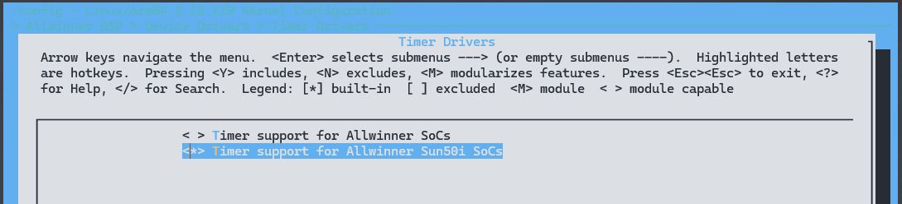

# Timer - 定时器

定时器是一种关键的系统组件，它能够在设定的时间间隔内进行计数。当计数达到预定值时，定时器会产生中断信号，标志着相应的任务完成。这种机制对于各种系统的时间管理至关重要。例如，在计算机系统中，定时器可用于生成内部中断，以便实现精准的系统时间管理，确保各个任务按时执行并协调系统的整体运行。通过定时器，系统可以根据需求进行调度和控制，提高系统的稳定性和可靠性。

## 模块配置

### 驱动配置

```
Timer Drivers ->
	<*> Timer support for Allwinner Sun50i SoCs 
```




### 设备树配置

```
soc_timer0: timer@3008000 {
    compatible = "allwinner,sun50i-timer";
    device_type = "soc_timer";
    reg = <0x0 0x03008000 0x0 0x400>;
    interrupt-parent = <&gic>;
    interrupts = <GIC_SPI 55 IRQ_TYPE_LEVEL_HIGH>;
    sunxi-timers = <&timer0>, <&timer1>;
};

timer0: timer@0 {
    clocks = <&dcxo24M>, <&ccu CLK_TIMER0>, <&ccu CLK_TIMER>;
    clock-names = "parent", "mod", "bus";
    resets = <&ccu RST_BUS_TIME>;
};
```

1. `compatible`: 用于指定具体设备的兼容性信息，以便进行驱动和设备的匹配。
2. `device_type`: 标识设备为 SoC 级别的定时器。
3. `reg`: 指定设备所使用的地址范围。
4. `interrupt-parent`: 引用设备所连接的中断控制器节点。
5. `interrupts`: 指定设备所使用的中断号。
6. `sunxi-timers`: 注册在设备上的定时器数量。
7. `clocks`: 指定设备所使用的时钟源。

为了在 Timer 驱动代码中区分每一个 Timer 控制器,需要在 Device Tree 中的 aliases 节点中为每一个
Timer 节点指定别名:

```
aliases {
       	global-timer0 = &soc_timer0;
        ...
};
```

## 驱动架构

Timer驱动模块内部的功能可分为以下几个部分：

1. **驱动注册**: 将Timer驱动注册到核心系统中，注册后会与设备树中描述的Timer控制器进行匹配。匹配成功后，会调用初始化函数(init)来初始化Timer控制器。

2. **Timer操作集**: 提供一套标准的接口集，内核可以通过这些接口来控制Timer控制器完成计时功能。

3. **中断处理**: 当计时结束时，Timer控制器会触发中断，驱动模块需要相应地进行中断处理。

4. **休眠处理**: 当Timer被关闭(shutdown)时，驱动模块需要保存相关寄存器状态，以便在恢复时继续正常运行。

## 驱动接口

### timer参数设置
函数原型

```c
static void sun50i_clkevt_time_setup(void __iomem *base, u8 timer, unsigned long delay)
```
参数

- `base`：Timer基地址。
- `timer`：Timer号。
- `delay`：延迟时长。

返回值

- `void`

### 开始timer计时

函数原型

```c
static void sun50i_clkevt_time_start(void __iomem *base, u8 timer, bool periodic)
```

参数说明

- `base`：Timer基地址。
- `timer`：Timer号。
- `periodic`：是否周期计数。

返回值

- `void`

### 停止timer计时

函数原型

```c
static void sun50i_clkevt_time_stop(void __iomem *base, u8 timer)
```

参数说明

- `base`：Timer基地址。
- `timer`：Timer号。

返回值

- `void`
