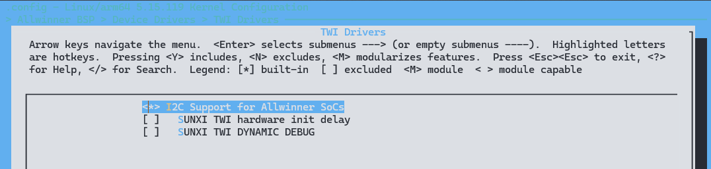
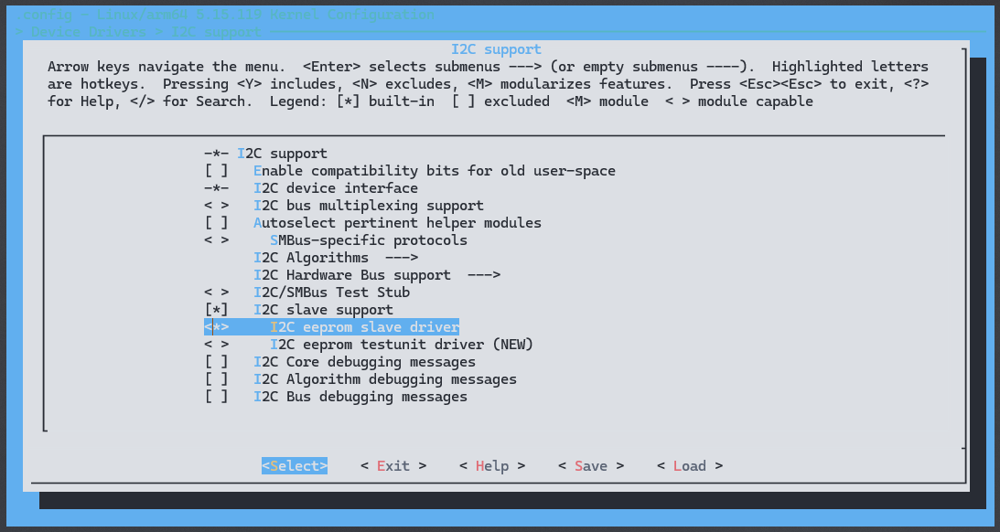
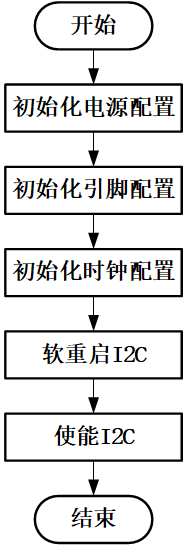
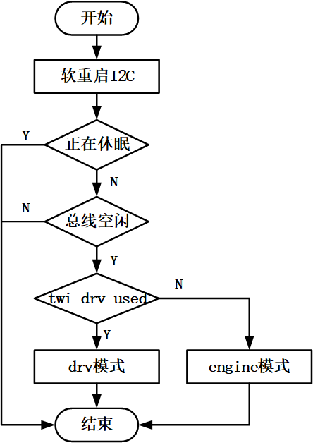
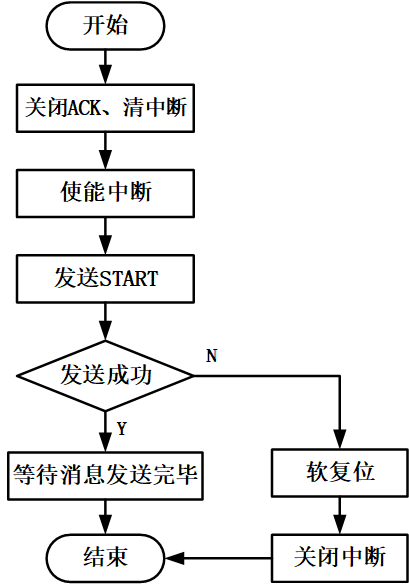

# TWI - Two Wire Interface

TWI 总线兼容 I2C 总线协议，是一种简单、双向二线制同步串行总线。它只需要两根线即可在连接于总线上的器件之间传送信息。 TWI控制器支持的标准通信速率为100kbps，最高通信速率可以达到400kbps。全志的twi控制器支持以下功能：

- 支持主机模式和从机模式；
  - 主机模式下支持dma传输；
  - 主机模式下在多个主机的模式下支持总线仲裁；
  - 主机模式下支持时钟同步，位和字节等待；
  - 从机模式下支持地址检测中断；
- 支持7bit从机地址和10bit从机地址；
- 支持常规的 I2C 协议模式和自定义传输模式。

## 模块配置

### 驱动配置

```
TWI Drivers ->
	<*> I2C Support for Allwinner SoCs
	[ ]   SUNXI TWI hardware init delay
	[ ]   SUNXI TWI DYNAMIC DEBUG
```



### 设备树配置

#### 引脚配置

```c
&pio {
	twi0_pins_default: twi0@0 {
        pins = "PD22", "PD23";
        function = "twi0";
        drive-strength = <10>;
        bias-pull-up;
    };

    twi0_pins_sleep: twi0@1 {
        pins = "PD22", "PD23";
        function = "gpio_in";
    };
};
```

部分平台存在两个域，需要分开配置：

```c
&r_pio {
	s_twi0_pins_default: s_twi0@0 {
		pins = "PL0", "PL1";
		function = "s_twi0";
		drive-strength = <10>;
		bias-pull-up;
	};

	s_twi0_pins_sleep: s_twi0@1 {
		pins = "PL0", "PL1";
		function = "gpio_in";
	};
};
```

#### TWI 控制器配置

```c
twi0: twi0@2502000 {
    #address-cells = <1>;
    #size-cells = 小于0>;
    compatible = "allwinner,sunxi-twi-v101";
    device_type = "twi0";
    reg = 小于0x0 0x02502000 0x0 0x400>;
    interrupts = <GIC_SPI 10 IRQ_TYPE_LEVEL_HIGH>;
    clocks = <&ccu CLK_TWI0>;
    clock-names = "bus";
    resets = <&ccu RST_BUS_TWI0>;
    dmas = <&dma 43>, <&dma 43>;
    dma-names = "tx", "rx";
    status = "okay";
};
```

1. `twi0: twi0@2502000 {`：设备节点名称，`twi0`是设备的别名，`@2502000`是设备在内存中的基地址。

2. `#address-cells = <1>;`：定义设备地址单元的数量。这里是1，表示每个设备地址使用一个单元。

3. `#size-cells = 小于0>;`：定义设备大小单元的数量。这里是0，表示设备大小不适用或为固定大小。

4. `compatible = "allwinner,sunxi-twi-v101";`：设备兼容性描述，指定了设备与驱动程序的兼容性。`allwinner,sunxi-twi-v101`表示该设备兼容Allwinner的Sunxi TWI版本101。

5. `device_type = "twi0";`：设备类型，表示这是一个TWI设备。

6. `reg = 小于0x0 0x02502000 0x0 0x400>;`：设备的寄存器地址和大小描述。`小于0x0 0x02502000 0x0 0x400>`指定了设备的寄存器地址范围，从0x02502000到0x025023FF，大小为0x400字节。

7. `interrupts = <GIC_SPI 10 IRQ_TYPE_LEVEL_HIGH>;`：设备中断描述，指定了设备使用的中断控制器和中断号，以及中断触发类型。这里使用了GIC（Generic Interrupt Controller）作为中断控制器，中断号为10，触发类型为高电平触发。

8. `clocks = <&ccu CLK_TWI0>;`：设备时钟描述，指定了设备使用的时钟源。`<&ccu CLK_TWI0>`表示设备使用了CCU（Clock Control Unit）中的`CLK_TWI0`时钟源。

9. `clock-names = "bus";`：设备时钟名称，指定了时钟的功能名称，这里是"bus"。

10. `resets = <&ccu RST_BUS_TWI0>;`：设备复位描述，指定了设备使用的复位控制。`<&ccu RST_BUS_TWI0>`表示设备使用了CCU中的`RST_BUS_TWI0`复位控制。

11. `dmas = <&dma 43>, <&dma 43>;`：DMA（Direct Memory Access）描述，指定了设备使用的DMA通道。这里指定了两个DMA通道，一个用于传输（tx），一个用于接收（rx）。

12. `dma-names = "tx", "rx";`：DMA通道名称，指定了DMA通道的功能名称，分别是"tx"和"rx"，用于传输和接收。

13. `status = "okay";`：设备状态，表示设备处于正常工作状态。

为了在TWI总线驱动代码中区分每一个TWI控制器，需要在Device Tree中的aliases节点中为每一个TWI节点指定别名：

```c
aliases {
    twi0 = &twi0;
    twi1 = &twi1;
    twi2 = &twi2;
    twi3 = &twi3;
    ...
};
```

TWI总线驱动程序通常会将每个TWI控制器都分配一个别名，形式为字符串“twi”加连续编号的数字，例如“twi0”、“twi1”等。这样的别名方便在代码中引用和区分不同的TWI控制器。通过`of_alias_get_id()`函数可以获取对应TWI控制器的数字编号，然后根据编号来确定具体是哪个TWI控制器，从而进行相应的操作。

### 板级配置

```c
&twi0 {
	clock-frequency = <400000>;		    /* TWI控制器的时钟频率 */
	pinctrl-names = "default", "sleep";	/* 设备使用的pin脚名称 */
	pinctrl-0 = <&twi0_pins_default>;	/* 设备使用的pin脚配置（default） */
	pinctrl-1 = <&twi0_pins_sleep>;		/* 设备使用的pin脚配置（sleep） */
	twi_drv_used = <1>;			        /* 是否启用drv模式传输数据：0-engine模式，1-drv模式 */
	twi-supply = <&reg_dcdc1>;		    /* regulator相关配置 */
	status = "okay";			        /* 设备是否使用 */
	eeprom@50 {				            /* eeprom从设备 */
		compatible = "atmel,24c16";	    /* eeprom从设备对应的设备驱动compatible，用于驱动和设备的绑定 */
		reg = 小于0x50>;			        /* eeprom从设备地址为0x50 */
		status = "disabled";		    /* eeprom从设备status */
	};
};
```

- `&twi0 { ... };`：这是TWI控制器的节点，使用了别名“twi0”。

- `clock-frequency = <400000>;`：指定了TWI控制器的时钟频率为400 kHz。

- `pinctrl-names = "default", "sleep";`：指定了TWI控制器在不同状态下使用的pin脚配置的名称，分别为“default”和“sleep”。

- `pinctrl-0 = <&twi0_pins_default>;`：指定了TWI控制器在默认状态下使用的pin脚配置，引用了一个名为“twi0_pins_default”的pin脚配置节点。

- `pinctrl-1 = <&twi0_pins_sleep>;`：指定了TWI控制器在睡眠状态下使用的pin脚配置，引用了一个名为“twi0_pins_sleep”的pin脚配置节点。

- `twi_drv_used = <1>;`：指定了TWI控制器是否启用了drv模式传输数据，这里设置为1表示启用了drv模式。

- `twi-supply = <&reg_dcdc1>;`：指定了TWI控制器使用的电源配置，引用了一个名为“reg_dcdc1”的电源节点。

- `status = "okay";`：指定了TWI控制器处于正常工作状态。

- `eeprom@50 { ... };`：这是一个EEPROM从设备的节点，使用了别名“eeprom”，地址为0x50。

  - `compatible = "atmel,24c16";`：指定了EEPROM从设备的设备驱动兼容性，这里是Atmel 24C16型号的EEPROM。

  - `reg = 小于0x50>;`：指定了EEPROM从设备的地址，这里是0x50。

  - `status = "disabled";`：指定了EEPROM从设备处于禁用状态。

## 工作模式

### master 模式

TWI控制器默认工作在master模式，无需其他额外配置。

### engine 模式配置

engine是中断模式驱动通信，占用cpu资源，可做slave模式，时钟延展，**一般作slave或者slave设备需要时钟延展特性时才使用engine模式**

工作在engine模式，主要是配置twi_drv_used = 小于0>属性，TWI模块在**dts文件**中的具体配置如下：

```c
&twi0 {
	clock-frequency = <400000>;		/* TWI控制器的时钟频率 */
	pinctrl-names = "default", "sleep";	/* 设备使用的pin脚名称 */
	pinctrl-0 = <&twi0_pins_default>;	/* 设备使用的pin脚配置（default） */
	pinctrl-1 = <&twi0_pins_sleep>;		/* 设备使用的pin脚配置（sleep） */
	twi_drv_used = 小于0>;			/* 是否启用drv模式传输数据：0-engine模式 */
	no_suspend = <1>;			/* 默认为0，无需配置；当pmu依赖twi时需要置1，标识twi在休眠唤醒阶段不休眠 */
	status = "okay";			/* 设备是否使用 */
};
```

### drv 模式配置

drv模式对cpu占用低，稳定性高，**一般master模式下，默认使用drv模式**

工作在drv模式，主要是配置 `twi_drv_used = <1>` 属性，TWI模块在**dts文件**中的具体配置如下：

```c
&twi0 {
	clock-frequency = <400000>;		/* TWI控制器的时钟频率 */
	pinctrl-names = "default", "sleep";	/* 设备使用的pin脚名称 */
	pinctrl-0 = <&twi0_pins_default>;	/* 设备使用的pin脚配置（default） */
	pinctrl-1 = <&twi0_pins_sleep>;		/* 设备使用的pin脚配置（sleep） */
	twi_drv_used = <1>;			/* 是否启用drv模式传输数据：1-drv模式 */
	no_suspend = <1>;			/* 默认为0，无需配置；当pmu依赖twi时需要置1，标识twi在休眠唤醒阶段不休眠 */
	status = "okay";			/* 设备是否使用 */
};
```

### 传输速率配置

工作在标准模式，时钟频率为100k，配置`clock-frequency = <100000>；`

工作在快速模式，时钟频率为400k，主要配置`clock-frequency = <400000>。`

TWI模块在**dts文件**中的具体配置如下：

```
&twi0 {
    clock-frequency = <400000>;/* TWI控制器的时钟频率，默认为400k */
    ...
};
```

### slave 模式

TWI控制器支持作为从机使用，但是默认工作在master模式，slave模式需要特殊配置。

#### 内核驱动配置

```
Device Drivers  --->
    I2C support  --->
        [*]   I2C slave support
        <*>     I2C eeprom slave driver
```



slave模式时TWI控制器需要配置为engine模式，并且在dts中注册为slave，具体配置如下：

TWI模块在**dts文件**中的具体配置如下：

```c
&twi0 {
        ...
        twi_drv_used = 小于0>;  /* slave must work in engine-mode */
        status = "okay";
        slave {
                compatible = "slave-24c02";  /* Slave device drivers provided by the kernel */
                reg = 小于0x50>;  /* slave_addr，可以修改 */
                status = "okay";
        };
};
```

按上述配置完成后，该TWI控制器即注册为一个从设备，设备地址为上述定义的slave_addr，该TWI控制器与其他master的sck和sda连接后可以进行正常通信。

## 模块介绍

Linux中的I2C体系结构是指Linux内核中用于管理和控制I2C（Inter-Integrated Circuit）总线的组织结构和架构。I2C总线是一种串行通信总线，常用于连接微控制器、传感器、存储器和其他外设，以实现它们之间的通信。

在Linux内核中，I2C体系结构主要由以下几个部分组成：

1. **用户空间**：用户空间包括所有使用I2C设备的应用程序。这些应用程序通过系统提供的接口与内核进行通信，从而与I2C设备进行数据交换。

2. **内核空间**：内核空间包括了驱动程序和管理I2C总线的核心模块。这些模块负责实现对I2C总线和连接在上面的设备的管理和控制。

3. **硬件**：硬件部分包括了实际的物理设备，包括I2C控制器和I2C外设。I2C控制器通常集成在主板或者处理器中，而外设则连接在I2C总线上，通过控制器进行数据交换。

在Linux内核中，对I2C总线的管理和控制是通过一系列的模块来完成的，这些模块包括：

- **I2C核心（I2C core）**：负责提供对I2C总线的核心功能和抽象，包括对I2C控制器和外设的管理、数据传输等。
  
- **I2C控制器驱动程序（I2C controller drivers）**：这些驱动程序负责与硬件I2C控制器进行通信，并提供统一的接口给上层的I2C核心模块使用。
  
- **I2C从设备驱动程序（I2C client drivers）**：这些驱动程序负责与连接在I2C总线上的外设进行通信，并提供相应的功能给上层的应用程序使用。
  
- **I2C总线驱动程序（I2C bus drivers）**：这些驱动程序负责管理和控制特定类型的I2C总线，例如SMBus等。

通过这些模块的协同工作，Linux内核可以实现对I2C总线的管理和控制，使得开发者可以方便地使用和操作连接在I2C总线上的各种外设。

### 模块初始化流程



I2C设备初始化流程如下所示:

- 获取I2C设备的时钟，获取电源配置，获取引脚配置
- 配置电源适配器，配置引脚，配置时钟
- 如果需要使用DMA传输，软重启设备

### 模块数据发送流程



当上层应用使用I2C在传输数据的时候，会调用会 `twi\_algorithm` 结构体的 `master_xfer` 函数，具体如下：

```c
static const struct i2c_algorithm sunxi_twi_algorithm = {
	.master_xfer	  = sunxi_twi_xfer,
	.functionality	  = sunxi_twi_functionality,
#if IS_ENABLED(CONFIG_I2C_SLAVE)
	.reg_slave        = sunxi_twi_reg_slave,
	.unreg_slave      = sunxi_twi_unreg_slave,
#endif
};
```

其中 `sunxi_twi_xfer` 的定义如下所示：

```c
static int sunxi_twi_xfer(struct i2c_adapter *adap, struct i2c_msg *msgs, int num)
{
	struct sunxi_twi *twi = (struct sunxi_twi *)adap->algo_data;
	...
	/* then the sunxi_twi_runtime_reseme() call back */
	ret = pm_runtime_get_sync(twi->dev);
	sunxi_twi_soft_reset(twi);							//软重启I2C
	ret = sunxi_twi_bus_barrier(&twi->adap);
	/* set the twi status to idle */
	twi->result = RESULT_IDLE;
	if (twi->twi_drv_used)
		ret = sunxi_twi_drv_xfer(twi, msgs, num);		//drv模式
	else
		ret = sunxi_twi_engine_xfer(twi, msgs, num);	//engine模式

	return ret;
}
```

可见该函数是判断使用 `engine` 模式传输数据还是 `drv` 模式传输数据，其决定于设备树中的 `twi_drv_used` 配置。
下面将会对 `engine`模式的传输流程进行分析：



在该传输中，先重启TWI设备，在配置需要传输的数据，使能TWI中断，然后启动TWI进行数据的传输，等待数据传输完毕。

### 模块 Delay Init 处理流程

对于 `delay_init` 的处理流程，可以分为以下几个步骤：

1. **Linux驱动的初始化**：在Linux内核启动时，驱动程序会被加载，并且执行相应的probe函数来初始化设备。在TWI（Two-Wire Interface，双线接口）驱动中，通常会执行probe函数来获取和初始化硬件资源。

2. **跳过硬件资源获取**：由于需要在异构系统中先由异构小核使用TWI资源，因此在Linux执行probe函数时，需要跳过硬件资源的获取部分，也就是暂时不执行sunxi_twi_hw_init()函数，以避免与异构小核的资源使用冲突。

3. **等待远端信号通知**：Linux在初始化过程中会启动一个等待机制，等待来自远端的信号通知，以确定何时可以安全地初始化TWI资源。这个信号通知通常通过rpmsg（Remote Processor Messaging）等方式进行传递。

4. **接收信号通知**：一旦远端完成了对TWI资源的使用，并且通过rpmsg向Linux发送了信号通知，Linux会收到这个通知，并且在接收到通知后执行相应的处理程序。

5. **执行资源获取函数**：在接收到远端信号通知后，Linux会执行TWI驱动中的资源获取函数，例如sunxi_twi_hw_init()，以完成对TWI资源的初始化。

通过以上流程，Linux可以在异构系统中平滑地与异构小核进行TWI资源的共享和切换，确保在使用结束后及时初始化TWI资源，避免资源竞争和冲突。

### 休眠唤醒处理流程

1. **运行时休眠唤醒处理流程**：
   - **Runtime Suspend/Runtime Resume函数使用**：通过在TWI驱动中实现runtime_suspend和runtime_resume函数，可以实现TWI在一定时间内未被调用时自动进入休眠状态，以节省能耗，并在需要时自动唤醒恢复正常工作。
   - **系统休眠唤醒时的处理**：在系统休眠过程中，针对非PMU（Power Management Unit）使用的TWI，首先关闭I2C子系统的调用，并确保任何正在进行的数据传输都已完成。最后，调用pm_runtime_force_suspend函数关闭电源、总线、时钟和引脚，将TWI状态设置为suspended。而对于PMU使用的TWI，直接退出，以确保在CPU和唤醒时能够正常使用。
   - **系统唤醒时的处理**：在系统唤醒时，对于非PMU使用的TWI，只进行上电操作，而不会真正调用到runtime_resume函数。TWI会在被真正使用时，通过调用runtime_resume函数来使能总线、时钟和引脚。

2. **注意事项**：
   - **模块的休眠唤醒函数调用顺序**：确保TWI的休眠唤醒函数在TWI的使用之前执行，以确保在TWI进行传输时，TWI资源已经准备好并能够正常使用。
   - **时钟的稳定性**：在休眠期间确保TWI的父时钟未被修改，以免在唤醒后导致TWI因时钟频率异常而无法工作。

### 关机流程

关机流程中对TWI的处理流程如下：

1. **对于PMU使用的TWI**：直接退出，以确保在CPUs中能够继续正常使用完成关机，不做任何处理。
2. **对于正在使用中的TWI**：
   - 确保传输完成最后一笔数据。
   - 修改TWI状态为SUNXI_TWI_XFER_STATUS_SHUTDOWN，表示TWI已处于关机状态。
3. **TWI处于SUNXI_TWI_XFER_STATUS_SHUTDOWN状态时的行为**：
   - 当TWI处于SUNXI_TWI_XFER_STATUS_SHUTDOWN状态时，调用i2c_transfer函数会显示失败，即TWI拒绝被使用。这是为了避免在关机过程中对TWI进行操作，以确保安全关机和系统稳定性。

### 模块内部接口

```c
static int sunxi_twi_xfer(struct i2c_adapter *adap, struct i2c_msg *msgs, int num)
```

- **功能描述**：当I2C Core发来消息时，该接口被调用以启动一次I2C的读写操作，首先发送Start信号，然后执行消息中指定的读写操作。
- **参数说明**：adap指向当前的I2C适配器，msgs指向待处理的I2C消息数组，num表示待处理的I2C消息个数。
- **返回值**：返回已成功处理的I2C消息个数，确保消息被正确发送和处理。

```c
static irqreturn_t sunxi_twi_handler(int this_irq, void * dev_id)
```

- **功能描述**：处理TWI控制器产生的中断信号，即当TWI控制器触发中断时，该函数被调用以进行中断处理。
- **参数说明**：this_irq表示中断号，dev_id是自定义的回调参数，通常是指向struct sunxi_twi结构体的指针，用于在中断处理函数中获取TWI控制器的相关信息。
- **返回值**：IRQ_HANDLED表示中断已经被正确处理，IRQ_NONE表示不是此设备的中断，通常在中断处理函数无法处理该中断时返回。

### I2C CORE 接口

```c
int i2c_transfer(struct i2c_adapter *adap, struct i2c_msg *msgs, int num);
```

完成TWI总线和TWI设备之间的一定数目的TWI消息交互。

- **参数**：
  - `adap`：指向所属的TWI总线控制器。
  - `msgs`：指向i2c_msg类型的指针，表示待处理的TWI消息数组。
  - `num`：表示一次需要处理几个TWI消息。

- **返回值**：
  - 大于0：已经处理的消息个数。
  - 小于0：失败。

```c
int i2c_master_recv(const struct i2c_client *client, char *buf, int count);
```

通过封装i2c_transfer()完成一次I2C接收操作，即从I2C设备读取数据。

- **参数**：
  - `client`：指向当前TWI设备的实例。
  - `buf`：用于保存接收到的数据的缓存。
  - `count`：数据缓存buf的长度。

- **返回值**：
  - \大于0：成功接收的字节数。
  - 小于0：失败。

```c
int i2c_master_send(const struct i2c_client *client, const char *buf, int count)。
```

通过封装i2c_transfer()完成一次I2c发送操作。

* **参数**：
  * `client`：指向当前TWI从设备的实例；

  * `buf`：要发送的数据；

  * `count`：要发送的数据长度。

* **返回值**：
  * \大于0：成功发送的字节数；
  * 小于0：失败。


### I2C 用户态接口

1. **打开设备文件**：
   - **函数原型**：`int open(const char *pathname, int flags)`
   - **参数**：
     - `pathname`：要打开的设备文件的路径。
     - `flags`：打开文件的标志，如读取、写入、追加等。
   - **返回值**：
     - 若成功，则返回文件描述符（非负整数），用于后续的读写操作。
     - 若失败，则返回-1，并设置errno来指示错误类型。

2. **写入数据**：
   - **函数原型**：`ssize_t write(int fd, const void *buf, size_t count)`
   - **参数**：
     - `fd`：已打开的I2C设备文件的文件描述符。
     - `buf`：要写入的数据的缓冲区指针。
     - `count`：要写入的数据的字节数。
   - **返回值**：
     - 若成功，则返回实际成功写入的字节数。
     - 若失败，则返回-1，并设置errno来指示错误类型。

3. **读取数据**：
   - **函数原型**：`ssize_t read(int fd, void *buf, size_t count)`
   - **参数**：
     - `fd`：已打开的I2C设备文件的文件描述符。
     - `buf`：用于存储读取数据的缓冲区指针。
     - `count`：要读取的数据的最大字节数。
   - **返回值**：
     - 若成功，则返回实际成功读取的字节数。
     - 若已到达文件末尾，则返回0。
     - 若失败，则返回-1，并设置errno来指示错误类型。

4. **控制操作**：
   - **函数原型**：`int ioctl(int fd, unsigned long request, ...)`
   - **参数**：
     - `fd`：已打开的I2C设备文件的文件描述符。
     - `request`：控制操作的请求码，用于指定要执行的操作。
     - `...`：可选的参数，用于传递控制操作所需的其他信息。
   - **返回值**：
     - 若成功，则返回0或者执行操作所返回的特定值。
     - 若失败，则返回-1，并设置errno来指示错误类型。

## 使用范例

### 内核态

```c
#include <linux/init.h>
#include <linux/module.h>
#include <linux/i2c.h>

static struct i2c_client *client;

static int __init i2c_example_init(void)
{
    struct i2c_adapter *adapter;
    struct i2c_board_info board_info;
    struct i2c_client *new_client;

    printk(KERN_INFO "I2C Example: Initializing\n");

    // 获取第一个 I2C 总线适配器
    adapter = i2c_get_adapter(0);
    if (!adapter) {
        printk(KERN_ERR "I2C Example: Failed to get adapter\n");
        return -ENODEV;
    }

    // 填充 I2C 设备信息
    memset(&board_info, 0, sizeof(board_info));
    strlcpy(board_info.type, "example_device", I2C_NAME_SIZE);

    // 在 I2C 总线上注册新的设备
    new_client = i2c_new_device(adapter, &board_info);
    if (!new_client) {
        printk(KERN_ERR "I2C Example: Failed to register device\n");
        i2c_put_adapter(adapter);
        return -ENODEV;
    }

    client = new_client;

    // 这里可以执行对设备的操作，如读写寄存器等

    return 0;
}

static void __exit i2c_example_exit(void)
{
    printk(KERN_INFO "I2C Example: Exiting\n");

    if (client) {
        // 从总线上注销设备
        i2c_unregister_device(client);
    }
}

module_init(i2c_example_init);
module_exit(i2c_example_exit);

MODULE_LICENSE("GPL");
MODULE_AUTHOR("Your Name");
MODULE_DESCRIPTION("I2C Example Module");
```

### 用户态

```c
#include <sys/ioctl.h>
#include <fcntl.h>
#include <linux/i2c-dev.h>
#include <linux/i2c.h>

#define CHIP "/dev/i2c-1"
#define CHIP_ADDR 0x50

int main()
{
    unsigned char rddata;
    unsigned char rdaddr[2] = {0, 0}; /* 将要读取的数据在芯片中的偏移量 */
    unsigned char wrbuf[3] = {0, 0, 0x3c}; /* 要写的数据，头两字节为偏移量 */
    int fd = open(CHIP, O_RDWR);
    if (fd < 0)
    {
        printf("open "CHIP"failed\n");
        goto exit;
    }
    if (ioctl(fd, TWI_SLAVE_FORCE, CHIP_ADDR) < 0)
    { /* 设置芯片地址 */
        printf("oictl:set slave address failed\n");
        goto close;
    }
    printf("input a char you want to write to E2PROM\n");
    wrbuf[2] = getchar();
    printf("write return:%d, write data:%x\n", write(fd, wrbuf, 3), wrbuf[2]);
    sleep(1);
    printf("write address return: %d\n",write(fd, rdaddr, 2)); /* 读取之前首先设置读取的偏移量 */
    printf("read data return:%d\n", read(fd, &rddata, 1));
    printf("rddata: %c\n", rddata);
    close(fd);
    exit:
    return 0;
}
```

## FAQ

### TWI数据未完全发送

**问题现象**： incomplete xfer。具体的log如下所示：

```c
[ 1658.926643] sunxi_twi_do_xfer()1936 - [twi0] incomplete xfer (status: 0x20, dev addr: 0x50)
[ 1658.926643] sunxi_twi_do_xfer()1936 - [twi0] incomplete xfer (status: 0x48, dev addr: 0x50)
```

**问题分析**：此错误表示主控已经发送了数据（status值为0x20时，表示发送了SLAVE ADDR + WRITE；status值为0x48时，表示发送了SLAVE ADDR + READ），但是设备没有回ACK，这表明设备无响应，应该检查是否未接设备、接触不良、设备损坏和上电时序不正确导致的设备未就绪等问题。

**问题排查步骤**：

步骤1：通过设备树里面的配置信息，核对引脚配置是否正确。每组TWI都有好几组引脚配置。

步骤2：更换TWI总线下的设备为at24c16，用i2ctools读写at24c16看看是否成功，成功则表明总线工作正常；

步骤3：排查设备是否可以正常工作以及设备与TWI之间的硬件接口是否完好；

步骤4：详细了解当前需要操作的设备的初始化方法，工作时序，使用方法，排查因初始化设备不正确导致通讯失败；

步骤5：用示波器检查TWI引脚输出波形，查看波形是否匹配。

### TWI起始信号无法发送

**问题现象**： START can't sendout!。具体的log如下所示：

```c
sunxi_twi_do_xfer()1865 - [twi1] START can't sendout!
```

**问题分析**：此错误表示TWI无法发送起始信号，一般跟TWI总线的引脚配置以及时钟配置有关。应该检查引脚配置是否正确，时钟配置是否正确，引脚是否存在上拉电阻等等。

**问题排查步骤**：

步骤1：重新启动内核，通过查看log，分析TWI是否成功初始化，如若存在引脚配置问题，应核对引脚信息是否正确；

步骤2：根据原理图，查看TWI-SCK和TWI-SDA是否经过合适的上拉电阻接到3.3v电压；

步骤3：用万用表量SDA与SCL初始电压，看电压是否在3.3V附近（断开此TWI控制器所有外设硬件连接与软件通讯进程）；

步骤4：核查引脚配置以及clk配置是否进行正确设置；

步骤5： 测试PIN的功能是否正常，利用寄存器读写的方式，将PIN功能直接设为INPUT功能，然后将PIN上拉和接地改变PIN状态，读PIN的状态，看是否匹配；

步骤6：测试CLK的功能是否正常，利用寄存器读写的方式，将TWI的CLK gating等打开，，然后读取相应TWI的寄存器信息，读TWI寄存器的数据，查看寄存器数据是否正常；

### TWI终止信号无法发送

**问题现象**： STOP can't sendout。具体的log如下所示：

```c
twi_stop()511 - [twi4] STOP can't sendout!
sunxi_twi_core_process()1726 - [twi4] STOP failed!
```

**问题分析**：此错误表示TWI无法发送终止信号，一般跟TWI总线的引脚配置。应该检查引脚配置是否正确，引脚电压是否稳定等等。

**问题排查步骤**：

步骤1：根据原理图，查看TWI-SCK和TWI-SDA是否经过合适的上拉电阻接到3.3v电压；

步骤2：用万用表量SDA与SCL初始电压，看电压是否在3.3V附近（断开此TWI控制器所有外设硬件连接与软件通讯进程）；

步骤3： 测试PIN的功能是否正常，利用寄存器读写的方式，将PIN功能直接设为INPUT功能，然后将PIN上拉和接地改变PIN状态，读PIN的状态，看是否匹配；

步骤4: 查看设备树配置，把其他用到SCK/SDA引脚的节点关闭，重新测试TWI通信功能。

### TWI传送超时

**问题现象**： xfer timeout。具体的log如下所示：

```c
[123.681219] sunxi_twi_do_xfer()1914 - [twi3] xfer timeout (dev addr:0x50)
```

**问题分析**:此错误表示主控已经发送完起始信号，但是在与设备通信的过程中无法正常完成数据发送与接收，导致最终没有发出终止信号来结束TWI传输，导致的传输超时问题。应该检查引脚配置是否正常，CLK配置是否正常，TWI寄存器数据是否正常，是否有其他设备干扰，中断是否正常等问题。

**问题排查步骤**：

步骤1：核实TWI控制器配置是否正确；

步骤2：根据原理图，查看TWI-SCK和TWI-SDA是否经过合适的上拉电阻接到3.3v电压；

步骤3：用万用表量SDA与SCL初始电压，看电压是否在3.3V附近（断开此TWI控制器所有外设硬件连接与软件通讯进程）；

步骤4：关闭其他TWI设备，重新进行烧录测试TWI功能是否正常；

步骤5： 测试PIN的功能是否正常，利用寄存器读写的方式，将PIN功能直接设为INPUT功能，然后将PIN上拉和接地改变PIN状态，读PIN的状态，看是否匹配；

步骤6：测试CLK的功能是否正常，利用寄存器读写的方式，将TWI的CLK gating等打开，，然后读取相应TWI的寄存器信息，读TWI寄存器的数据，查看寄存器数据是否正常；

步骤7：根据相关的LOG跟踪TWI代码执行流程，分析报错原因。