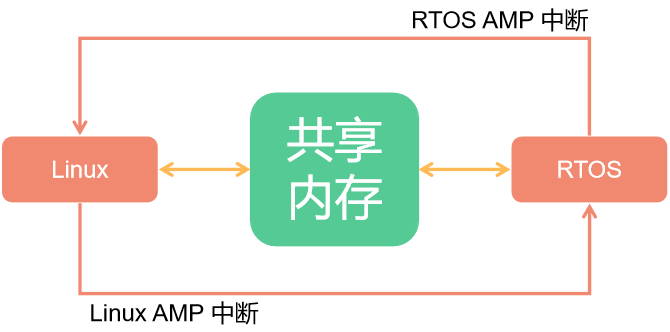
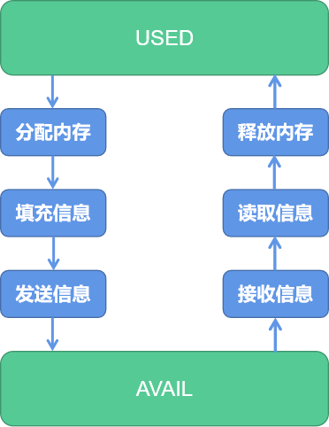
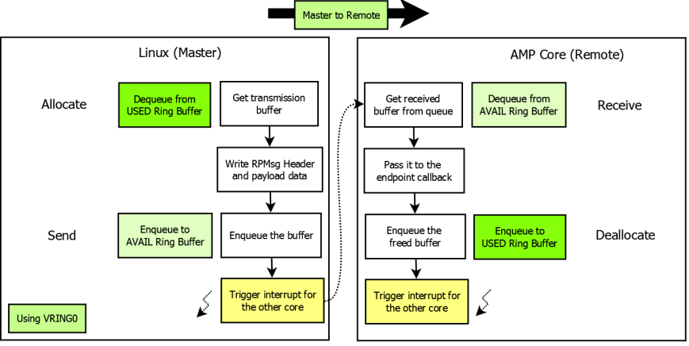
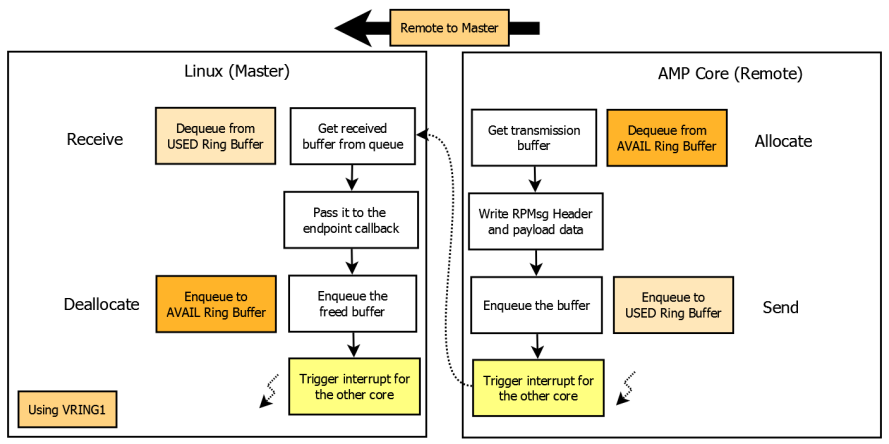
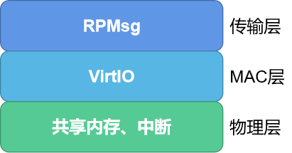

# 异构计算简介

Avaota SBC 的部分平台内具有小核心 CPU，与大核心一起组成了异构计算的功能。

在异构多处理系统中，主核心和辅助核心的存在旨在共同协作，以实现更高效的任务处理。这种协作需要系统采取一系列策略来确保各个核心能够充分发挥其性能优势，并实现有效的通信和协同工作。这就形成了一种称为异构多处理系统（AMP系统）的架构。

在AMP系统中，通常采用主-从结构。主核心作为系统的控制中心，负责启动和管理辅助核心。一旦辅助核心启动完成，主核心和辅助核心之间会建立通信通道，以便进行数据交换和协同计算。这种通信通常通过IPC（Inter Processor Communication，处理器间通信）方式进行，而RPMsg则是其中一种常用的通信协议之一。

一项关键的任务在于确保两个核心之间的数据共享和同步。为此，系统通常会采用共享内存的方式，使得两个核心能够访问相同的数据空间。此外，系统还需要设计合适的中断机制，以便在必要时触发核心间的通信和同步操作。

## 异构系统的通讯

异构系统通讯在硬件上使用的是 MSGBOX，在软件层面上使用的是 AMP 与 RPMsg 通讯协议。其中大核心上基于 Linux 标准的 RPMsg 驱动框架，小核心是基于 OpenAMP 的异构通信框架。

### AMP 与 RPMsg

主核心与辅助核心是完全不同的两个核心，为了最大限度的发挥他们的性能，协同完成某一任务，所以在不同的核心上面运行的系统也各不相同。这些不同架构的核心以及他们上面所运行的软件组合在一起，就成了 AMP 系统 （Asymmetric Multiprocessing System, 异构多处理系统）。

由于两个核心存在的目的是协同的处理，因此在异构多处理系统中往往会形成 Master - Remote 结构。主核心启动后启动从核心。当两个核心上的系统都启动完成后，他们之间就通过 IPC（Inter Processor Communication）方式进行通信，而 RPMsg 就是 IPC 中的一种。

在AMP系统中，两个核心通过共享内存的方式进行通信。两个核心通过 AMP 中断来传递讯息。内存的管理由主核负责。

异构多处理系统的设计需要充分考虑到主核心和辅助核心的异构性质，以及它们之间的通信和协作方式，从而实现任务的高效分配和处理。



AMP 系统在每个通信方向上都有两个缓冲区，分别是 `USED` 和 `AVAIL`，这个缓冲区可以按照 RPMsg 中消息的格式分成一块一块链接形成一个环。



当主核需要和从核进行通信的时候可以分为四步：

（1）主核先从USED中取得一块内存（Allocate）

（2）将消息按照消息协议填充

（3）将该内存链接到 AVAIL 缓冲区中（Send）

（4）触发中断，通知辅助核有消息处理



反之，从核需要和主核通信的时候也类似：

（1）从核先从AVAIL中取得一块内存（Allocate）

（2）将消息按照消息协议填充

（3）将该内存链接到 USED 缓冲区中（Send）

（4）触发中断，通知主核有消息处理。



### RPMsg 协议

既然 RPMsg 是一种信息交换的协议，与TCP/IP类似，RPMsg 协议也有分层，主要分为三层，分别是传输层、MAC层和物理层。




其中 MAC层 的 VirtIO 是一种I/O 半虚拟化解决方案，是一套通用 I/O 设备虚拟化的程序，是对半虚拟化 Hypervisor 中的一组通用 I/O 设备的抽象。 提供了一套上层应用与各 Hypervisor 虚拟化设备之间的通信框架和编程接口，减少跨平台所带来的兼容性问题，大大提高驱动程序开发效率。

RPMsg 总线上的消息都具有以下结构，包含消息头和数据两个固定的部分，该消息格式的定义位于`drivers/rpmsg/virtio_rpmsg_bus.c`中，具体定义如下：

```c
struct rpmsg_hdr {
    u32 src;
    u32 dst;
    u32 reserved;
    u16 len;
    u16 flags;
    u8 data[];
} __packed;
```

## 异构系统的控制

在异构系统中，不止需要消息的传输，还需要相关控制。例如主核对辅助核心的开启，加载固件，关闭等等。这就需要用到 remoteproc 框架。

remoteproc 框架支持对不同平台，不同架构的处理器进行控制，可以监控辅助核心的运行情况。