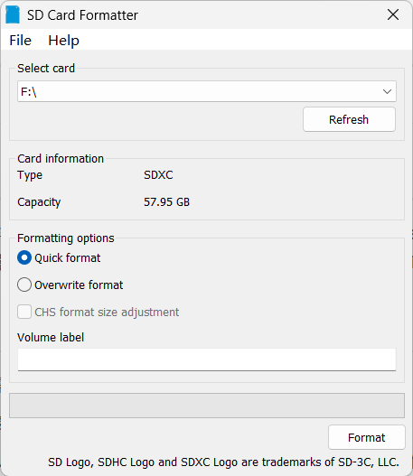
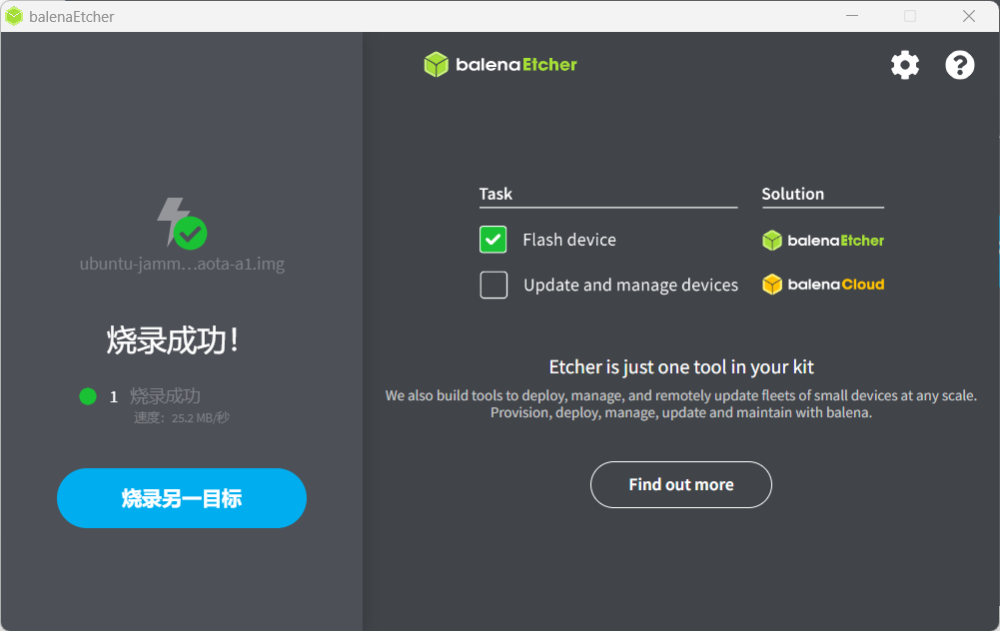
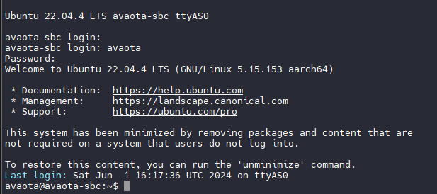
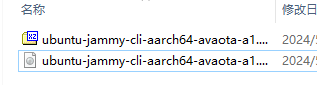
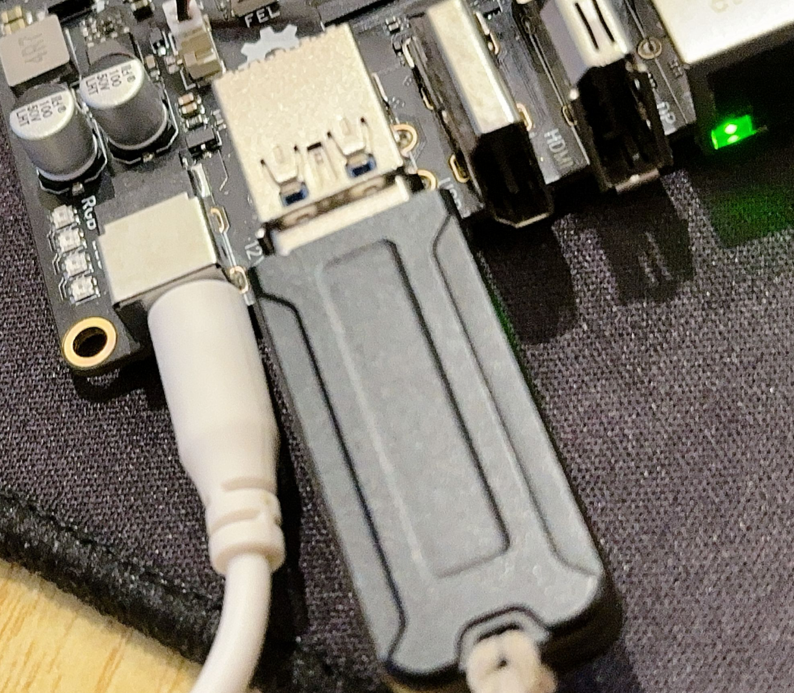
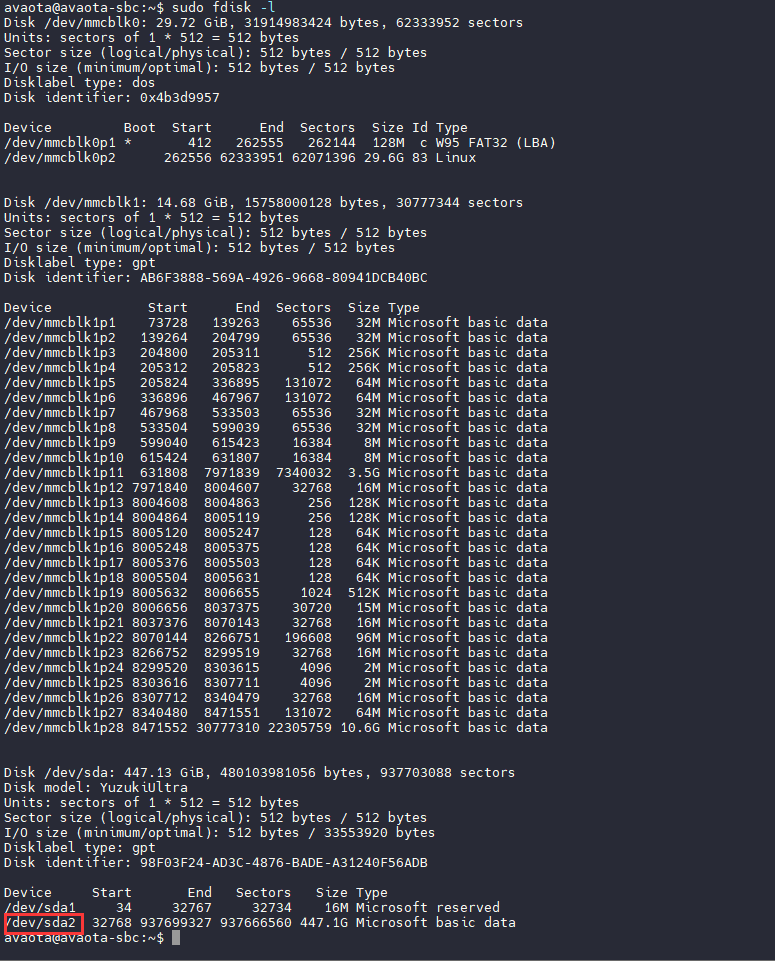
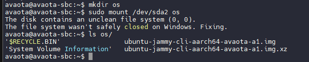

# Avaota OS 固件烧录

## 烧写到 TF 卡上

### 材料准备

  首先需要准备的材料有: 

- **SD-Card Formatter：[https://www.sdcard.org/downloads/formatter/]**
- **balenaEtcher：[https://etcher.balena.io/]** 
- **Avaota Pi - A1开发板 x1**
- **TF-Card ( 不小于4Gb ) x1** 
- **12V-DC电源适配器 x1** 
- **TF读卡器 x1** 
- USBTTL Splitter x1（可选）
- HDMI 采集卡 x1 （可选）
- USB 数据线

### 获取镜像

在安装开始前，您需要获取 AvaotaOS 发布的镜像及其校验文件。

-  点击打开此链接 [Releases · AvaotaSBC/AvaotaOS (github.com)](https://github.com/AvaotaSBC/AvaotaOS/releases) 。
-  下载选取如 **ubuntu-jammy-cli-aarch64-avaota-a1.img.xz** 的镜像包。

### TF 卡烧写步骤

1. 先使用 SD-Card Formatter 格式化内存卡 。




2. 烧录到 SD 卡。




3. 取出 SD 卡，插入 Avaota 然后接入电源

## 烧写到板载 eMMC

eMMC 是通过 TF 卡进行烧写的，先按上面所示准备一个烧写号系统的 TF 卡。

然后 Avaota OS 上电启动系统。



准备一个U盘，将系统拷贝进入 U 盘内。



U盘接入开发板



查看分区挂载情况

```
sudo fdisk -l
```



可以看到插入的 U 盘是 `/dev/sda`，分区是 `/dev/sda2`，eMMC是 `/dev/mmcblk1`，这里需要写入的是 `/dev/mmcblk1`，然后新建一个文件夹 `os` 作为挂载点，挂载 U 盘

```
mkdir os
sudo mount /dev/sda2 os
```



将固件写入 eMMC

```
sudo dd if=ubuntu-jammy-cli-aarch64-avaota-a1.img of=/dev/mmcblk1
```

