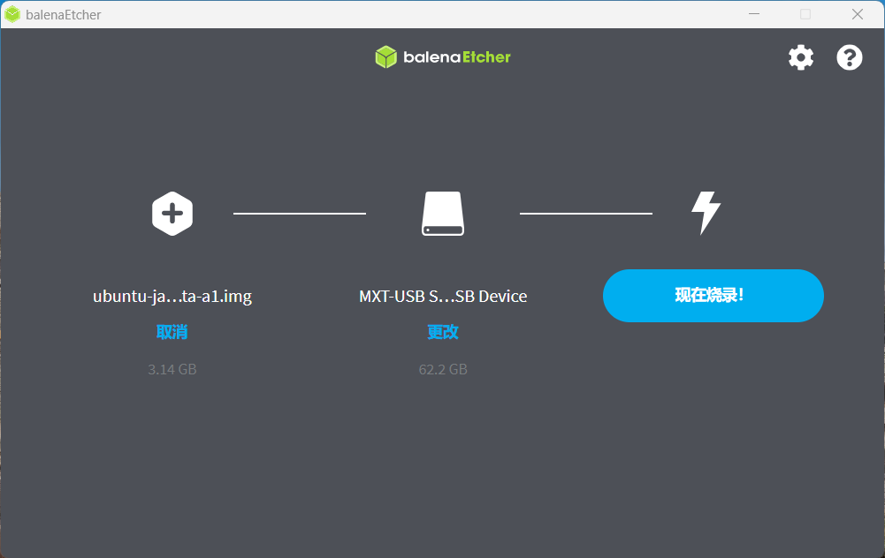

# Avaota OS 固件烧录

## 安装准备

### 材料准备

  首先需要准备的材料有: 

- **SD-Card Formatter：[https://www.sdcard.org/downloads/formatter/]**
- **balenaEtcher：[https://etcher.balena.io/]** 
- **Avaota Pi - A1开发板 x1**
- **TF-Card ( 不小于4Gb ) x1** 
- **12V-DC电源适配器 x1** 
- **TF读卡器 x1** 
- USBTTL Splitter x1（可选）
- HDMI 采集卡 x1 （可选）
- USB 数据线

### 获取镜像

在安装开始前，您需要获取 AvaotaOS 发布的镜像及其校验文件。

-  点击打开此链接 [Releases · AvaotaSBC/AvaotaOS (github.com)](https://github.com/AvaotaSBC/AvaotaOS/releases) 。
-  下载选取如 **ubuntu-jammy-cli-aarch64-avaota-a1.img.xz** 的镜像包。

## 安装步骤

1. 先使用 SD-Card Formatter 格式化内存卡 。

2. 烧录到 SD 卡。

3. 取出 SD 卡，插入Avaota然后接入电源

