# 使用 SSH 连接开发板

## 启动系统

前提条件：

- 确保已经 参考页面 https://avaota.fun/linux-manual/avaotaos/os-flash 制作好AvaotaA1系统镜像至TF卡。

​	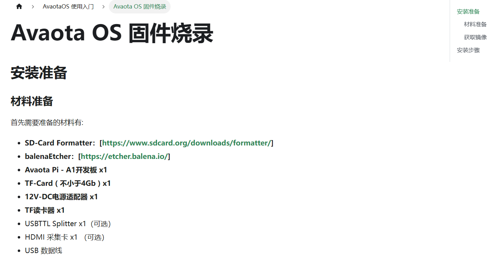

- 确保开发板电源供电正常：默认SPI显示屏有图案输出。

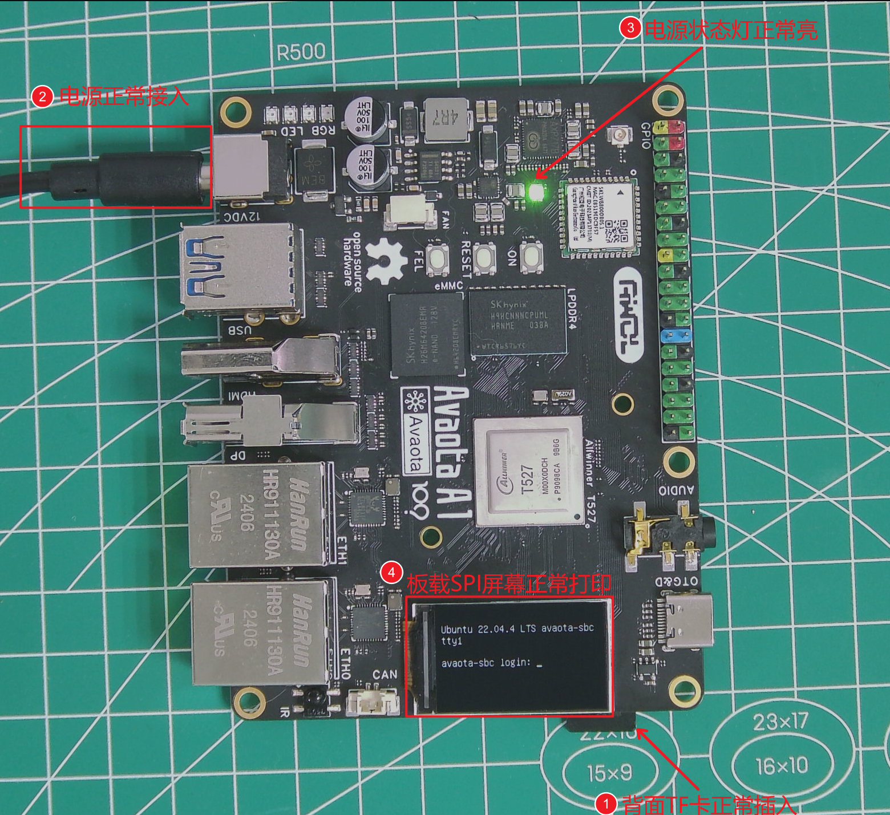

- 确保当前环境下有可以正常上网的路由器+RJ45网线接口。

## 获取IP地址

如果想通过ssh去登陆开发板系统，可以通过两种方式来获取IP，方式一：通过USB转串口模块 直接进入shell终端，输入 ifconfig 进行获取。 方式二： AvaotaA1接入USB键盘，在小屏幕上登陆系统，输入 ifconfig 得到IP地址。

### 使用USB键盘

如下图序号 1 2 3 4 5 6 7 所示，先将我们常用的USB键盘接入AvaotaA1开发板，之后系统会自动识别加载USB键盘驱动，我们就可以通过 USB键盘来操作小屏幕上了。

第一步：输入系统用户名 密码 avaota avaota 来登录进入系统。

第二步：登陆系统后可以看到 shell 终端命令行，可以进行操作。

第三步：输入ifconfig 来查看当前网络设备详细信息。

第四步：因为信息太多，我们只需要获取IP地址，可以通过 `ifconfig | grep inet | awk '{print $2}'` 命令单独显示IP地址。

第五步：将打印出来的IP地址记录下来，用于后续启动操作，如下图，这里的IP地址是 192.168.1.76(你的和我的不一样)。

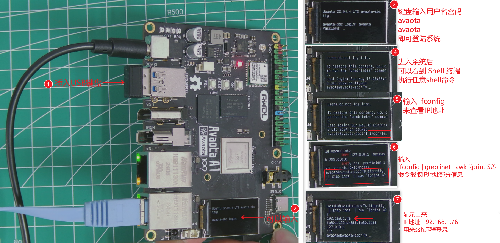

### 使用串口工具

点击下一个页面  https://avaota.fun/linux-manual/avaotaos/uart 使用UART连接开发板，我们可以USB转TTL / TypeC-SUB调试器方式进行，登录终端，输入  `ifconfig | grep inet | awk '{print $2}'`  命令，也可以快速获取到IP地址。

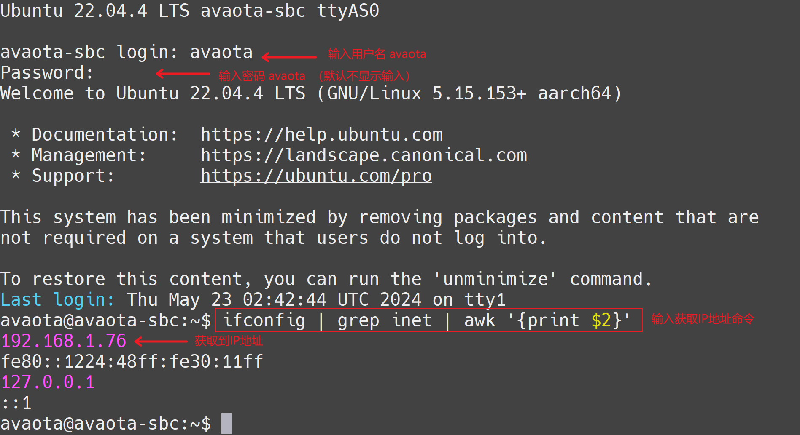

## 设置SSH工具

### 使用Putty登陆

- Putty工具可以访问页面 https://www.chiark.greenend.org.uk/~sgtatham/putty/latest.html 来获取。

  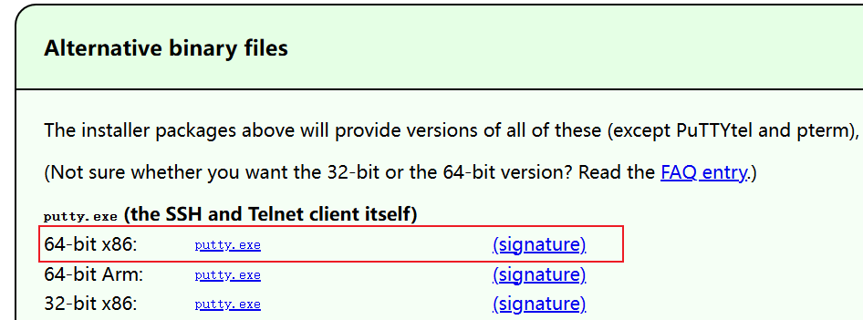

  

Putty创建SSH会话

|              点击SSH类型，输入IP地址，点击Open               |             在弹出的密钥对话框内 点击 Accept同意             |
| :----------------------------------------------------------: | :----------------------------------------------------------: |
| 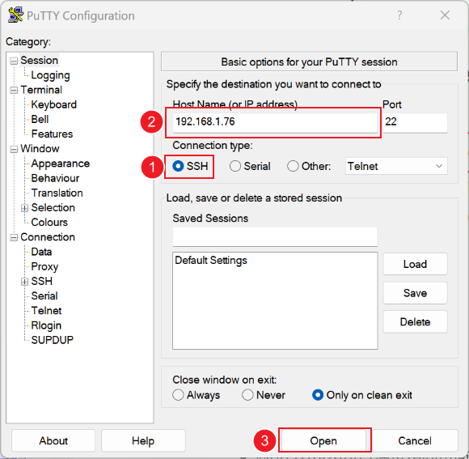 | 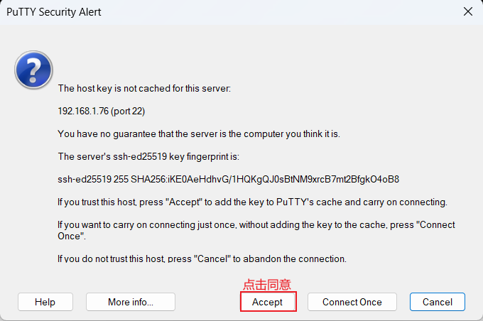 |

  参考下图所示，输入AvaotaA1 系统的用户名和密码，即可登录到开发板终端内。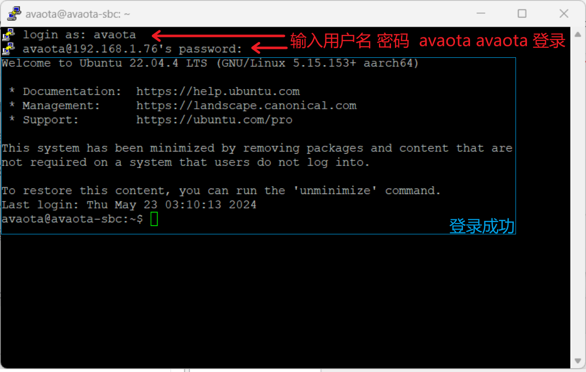

### 使用Mobaxterm登陆

- MobaXterm可以通过访问页面 https://mobaxterm.mobatek.net/ 获取 (推荐使用)。

安装完成以后，参考如下步骤，我们需要新建一个 ssh终端来登录开发板，首先点击左上角 Session 新建会话，在弹出的对话框中，选择 SSH 界面，之后 在序号 3  序号 4 内输入你的AvaotaA1 IP地址 和用户名，输入完成后，点击 序号5 OK即可打开新的终端。

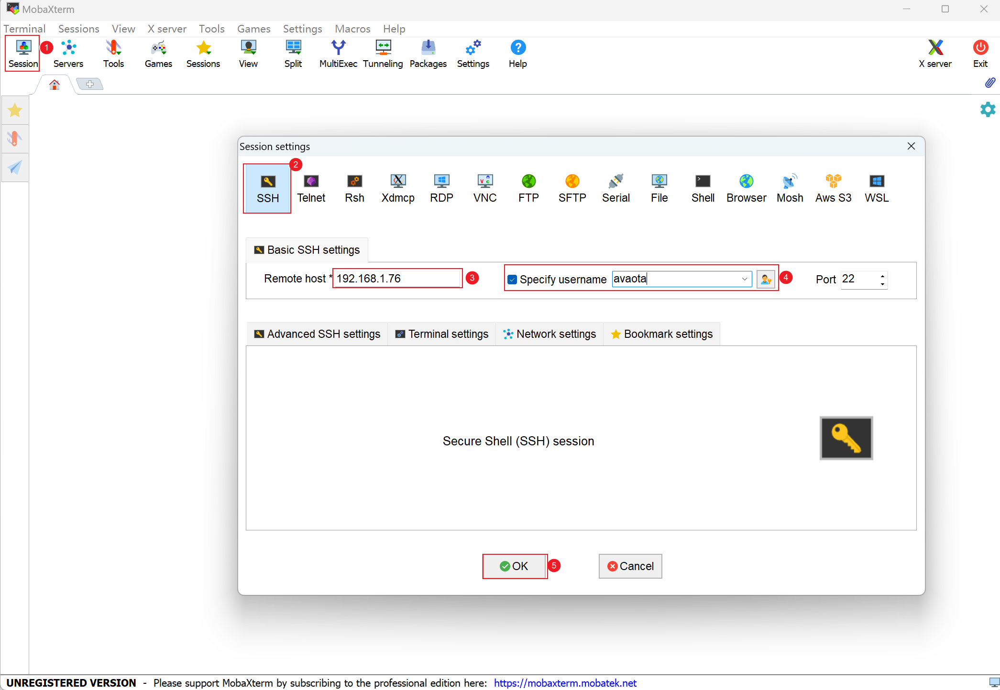

第一次登陆，因为我们已经设置了用户名，会弹出对话框提示输入密码，我们只需要 输入AvaotaA1 密码 avaota 即可自动登陆，此时Mobaxterm会提示你是否需要保存此设备密码，如果你不想每次输入密码登陆ssh 可以点击Yes.

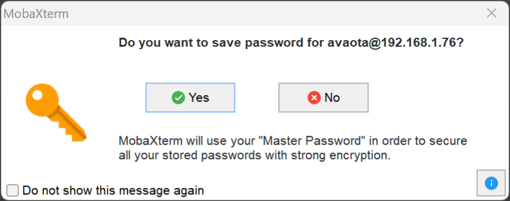

操作完成后，就可以自动进入到 AvaotaA1 终端命令行界面。

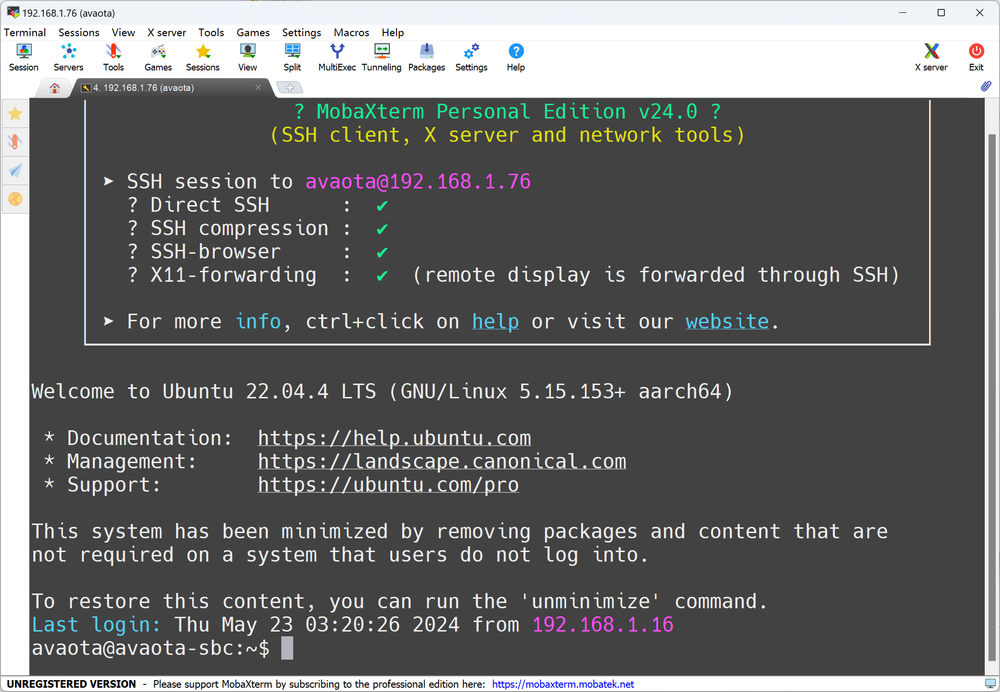
