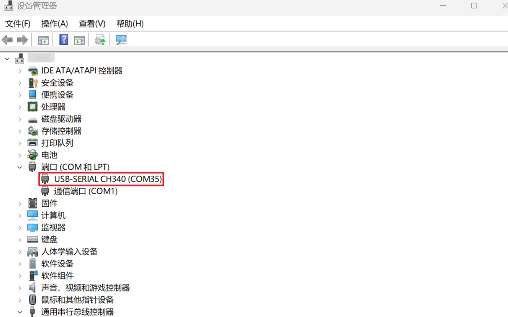
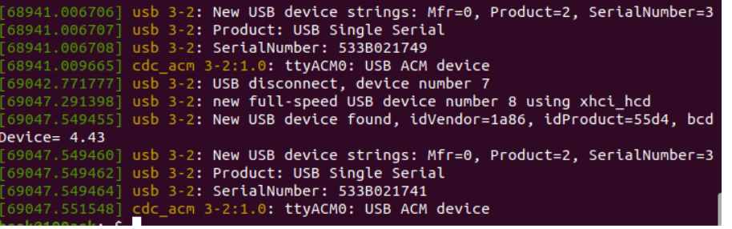
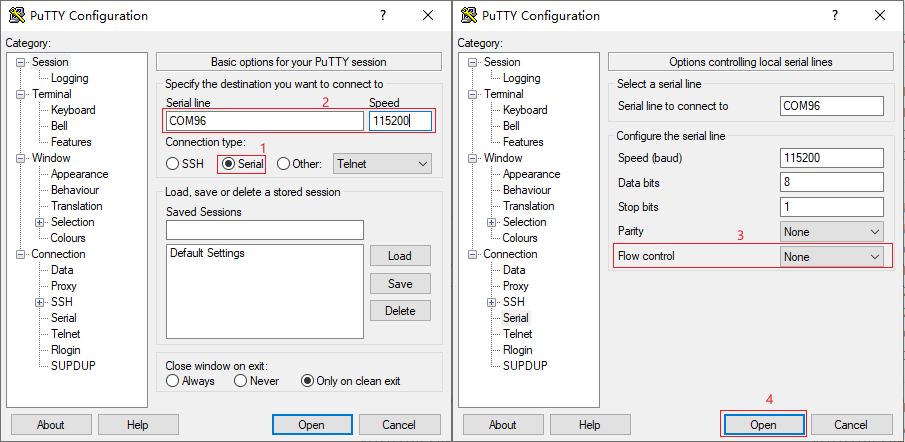
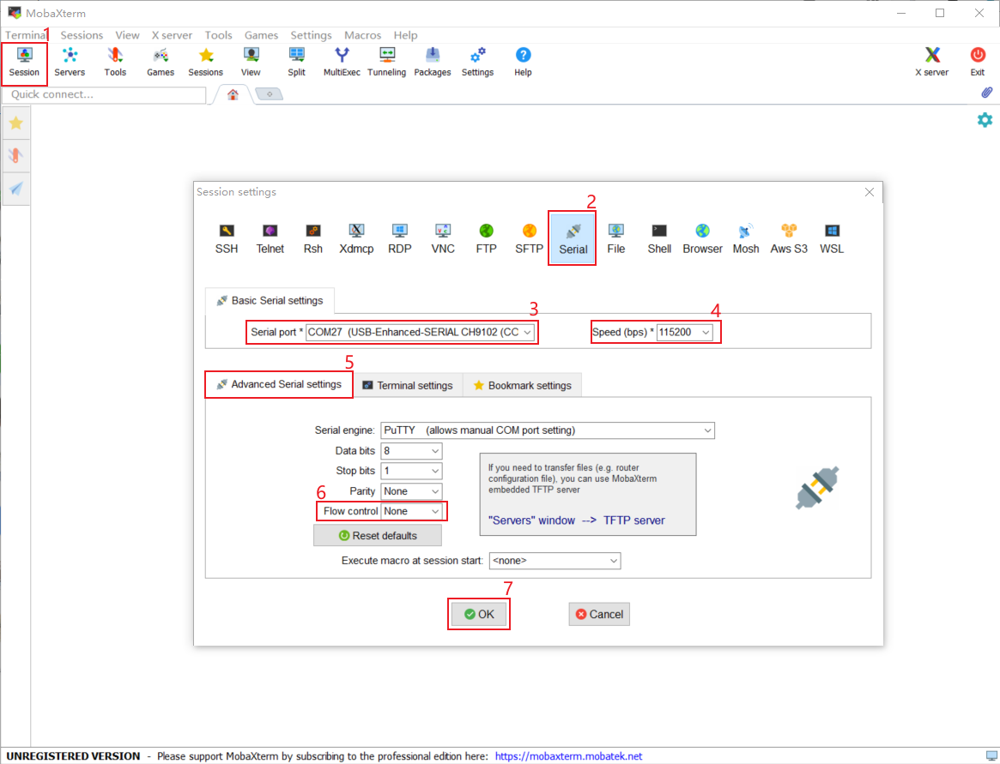
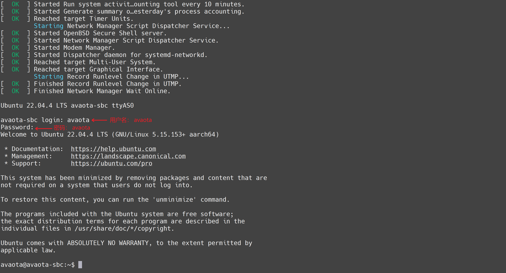

# 使用 UART 连接开发板

AvaotaA1提供两种连接串口输出方式，因为AvaotaA1需要DC 12V/2A/5.5-2.1电源适配器才可以启动系统，请先确保电源已接通。

方式一： 使用配套的 TyepC-SUB 转接板 + 40Gbps雷电线+标准TypeC数据线，就可以同步实现 USB 串口输出+USB OTG功能，连接示意图如下所示，连接时请严格按照下图红色箭头所示进行连接，如果不一致，则会出现无法使用问题。

第二种方式就是我们常规使用USB转TTL串口模块，通过杜邦线方式连接扩展排针位置，其中Pin8 Pin9分别为 系统TX RX，此时需要将这两个引脚连接至串口 RX TX，同时需要连接GND，使用电脑串口工具打开USB转串口设备节点即可。

## 1. 确认串口设备

将配套的TypeC线一段**正接**至开发板的串口/供电接口，另一端连接至电脑USB接口，连接成功后板载的电源灯会闪烁。 默认情况下系统会自动安装串口设备驱动，如果没有自动安装，可以使用驱动精灵来自动安装。

- 对于Windows系统 此时Windows设备管理器 在 端口(COM和LPT) 处会多出一个串口设备，一般是以 `USB-Enhanced-SERIAL CH340`开头，您需要留意一下后面的具体COM编号，用于后续连接使用。

  

  

如上图，COM号是35，我们接下来连接所使用的串口号就是35。

- 对于Linux系统 可以查看是否多出一个`/dev/tty<>`设备,一般情况设备节点为 /dev/ttyACM0 。

## 2. 打开串口控制台

### 获取串口工具

使用Putty或者MobaXterm等串口工具来开发板设备。

- 其中putty工具可以访问页面 https://www.chiark.greenend.org.uk/~sgtatham/putty/ 来获取。
- MobaXterm可以通过访问页面 https://mobaxterm.mobatek.net/ 获取 (推荐使用)。

### 使用putty登录串口

​	下载putty.exe后，直接双击运行，可以看到如下界面，分别参考如下红框 数字序号所示，按照 1 2 3 4 步骤进行配置，请注意红框 2  内 **COM96** 表示需要连接的串口设备，你的电脑可能不是COM96 ，请根据实际情况进行修改，其他配置保持不变，最后点击 红框4 Open 打开串口即可。

### 使用Mobaxterm登录串口

​	打开MobaXterm，点击左上角的  Session ，在弹出的界面选中 Serial ，如下图所示选择端口号（前面设备管理器显示的端口号COM35）、波特率（Speed 115200）、流控（Flow Control: none）,最后点击“OK”即可。步骤如下图所示。 **注意：流控（Flow Control）一定要选择none，否则你将无法在MobaXterm中向串口输入数据**

## 3. 进入系统shell

使用串口工具成功打开串口后，可以直接按下 Enter 键 进入shell，如果提示登陆密码，可是查看  页面 http://localhost:3000/linux-manual/avaotaos/os-start 获取，默认情况下

 用户名 `avaota` 密码 `avaota`

 用户名 `avaota` 密码 `avaota`

 用户名 `avaota` 密码 `avaota`

