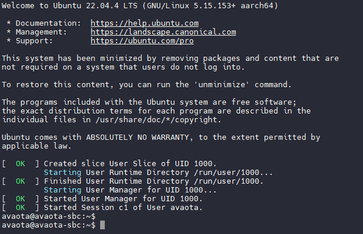
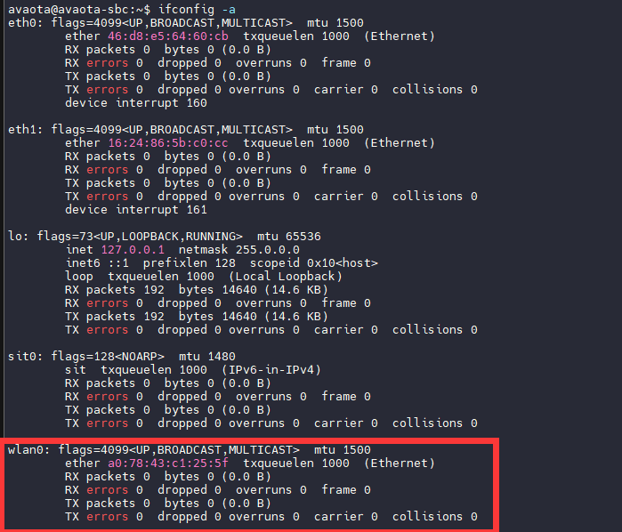
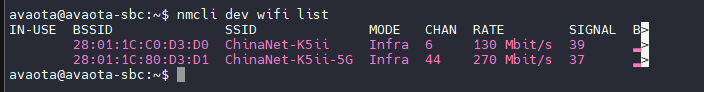
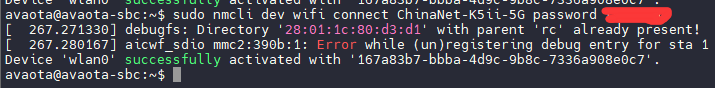
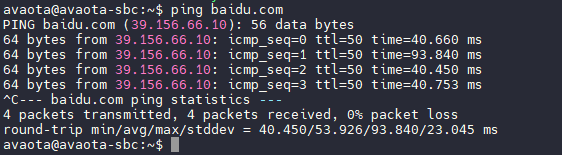
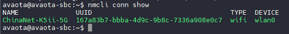

# 连接 WIFI

Avaota OS 支持连接 WIFI，这里主要分为两个部分来说明如何连接WIFI，包括 CLI 命令行界面和GUI图形界面

## CLI 连接 WIFI

这里我们使用串口登录 Avaota SBC



使用 `ifconfig -a` 查看是否有 `wlan0` 节点



### 查看可用的 WIFI 节点

```
nmcli dev wifi list
```



### 联网

使用命令联网，其中的 `<SSID>` 替换成你的 WIFI 名称，`<密码>` 换成你的 WIFI 密码。

```
sudo nmcli dev wifi connect <SSID> password <密码>
```



每次命令执行后，会在 `/etc/NetworkManager/system-connections/` 目录下创建一个新文件来保存配置，重复执行则创建多个这样的文件。删除 WIFI 连接，在 `/etc/NetworkManager/system-connections/` 目录下的对应文件也会被删除。

### 检查网络连接

通过 `ping` 百度获取网络连接情况

```
ping baidu.com
```



### 查看保存的网络

```
nmcli conn show
```



