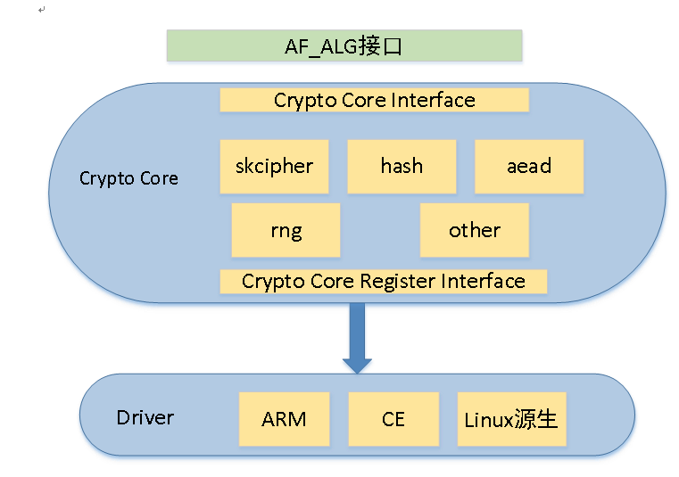
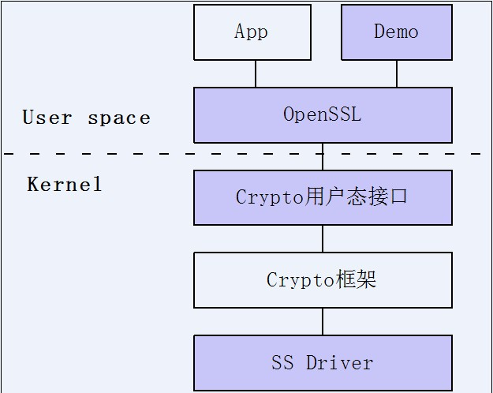
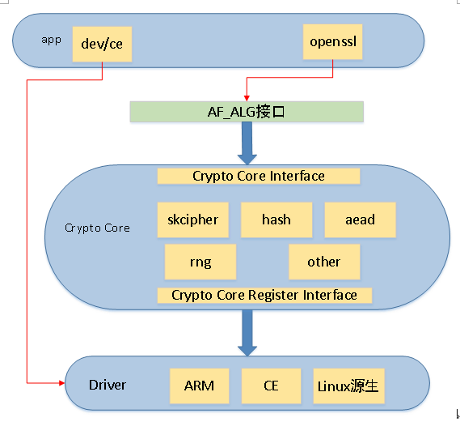
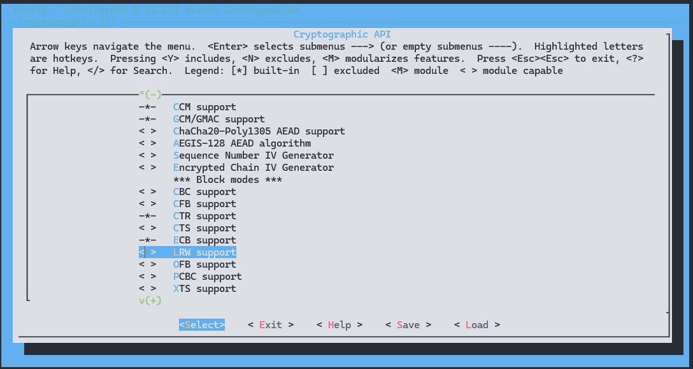
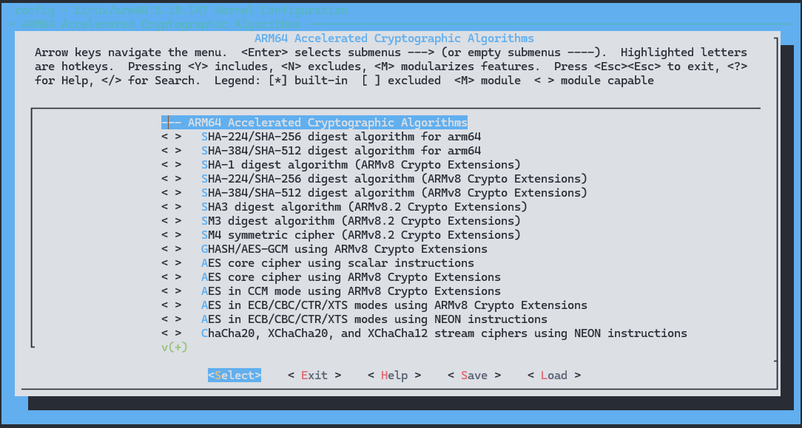
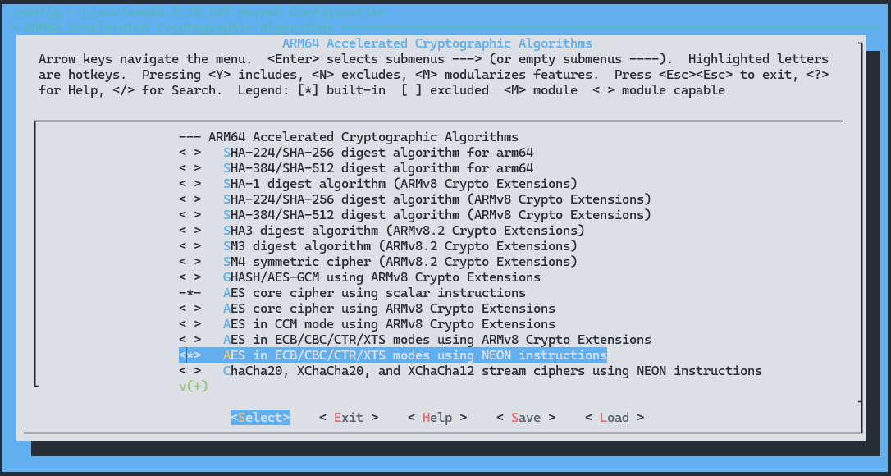
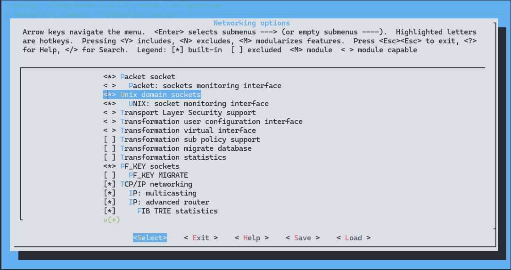
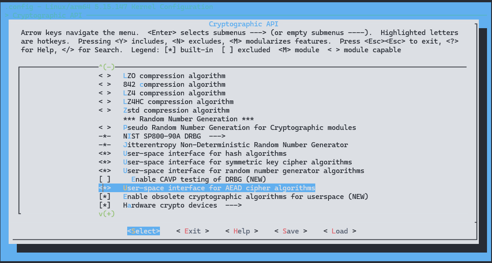
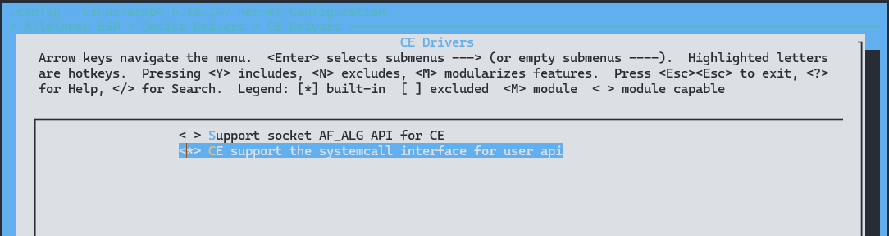
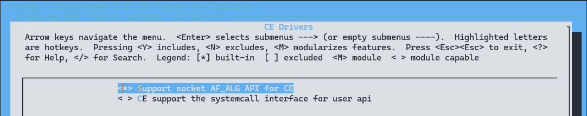

# Crypto Engine - 算法引擎

Crypto是内核一个独立的子系统，源码在kernel/crypto下，它实现了对算法的统一管理，并提供出统一的数据处理接口给其他子系统使用；

因此基于这套框架，我们不仅可以使用kernel已有的crypto算法对数据做转换，还能自行扩展添加算法，整个算法框架如下。



它实现了对称加解密，非对称加解密，认证加解密，hash，Hmac，伪随机数生成算法和压缩算法。

CE 按照Linux内核中的 Crypto 框架设计，在应用层能够和OpenSSL完美配合，很容易扩展完成多种硬件算法的支持。整个软件架构的关系图如下:



其中，[App] 是指用户的应用程序；[Crypto框架]是Linux内核自带的加密算法管理框架；紫色区域需要我们开发或修改，它们分别是：

1. Demo，基于OpenSSL的示例代码。

2. OpenSSL，一个基于密码学的安全开发包，OpenSSL提供的功能相当强大和全面。

3. Crypto用户态接口，内核crypto框架和用户态的接口部分。

4. SS Driver即CE Driver，负责操作CE硬件控制器。

可以看到，和用户应用程序直接打交道的是OpenSSL标准接口（将在第4章详述），这样App也很容易嵌入硬件的加解密功能。

需要指出，标准的OpenSSL还不能直接和内核中的Crypto框架互通，需要在OpenSSL中注册一个引擎插件(af_alg插件)，并在App中要配置OpenSSL使用af_alg引擎。

由于某些应用场景中，不想使用OpenSSL标准接口来操作CE的接口，因为openssl编译出来的库比较大，不适合小内存方案。因此CE驱动还提供CE设备节点方式供用户空间使用，如图所示，通过CE的设备节点方式不经过Crypto的框架，直接调用加解密接口。



## 模块配置

### 驱动配置

Linux 支持多种加解密接口：

| 加解密接口              | 备注                  |
| ----------------------- | --------------------- |
| Linux内核源生加解密接口 | C语言实现             |
| ARM加解密接口           | 采用ARM的加速指令实现 |
| CE加解密接口            | 加解密硬件加速模块    |

#### Linux 内核源生加解密接口

在这里选择自己需要的 API 即可，内核源生加解密接口是软件实现的支持的范围最广

```
Cryptographic API ->
	< >   CBC support
	-*-   CTR support
	...
```



#### ARM加解密接口

如果数据块是以8K为单位，或 8K 以下，可以采用 ARM 的加速指令这比CE模块的性能更加有优势，需要注意的是如果开启 ARM 的加速指令，必须关闭 CE 的配置，因为CE的配置优先级更加高。

```
[*] ARM64 Accelerated Cryptographic Algorithms  --->
	< >   SHA-224/SHA-256 digest algorithm for arm64
	< >   SHA-384/SHA-512 digest algorithm for arm64
	< >   SHA-1 digest algorithm (ARMv8 Crypto Extensions)
	...
```



#### ARM OpenSSL 加解密接口

这里以选择使用 NEON 加速 AES 类算法为示例，介绍如何在用户空间通过 OpenSSL 库使用 ARM 指令优化的加解密接口。

首先勾选 `AES in ECB/CBC/CTR/XTS modes using NEON instructions` 模块开启 ARM 指令优化

```
[*] ARM64 Accelerated Cryptographic Algorithms  --->
	<*>   AES in ECB/CBC/CTR/XTS modes using NEON instructions
```



然后开启 NET 选项


然后配置 `Networking options`

```
Networking support ->
	Networking options ->
		<*> Unix domain sockets
```



打开用户接口

```
CONFIG_CRYPTO_USER_API
CONFIG_CRYPTO_USER_API_HASH
CONFIG_CRYPTO_USER_API_SKCIPHER
CONFIG_CRYPTO_USER_API_RNG
CONFIG_CRYPTO_USER_API_AEAD
```



同时关闭硬件 CE


#### CE 原生调用接口

勾选

```
CE Drivers ->
	< > Support socket AF_ALG API for CE
	<*> CE support the systemcall interface for user api
```



#### CE OpenSSL 调用方法

需要勾选 `Support socket AF_ALG API for CE`

```
CE Drivers ->
	<*> Support socket AF_ALG API for CE
	< > CE support the systemcall interface for user api
```



同时配置 Linux 内核的 Sockets 支持，开启 NET 选项


然后配置 `Networking options`

```
Networking support ->
	Networking options ->
		<*> Unix domain sockets
```


打开用户接口

```
CONFIG_CRYPTO_USER_API
CONFIG_CRYPTO_USER_API_HASH
CONFIG_CRYPTO_USER_API_SKCIPHER
CONFIG_CRYPTO_USER_API_RNG
CONFIG_CRYPTO_USER_API_AEAD
```


### 设备树配置

```c
cryptoengine: ce@3040000 {
	compatible = "allwinner,sunxi-ce";
	device_name = "ce";
	reg = <0x0 0x03040000 0x0 0xa0>, /* non-secure space */
		<0x0 0x03040800 0x0 0xa0>; /* secure space */
	interrupts = <GIC_SPI 52 IRQ_TYPE_EDGE_RISING>, /*non-secure*/
				<GIC_SPI 53 IRQ_TYPE_EDGE_RISING>; /* secure*/
	clock-frequency = <400000000>; /* 400MHz */
	clocks = <&ccu CLK_BUS_CE>, <&ccu CLK_CE>, <&ccu CLK_CE_MBUS_GATE>,
		<&ccu CLK_PLL_PERI0_400M>, <&ccu CLK_CE_SYS>;
	clock-names = "bus_ce", "ce_clk", "mbus_ce", "clk_src", "ce_sys_clk";
	resets = <&ccu RST_BUS_CE>;
};
```

1. compatible:表征具体的设备,用于驱动和设备的绑定。
2. reg:设备使用的地址。
3. interrupts:设备使用的中断。
4. clock-frequency:设备使用的时钟频率。
5. clocks:设备使用的时钟源。

## 源码结构

### 源码树

```
.
├── Kconfig
├── Makefile
├── sunxi_ce.c				// Sunxi平台CE算法注册、处理流程的实现
├── sunxi_ce_cdev.c			// CE的字符设备相关注册实现--硬件资源申请和使能，ioctl逻辑实现
├── sunxi_ce_cdev.h			// CE字符设备相关头文件
├── sunxi_ce.h				// CE的驱动头文件
├── sunxi_ce_proc_comm.c
├── sunxi_ce_proc.h
├── v2
│   ├── sunxi_ce_proc.c		// V2CE器的算法处理过程
│   ├── sunxi_ce_reg.c		// V2版本SS控制器的寄存器接口实现
│   └── sunxi_ce_reg.h		// V2版本SS控制器的寄存器接口声明
├── v3
│   ├── sunxi_ce_cdev_comm.c
│   ├── sunxi_ce_proc.c
│   ├── sunxi_ce_proc_walk.c
│   ├── sunxi_ce_reg.c
│   └── sunxi_ce_reg.h
├── v4
│   ├── sunxi_ce_cdev_comm.c
│   ├── sunxi_ce_proc.c
│   ├── sunxi_ce_reg.c
│   └── sunxi_ce_reg.h
└── v5
    ├── sunxi_ce_cdev_comm.c// V5版本SS控制器的算法处理过程
    ├── sunxi_ce_proc.c		// V5版本CE器的算法处理过程
    ├── sunxi_ce_reg.c		// V5版本SS控制器的寄存器接口实现
    └── sunxi_ce_reg.h		// V5版本SS控制器的寄存器接口声明
```

通过Makefile控制四种CE版本的源码编译，Makefile内容如下:

```
# SPDX-License-Identifier: GPL-2.0
#
# Makefile for the ce drivers.
#

obj-$(CONFIG_AW_CE_SOCKET) += sunxi-ce.o
obj-$(CONFIG_AW_CE_IOCTL) += sunxi-ce-ioctl.o

sunxi-ce-ioctl-$(CONFIG_AW_CE_IOCTL) += sunxi_ce_cdev.o
sunxi-ce-$(CONFIG_AW_CE_SOCKET) += sunxi_ce.o sunxi_ce_proc_comm.o

ifdef CONFIG_ARCH_SUN50IW10
        AW_CE_VER = v4
endif

ifdef CONFIG_ARCH_SUN55IW3
        AW_CE_VER = v5
endif

sunxi-ce-$(CONFIG_AW_CE_SOCKET) +=  $(AW_CE_VER)/sunxi_ce_reg.o $(AW_CE_VER)/sunxi_ce_proc.o
sunxi-ce-ioctl-$(CONFIG_AW_CE_IOCTL) += $(AW_CE_VER)/sunxi_ce_reg.o $(AW_CE_VER)/sunxi_ce_cdev_comm.o

#ccflags-y += -I$(srctree)/drivers/crypto/sunxi-ce/$(AW_CE_VER)
#ccflags-y += -DDEBUG
```

### 接口函数

### Linux 5.15 Crypto API

#### crypto_alloc_cipher

* 函数原型: 
  ```c
  struct crypto_cipher *crypto_alloc_cipher(const char *alg_name, unsigned int flags, unsigned int mask)
  ```
* 作用：分配并返回指定算法的对称加密算法句柄。
* 参数：
  - `alg_name`: 要分配的加密算法名称。
  - `flags`: 标志位。
  - `mask`: 屏蔽值。
* 返回：
  - 成功，返回对称加密算法句柄。
  - 失败，返回NULL。

#### crypto_alloc_hash

* 函数原型: 
  ```c
  struct crypto_hash *crypto_alloc_hash(const char *alg_name, unsigned int flags, unsigned int mask)
  ```
* 作用：分配并返回指定算法的哈希算法句柄。
* 参数：
  - `alg_name`: 要分配的哈希算法名称。
  - `flags`: 标志位。
  - `mask`: 屏蔽值。
* 返回：
  - 成功，返回哈希算法句柄。
  - 失败，返回NULL。

#### crypto_free_cipher

* 函数原型: 
  ```c
  void crypto_free_cipher(struct crypto_cipher *tfm)
  ```
* 作用：释放对称加密算法句柄。
* 参数：
  - `tfm`: 对称加密算法句柄。

#### crypto_free_hash

* 函数原型: 
  ```c
  void crypto_free_hash(struct crypto_hash *tfm)
  ```
* 作用：释放哈希算法句柄。
* 参数：
  - `tfm`: 哈希算法句柄。

#### crypto_cipher_encrypt

* 函数原型: 
  ```c
  int crypto_cipher_encrypt(struct cipher_desc *desc)
  ```
* 作用：对称加密算法的加密操作。
* 参数：
  - `desc`: 加密描述符。
* 返回：
  - 加密操作的结果。

#### crypto_cipher_decrypt

* 函数原型: 
  ```c
  int crypto_cipher_decrypt(struct cipher_desc *desc)
  ```
* 作用：对称加密算法的解密操作。
* 参数：
  - `desc`: 加密描述符。
* 返回：
  - 解密操作的结果。

#### crypto_hash_digest

* 函数原型: 
  ```c
  int crypto_hash_digest(struct hash_desc *desc)
  ```
* 作用：哈希算法的摘要计算操作。
* 参数：
  - `desc`: 哈希描述符。
* 返回：
  - 摘要计算的结果。