# EMAC - 以太网络

以太网是一种局域网通信技术，遵循IEEE802.3协议规范，包括10 Mbps、100 Mbps、1000 Mbps和10 Gbps等多种速率的以太网。以太网与TCP/IP协议族的物理层（L1）和数据链路层（L2）相关，其中数据链路层包括逻辑链路控制（LLC）和媒体访问控制（MAC）子层。以太网在TCP/IP协议族中的位置如下图所示：

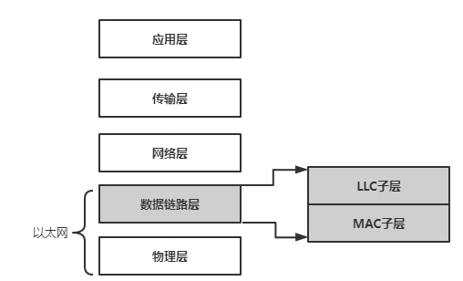

Linux 内核中网络设备框架如下图所示：

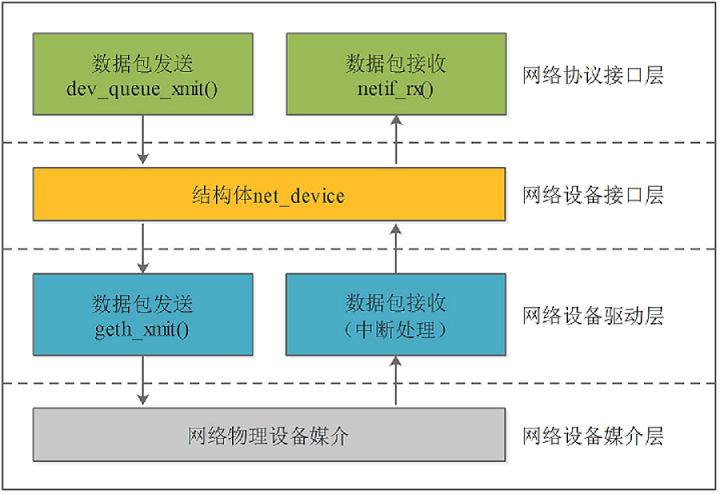

1. 网络协议接口层：向网络协议层提供统一的数据包收发接口，通过dev_queue_xmit()发送数据，并通过netif_rx()接收数据
2. 网络设备接口层：向协议接口层提供统一的用于描述网络设备属性和操作的结构体net_device，该结构体是设备驱动层中各函数的容器。
3. 网络设备驱动层：实现net_device中定义的操作函数指针（通常不是全部），驱动硬件完成相应动作。
4. 网络设备媒介层：完成数据包发送和接收的物理实体，包括网络适配器和具体的传输媒介。

## 模块配置

### Kernel 协议栈配置

对于 Linux 系统，使用以太网需要配置以太网协议栈，包括如下配置项

```
CONFIG_PACKET
CONFIG_UNIX
CONFIG_UNIX_DIAG
CONFIG_NET_KEY
CONFIG_INET
CONFIG_IP_MULTICAST
CONFIG_IP_ADVANCED_ROUTER
CONFIG_IP_FIB_TRIE_STATS
CONFIG_IP_MULTIPLE_TABLES
```

### Kernel 驱动配置

对于 EMAC 的驱动，由于芯片存在多套以太网IP，包括 EMAC，GMAC，GMAC-200。其适配的以太网驱动为不同驱动框架。这里分开说明

#### EMAC 配置说明

EMAC 控制器描述如下图所示，其主要特点为最高支持百兆网络。

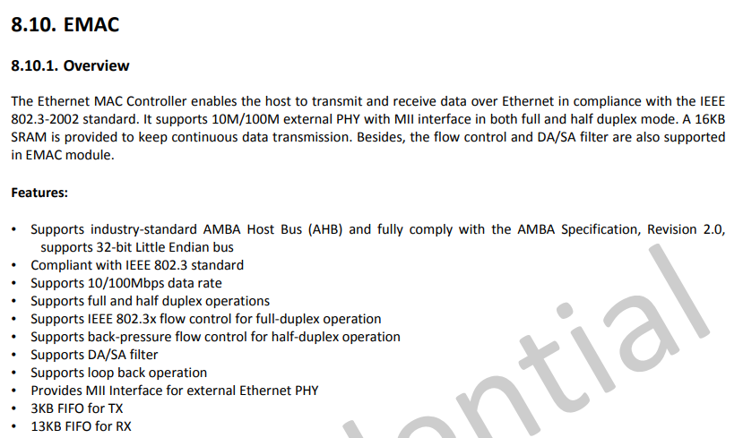

内核配置项目为

```
CONFIG_AW_EMAC
CONFIG_AW_EMAC_MDIO
```

内核设备树配置项

```c
mdio1: mdio1@1c0b080 {
	compatible = "allwinner,sun4i-mdio";
	#address-cells = <1>;
	#size-cells = <0>;
	reg = <0x0 0x01c0b080 0x0 0x14>;
	status = "okay";
	phy1: ethernet-phy@1 {
		reg = <1>;
	};
};

emac0: emac0@1c0b000 {
	compatible = "allwinner,sunxi-emac";
	reg = <0x0 0x01c0b000 0x0 0x0c000>;
	interrupts      = <GIC_SPI 55 IRQ_TYPE_LEVEL_HIGH>;
    interrupt-names = "emacirq";
	clocks   = <&ccu CLK_BUS_EMAC>;
	clock-names = "emac";
	resets = <&ccu RST_BUS_EMAC>;
    pinctrl-names = "default";
	pinctrl-0     = <&emac_pins_a>;
	phy-rst = <&pio PH 27 1 1 1 0>;
	phy-handle = <&phy1>;
	status = "disabled";
};
```

- `compatible` 表征具体的设备,用于驱动和设备的绑定；

- `reg` 设备使用的地址；

- `interrupts` 设备使用的中断；
- `clocks` 设备使用的时钟；
- `pinctrl-0` 设备active状态下的GPIO配置；
- `pinctrl-1` 设备sleep状态下的GPIO配置；
- `phy-rst`（***注：更换PHY器件需要更改此属性***） PHY复位脚；
- `phy-handle` phy器件句柄；
- phy子节点配置（***注：更换PHY器件需要更改此属性***）：
  - `reg` 表征phy地址。


板级配置项目，主要是配置 emac 的 PHY RST 控制脚，和配置启用节点。

```
&mdio1 {
	status        = "okay";
};

&emac0 {
    pinctrl-names = "default";
	pinctrl-0     = <&emac_pins_a>;
	phy-rst       = <&pio PH 27 GPIO_ACTIVE_LOW>;
	status        = "okay";
};
```

#### GMAC 配置说明

GMAC 控制器描述如下图所示，其支持最高千兆网络。

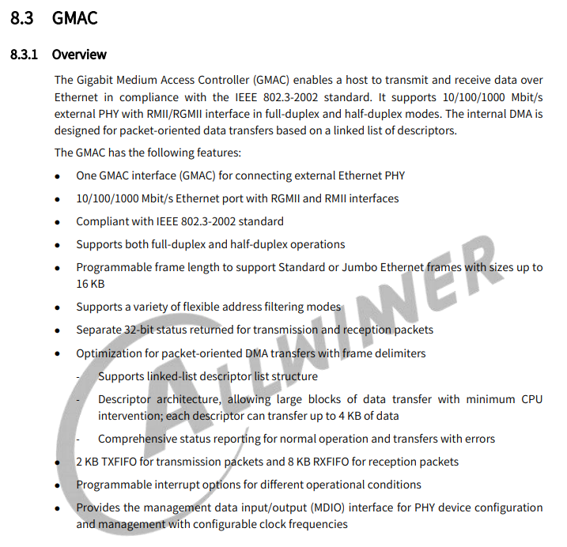

内核配置项目为：

```
CONFIG_AW_GMAC
CONFIG_AW_GMAC_MDIO
```

设备树配置项目：

```c
mdio0: mdio0@4500048 {
	compatible = "allwinner,sunxi-mdio";
	#address-cells = <1>;
	#size-cells = <0>;
	reg = <0x0 0x04500048 0x0 0x8>;
	status = "disabled";
	gmac0_phy0: ethernet-phy@1 {
		/* RTL8211F (0x001cc916) */
		reg = <1>;
		max-speed = <1000>;  /* Max speed capability */
		reset-gpios = <&pio PH 19 GPIO_ACTIVE_LOW>;
		/* PHY datasheet rst time */
		reset-assert-us = <10000>;
		reset-deassert-us = <150000>;
	};
};

gmac0: gmac0@4500000 {
	compatible = "allwinner,sunxi-gmac";
	reg = <0x0 0x04500000 0x0 0x10000>,
	      <0x0 0x03000030 0x0 0x4>;
	interrupts = <GIC_SPI 46 IRQ_TYPE_LEVEL_HIGH>;
	interrupt-names = "gmacirq";
	clocks = <&ccu CLK_GMAC0>, <&ccu CLK_GMAC0_25M>;
	clock-names = "gmac", "phy25m";
	resets = <&ccu RST_BUS_GMAC0>;
	phy-handle = <&gmac0_phy0>;
	status = "disabled";
};
```

- `compatible` 表征具体的设备，用于驱动和设备的绑定；
- `reg` 设备使用的地址；
- `interrupts` 设备使用的中断；
- `clocks` 设备使用的时钟；
- `status` 是否使能该设备节点；
- `phy-handle` phy器件句柄；
- phy子节点配置（***注：更换PHY器件需要更改此属性***）：
  - `reg` 表征phy地址，
  - `max-speed` 表征phy的最大速率，
  - `reset-gpios` 表征phy硬件复位的引脚，
  - `reset-assert-us` 硬件复位拉低时间，
  - `reset-deassert-us` 硬件复位拉

板级设备树配置：

```c
&mdio0 {
	status = "okay";
};

&gmac0 {
	phy-mode      = "rgmii";
	pinctrl-names = "default", "sleep";
	pinctrl-0     = <&gmac0_pins_default>;
	pinctrl-1     = <&gmac0_pins_sleep>;
	sunxi,phy-clk-type = <0>;
	tx-delay      = <3>;
	rx-delay      = <4>;

	gmac3v3-supply = <&reg_cldo3>;
	status = "okay";
};
```

- `phy-mode` GMAC与PHY之间的物理接口，如MII、RMII、RGMII等；
- `pinctrl-0` 设备active状态下的GPIO配置；
- `sunxi,phy-clk-type` 配置phy使用的时钟，0表示使用soc内置的25 M 时钟；
- `tx-delay` tx时钟延迟，tx-delay取值0-7，一档约536 ps（皮秒）；
- `rx-delay` rx时钟延迟，rx-delay取值0-31，一档约186 ps（皮秒）；
- `gmac3v3-supply` gmac电源脚，根据实际情况配置；
- `status` 是否使能该设备节点。

#### GMAC-200 配置说明

GMAC-200 控制器描述如下，其支持标准更新更丰富，其使用的是内核标准 stmmac 驱动。

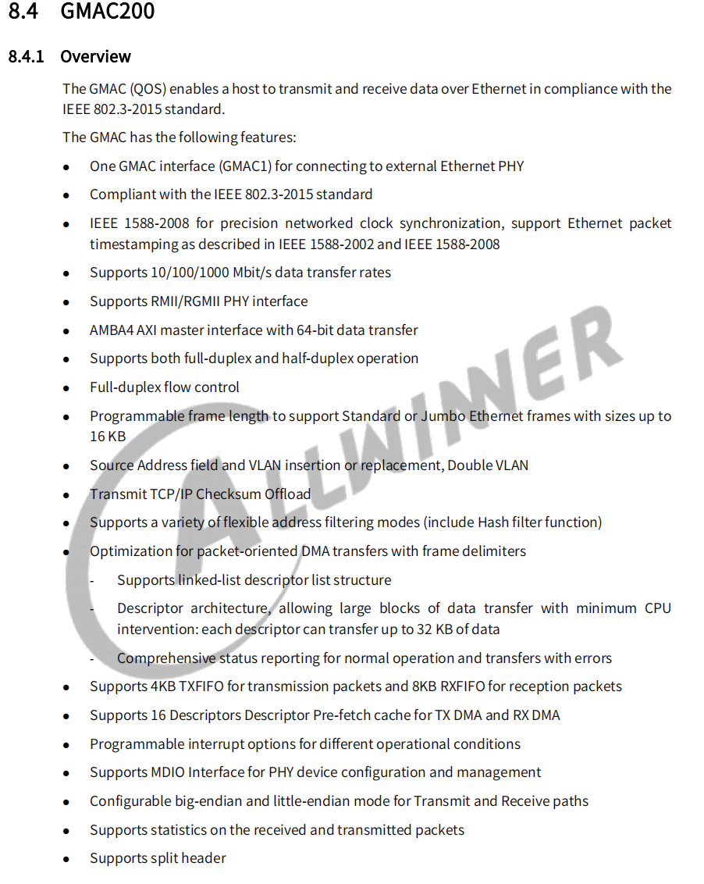

内核配置项目为：

```
CONFIG_AW_STMMAC_ETH
```

设备树配置项目：

```c
gmac1: ethernet@4510000 {
	compatible = "allwinner,sunxi-gmac-200", "snps,dwmac-4.20a";
	reg = <0x0 0x04510000 0x0 0x10000>,
			<0x0 0x03000034 0x0 0x4>;
	interrupts = <GIC_SPI 47 IRQ_TYPE_LEVEL_HIGH>;
	interrupt-names = "macirq";
	clocks = <&ccu CLK_GMAC1>, <&ccu CLK_GMAC1_MBUS_GATE>, <&ccu CLK_GMAC1_25M>;
	clock-names = "stmmaceth", "pclk", "phy25m";
	resets = <&ccu RST_BUS_GMAC1>;
	reset-names = "stmmaceth";
	phy-handle = <&gmac1_phy0>;
	status = "disabled";

	snps,fixed-burst;

	snps,axi-config = <&gmac1_stmmac_axi_setup>;
	snps,mtl-rx-config = <&gmac1_mtl_rx_setup>;
	snps,mtl-tx-config = <&gmac1_mtl_tx_setup>;

	gmac1_stmmac_axi_setup: stmmac-axi-config {
		snps,wr_osr_lmt = <0xf>;
		snps,rd_osr_lmt = <0xf>;
		snps,blen = <256 128 64 32 16 8 4>;
	};

	gmac1_mtl_rx_setup: rx-queues-config {
		snps,rx-queues-to-use = <1>;
		queue0 {};
	};

	gmac1_mtl_tx_setup: tx_queues-config {
		snps,tx-queues-to-use = <1>;
		queue0 {};
	};

	mdio1: mdio1@1 {
		compatible = "snps,dwmac-mdio";
		#address-cells = <1>;
		#size-cells = <0>;
		gmac1_phy0: ethernet-phy@1 {
			compatible = "ethernet-phy-ieee802.3-c22";
			reg = <0x1>;
			max-speed = <1000>;  /* Max speed capability */
			reset-gpios = <&pio PJ 27 GPIO_ACTIVE_LOW>;
			/* PHY datasheet rst time */
			reset-assert-us = <10000>;
			reset-deassert-us = <150000>;
		};
	};
};
```

- `compatible`: 表征具体的设备,用于驱动和设备的绑定；
- `reg`: 设备使用的地址；
- `interrupts`: 设备使用的中断；
- `clocks`: 设备使用的时钟；
- `status`: 是否使能该设备节点；
- `phy-handle`: phy器件句柄；
- phy子节点配置（***注：更换PHY器件需要更改此属性***）：
  - `reg`: 表征phy地址，
  - `max-speed`: 表征phy的最大速率，
  - `reset-gpios`: 表征phy硬件复位的引脚，
  - `reset-assert-us`: 硬件复位拉低时间，
  - `reset-deassert-us`: 硬件复位拉高时间；
- `snps,axi-config`: AXI总线模式参数；
- `snps,mtl-rx-config`: rx队列参数；
- `snps,mtl-tx-config`: tx队列参数。


板级设备树配置：

```c
&gmac1 {
	phy-mode = "rgmii";
	pinctrl-names = "default", "sleep";
	pinctrl-0 = <&gmac1_pins_default>;
	pinctrl-1 = <&gmac1_pins_sleep>;
	aw,soc-phy25m;
	tx-delay = <3>;
	rx-delay = <4>;
	dwmac3v3-supply = <&reg_cldo3>;
	status = "okay";
	mdio1: mdio1@1 {
		gmac1_phy0: ethernet-phy@1 {
			reset-gpios = <&pio PI 5 GPIO_ACTIVE_LOW>;
		};
	};
};
```

- `phy-mode`: GMAC与PHY之间的物理接口，如MII、RMII、RGMII等；
- `pinctrl-0`: 设备active状态下的GPIO配置；
- `aw,soc-phy25m`: 属性表示使用SOC供的25M时钟给PHY；
- `tx-delay`: tx时钟延迟，tx-delay取值0-7，一档约536 ps（皮秒）；
- `rx-delay`: rx时钟延迟，rx-delay取值0-31，一档约186 ps（皮秒）；
- `dwmac3v3-supply`: gmac-200电源脚，根据实际情况配置；
- `status`: 是否使能该设备节点。

## 调试说明

常用以太网调试的软件包：

###  ifconfig

使用`ifconfig -h`查看支持的参数，如下所示：

```
/ # ifconfig -h
Usage:
  ifconfig [-a] [-v] [-s] <interface> [[<AF>] <address>]
  [add <address>[/<prefixlen>]]
  [del <address>[/<prefixlen>]]
  [[-]broadcast [<address>]]  [[-]pointopoint [<address>]]
  [netmask <address>]  [dstaddr <address>]  [tunnel <address>]
  [outfill <NN>] [keepalive <NN>]
  [hw <HW> <address>]  [mtu <NN>]
  [[-]trailers]  [[-]arp]  [[-]allmulti]
  [multicast]  [[-]promisc]
  [mem_start <NN>]  [io_addr <NN>]  [irq <NN>]  [media <type>]
  [txqueuelen <NN>]
  [[-]dynamic]
  [up|down] ...

  <HW>=Hardware Type.
  List of possible hardware types:
    loop (Local Loopback) slip (Serial Line IP) cslip (VJ Serial Line IP)
    slip6 (6-bit Serial Line IP) cslip6 (VJ 6-bit Serial Line IP) adaptive (Adaptive Serial Line IP)
    ash (Ash) ether (Ethernet) ax25 (AMPR AX.25)
    netrom (AMPR NET/ROM) rose (AMPR ROSE) tunnel (IPIP Tunnel)
    ppp (Point-to-Point Protocol) hdlc ((Cisco)-HDLC) lapb (LAPB)
    arcnet (ARCnet) dlci (Frame Relay DLCI) frad (Frame Relay Access Device)
    sit (IPv6-in-IPv4) fddi (Fiber Distributed Data Interface) hippi (HIPPI)
    irda (IrLAP) x25 (generic X.25) infiniband (InfiniBand)
    eui64 (Generic EUI-64)
  <AF>=Address family. Default: inet
  List of possible address families:
    unix (UNIX Domain) inet (DARPA Internet) inet6 (IPv6)
    ax25 (AMPR AX.25) netrom (AMPR NET/ROM) rose (AMPR ROSE)
    ipx (Novell IPX) ddp (Appletalk DDP) ash (Ash)
    x25 (CCITT X.25)
```

- -a：显示全部接口信息；
- -s：显示摘要信息；

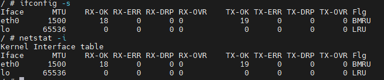

- add/del：添加对应网口的ipv6地址；

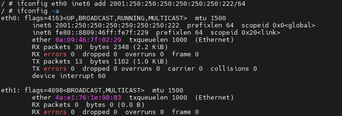

- netmask：设置子网掩码；

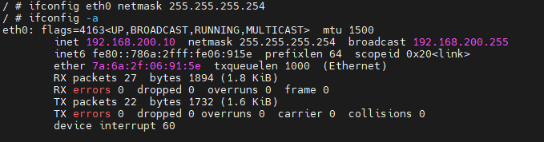

- hw：设置mac地址；

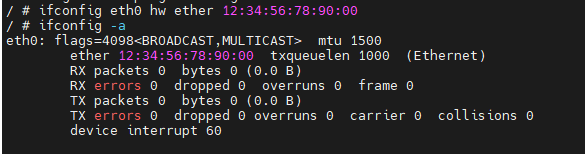

- arp：打开或者关闭对应网口是否支持arp功能，如下图所示，关闭arp协议，ping不通，打开之后就可以ping通；

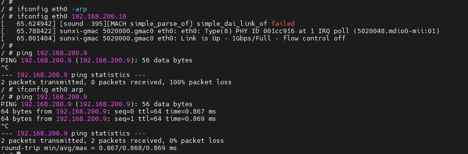

### route

设置和查看路由表都可以用 route 命令，设置内核路由表的命令格式是：

```shell
# route  [add|del] [-net|-host] target [netmask Nm] [gw Gw] [[dev] If]
```

其中：

- add：添加一条路由规则；
- del：删除一条路由规则；
- -net：目的地址是一个网络；
- -host：目的地址是一个主机；
- target：目的网络或主机；
- netmask：目的地址的网络掩码；
- gw：路由数据包通过的网关；
- dev：为路由指定的网络接口。

示例：


```shell
route add -host 192.168.200.9 dev eth0 #添加eth0的目的地址为192.168.200.9
route add -host 192.168.200.9 gw 192.168.200.1 #添加到目的地址192.168.200.9经过网关192.168.200.1
```

### mii_reg

`mii_reg` 工具是GMAC驱动中提供的调试节点，其主要作用是对外部PHY寄存器地址进行读写操作。

启动网卡：

```shell
ifconfig eth0 up
```

进入操作目录：

```shell
cd sys/devices/platform/soc@3000000/450000.eth
```

注：不同的目录可能会因板卡不同有差异，此处为大致路径。

读取对应的phy寄存器：

```shell
addr: PHY地址
reg: PHY寄存器
val: 数据
```

写操作：

```shell
echo addr reg val > mii_write; cat mii_write
eg:
echo 0x00 0x1f 0xa43 > mii_write; cat mii_write
```

读操作：

```shell
echo addr reg > mii_read; cat mii_read
eg:
echo 0x10 0x06 > mii_read; cat mii_read
```

一次读多位寄存器操作: 0x01~0x0a

```shell
cat mii_reg
```

- `udhcpc`
- `ethtool`

### 常用测试方法

#### 查看网络设备信息

- 查看网口状态：`ifconfig eth0 -a`  
- 查看收发包统计：`cat /proc/net/dev`
- 查看当前速率：`cat /sys/class/net/eth0/speed`

#### 打开/关闭网络设备

- 打开网络设备：`ifconfig eth0 up`

对于 GMAC 会显示 LOG：

```
sunxi-gmac 4500000.gmac0 eth0: eth0: Type(9) PHY ID 001cc916 at 1 IRQ poll (4500048.mdio0-mii:01)
```

对于 GMAC-200，会显示LOG：

```
dwmac-sunxi 4510000.ethernet eth1: PHY [stmmac-0:01] driver [Generic PHY] (irq=POLL)
dwmac-sunxi 4510000.ethernet eth1: Register MEM_TYPE_PAGE_POOL RxQ-0
dwmac4: Master AXI performs fixed burst length
dwmac-sunxi 4510000.ethernet eth1: No Safety Features support found
dwmac-sunxi 4510000.ethernet eth1: IEEE 1588-2008 Advanced Timestamp supported
dwmac-sunxi 4510000.ethernet eth1: configuring for phy/rgmii link mode
```

插上网线

- 关闭网络设备：`ifconfig eth0 down`

```
sunxi-gmac 4500000.gmac0 eth0: Link is Down
```

### 配置网络设备

- 配置静态IP地址：`ifconfig eth0 192.168.1.110`
- 配置MAC地址：`ifconfig eth0 hw ether 00:11:22:aa:bb:cc`
- 动态获取IP地址：`udhcpc -i eth0`
- PHY强制模式：`ethtool -s eth0 speed 1000 duplex full autoneg on`（设置1000 Mbps速率、全双工、开启自协商）

### 测试网络联通

- 设备连通性测试

ping 对端 ip 地址，本机ip和对端ip的前三个网段需相同才能ping通。

```
ping 192.168.1.100
```

- TCP 吞吐测试

假设 Server 端 IP 为：192.168.1.100

```
Server端：iperf3 -s -i 1
Client端：iperf3 -c 192.168.1.100 -i 1 -t 60
```

- UDP 吞吐测试

假设 Server 端 IP 为：192.168.1.100

```
Server端：iperf3 -s -u -i 1
Client端：iperf3 -c 192.168.1.100 -u -b 1000M -i 1 -t 60
```

### 本地网络环路性能测试

```
iperf3 -s &;iperf3 -c 127.0.0.1
```

### delay参数节点

delay参数调试节点是GMAC驱动中提供的调整千兆RGMII接口时序的节点。

进入操作目录：

```shell
cd /sys/devices/platform/soc/gmac/
```

注：不同的目录可能会因板卡不同有差异，此处为大致路径。

调整rxdelay时序：

```shell
#rx_delay：val - rxdelay参数，0~31共32挡，每档将采样时间推迟约130ps
echo val > rx_delay; cat rx_delay
```

调整txdelay时序：

```shell
#tx_delay：val - txdelay参数，0~7共8档，每档将采样时间推迟约536ps
echo val > tx_delay; cat tx_delay
```

### jumbo帧测试方法

准备两台均支持jumbo帧的板卡直连对测。

步骤：

以千兆网卡为例；

（1）板卡A：`ifconfig eth0 mtu 8100`，板卡B：`ifconfig eth0 mtu 8100`（设置eth0的mtu大小为8100）；

（2）板卡A：`ifconfig eth0 192.168.200.10`，板卡B：`ifconfig eth0 192.168.200.9`；

（3）板卡A：`ping 192.168.200.9 -s 8000`（传输8000长度的数据）。

注：

（1）百兆网卡不存在带宽不足情况，一般不需要使用jumbo帧；

（2）百兆网卡支持的 jumbo 帧范围为1500至4000，千兆网卡支持的 jumbo 帧范围为 1500 至 8100；

（3）测试时两端mtu无需设置成相同大小；

（4）ping通即表明测试通过；

（5）ping传输8000长度的原因：mtu为整个以太网帧的长度，ping工具指定的长度8000为纯数据长度，不包括ICMP及以太网报头的长度。

### 以太网回环测试

**问题背景：**

以太网能正常up，但是ping不通。

**复现步骤：**

ping对端设备，例如`ping 192.168.200.9。`

**问题分析：**

- PHY被设置成回环模式后，从MAC经过RMII/RGMII发送过来的数据不会再被发送到MDI上，而是在PHY内部PCS层进行回环，被回环到RGMII/RMII的接收通道，如下图所示；

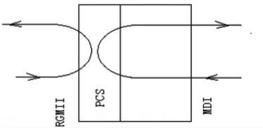

- 当设置了PHY的回环模式后，往外发包，如果小机端的rx能正常接收到数据，说明需要检查PHY到对端的硬件电路有无异常，反之需要检查RMII/RGMII接口的硬件电路有无异常；

**测试办法：**

- 通过GMAC驱动提供的节点，设置PHY的回环模式；

```
cd /sys/devices/platform/soc@3000000/4500000.gmac0 #注：此处为大致路径，不同版本内核路径有轻微差异
echo 2 > loopback_test; cat loopback_test
```

- 往外ping包，观察tx和rx的增长数量是否一致，若tx和rx的增长数量一致，则需要重点排查PHY到对端的硬件电路有无异常；若不一致（例如rx收不到包或数量少于tx），则需要重点排查RMII/RGMII接口的硬件电路有无异常。

## 以太网带宽测试

- 对端准备一块经过验证的千兆带宽达标（>=900Mbps）或百兆带宽达标的（>=90Mbps）板子/PC；
- 保持测试板卡系统处于低负载状态，关闭无关DEBUG选项及不跑非原生应用；
- 将对端与测试板卡用网线直连；
- 指定双方IP地址为同一网段，例如：测试板卡 ``ifconfig eth0 192.168.200.10``，对端：``ifconfig eth0 192.168.200.9``，PC的IP地址修改请参考7.2章节；
- 发送测试：对端输入``iperf -s -i 1``，测试板卡输入``iperf -c 192.168.200.9 -i 1 -t 60``；
- 接收测试：测试板卡输入``iperf -s -i 1``，对端输入``iperf -c 192.168.200.10 -i 1 -t 60``。

若按照上述步骤测试后，千兆带宽不达标，可能的影响因素包括：

- **单核CPU算力：** DDR频率、CPU自身算力、CPU频率、CPU的访存能力都会影响到CPU算力；
- **IP差异：** GMAC使用AHB总线比GMAC-200的AXI总线带宽少10~40M左右；
- **系统负载：** 以太网性能测试属于CPU消耗型任务，测试时系统需要保持在低负载的状态下，并且关闭无关的内核DEBUG选项；
- **硬件信号：** 硬件信号时序（保证建立保持时间最优，请使用7.4章节节点调试），硬件信号质量；
- **对端的发送与接收能力：** 以太网测试时确保对端是经过验证的千兆带宽达标的平台；
- **总线抢占：** 其他模块抢占GMAC的AHB总线及新GMAC的AXI总线带宽；
- **中断抢占及调度抢占：** Android固件建议在测试时把GMAC中断放在单独的核上（比如大核，命令例如：`echo f0 > /proc/irq/498/smp_affinity`，注：498是指GMAC的中断号，具体请以实际平台为准），Linux固件由于场景简单，一般无此需求。

注：

- 为什么要使用一块经过验证千兆带宽达标的板子直连对测；
  - 千兆达标的板子：对端的带宽吞吐能力会直接影响到测试板卡的吞吐；
  - 直连对测：避免引入无关因素，比如路由器的吞吐能力；
- 若测试千兆请使用**千兆网线；**

## 常见问题

### ifconfig命令无eth0节点

**问题现象**

执行ifconfig eth0无相关log信息。

**常见原因**

以太网模块配置未打开或存在GPIO冲突。

**排查步骤：**

（1）抓取内核启动log，检查驱动probe是否成功；

（2）如果无驱动相关打印，请确认以太网基本配置是否打开；

（3）如果驱动probe失败，请log定位具体原因，常见原因是GPIO冲突导致。

### 网络不通或网络丢包

**问题现象：**

ping不通对端设备、无法动态获取ip地址或有丢包现象。

**问题分析：**

一般原因是tx/rx通路不通

**排查步骤：**

（1）检查 `ifconfig eth0 up` 是否正常；

（2）检查 `eth0` 能否动态获取 `IP` 地址；

（3）若步骤1正常，但步骤2异常，需首先确认 `TX/RX` 哪条通路不通；

（4）若无法动态获取 `IP` 地址，可配置静态 `IP`，和对端设备互相 `ping`，如果和电脑对测，确保防火墙不会影响测试；

（5）检查对端设备能否收到数据包，若能收到，则说明 `TX` 通路正常，否则 `TX` 通路异常；

（6）检查本地设备能否收到数据包，若能收到，则说明 `RX` 通路正常，否则 `RX` 通路异常；

（7）若 `TX` 通路异常，可调整 `tx-delay` 参数或对照原理图检查 `TX` 通路是否异常，如漏焊关键器件；

（8）若 `RX` 通路异常，可调整 `rx-delay` 参数或对照原理图检查 `RX` 通路是否异常，如漏焊关键器件；

（9）若经过上述排查步骤问题仍未解决，需检查 `PHY` 供电与 `GPIO` 耐压是否匹配。

### 内核打印 `Link is Up`

- 保持网线插入网口，并连接以太网功能正常的对端设备；
- `ifconfig up` 网卡后，软件会起一个 1s 的轮询机制；
- 轮询查询 `PHY` 的 `02` 寄存器的 `Link status` 标志位，若为 `1`，则根据 `PHY` 的速率/双工 更改 `MAC` 的速率/双工，并打印 `Link is up - xxxMbps/Full` ，若为 `0`，则打印 `Link is Down`；
- 只有 `Link status` 发生改变时才会打印，比如 `0->1` `1->0`；
- `PHY` 的 `Link status` 标志位是只读的，根据两端 `PHY` 的自协商情况完成置 `1`/清 `0`，若遇到频繁 `Up/Down` 的情况，请参考第六章排查硬件问题。

### 找不到 PHY

运行 `ifconfig eth0 up` 显示如下输出

```
# GMAC
[ 25.506200] sunxi-gmac gmac0 eth0: Error：Could not connect to phy

# GMAC-200
[ 25.116200] dwmac-sunxi 45000000.ethernet eth0: stmmac_open: Cannot attach to PHY
```

- 检查 `PHY` 是否正确初始化：确保给 `PHY` 供给了 `25M` 时钟，正确设置了 `PINMUX`，以及确保 `PIN BANK` 电压已开启（如果适用）。如果出现 `PHY` 供电异常，可以检查供电电路以确保正常工作。此外，确保在激活网卡之前给 `PHY` 做了复位操作，以确保其处于正确的状态。如果遇到问题，请参考第六章的指南来检查 `PHY` 的硬件最小系统。
- 在更换了 `PHY` 之后，要特别注意 `PHY` 地址是否发生了变化。如果 `PHY` 地址发生了变化，需要相应地更新配置文件或软件中的 `PHY` 地址。这可能涉及到重新编译驱动程序或更新设备树等操作。确保在更新后，系统能够正确识别并与新的 `PHY` 进行通信。

- 使用示波器检查 `PHY` 的 `25M` 时钟是否正常，并使用万用表检查 `PHY` 的供电情况，包括 `AVDD33`、`DVDDIO`、`ADVDD10OUT`、`DVDD10OUT` 等电压是否正常。

- 在设备树（`dts`）中配置 `PHY` 的复位引脚：请参考原理图，将复位引脚配置到设备树的 `phy` 子节点的 `reset-gpios` 属性中。

- 处理 `PHY` 地址变更：结合原理图上 `PHYADD` 相关引脚的电平，将 `PHY` 地址配置到设备树的 `phy` 子节点的 `reg` 属性中。如果无法确定 `PHY` 地址，有以下两种方法可以获取：

  - 使用`mii_reg` 工具手动读取对应地址的 `PHY` 寄存器，若能正确读取到寄存器（例如 `phyid` 寄存器），则表示 `PHY` 的地址为当前地址。

  - 打开 `mdio` 驱动（`GMAC` 对应 `sunxi-mdio.c`，`GMAC200` 对应 `stmmac_mdio.c`）开头的 `DEBUG` 宏，启动日志会打印 `PHY` 地址。以 `GMAC-200` 为例，日志如下所示，`PHYADDR` 即为 `PHY` 地址，将这个值写入设备树 `phy` 子节点的 `reg` 属性中。

```shell
[    2.814160] dwmac-sunxi 4510000.ethernet: PHYADDR = 1, PHYID = 0x1cc916
```

### MAC复位失败

运行 `ifconfig eth0 up` 显示如下输出

```
# GMAC
[ 11.315214] sunxi-gmac gmac1 eth0: Error: Mac reset failed, please check phy and mac clk

# GMAC-200
[ 22.601790] dwmac-sunxi 45000000.ethernet eth0: stmmac_hw_setup: DMA engine initialization failed
[ 22.611644] dwmac-sunxi 45000000.ethernet eth0: stmmac_open: Hw setup failed
```

1. **时钟引脚方向不正确**：
   - 对于 `RMII` 接口，确保 `MAC` 的 `TXCK` 引脚是输入，由 `PHY` 输出该信号。
   - 对于 `RGMII` 接口，确保 `MAC` 的 `RGMII_CLKIN` 是输入，由 `PHY` 输出该信号。
2. **供给 `PHY` 的 `25M` 时钟偏差过大**：
   - 检查供给 `PHY` 的 `25M` 时钟频率是否在合理范围内（一般为 `25Mhz` ± `0.02Mhz`），请参考 `PHY` 的数据手册。
   - 如果时钟频率偏差过大，可能需要调整时钟源或修复时钟信号的源头问题。
3. **时钟信号频率不稳定**：
   - 对于 `RMII` 接口，确保回给 `MAC` 的时钟信号频率在合理范围内。对于 `10M` 和 `100M` 的速率，时钟频率应为 `5Mhz` 和 `50Mhz`；对于 `1000M` 的速率，时钟频率应为 `125Mhz`。
   - 对于 `RGMII` 接口，时钟频率应为 `25Mhz`（对应 `100M` 速率）或 `125Mhz`（对应 `1000M` 速率）。
   - 如果时钟频率不稳定，可能需要检查时钟信号的源头和信号线路，确保其稳定性和质量，可能需要重新布线或者使用更稳定的时钟源。

一般情况下PHY不需要PHY驱动，走内核的通用驱动，但某些厂商的PHY需要特殊的PHY驱动支持，如果按照通用PHY的调试方法仍无法调通，请联系PHY厂商提供资料。

### 以太网PHY硬件排查方法

#### 电源检查

- 电压检查：用万用表测试电压，需满足规格书要求。对于PHY，需要检查PHY的电源电压和IO供电，以RTL8211，为例，VDD与IO供电要求如下：

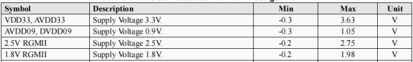

- 上电时序（示波器测量）、电压值（万用表测量）满足规格书要求。
- 上电波形检查：用示波器测试电源供电和IO供电的上电波形，核对是否存在电压过冲或跌落；若有电压波动，要求不能超过规格书的电压要求的范围，否则PHY可能工作异常；

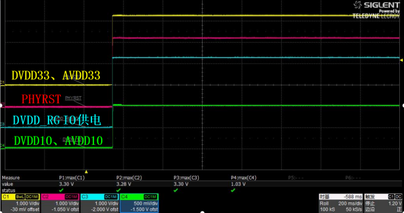

- 上电时序检查：根据规格书，确定PHY的上电时序是否正常；

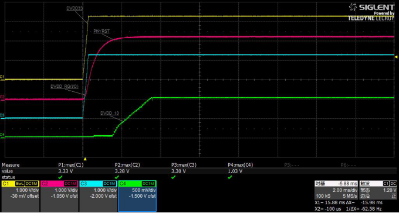

#### PHY 复位检查

用示波器测试上电波形是否满足规格书要求的Reset时序，一般要求PHYRST拉低10ms。示波器测量实际波形如下，实测PHYRSTB低电平为20.1ms，满足时序要求：

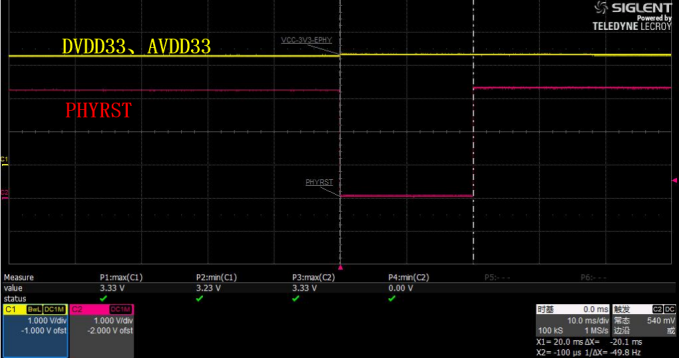

#### 时钟检查

PHY的基准时钟一般由晶振或SOC 25M_CLK提供，用示波器测试信号是否存在，频率偏差是否过大：

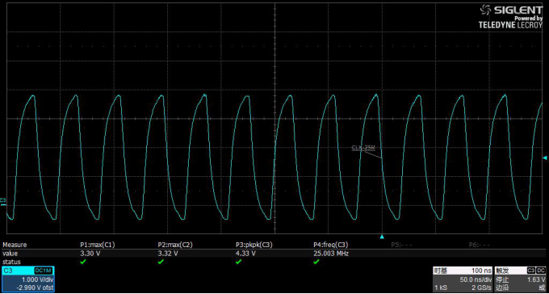

#### 外围电路配置

根据PHY规格书检查电路配置，如rtl8211，其兼容了RGMII和GMII两个模式，IO电压可以配置为3.3V、2.5V、1.8V、1.5V等，需要通过外围电路配置，若配置错误，可能引起工作异常；

- 信号检查：检查SOC端输出信号（RMII与RGMII）是否存在错接，少接的情况；
- PHY地址检查：确认是否与软件设定相匹配；

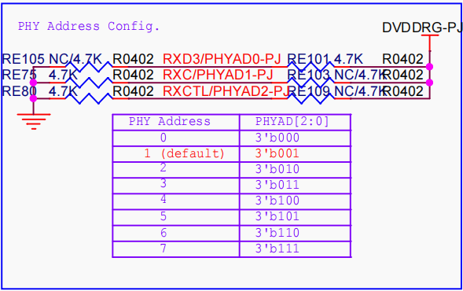

- 时钟配置以选择晶振输入或SOC 25M时钟输入；
  - 其中使用PHY使用SOC时钟输入时，XTAL-IN引脚需要接GND；


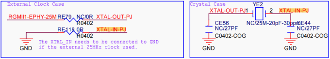

- IO电压配置：要求SOC IO供电与PHY IO供电相匹配；

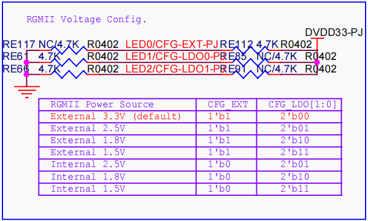

- 参考时钟配置：以RTL8201为例，REF_CLK 下拉，表示时钟输出;

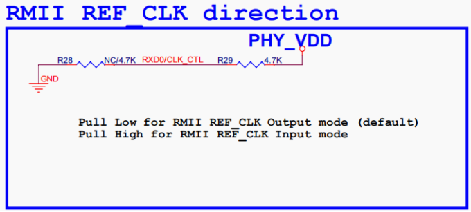

- 模式配置：以RTL8201为例，可以配置RMII 或 MII两个2模式，SOC一般只支持RMII/RGMII两种，需要配置RMII/RGMII

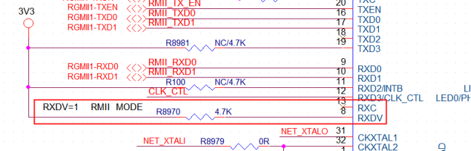

