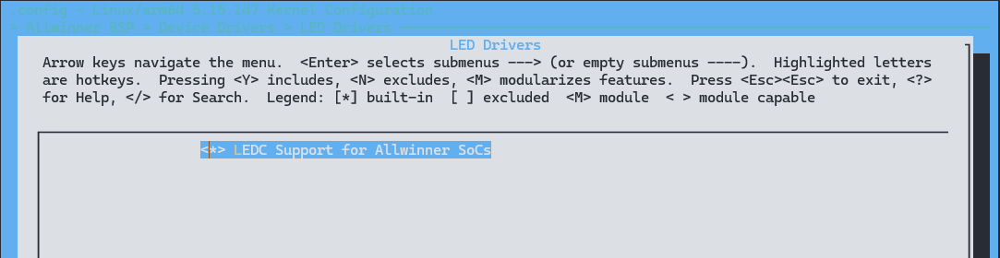

# LEDC - 发光二极管控制器

LEDC（Light Emitting Diode Controller），发光二极管控制器。支持驱动目前市场上已有成熟的智能外控 LED，例如 WS2812 系列，每个 LED 的三基色均可实现 256 级亮度显示，因此整个 LED 可完成 256ˆ3（即 16777216）种颜色的全真色彩显示。模块支持最大1024颗外控 LED级联。

## 模块介绍

LED 典型电路如图所示，其中 DI 表示控制数据输入脚，DO 表示控制数据输出脚。DI 端接收从控制器传过来的数据，每个 LED 内部的数据锁存器会存储 24bit 数据，剩余的数据经过内部整形处理电路整形放大后通过 DO 端口开始转发输出给下一个级联的 LED。因此，每经过一个LED，数据减少 24bit。


LED典型电路如上图所示，其中 DI 表示控制数据输入脚，DO 表示控制数据输出脚。DI 端接受从控制器传输过来的数据，每个 LED 内部的数据锁存器会存储 24bit (分别对应 R,G,B 三种颜色)数据，剩余的数据经过内部整形处理电路整形放大后通过 DO 端口开始转发输出给下一个级联的 LED 。因此，每经过一个 LED ，数据减少 24bit。


## 模块配置

### 驱动配置

驱动位于

```
LED Drivers ->
	<*> LEDC Support for Allwinner SoCs
```



### 设备树配置

在设备树中配置如下:

在 SoC 的 `dtsi` 文件中提炼了内存基地址、中断控制、时钟等共性信息，是该类芯片所有平台的模块配置

```c
ledc: ledc@2008000 {
	#address-cells = <1>;
	#size-cells = <0>;
	compatible = "allwinner,sunxi-leds";
	reg = <0x0 0x02008000 0x0 0x400>;
	interrupts = <GIC_SPI 28 IRQ_TYPE_LEVEL_HIGH>;
	clocks = <&ccu CLK_LEDC>, <&ccu CLK_BUS_LEDC>;
	clock-names = "clk_ledc", "clk_cpuapb";
	resets = <&ccu RST_BUS_LEDC>;
	reset-names = "ledc_reset";
	dmas = <&dma 42>, <&dma 42>;
	dma-names = "rx", "tx";
	status = "disabled";
};
```

在设备端，配置了 LEDC 的引脚，配置位于 `pio` 节点下

```c
&pio {
	ledc_pins_a: ledc@0 {
		pins = "PG0";
		function = "ledc";
		drive-strength = <10>;
	};

	ledc_pins_b: ledc@1 {
		pins = "PG0";
		function = "gpio_in";
	};
}
```

配置灯珠数量，时序等

```c
&ledc  {
	pinctrl-names = "default", "sleep";
	pinctrl-0 = <&ledc_pins_a>;
	pinctrl-1 = <&ledc_pins_b>;
	led_count = <34>;
	output_mode = "GRB";
	reset_ns = <84>;
	t1h_ns = <800>;
	t1l_ns = <320>;
	t0h_ns = <300>;
	t0l_ns = <800>;
	wait_time0_ns = <84>;
	wait_time1_ns = <84>;
	wait_data_time_ns = <600000>;
	status = "disabled";
};
```

- `pinctrl-names`: 用于表示 0 和 1 的 pinctrl 哪个是默认和休眠状态。
- `pinctrl-0`: 引脚配置，这里是默认使用的时候配置。
- `pinctrl-1`: 同上，这里是休眠时的配置。
- `led_count`: LED 灯的数目，根据硬件配置。
- `output_mode`: LED 灯输出模式，根据 LED 灯的 datasheet 进行配置。
- `reset_ns`: LED 灯 reset 时间控制。
- `t1h_ns`: 1 码高电平时间，根据 LED 灯的 datasheet 进行配置。
- `t1l_ns`: 1 码低电平时间，根据 LED 灯的 datasheet 进行配置。
- `t0h_ns`: 0 码高电平时间，根据 LED 灯的 datasheet 进行配置。
- `t0l_ns`: 0 码低电平时间，根据 LED 灯的 datasheet 进行配置。
- `wait_time0_ns`: 两个 LED 数据之间的等待时间，根据 LED 灯的 datasheet 进行配置。
- `wait_time1_ns`: 帧数据之间的等待时间，根据 LED 灯的 datasheet 进行配置。
- `wait_data_time_ns`: 内部 FIFO 等待数据时间，超过时间触发异常中断。
- `status`: 设备状态。

通常，如果想要使用一款新的 LEDC 灯，需要确认上述全部配置项都配置正确，比如说引脚配置以及 LED 灯的参数配置（包括 01 码高低电平时间、reset 时间以及 wait 时间），全部配置正确才能成功点亮。

## 驱动接口

驱动会在 `/sys/class/leds` 注册每个LED对应的设备目录

```
/sys/class/leds/sunxi_led0r // 红色
/sys/class/leds/sunxi_led0g // 绿色
/sys/class/leds/sunxi_led0b // 蓝色
```

其中 `0` 表示LED的编号，如果是 1 号 LED 则是

```
/sys/class/leds/sunxi_led1r
/sys/class/leds/sunxi_led1g
/sys/class/leds/sunxi_led1b
```

需要调节第 0 个LED的颜色为白光且最亮，操作如下：

```
echo 255 > /sys/class/leds/sunxi_led0r/brightness
echo 255 > /sys/class/leds/sunxi_led0g/brightness
echo 255 > /sys/class/leds/sunxi_led0b/brightness
```

## 使用 DEMO

这段代码的功能是打开一个 LED 设备文件，向该设备写入数据并计算帧率，最后关闭设备文件。

```c
#include <linux/input.h>
#include <fcntl.h>
#include <unistd.h>
#include <errno.h>
#include <string.h>
#include <stdio.h>
#include <stdlib.h>
#include <sys/types.h>
#include <sys/stat.h>
#include <sys/time.h>

int main(int argc, char *argv[])
{
    int fd;
    int led_counts = atoi(argv[1]); /* 将参数转换为整数 */
    unsigned char led_raw_buf[led_counts * 3];
    struct timeval start, end;
    long s, us;
    long elapsed;
    int time_count = 1000;
    float fps;

    if ((fd = open("/sys/class/led/light", O_RDWR)) < 0) {
        printf("can't open %s(%s)\n", "/sys/class/led/light", strerror(errno));
        return -1;
    }

    gettimeofday(&start, NULL);

    for (int i = 0; i < time_count; i++) {
        memset(led_raw_buf, ((i * 2) % 255), led_counts * 3); // 根据循环变量 i 设置 LED 数据
        write(fd, led_raw_buf, sizeof(led_raw_buf)); // 写入 LED 数据
    }

    gettimeofday(&end, NULL);

    s = end.tv_sec - start.tv_sec;
    us = end.tv_usec - start.tv_usec;
    elapsed = s * 1000000 + us;
    fps = time_count / ((float)elapsed / 1000000); // 计算帧率

    printf("test count %d, elapsed %ld us, fps %f\n", time_count, elapsed, fps);

    sleep(1);
    close(fd);
    printf("%s", "test finished\n");

    return 0;
}
```

## 调试接口

LEDC 相关的 `debugfs` 文件节点所在目录为 `/sys/kernel/debug/sunxi_leds`，节点说明如下：

| 节点名称          | 功能描述                                   | 可设置范围                   |
| ----------------- | ------------------------------------------ | ---------------------------- |
| reset_ns          | 设置和读取LED的reset时间                   | 80ns-327us                   |
| t1h_ns            | 设置和读取1码高电平时间                    | 80ns-2560ns                  |
| t1l_ns            | 设置和读取1码低电平时间                    | 80ns-1280ns                  |
| t0h_ns            | 设置和读取0码高电平时间                    | 80ns-1280ns                  |
| t0l_ns            | 设置和读取0码低电平时间                    | 80ns-2560ns                  |
| wait_time0_ns     | 设置和读取LED数据之间等待时间              | 80ns-10us                    |
| wait_time1_ns     | 设置和读取帧数据之间等待时间               | 80ns-85s                     |
| wait_data_time_ns | 设置和读取LEDC内部FIFO等待数据的时间容忍度 | 80ns-655us                   |
| data              | 读取data buffer中的数据                    | -                            |
| output_mode       | 设置和读取当前输出模式                     | GRB、GBR、RGB、RBG、BGR、BRG |
| trans_mode        | 设置和读取数据传输模式                     | CPU或DMA                     |
| hwversion         | 查看当前LEDC的硬件版本                     | -                            |

请注意

1. 设置的时间必须在所说明的时间范围内，否则不会做任何操作。
2. 最终设置寄存器之后得到的时间均为42ns的整数倍，若通过节点设置的时间不遵循42ns的整数倍，则实际所设置的时间为小于该值的最大能够被42ns整除的数。例如通过reset_ns设置90ns，则设置成功之后的LED reset时间为84ns。

实例:

- `echo 84 > /sys/kernel/debug/sunxi_leds/reset_ns`：将LED的reset时间设置为84ns。这个操作用于调整LED的复位时间，以确保LED在正常工作时能够正确地接收数据信号。

- `cat /sys/kernel/debug/sunxi_leds/data`：读取data buffer中的数据。该操作用于查看当前LED的数据状态，以便进行调试或监视LED的输出情况。

- `echo RGB > /sys/kernel/debug/sunxi_leds/output_mode`：将LED的输出模式设置为RGB。这个操作用于指定LED输出的颜色顺序，以确保LED正确显示所需的颜色。

- `echo DMA > /sys/kernel/debug/sunxi_leds/trans_mode`：将LED的数据传输模式设置为DMA。这个操作用于指定LED数据传输的方式，可以选择CPU或DMA，DMA通常能够提供更高的数据传输效率。

- `cat /sys/kernel/debug/sunxi_leds/hwversion`：查看当前LEDC的硬件版本。
