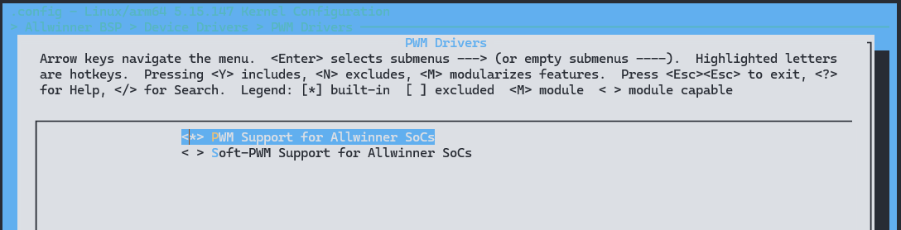

# PWM - 脉冲宽度调制

脉冲宽度调制（PWM）是一种对模拟信号电平进行数字编码的方法。 通过高分辨率计数器的使用，方波的占空比被调制用来对一个具体模拟信号的电平进行编码。

PWM模块属于Linux PWM子系统，会调用PWM子系统的相关接口。

不同平台上拥有不同个数的PWM通道，其中两个为一个PWM对。其中PWM具有以下特点：

- 支持脉冲，周期和互补对输出；
- 支出捕捉输入；
- 带可编程死区发生器，死区时间可控；
- 0-100M输出频率范围。0%-100%占空比可调，最小分辨率1/65536；
- 支持PWM输出和捕捉输入产生中断；
- 组模式下各通道输出波形相对相位可配置。

## 模块配置

### 驱动配置

驱动位于

```
PWM Drivers ->
	<*> PWM Support for Allwinner SoCs
	< > Soft-PWM Support for Allwinner SoCs 
```



### 设备树配置

#### PWM 控制器节点

这里以 PWM0 控制器作为示例说明

```c
pwm0: pwm0@2000c00 {
	#pwm-cells = <0x3>;
	compatible = "allwinner,sunxi-pwm-v201";
	reg = <0x0 0x02000c00 0x0 0x400>;
	clocks = <&ccu CLK_PWM>;
	interrupts = <GIC_SPI 19 IRQ_TYPE_LEVEL_HIGH>;
	resets = <&ccu RST_BUS_PWM>;
	pwm-number = <16>;
	pwm-base = <0x0>;
	sunxi-pwms = <&pwm0_0>, <&pwm0_1>, <&pwm0_2>, <&pwm0_3>, <&pwm0_4>,
	<&pwm0_5>, <&pwm0_6>, <&pwm0_7>, <&pwm0_8>, <&pwm0_9>,
	<&pwm0_10>, <&pwm0_11>, <&pwm0_12>, <&pwm0_13>,
	<&pwm0_14>, <&pwm0_15>;
	status = "okay";
};
```

* `compatible = "allwinner,sunxi-pwm-v201";`表示用哪套设备和驱动绑定

* `reg = <0x0 0x02000c00 0x0 0x400>;` 寄存器的基地址

* ` clocks = <&ccu CLK_PWM>;`时钟配置

* `interrupts = <GIC_SPI 19 IRQ_TYPE_LEVEL_HIGH>;`中断号的配置

* `resets = <&ccu RST_BUS_PWM>;`复位配置

* `pwm-number = <16>;`控制器的pwm通道个数

* `pwm-base = <0x0>;`pwm的起始基数

* `sunxi-pwms = <&pwm0_0>, <&pwm0_1>, ....;`  控制器的具体通道

#### PWM 通道配置

```c
pwm0_0: pwm0_0@2000c10 {
	compatible = "allwinner,sunxi-pwm0";
	pinctrl-names = "active", "sleep";
	reg = <0x0 0x02000c10 0x0 0x4>;
	reg_base = <0x02000c00>;
	status = "disabled";
};

pwm0_1: pwm0_1@2000c11 {
	compatible = "allwinner,sunxi-pwm1";
	pinctrl-names = "active", "sleep";
	reg = <0x0 0x02000c11 0x0 0x4>;
	reg_base = <0x02000c00>;
	status = "disabled";
};

pwm0_2: pwm0_2@2000c12 {
	compatible = "allwinner,sunxi-pwm2";
	pinctrl-names = "active", "sleep";
	reg = <0x0 0x02000c12 0x0 0x4>;
	reg_base = <0x02000c00>;
	status = "disabled";
};

pwm0_3: pwm0_3@2000c13 {
	compatible = "allwinner,sunxi-pwm3";
	pinctrl-names = "active", "sleep";
	reg = <0x0 0x02000c13 0x0 0x4>;
	reg_base = <0x02000c00>;
	status = "disabled";
};

pwm0_4: pwm0_4@2000c14 {
	compatible = "allwinner,sunxi-pwm4";
	pinctrl-names = "active", "sleep";
	reg = <0x0 0x02000c14 0x0 0x4>;
	reg_base = <0x02000c00>;
	status = "disabled";
};

pwm0_5: pwm0_5@2000c15 {
	compatible = "allwinner,sunxi-pwm5";
	pinctrl-names = "active", "sleep";
	reg = <0x0 0x02000c15 0x0 0x4>;
	reg_base = <0x02000c00>;
	status = "disabled";
};

pwm0_6: pwm0_6@2000c16 {
	compatible = "allwinner,sunxi-pwm6";
	pinctrl-names = "active", "sleep";
	reg = <0x0 0x02000c16 0x0 0x4>;
	reg_base = <0x02000c00>;
	status = "disabled";
};

pwm0_7: pwm0_7@2000c17 {
	compatible = "allwinner,sunxi-pwm7";
	pinctrl-names = "active", "sleep";
	reg = <0x0 0x02000c17 0x0 0x4>;
	reg_base = <0x02000c00>;
	status = "disabled";
};

pwm0_8: pwm0_8@2000c18 {
	compatible = "allwinner,sunxi-pwm8";
	pinctrl-names = "active", "sleep";
	reg = <0x0 0x02000c18 0x0 0x4>;
	reg_base = <0x02000c00>;
	status = "disabled";
};

pwm0_9: pwm0_9@2000c19 {
	compatible = "allwinner,sunxi-pwm9";
	pinctrl-names = "active", "sleep";
	reg = <0x0 0x02000c19 0x0 0x4>;
	reg_base = <0x02000c00>;
	status = "disabled";
};

pwm0_10: pwm0_10@2000c1a {
	compatible = "allwinner,sunxi-pwm10";
	pinctrl-names = "active", "sleep";
	reg = <0x0 0x02000c1a 0x0 0x4>;
	reg_base = <0x02000c00>;
	status = "disabled";
};

pwm0_11: pwm0_11@2000c1b {
	compatible = "allwinner,sunxi-pwm11";
	pinctrl-names = "active", "sleep";
	reg = <0x0 0x02000c1b 0x0 0x4>;
	reg_base = <0x02000c00>;
	status = "disabled";
};

pwm0_12: pwm0_12@2000c1c {
	compatible = "allwinner,sunxi-pwm12";
	pinctrl-names = "active", "sleep";
	reg = <0x0 0x02000c1c 0x0 0x4>;
	reg_base = <0x02000c00>;
	status = "disabled";
};

pwm0_13: pwm0_13@2000c1d {
	compatible = "allwinner,sunxi-pwm13";
	pinctrl-names = "active", "sleep";
	reg = <0x0 0x02000c1d 0x0 0x4>;
	reg_base = <0x02000c00>;
	status = "disabled";
};

pwm0_14: pwm0_14@2000c1e {
	compatible = "allwinner,sunxi-pwm14";
	pinctrl-names = "active", "sleep";
	reg = <0x0 0x02000c1e 0x0 0x4>;
	reg_base = <0x02000c00>;
	status = "disabled";
};

pwm0_15: pwm0_15@2000c1f {
	compatible = "allwinner,sunxi-pwm15";
	pinctrl-names = "active", "sleep";
	reg = <0x0 0x02000c1f 0x0 0x4>;
	reg_base = <0x02000c00>;
	status = "disabled";
};
```

具体通道配置按照需求进行配置。

- `pinctrl-names`：分别表示pwm的io口的两种工作状态；
- `pinctrl-0`、`pinctrl-1`：pwm两种工作状态的引脚参数设置；
- `status`:模块设备的打开或关闭，当编译该模块时，`status="okay";`不编译时，`status="disabled";`。

#### 多个 PWM 控制器配置

同时在一些芯片平台不只有一个 PWM 控制器，所以有多个控制器的配置，例如这里的 PWM1 如下

```c
pwm1: pwm1@2051000 {
    #pwm-cells = <0x3>;
    compatible = "allwinner,sunxi-pwm-v201";
    reg = <0x0 0x02051000 0x0 0x400>;
    clocks = <&ccu CLK_PWM1>;
    interrupts = <GIC_SPI 142 IRQ_TYPE_LEVEL_HIGH>;
    resets = <&ccu RST_BUS_PWM1>;
    pwm-number = <4>;
    pwm-base = <0x10>;
    sunxi-pwms = <&pwm1_0>, <&pwm1_1>, <&pwm1_2>, <&pwm1_3>;
    status = "disabled";
};

pwm1_0: pwm1_0@2051010 {
    compatible = "allwinner,sunxi-pwm16";
    pinctrl-names = "active", "sleep";
    reg = <0x0 0x02051010 0x0 0x4>;
    reg_base = <0x02051000>;
    status = "disabled";
};

pwm1_1: pwm1_1@2051011 {
    compatible = "allwinner,sunxi-pwm17";
    pinctrl-names = "active", "sleep";
    reg = <0x0 0x02051011 0x0 0x4>;
    reg_base = <0x02051000>;
    status = "disabled";
};

pwm1_2: pwm1_2@2051012 {
    compatible = "allwinner,sunxi-pwm18";
    pinctrl-names = "active", "sleep";
    reg = <0x0 0x02051012 0x0 0x4>;
    reg_base = <0x02051000>;
    status = "disabled";
};

pwm1_3: pwm1_3@2051013 {
    compatible = "allwinner,sunxi-pwm19";
    pinctrl-names = "active", "sleep";
    reg = <0x0 0x02051013 0x0 0x4>;
    reg_base = <0x02051000>;
    status = "disabled";
};
```

## 模块驱动

PWM驱动的源代码位于BSP独立仓库的 `drivers/pwm` 目录下，具体的路径如下所示：

```
.
├── Kconfig
├── Makefile
├── pwm-sunxi.c
├── pwm-sunxi.h
└── sunxi-soft-pwm.c
```

### 用户层接口

可以直接在linux内核中调试pwm模块，具体如下：

* 进入/sys/class/pwm目录。该目录是linux内核为pwm子系统提供的类目录，遍历该目录。可看到很多的pwmchipX，其中X表示很多能够被控制的通道，下面以pwmchip0为例进行说明。

```shell
/sys/class/pwm # ls
pwmchip0
```

* 可以看到，上述 pwmchip0 就是我们注册的pwm控制器，进入该目录，然后遍历该目录。

```shell
/sys/class/pwm # cd pwmchip0/
/sys/devices/platform/soc/1c23400.pwm/pwm/pwmchip0 # ls
device     export     npwm       subsystem  uevent     unexport
```

* 其中 `npwm` 文件储存了该pwm控制器的pwm个数，而export和unexport是导出和删除某个pwm设备的文件，下面演示导出pwm1。

```shell
/sys/devices/platform/soc/1c23400.pwm/pwm/pwmchip0 # cat npwm
2
/sys/devices/platform/soc/1c23400.pwm/pwm/pwmchip0 # echo 1 > export
/sys/devices/platform/soc/1c23400.pwm/pwm/pwmchip0 # ls
device     export     npwm       pwm1      subsystem  uevent     unexport
```

可以看到目录中多出pwm1目录，进入该目录显示出不同的节点。不同节点的参数如下：

- enable：使能pwm，其中1代表使能，0代表不使能；
- duty_cycle：pwm信号的占空比，单位为（ns）；
- period：pwm信号的频率，单位为（ns）；
- polarity：是否翻转极性，其中1表示翻转极性，0表示不翻转极性。

```shell
/sys/devices/platform/soc/1c23400.pwm/pwm/pwmchip0 # cd pwm1/
/sys/devices/platform/soc/1c23400.pwm/pwm/pwmchip0/pwm1 # ls
capture     duty_cycle  enable      period      polarity    uevent
```

可通过以上节点来对pwm的状态进行改变：

```shell
/sys/devices/platform/soc/1c23400.pwm/pwm/pwmchip0/pwm1 # echo 1000000000 > period
/sys/devices/platform/soc/1c23400.pwm/pwm/pwmchip0/pwm1 # echo 500000000 > duty_cycle
/sys/devices/platform/soc/1c23400.pwm/pwm/pwmchip0/pwm1 # echo normal > polarity
/sys/devices/platform/soc/1c23400.pwm/pwm/pwmchip0/pwm1 # echo 1 > enable
```

如果相关引脚接上了示波器等，可以看到波形。最后返回上层目录，删除该pwm设备。

```shell
/sys/devices/platform/soc/1c23400.pwm/pwm/pwmchip0/pwm1 # cd ..
/sys/devices/platform/soc/1c23400.pwm/pwm/pwmchip0 # ls
device     export     npwm       pwm1       subsystem  uevent     unexport
/sys/devices/platform/soc/1c23400.pwm/pwm/pwmchip0 # echo 1 > unexport
/sys/devices/platform/soc/1c23400.pwm/pwm/pwmchip0 # ls
device     export     npwm       subsystem  uevent     unexport
```

### 内核层接口

内核调用的接口如下

#### devm_pwm_get

- 函数原型: 

```c
struct pwm_device *devm_pwm_get(struct device *dev, const char *con_id)。
```

- 作用: 请求pwm设备。

- 参数: 
  - dev: 指向当前PWM设备的实例；

  -  con_id: 使用方绑定的名称；

- 返回值: 
  - 成功：返回请求成功的pwm设备;
  -  失败：返回错误码


#### pwm_config

- 函数原型

```c
static inline int pwm_config(struct pwm_device *pwm, int duty_ns, int period_ns)
```

- 作用: 更改PWM设备配置。

- 参数: 
  - dev: 指向当前PWM设备的实例；

  - duty_ns: 占空比；

  - period_ns：周期

- 返回值: 
  - 成功：0; 
  - 失败：负值错误码

#### pwm_enable

- 函数原型：

```c
static inline int pwm_enable(struct pwm_device *pwm)
```

- 作用: 启动PWM输出。

- 参数: pwm: 指向当前PWM设备的实例；

- 返回值: 
  - 成功：0； 
  - 失败：负值错误码


## 模块 DEMO

### 内核驱动 DEMO

编写一个内核驱动，调用 PWM 

```c
#include <linux/module.h>
#include <linux/kernel.h>
#include <linux/init.h>
#include <linux/platform_device.h>
#include <linux/pwm.h>

static int sunxi_pwm_test_probe(struct platform_device *pdev)
{
    int ret;
    struct pwm_device *chip;
    struct device *dev = &pdev->dev;

    chip = devm_kzalloc(dev, sizeof(*chip), GFP_KERNEL);
    if (!chip)
        return -ENOMEM;

    chip= devm_pwm_get(dev, "pwm-test");
    if (IS_ERR(chip)) {
        dev_err(dev, "Cannot request PWM channel\n");
        return PTR_ERR(chip);
    }

    /* set pwm period and duty_cycle */
    ret = pwm_config(chip, 5000, 10000);
    if (ret) {
        dev_err(dev, "Cannot configure PWM\n");
        return ret;
    }

    /* Enable PWM */
    ret = pwm_enable(chip);
    if (ret) {
        dev_err(dev, "Cannot enable PWM\n");
        return ret;
    }

    platform_set_drvdata(pdev, chip);

    return 0;
}

static int sunxi_pwm_test_remove(struct platform_device *pdev)
{
    struct pwm_device *chip = platform_get_drvdata(pdev);

    pwm_disable(chip);
    pwm_free(chip);

    return 0;
}

static const struct of_device_id sunxi_pwm_test_of_match[] = {
    { .compatible = "sunxi-pwm-test", },
    {},
};
MODULE_DEVICE_TABLE(of, sunxi_pwm_test_of_match);

static struct platform_driver sunxi_pwm_test_driver = {
    .driver = {
        .name = "sunxi-pwm-test",
        .owner = THIS_MODULE,
        .of_match_table = sunxi_pwm_test_of_match,
    },
    .probe = sunxi_pwm_test_probe,
    .remove = sunxi_pwm_test_remove,
};

module_platform_driver(sunxi_pwm_test_driver);

MODULE_LICENSE("GPL v2");
MODULE_AUTHOR("yourname <yourname@yourname.com>");
MODULE_DESCRIPTION("sunxi-pwm test driver");
MODULE_VERSION("1.0.0");
```

增加一个设备树节点，注册这个设备

```c
sunxi_pwm_test: sunxi-pwm-test {
	compatible = "sunxi-pwm-test";
	#pwm-cells = <3>;
	pwms = <&pwm0 0 500000 1000000 0>;
	pwm-names = "pwm-test";
	status = "oaky";
};
```

* `pwms = <&pwm0 0 500000 1000000 0>：`**&pwm0表示要引用的PWM的控制器（根据需求可引用对应的引脚）；**0 表示对应 pwm0_0 下的具体通道；`500000`表示占空比；`1000000`表示周期；`0`表示极性。
* `pwm-names = "pwm-test";` 表示索引具体的pwm通道名称。其名称与devm_pwm_get(dev, "pwm-test")的第二个参数保持一致。

配置 PWM0_0 通道的引脚

```c
&pio {
    pwm0_0_pin_active: pwm0_0@0 {
        pins = "PD23";
        function = "pwm0_0";
    };
    
    pwm0_0_pin_sleep: pwm0_0@1 {
        pins = "PD23";
        function = "gpio_in";
        bias-pull-down
    };
};

&pwm0_0 {
    pinctrl-names = "active", "sleep";
    pinctrl-0 = <&pwm0_0_pin_active>;
    pinctrl-1 = <&pwm0_0_pin_sleep>;
    status = "okay";
};
```

编译内后，当系统启动即可启用 PWM0_0 通道输出波形

### 用户层调用 DEMO

以下是一个使用 C 语言编写的操作 PWM0 的示例代码：

```c
#include <stdio.h>
#include <stdlib.h>
#include <string.h>

#define PWM_PATH "/sys/class/pwm/pwmchip0/"
#define PWM_EXPORT_PATH PWM_PATH "export"
#define PWM_UNEXPORT_PATH PWM_PATH "unexport"
#define PWM0_PATH PWM_PATH "pwm0/"

int main() {
    // 导出 PWM0
    FILE *export_file = fopen(PWM_EXPORT_PATH, "w");
    if (export_file == NULL) {
        perror("Error opening export file");
        return 1;
    }
    fprintf(export_file, "0");
    fclose(export_file);

    // 设置 PWM0 的周期和占空比
    char period_path[256];
    strcpy(period_path, PWM0_PATH);
    strcat(period_path, "period");
    FILE *period_file = fopen(period_path, "w");
    if (period_file == NULL) {
        perror("Error opening period file");
        return 1;
    }
    fprintf(period_file, "1000000000"); // 设置周期为 1s
    fclose(period_file);

    char duty_cycle_path[256];
    strcpy(duty_cycle_path, PWM0_PATH);
    strcat(duty_cycle_path, "duty_cycle");
    FILE *duty_cycle_file = fopen(duty_cycle_path, "w");
    if (duty_cycle_file == NULL) {
        perror("Error opening duty cycle file");
        return 1;
    }
    fprintf(duty_cycle_file, "500000000"); // 设置占空比为 50%
    fclose(duty_cycle_file);

    // 设置极性为正常并使能 PWM
    FILE *polarity_file = fopen(PWM0_PATH "polarity", "w");
    if (polarity_file == NULL) {
        perror("Error opening polarity file");
        return 1;
    }
    fprintf(polarity_file, "normal");
    fclose(polarity_file);

    FILE *enable_file = fopen(PWM0_PATH "enable", "w");
    if (enable_file == NULL) {
        perror("Error opening enable file");
        return 1;
    }
    fprintf(enable_file, "1");
    fclose(enable_file);

    // 删除 PWM0
    FILE *unexport_file = fopen(PWM_UNEXPORT_PATH, "w");
    if (unexport_file == NULL) {
        perror("Error opening unexport file");
        return 1;
    }
    fprintf(unexport_file, "0");
    fclose(unexport_file);

    return 0;
}
```

这段代码将会打开相应的文件，并向其中写入所需的数值来配置 PWM0 的周期、占空比、极性和使能状态。完成后，会关闭文件并最终删除 PWM0。

### PWM 捕获模式 DEMO

**捕获模式原理：**将两个引脚连接起来，对A引脚设置参数，用B引脚去捕获A的参数。

**测试方法：**用杜邦线将两个具有PWM功能的引脚连接起来，在一个引脚上设置需要的频率及占空比,在另一个引脚的下读取capture。

* 根据普通调试接口的方法,对其中一个引脚设置频率及占空比。

```
/sys/devices/platform/soc/1c23400.pwm/pwm/pwmchip0 # echo 0 > export
/sys/devices/platform/soc/1c23400.pwm/pwm/pwmchip0 # cd pwm0/
/sys/devices/platform/soc/1c23400.pwm/pwm/pwmchip0/pwm0 # echo 20000 > period
/sys/devices/platform/soc/1c23400.pwm/pwm/pwmchip0/pwm0 # echo 5000 > duty_cycle
/sys/devices/platform/soc/1c23400.pwm/pwm/pwmchip0/pwm0 # echo normal > polarity
/sys/devices/platform/soc/1c23400.pwm/pwm/pwmchip0/pwm0 # echo 1 > enable
```

- 采用capture模式在另一个引脚上捕获频率及占空比。

```
/sys/devices/platform/soc/1c23400.pwm/pwm/pwmchip0 # echo 3 > export
/sys/devices/platform/soc/1c23400.pwm/pwm/pwmchip0 # cd pwm3/
/sys/devices/platform/soc/1c23400.pwm/pwm/pwmchip0/pwm3 # cat capture
```

