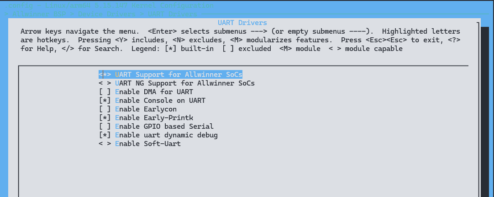
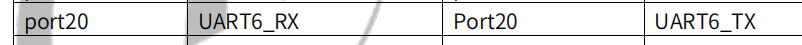
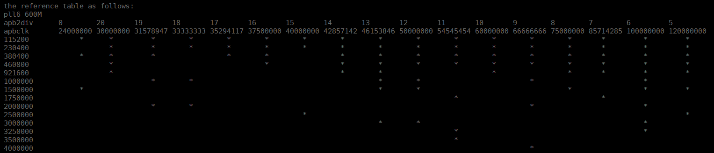

# UART - 通用异步收发传输器

通用异步收发器（Universal Asynchronous Receiver/Transmitter)，通常称作UART，是一种串行、异步、全双工的通信协议，在嵌入式领域应用的非常广泛。在19世纪60年代，为了解决计算机和电传打字机通信，Bell发明了UART协议，将并行输入信号转换成串行输出信号。因为UART简单实用的特性，其已经成为一种使用非常广泛的通讯协议。UART 控制器支持以下功能：

- 兼容标准16550串口
- 支持发送接收FIFO
- 支持DMA控制接口
- 支持软件/硬件流控配置
- 支持IrDA 1.0 SIR
- 支持2/4/8线串口接口
- 支持5-8数据位和1/1.5/2停止位
- 支持奇偶校验，无校验位

## 模块配置

### 驱动配置

驱动位于

```text
UART Drivers ->
	<*> UART Support for Allwinner SoCs    # 使用 UART 驱动
	< > UART NG Support for Allwinner SoCs # 使用 UART NG 驱动
	[ ] Enable DMA for UART                # UART 启用 DMA 传输
	[*] Enable Console on UART             # UART 用于显示终端
	[ ] Enable Earlycon                    # 启用 Earlycon
	[*] Enable Early-Printk                # 启用 Early Printk
	[ ] Enable GPIO based Serial           # 启用基于 GPIO 的 UART
	[*] Enable uart dynamic debug          # UART 动态调试
	< > Enable Soft-Uart                   # 启用软件 UART
```



### 设备树配置

在 Device Tree 中对每一个 UART 控制器进行配置,一个 UART 控制器对应一个 UART 节点,节点属性的含义见注释。为了在UART 驱动代码中区分每一个UART 控制器，需要在 `Device Tree` 中的 `aliases` 节点中未每一个。
UART 节点指定别名，如下 `aliases` 节点所示。别名形式为字符串“serial”加连续编号的数字，在UART 驱动程序中可以通过 `of_alias_get_id()` 函数获取对应的 UART 控制器的数字编号，从而区分每一个 UART 控制器。

```c
aliases {
	serial0 = &uart0;
	serial1 = &uart1;
	serial2 = &uart2;
	serial3 = &uart3;
	serial4 = &uart4;
	serial5 = &uart5;
	serial6 = &uart6;
	serial7 = &uart7;
};
```

#### 二线串口配置

在 SoC 的 `dtsi` 文件中提炼了内存基地址、中断控制、时钟等共性信息，是该类芯片所有平台的模块配置

```c
uart0: uart@2500000 {
	compatible = "allwinner,sun55i-uart";
	reg = <0x0 0x02500000 0x0 0x400>;     /* 设备使用的基地址 */
	interrupts = <GIC_SPI 2 IRQ_TYPE_LEVEL_HIGH>; /* 设备使用的中断 */
	clocks = <&ccu CLK_BUS_UART0>;  /* 设备使用的时钟 */
	resets = <&ccu RST_BUS_UART0>;  /* 设备reset时钟 */
	uart0_port = <0>;               /* 端口号 */
	uart0_type = <2>;               /* 该串口支持的模式，通常有2/4/8 */
    sunxi,uart-fifosize = <64>;	    /* 模块FIFO深度 */
	status = "disabled";
};
```

在设备端，配置了 UART 的引脚，配置位于 `pio` 节点下

```c
&pio {
    uart0_pins_a: uart0_pins@0 {
		pins = "PB9", "PB10";
		function = "uart0";
	};

	uart0_pins_b: uart0_pins@1 {
		pins = "PB9", "PB10";
		function = "gpio_in";
	};
};
```

配置引脚，功能等

```c
&uart0 {
	pinctrl-names = "default", "sleep";
	pinctrl-0 = <&uart0_pins_a>;
	pinctrl-1 = <&uart0_pins_b>;
	uart-supply = <&reg_cldo3>;
	status = "okay";
};
```

#### 四线串口配置

在设备树中配置如下:

在 SoC 的 `dtsi` 文件中提炼了内存基地址、中断控制、时钟等共性信息，是该类芯片所有平台的模块配置

```c
uart1: uart@2500400 {
	compatible = "allwinner,sun55i-uart";
	device_type = "uart1";
	reg = <0x0 0x02500400 0x0 0x400>;
	interrupts = <GIC_SPI 3 IRQ_TYPE_LEVEL_HIGH>;
	sunxi,uart-fifosize = <64>;
	clocks = <&ccu CLK_BUS_UART1>;
	clock-names = "uart1";
	resets = <&ccu RST_BUS_UART1>;
	pinctrl-names = "default", "sleep";
	uart1_port = <1>;
	uart1_type = <4>;
	status = "disabled";
};
```

在设备端，配置了 UART 的引脚，配置位于 `pio` 节点下

```c
&pio {
    uart1_pins_a: uart1@0 {
        pins = "PG6", "PG7", "PG8", "PG9";
        function = "uart1";
        drive-strength = <10>;
        bias-pull-up;
    };

    uart1_pins_b: uart1@1 {
        pins = "PG6", "PG7", "PG8", "PG9";
        function = "gpio_in";
    };
};
```

配置引脚，功能等

```c
&uart1 {
	pinctrl-names = "default", "sleep";
	pinctrl-0 = <&uart1_pins_a>;
	pinctrl-1 = <&uart1_pins_b>;
	status = "okay";
};
```

#### DMA 模式配置

在内核打开 `CONFIG_AW_SERIAL_DMA` 配置后可以使用 DMA 模式

```
uart6: uart@2501800 {
	compatible = "allwinner,sun55i-uart";
	reg = <0x0 0x2501800 0x0 0x400>;
	interrupts = <GIC_SPI 8 IRQ_TYPE_LEVEL_HIGH>;
	clocks = <&ccu CLK_UART6>;
	resets = <&ccu RST_BUS_UART6>;
	use_dma = <3>;	/* 是否采用DMA 方式传输，0：不启用，1：只启用TX，2：只启用RX，3：启用TX 与RX */
	dmas = <&dma 20>, <&dma 20>;	/* 20 表示DRQ, 查看手册得知 */
	dma-names = "tx", "rx";
	uart6_port = <6>;
	uart6_type = <2>;
	sunxi,uart-fifosize = <128>;
	status = "disabled";
};
```

其中的 dma 通道号可以查看数据手册得知



在设备端，配置了 UART 的引脚，配置位于 `pio` 节点下

```
&pio {
	uart6_pins_a: uart6_pins@0 {
		pins = "PI6", "PI7";
		function = "uart6";
	};

	uart6_pins_b: uart6_pins@1 {
		pins = "PI6", "PI7";
		function = "gpio_in";
	};
};
```

## 模块使用说明

UART驱动会注册生成串口设备 `/dev/ttySx`，应用层的使用只需遵循 Linux 系统中的标准串口编程方法即可。

UART驱动会注册生成串口设备/dev/ttySx，应用层的使用只需遵循Linux系统中的标准串口编程方法即可。

### 打开/关闭串口

使用标准的文件打开函数：

```c
int open(const char *pathname, int flags);
int close(int fd);
```
需要引用头文件：

```c
#include <sys/types.h>
#include <sys/stat.h>
#include <fcntl.h>
#include <unistd.h>
```
### 读/写串口

同样使用标准的文件读写函数：

``` c
ssize_t read(int fd, void *buf, size_t count);
ssize_t write(int fd, const void *buf, size_t count);
```
需要引用头文件：

``` c
#include <unistd.h>
```
### 设置串口属性

串口属性包括波特率、数据位、停止位、校验位、流控等，这部分是串口设备特有的接口。串口属性的数据结构termios定义如下：（terminos.h）。

```c
#define NCCS 19
struct termios {
	tcflag_t c_iflag;		/* input mode flags */
	tcflag_t c_oflag;		/* output mode flags */
	tcflag_t c_cflag;		/* control mode flags */
	tcflag_t c_lflag;		/* local mode flags */
	cc_t c_line;			/* line discipline */
	cc_t c_cc[NCCS];		/* control characters */
};
```
其中，c_iflag的标志常量定义如下：

| 标志    | 说明                                                         |
| ------- | ------------------------------------------------------------ |
| IGNBRK  | 忽略输入中的 BREAK 状态。                                    |
| BRKINT  | 如果设置了 IGNBRK，将忽略 BREAK。如果没有设置，但是设置了 BRKINT，那么 BREAK 将使得输入和输出队列被刷新，如果终端是一个前台进程组的控制终端，这个进程组中所有进程将收到 SIGINT 信号。如果既未设置 IGNBRK 也未设置 BRKINT，BREAK 将视为与 NUL 字符同义，除非设置了 PARMRK，这种情况下它被视为序列 \\377 \\0 \\0。 |
| IGNPAR  | 忽略桢错误和奇偶校验错。                                     |
| PARMRK  | 如果没有设置 IGNPAR，在有奇偶校验错或桢错误的字符前插入 \\377 \\0。如果既没有设置 IGNPAR 也没有设置 PARMRK，将有奇偶校验错或桢错误的字符视为 \\0。 |
| INPCK   | 启用输入奇偶检测。                                           |
| ISTRIP  | 去掉第八位。                                                 |
| INLCR   | 将输入中的 NL 翻译为 CR。                                    |
| IGNCR   | 忽略输入中的回车。                                           |
| ICRNL   | 将输入中的回车翻译为新行 (除非设置了 IGNCR)。                |
| IUCLC   | (不属于 POSIX) 将输入中的大写字母映射为小写字母。            |
| IXON    | 启用输出的 XON/XOFF 流控制。                                 |
| IXANY   | (不属于 POSIX.1；XSI) 允许任何字符来重新开始输出。           |
| IXOFF   | 启用输入的 XON/XOFF 流控制。                                 |
| IMAXBEL | (不属于 POSIX) 当输入队列满时响零。Linux 没有实现这一位，总是将它视为已设置。 |

c_oflag 的标志常量定义如下：

| 标志   | 说明                                                         |
| ------ | ------------------------------------------------------------ |
| OLCUC  | (不属于 POSIX) 将输出中的小写字母映射为大写字母。            |
| ONLCR  | (XSI) 将输出中的新行符映射为回车-换行。                      |
| OCRNL  | 将输出中的回车映射为新行符。                                 |
| ONOCR  | 不在第 0 列输出回车。                                        |
| ONLRET | 不输出回车。                                                 |
| OFILL  | 发送填充字符作为延时，而不是使用定时来延时。                 |
| OFDEL  | (不属于 POSIX) 填充字符是 ASCII DEL (0177)。如果不设置，填充字符则是 ASCII NUL。 |
| NLDLY  | 新行延时掩码。取值为 NL0 和 NL1。                            |
| CRDLY  | 回车延时掩码。取值为 CR0, CR1, CR2, 或 CR3。                 |
| TABDLY | 水平跳格延时掩码。取值为 TAB0, TAB1, TAB2, TAB3 (或 XTABS)。取值为 TAB3，即 XTABS，将扩展跳格为空格 (每个跳格符填充 8 个空格)。 |
| BSDLY  | 回退延时掩码。取值为 BS0 或 BS1。(从来没有被实现过)。        |
| VTDLY  | 竖直跳格延时掩码。取值为 VT0 或 VT1。                        |
| FFDLY  | 进表延时掩码。取值为 FF0 或 FF1。                            |

c_cflag 的标志常量定义如下：

| 标志    | 说明                                                         |
| ------- | ------------------------------------------------------------ |
| CBAUD   | (不属于 POSIX) 波特率掩码 (4+1 位)。                         |
| CBAUDEX | (不属于 POSIX) 扩展的波特率掩码 (1 位)，包含在 CBAUD 中。(POSIX 规定波特率存储在 termios 结构中，并未精确指定它的位置，而是提供了函数 cfgetispeed() 和 cfsetispeed() 来存取它。一些系统使用 c_cflag 中 CBAUD 选择的位，其他系统使用单独的变量，例如 sg_ispeed 和 sg_ospeed 。) |
| CSIZE   | 字符长度掩码。取值为 CS5, CS6, CS7, 或 CS8。                 |
| CSTOPB  | 设置两个停止位，而不是一个。                                 |
| CREAD   | 打开接受者。                                                 |
| PARENB  | 允许输出产生奇偶信息以及输入的奇偶校验。                     |
| PARODD  | 输入和输出是奇校验。                                         |
| HUPCL   | 在最后一个进程关闭设备后，降低 modem 控制线 (挂断)。         |
| CLOCAL  | 忽略 modem 控制线。                                          |
| LOBLK   | (不属于 POSIX) 从非当前 shell 层阻塞输出(用于 shl )。        |
| CIBAUD  | (不属于 POSIX) 输入速度的掩码。CIBAUD 各位的值与 CBAUD 各位相同，左移了 IBSHIFT 位。 |
| CRTSCTS | (不属于 POSIX) 启用 RTS/CTS (硬件) 流控制。                  |

c_lflag 的标志常量定义如下：

| 标志    | 说明                                                         |
| ------- | ------------------------------------------------------------ |
| ISIG    | 当接受到字符 INTR, QUIT, SUSP, 或 DSUSP 时，产生相应的信号。 |
| ICANON  | 启用标准模式 (canonical mode)。允许使用特殊字符 EOF, EOL, EOL2, ERASE, KILL, LNEXT, REPRINT, STATUS, 和 WERASE，以及按行的缓冲。 |
| XCASE   | (不属于 POSIX; Linux 下不被支持) 如果同时设置了 ICANON，终端只有大写。输入被转换为小写，除了以 \ 前缀的字符。输出时，大写字符被前缀 \，小写字符被转换成大写。 |
| ECHO    | 回显输入字符。                                               |
| ECHOE   | 如果同时设置了 ICANON，字符 ERASE 擦除前一个输入字符，WERASE 擦除前一个词。 |
| ECHOK   | 如果同时设置了 ICANON，字符 KILL 删除当前行。                |
| ECHONL  | 如果同时设置了 ICANON，回显字符 NL，即使没有设置 ECHO。      |
| ECHOCTL | (不属于 POSIX) 如果同时设置了 ECHO，除了 TAB, NL, START, 和 STOP 之外的 ASCII 控制信号被回显为 ^X, 这里 X 是比控制信号大 0x40 的 ASCII 码。例如，字符 0x08 (BS) 被回显为 ^H。 |
| ECHOPRT | (不属于 POSIX) 如果同时设置了 ICANON 和 IECHO，字符在删除的同时被打印。 |
| ECHOKE  | (不属于 POSIX) 如果同时设置了 ICANON，回显 KILL 时将删除一行中的每个字符，如同指定了 ECHOE 和 ECHOPRT 一样。 |
| DEFECHO | (不属于 POSIX) 只在一个进程读的时候回显。                    |
| FLUSHO  | (不属于 POSIX; Linux 下不被支持) 输出被刷新。这个标志可以通过键入字符 DISCARD 来开关。 |
| NOFLSH  | 禁止在产生 SIGINT, SIGQUIT 和 SIGSUSP 信号时刷新输入和输出队列。 |
| PENDIN  | (不属于 POSIX; Linux 下不被支持) 在读入下一个字符时，输入队列中所有字符被重新输出。(bash 用它来处理 typeahead) |
| TOSTOP  | 向试图写控制终端的后台进程组发送 SIGTTOU 信号。              |
| IEXTEN  | 启用实现自定义的输入处理。这个标志必须与 ICANON 同时使用，才能解释特殊字符 EOL2，LNEXT，REPRINT 和 WERASE，IUCLC 标志才有效。 |

c_cc 数组定义了特殊的控制字符。符号下标 (初始值) 和意义为：

| 标志     | 说明                                                         |
| -------- | ------------------------------------------------------------ |
| VINTR    | (003, ETX, Ctrl-C, or also 0177, DEL, rubout) 中断字符。发出 SIGINT 信号。当设置 ISIG 时可被识别，不再作为输入传递。 |
| VQUIT    | (034, FS, Ctrl-\) 退出字符。发出 SIGQUIT 信号。当设置 ISIG 时可被识别，不再作为输入传递。 |
| VERASE   | (0177, DEL, rubout, or 010, BS, Ctrl-H, or also #) 删除字符。删除上一个还没有删掉的字符，但不删除上一个 EOF 或行首。当设置 ICANON 时可被识别，不再作为输入传递。 |
| VKILL    | (025, NAK, Ctrl-U, or Ctrl-X, or also @) 终止字符。删除自上一个 EOF 或行首以来的输入。当设置 ICANON 时可被识别，不再作为输入传递。 |
| VEOF     | (004, EOT, Ctrl-D) 文件尾字符。更精确地说，这个字符使得 tty 缓冲中的内容被送到等待输入的用户程序中，而不必等到 EOL。如果它是一行的第一个字符，那么用户程序的 read() 将返回 0，指示读到了 EOF。当设置 ICANON 时可被识别，不再作为输入传递。 |
| VMIN     | 非 canonical 模式读的最小字符数。                            |
| VEOL     | (0, NUL) 附加的行尾字符。当设置 ICANON 时可被识别。          |
| VTIME    | 非 canonical 模式读时的延时，以十分之一秒为单位。            |
| VEOL2    | (not in POSIX; 0, NUL) 另一个行尾字符。当设置 ICANON 时可被识别。 |
| VSTART   | (021, DC1, Ctrl-Q) 开始字符。重新开始被 Stop 字符中止的输出。当设置 IXON 时可被识别，不再作为输入传递。 |
| VSTOP    | (023, DC3, Ctrl-S) 停止字符。停止输出，直到键入 Start 字符。当设置 IXON 时可被识别，不再作为输入传递。 |
| VSUSP    | (032, SUB, Ctrl-Z) 挂起字符。发送 SIGTSTP 信号。当设置 ISIG 时可被识别，不再作为输入传递。 |
| VLNEXT   | (not in POSIX; 026, SYN, Ctrl-V) 字面上的下一个。引用下一个输入字符，取消它的任何特殊含义。当设置 IEXTEN 时可被识别，不再作为输入传递。 |
| VWERASE  | (not in POSIX; 027, ETB, Ctrl-W) 删除词。当设置 ICANON 和 IEXTEN 时可被识别，不再作为输入传递。 |
| VREPRINT | (not in POSIX; 022, DC2, Ctrl-R) 重新输出未读的字符。当设置 ICANON 和 IEXTEN 时可被识别，不再作为输入传递。 |

### tcgetattr

* 作用：获取串口设备的属性。
* 参数：
  - fd，串口设备的文件描述符。
  - termios_p，用于保存串口属性。
* 返回：
  - 成功，返回0。
  - 失败，返回-1，errnor给出具体错误码。

### tcsetattr

* 作用：设置串口设备的属性。
* 参数：
  - fd，串口设备的文件描述符。
  - optional_actions，本次设置什么时候生效。
  - termios_p，指向要设置的属性结构。
* 返回：
  - 成功，返回0。
  - 失败，返回-1，errnor给出具体错误码


其中，optional_actions的取值有：

- TCSANOW：会立即生效。

- TCSADRAIN：当前的输出数据完成传输后生效，适用于修改了输出相关的参数。

- TCSAFLUSH：当前的输出数据完成传输，如果输入有数据可读但没有读就会被丢弃。

### cfgetispeed

* 作用：返回串口属性中的输入波特率。
* 参数：
  - termios_p，指向保存有串口属性的结构。
* 返回：
  - 成功，返回波特率，取值是一组宏，定义在terminos.h。
  - 失败，返回-1，errnor给出具体错误码。

波特率定义如下所示：

| 宏定义   | 值      |
| -------- | ------- |
| B0       | 0000000 |
| B50      | 0000001 |
| B75      | 0000002 |
| B110     | 0000003 |
| B134     | 0000004 |
| B150     | 0000005 |
| B200     | 0000006 |
| B300     | 0000007 |
| B600     | 0000010 |
| B1200    | 0000011 |
| B1800    | 0000012 |
| B2400    | 0000013 |
| B4800    | 0000014 |
| B9600    | 0000015 |
| B19200   | 0000016 |
| B38400   | 0000017 |
| B57600   | 0010001 |
| B115200  | 0010002 |
| B230400  | 0010003 |
| B460800  | 0010004 |
| B500000  | 0010005 |
| B576000  | 0010006 |
| B921600  | 0010007 |
| B1000000 | 0010010 |
| B1152000 | 0010011 |
| B1500000 | 0010012 |
| B2000000 | 0010013 |
| B2500000 | 0010014 |
| B3000000 | 0010015 |
| B3500000 | 0010016 |
| B4000000 | 0010017 |

### cfgetospeed

* 作用：返回串口属性中的输出波特率。
* 参数：
  - termios_p，指向保存有串口属性的结构。
* 返回：
  - 成功，返回波特率，取值是一组宏，定义在terminos.h。
  - 失败，返回-1，errnor给出具体错误码。

### cfsetispeed

* 作用：设置输入波特率到属性结构中。
* 参数：
  - termios_p，指向保存有串口属性的结构。
  - speed，波特率。
* 返回：
  - 成功，返回0。
  - 失败，返回-1，errnor给出具体错误码。

### cfsetospeed

* 作用：设置输出波特率到属性结构中。
* 参数：
  - termios_p，指向保存有串口属性的结构。
  - speed，波特率。
* 返回：
  - 成功，返回0。
  - 失败，返回-1，errnor给出具体错误码

### cfsetspeed

* 作用：同时设置输入和输出波特率到属性结构中。
* 参数：
  - termios_p，指向保存有串口属性的结构。
  - speed，波特率。
* 返回：
  - 成功，返回0。
  - 失败，返回-1，errnor给出具体错误码

### tcflush

* 作用：清空输出缓冲区、或输入缓冲区的数据，具体取决于参数queue_selector。
* 参数：
  - fd，串口设备的文件描述符。
  - queue_selector，清空数据的操作。
* 返回：
  - 成功，返回0。
  - 失败，返回-1，errnor给出具体错误码。

参数queue_selector的取值有三个：

- TCIFLUSH：清空输入缓冲区的数据。

- TCOFLUSH：清空输出缓冲区的数据。

- TCIOFLUSH：同时清空输入/输出缓冲区的数据。

## 使用 DEMO

此 demo 程序是打开一个串口设备，然后侦听这个设备，如果有数据可读就读出来并打印。设备名称、侦听的循环次数都可以由参数指定。

```c
#include <errno.h>  /*错误号定义*/
#include <fcntl.h>  /*文件控制定义*/
#include <stdio.h>  /*标准输入输出定义*/
#include <stdlib.h> /*标准函数库定义*/
#include <string.h>
#include <sys/stat.h>
#include <sys/types.h>
#include <termios.h> /*PPSIX 终端控制定义*/
#include <unistd.h>  /*Unix 标准函数定义*/

enum parameter_type {
    PT_PROGRAM_NAME = 0,
    PT_DEV_NAME,
    PT_CYCLE,

    PT_NUM
};

#define DBG(string, args...)                                       \
    do {                                                           \
        printf("%s, %s()%u---", __FILE__, __FUNCTION__, __LINE__); \
        printf(string, ##args);                                    \
        printf("\n");                                              \
    } while (0)

void usage(void) {
    printf("You should input as: \n");
    printf("\t select_test [/dev/name] [Cycle Cnt]\n");
}

int OpenDev(char *name) {
    int fd = open(name, O_RDWR);//| O_NOCTTY | O_NDELAY
    if (-1 == fd)
        DBG("Can't Open(%s)!", name);

    return fd;
}

/**
*@brief  设置串口通信速率
*@param  fd     类型 int  打开串口的文件句柄
*@param  speed  类型 int  串口速度
*@return  void
*/
void set_speed(int fd, int speed) {
    int i;
    int status;
    struct termios Opt = {0};
    int speed_arr[] = {
            B38400,
            B19200,
            B9600,
            B4800,
            B2400,
            B1200,
            B300,
            B38400,
            B19200,
            B9600,
            B4800,
            B2400,
            B1200,
            B300,
    };
    int name_arr[] = {
            38400,
            19200,
            9600,
            4800,
            2400,
            1200,
            300,
            38400,
            19200,
            9600,
            4800,
            2400,
            1200,
            300,
    };

    tcgetattr(fd, &Opt);

    for (i = 0; i < sizeof(speed_arr) / sizeof(int); i++) {
        if (speed == name_arr[i])
            break;
    }

    tcflush(fd, TCIOFLUSH);
    cfsetispeed(&Opt, speed_arr[i]);
    cfsetospeed(&Opt, speed_arr[i]);

    Opt.c_lflag &= ~(ICANON | ECHO | ECHOE | ISIG); /*Input*/
    Opt.c_oflag &= ~OPOST;                          /*Output*/

    status = tcsetattr(fd, TCSANOW, &Opt);
    if (status != 0) {
        DBG("tcsetattr fd");
        return;
    }
    tcflush(fd, TCIOFLUSH);
}

/**
*@brief   设置串口数据位，停止位和效验位
*@param  fd     类型  int  打开的串口文件句柄
*@param  databits 类型  int 数据位   取值 为 7 或者8
*@param  stopbits 类型  int 停止位   取值为 1 或者2
*@param  parity  类型  int  效验类型 取值为N,E,O,,S
*/
int set_Parity(int fd, int databits, int stopbits, int parity) {
    struct termios options;

    if (tcgetattr(fd, &options) != 0) {
        perror("SetupSerial 1");
        return -1;
    }
    options.c_cflag &= ~CSIZE;

    switch (databits) /*设置数据位数*/
    {
        case 7:
            options.c_cflag |= CS7;
            break;
        case 8:
            options.c_cflag |= CS8;
            break;
        default:
            fprintf(stderr, "Unsupported data size\n");
            return -1;
    }

    switch (parity) {
        case 'n':
        case 'N':
            options.c_cflag &= ~PARENB; /* Clear parity enable */
            options.c_iflag &= ~INPCK;  /* Enable parity checking */
            break;
        case 'o':
        case 'O':
            options.c_cflag |= (PARODD | PARENB); /* 设置为奇效验*/
            options.c_iflag |= INPCK;             /* Disnable parity checking */
            break;
        case 'e':
        case 'E':
            options.c_cflag |= PARENB;  /* Enable parity */
            options.c_cflag &= ~PARODD; /* 转换为偶效验*/
            options.c_iflag |= INPCK;   /* Disnable parity checking */
            break;
        case 'S':
        case 's': /*as no parity*/
            options.c_cflag &= ~PARENB;
            options.c_cflag &= ~CSTOPB;
            break;
        default:
            fprintf(stderr, "Unsupported parity\n");
            return -1;
    }

    /* 设置停止位*/
    switch (stopbits) {
        case 1:
            options.c_cflag &= ~CSTOPB;
            break;
        case 2:
            options.c_cflag |= CSTOPB;
            break;
        default:
            fprintf(stderr, "Unsupported stop bits\n");
            return -1;
    }

    /* Set input parity option */
    if (parity != 'n')
        options.c_iflag |= INPCK;
    tcflush(fd, TCIFLUSH);
    options.c_cc[VTIME] = 150; /* 设置超时15 seconds*/
    options.c_cc[VMIN] = 0;    /* Update the options and do it NOW */
    if (tcsetattr(fd, TCSANOW, &options) != 0) {
        perror("SetupSerial 3");
        return -1;
    }
    return 0;
}

void str_print(char *buf, int len) {
    int i;

    for (i = 0; i < len; i++) {
        if (i % 10 == 0)
            printf("\n");

        printf("0x%02x ", buf[i]);
    }
    printf("\n");
}

int main(int argc, char **argv) {
    int i = 0;
    int fd = 0;
    int cnt = 0;
    char buf[256];

    int ret;
    fd_set rd_fdset;
    struct timeval dly_tm;// delay time in select()

    if (argc != PT_NUM) {
        usage();
        return -1;
    }

    sscanf(argv[PT_CYCLE], "%d", &cnt);
    if (cnt == 0)
        cnt = 0xFFFF;

    fd = OpenDev(argv[PT_DEV_NAME]);
    if (fd < 0)
        return -1;

    set_speed(fd, 19200);
    if (set_Parity(fd, 8, 1, 'N') == -1) {
        printf("Set Parity Error\n");
        exit(0);
    }

    printf("Select(%s), Cnt %d. \n", argv[PT_DEV_NAME], cnt);
    while (i < cnt) {
        FD_ZERO(&rd_fdset);
        FD_SET(fd, &rd_fdset);

        dly_tm.tv_sec = 5;
        dly_tm.tv_usec = 0;
        memset(buf, 0, 256);

        ret = select(fd + 1, &rd_fdset, NULL, NULL, &dly_tm);
        //		DBG("select() return %d, fd = %d", ret, fd);
        if (ret == 0)
            continue;

        if (ret < 0) {
            printf("select(%s) return %d. [%d]: %s \n", argv[PT_DEV_NAME], ret, errno, strerror(errno));
            continue;
        }

        i++;
        ret = read(fd, buf, 256);
        printf("Cnt%d: read(%s) return %d.\n", i, argv[PT_DEV_NAME], ret);
        str_print(buf, ret);
    }

    close(fd);
    return 0;
}
```

1. `OpenDev` 函数用于打开串口设备。
2. `set_speed` 函数用于设置串口通信速率。
3. `set_Parity` 函数用于设置数据位、停止位和效验位。
4. `str_print` 函数用于以十六进制格式打印字符串。
5. `main` 函数是程序的入口，首先解析命令行参数，然后根据参数打开串口设备并配置串口参数，最后通过循环使用 select 函数读取串口数据。

## 调试接口

### 动态调试接口

勾选内核 `CONFIG_DYNAMIC_DEBUG` 功能，开启 `[*] Enable uart dynamic debug` 功能

1. 挂载 debugfs 文件系统：
   ```
   mount -t debugfs none /sys/kernel/debug
   ```
   这条命令将 debugfs 文件系统挂载到 /sys/kernel/debug 目录，以便进行动态调试操作。

2. 打开 uart 模块所有打印：
   ```
   echo "module sunxi_uart +p" > /mnt/dynamic_debug/control
   ```
   这条命令表示打开名为 sunxi_uart 模块的所有打印信息，并将其输出级别设置为最高(p)。

3. 打开指定文件的所有打印：
   ```
   echo "file sunxi-uart.c +p" > /mnt/dynamic_debug/control
   ```
   这条命令表示打开名为 sunxi-uart.c 文件的所有打印信息，并将其输出级别设置为最高(p)。

4. 打开指定文件指定行的打印：
   ```
   echo "file sunxi-uart.c line 615 +p" > /mnt/dynamic_debug/control
   ```
   这条命令表示打开名为 sunxi-uart.c 文件的第 615 行的打印信息，并将其输出级别设置为最高(p)。

5. 打开指定函数名的打印：
   ```
   echo "func sw_uart_set_termios +p" > /mnt/dynamic_debug/control
   ```
   这条命令表示打开名为 sw_uart_set_termios 函数的打印信息，并将其输出级别设置为最高(p)。

6. 关闭打印：
   ```
   echo "func sw_uart_set_termios -p" > /mnt/dynamic_debug/control
   ```

### 调试节点

UART端口的一些硬件资源信息：

```
/sys/devices/platform/soc*/*uart*/dev_info
```

UART端口的一些运行状态信息，包括控制器的各寄存器值

```
/sys/devices/platform/soc*/*uart*/status
```

当前UART端口的寄存器值、收发数据的统计等

```
/sys/devices/platform/soc*/*uart*/ctrl_info
```

## FAQ

### 设置 UART 波特率

UART控制器会对输入的时钟源进行分频，最终输出一个频率满足（或近似）UART波特率的时钟信号。UART常用的标准波特率有：

UART时钟的分频比是16的整数倍，分频难免会有误差，所以输出UART Device通信的波特率是否足够精准，很大程度取决于输入的时钟源频率。
考虑到功耗，UART驱动中一般默认使用24M时钟源，但是根据应用场景我们有时候需要切换别的时钟源，基于两个原因：

1. `24MHz/16=1.5MHz`，这个最大频率满足不了1.5M以上的波特率应用；

2. 24M分频后得到波特率误差可能太大，也满足不了某些UART外设的冗余要求（一般要求2%或5%以内，由外设决定）。

UART时钟源来自APB，在不同平台上可能是APB1或APB2，APB的时钟源有多个，包括24MHz（HOSC）和PLL_PERIPH（即驱动中的PLL_PERIPH_CLK），系统默认配置APB的时钟源是24M，如果要提高UART的时钟就要将APB的时钟源设置为PLL_PERIPH，一般挑选600M的PLL_PERIPH时钟。同时要注意到APB也是TWI的时钟源，所以需要兼顾TWI时钟。

各个 UART 波特率对应频点关系如下：



例如需要配置 uart2 的波特率为 460800，在上述关系表中可以看出，对应的APB时钟为30M、37.5M、42.857M、46.153M和50M等，所以需要在设备树里修改 uart2 时钟源：

支持460800波特率需要修改的dts内容如下，注意uart0及其他在用时钟也需要同步修改保持一致性，避免乱码:

```c
			device_type = "uart2";
			reg = <0x0 0x05000800 0x0 0x400>;
			interrupts = <GIC_SPI 2 IRQ_TYPE_LEVEL_HIGH>;
-			clocks = <&clk_uart2>;
+			clocks = <&ccu CLK_BUS_UART0>,
+					<&ccu CLK_APB2>,
+					<&ccu CLK_PSI_AHB1_AHB2>;
+			clock-frequency = <50000000>;
			pinctrl-names = "default", "sleep";
```

### UART 回环测试使用说明

回环测试分为硬件回环与软件回环：

若需要使用硬件回环，需要短接uart的tx与rx引脚

若需要使用软件回环，可以在`/sys/devices/platform`路径下找到uart的loopback节点，使用如下指令即可配置软件回环：

```
echo enable > loopback
```

注意：除了 `enable`,其他所有字符都表示不开启回环