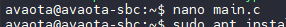
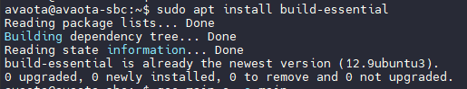
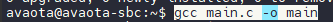
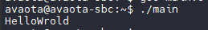

# 编写 Hello World

Avaota OS 基于 Linux 系统，所以支持板载开发。这里将以编写一个 HelloWorld 作为示例。

首先新建一个文件，命名为 `main.c` 

```
avaota@avaota-sbc:~$ nano main.c
```



然后编写如下内容：

```c
#include <stdio.h>

int main()
{
        printf("HelloWrold\n");
}
```

之后安装编译工具链。如下

```
sudo apt install build-essential
```

可以看到目前系统里已经安装了，且为最新版本



编译可执行文件

```
gcc main.c -o main
```



运行该文件

```
./main
```



## 演示

import AsciinemaWidget from '/src/components/AsciinemaWidget';

<AsciinemaWidget src={require('./assets/post/01-helloworld/helloworld.docx').default} rows={30} idleTimeLimit={1} preload={true} />