# 部署 LNMP 服务

## 准备工作

在这之前，确保设备已经联网，可以用 `ifconfig` 命令查看联网状态。这里使用的是 WIFI 联网，可以看到已经获取了IP地址。

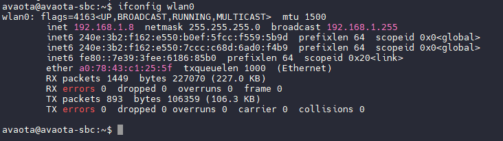

由于安装需要较长时间，建议使用 `screen` 后台登录，这里看到系统默认已经安装了 `screen`

```
sudo apt install screen
```

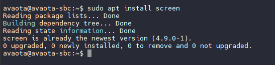

## 安装 LNMP 服务

使用一键安装程序，安装配置 LNMP 服务器

首先进入 ROOT 模式

```
sudo -i
```

然后开始安装

```c
wget https://soft.lnmp.com/lnmp/lnmp2.0.tar.gz -O lnmp2.0.tar.gz && tar zxf lnmp2.0.tar.gz && cd lnmp2.0 && ./install.sh lnmp
```

运行上述LNMP安装命令后，会出现如下提示：

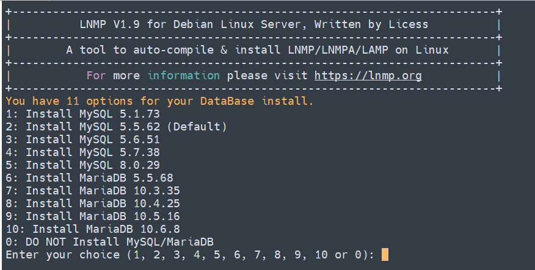

目前提供了较多的MySQL、MariaDB版本和不安装数据库的选项，需要**注意的是MySQL 5.6,5.7及MariaDB 10如果是编译安装必须在1G以上内存的更高配置上才能选择**！如仅需安装数据库在lnmp安装包目录下执行：./install.sh db

输入对应MySQL或MariaDB版本前面的序号，回车进入下一步.

如果选择MySQL/MariaDB如果有对应架构的二进制包会提示：”Using Generic Binaries [y/n]:“ 这一步是提示是否使用二进制安装，输入 y 为使用二进制安装，输入 n 为使用源码编译安装。如果没有提示说明当前架构没有对应的二进制安装包。
**由于MySQL 5.7/8.0二进制包巨大，离线安装请使用编译安装方式或自行下载对应版本二进制包到安装包src目录下**。

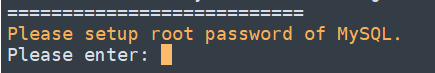

设置MySQL的root密码（为了安全不输入直接回车将会设置为lnmp.org#随机数字）如果输入有错误需要删除时，可以按住Ctrl再按Backspace键进行删除(个别情况下是只需按Backspace键)。输入后回车进入下一步，如下图所示：

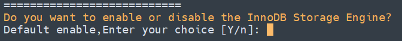

询问是否需要启用MySQL InnoDB，InnoDB引擎默认为开启，一般建议开启，直接回车或输入 y ，如果确定确实不需要该引擎可以输入 n，(MySQL 5.7+版本无法关闭InnoDB),输入完成，回车进入下一步。

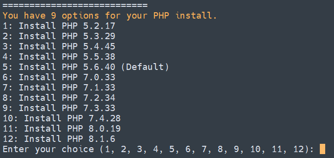

注意：选择PHP 7+版本时需要自行确认PHP版本是否与自己的程序兼容。

输入要选择的PHP版本的序号，回车进入下一步，选择是否安装内存优化：

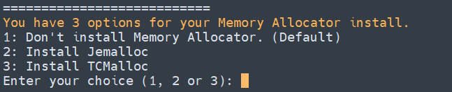

可以选择不安装、Jemalloc 或 TCmalloc，输入对应序号回车，直接回车为默认为不安装。

然后就进入了安装流程，耐心等待即可。

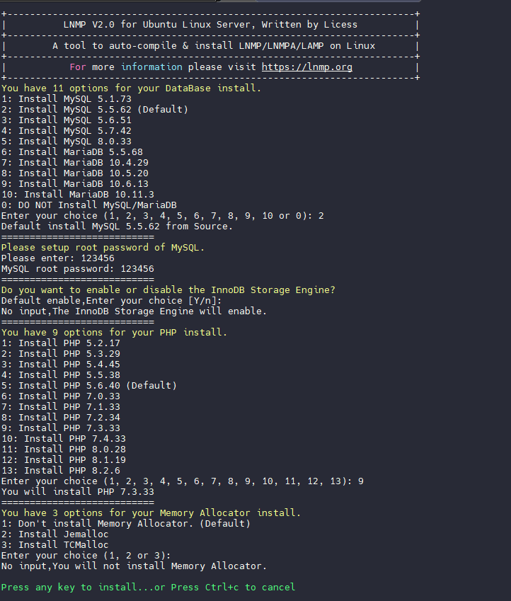

安装完成后会有提示

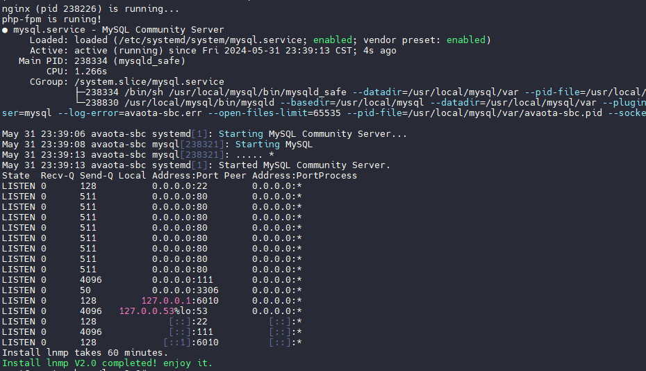

此时可以连接到开发板的IP地址，查看部署的网站

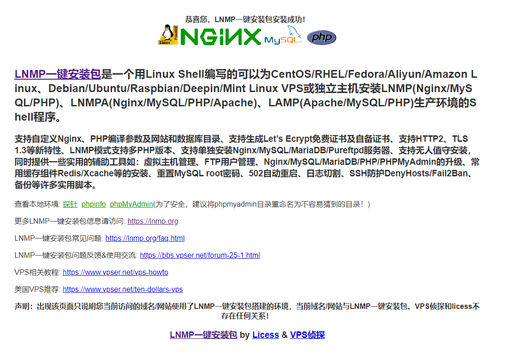

可以查看探针，获取系统数据

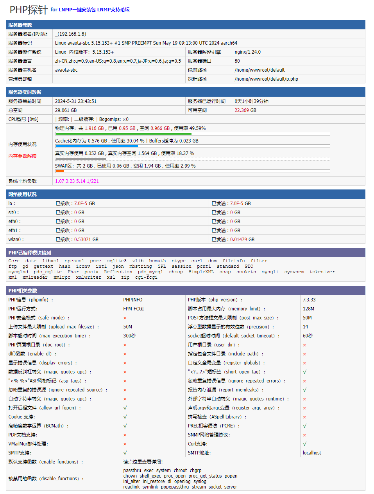
