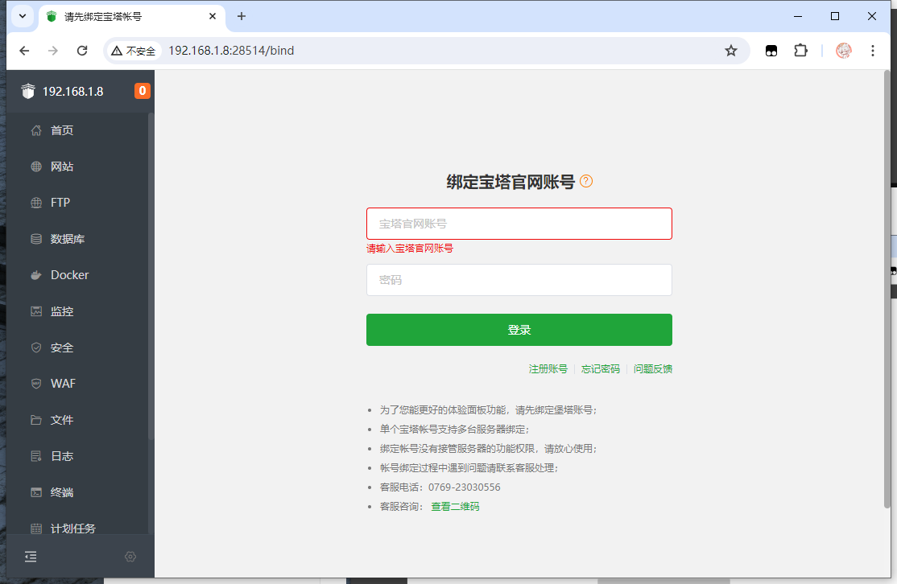
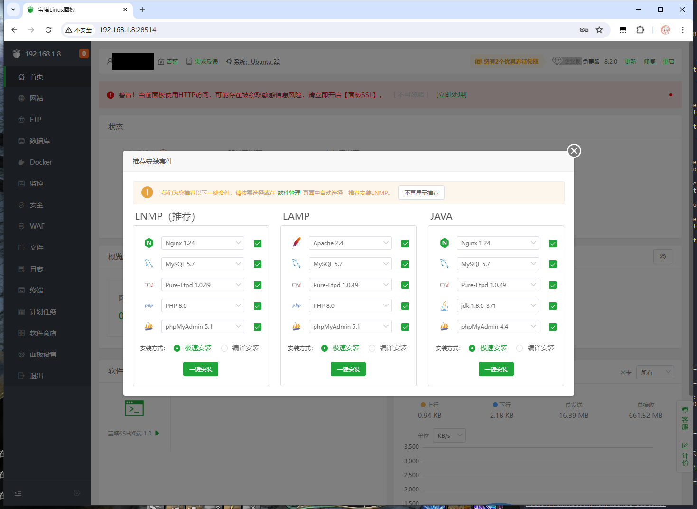
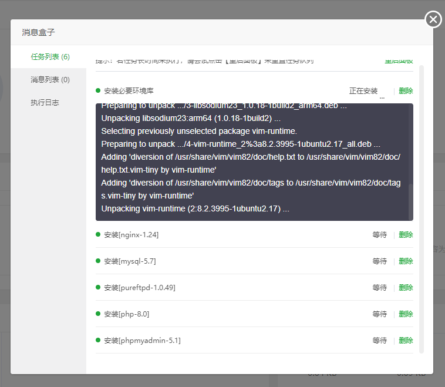

# 部署宝塔面板

宝塔Linux面板是提升运维效率的服务器管理软件，支持一键LAMP/LNMP/集群/监控/网站/FTP/数据库/JAVA等100多项服务器管理功能。


## 开始部署

运行命令一键部署宝塔面板

```
wget -O install.sh https://download.bt.cn/install/install-ubuntu_6.0.sh && sudo bash install.sh ed8484bec
```


部署完成后会显示


打开浏览器即可进入面板


面板登录用户名密码都显示出来了


需要同意用户协议


此处需要绑定账号



之后便可以开启面板使用


## 安装基础服务套件

这里选择推荐的 LNMP 安装



即可作为网站使用。


