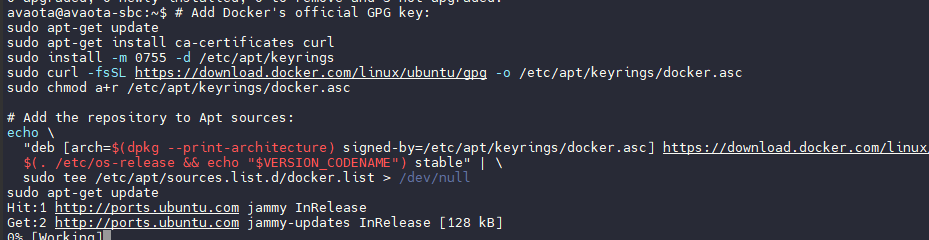
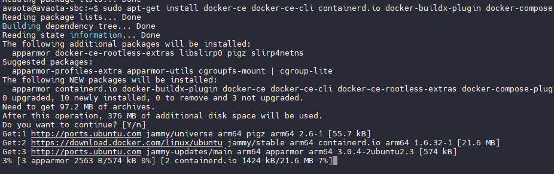

# 部署 Docker 服务

Docker 是一个开源的应用容器引擎，让开发者可以打包他们的应用以及依赖包到一个可移植的镜像中，然后发布到任何流行的 Linux或Windows操作系统的机器上，也可以实现虚拟化。容器是完全使用沙箱机制，相互之间不会有任何接口。

## 准备安装

### 卸载旧版本

在安装Docker Engine之前，您需要卸载任何冲突的软件包。

发行版维护者在APT中提供了Docker软件包的非官方发布。在安装官方版本的Docker Engine之前，您必须卸载这些软件包。

需要卸载的非官方软件包包括：

- docker.io
- docker-compose
- docker-compose-v2
- docker-doc
- podman-docker

此外，Docker Engine依赖于containerd和runc。Docker Engine将这些依赖项捆绑为一个包：containerd.io。如果您之前已经安装了containerd或runc，请卸载它们以避免与Docker Engine捆绑版本的冲突。

运行以下命令以卸载所有冲突的软件包：

```bash
for pkg in docker.io docker-doc docker-compose docker-compose-v2 podman-docker containerd runc; do sudo apt-get remove $pkg; done
```

当您卸载Docker时，存储在`/var/lib/docker`中的镜像、容器、卷和网络不会自动删除。如果您想进行干净的安装，并且希望清理任何现有数据，请阅读[卸载Docker Engine](https://chat16.aichatos.xyz/#)部分。

### 使用apt软件源安装

在首次在新主机上安装Docker Engine之前，您需要设置Docker软件源。之后，您可以从该软件源安装和更新Docker。

- 配置 apt 软件源

```
# Add Docker's official GPG key:
sudo apt-get update
sudo apt-get install ca-certificates curl
sudo install -m 0755 -d /etc/apt/keyrings
sudo curl -fsSL https://download.docker.com/linux/ubuntu/gpg -o /etc/apt/keyrings/docker.asc
sudo chmod a+r /etc/apt/keyrings/docker.asc

# Add the repository to Apt sources:
echo \
  "deb [arch=$(dpkg --print-architecture) signed-by=/etc/apt/keyrings/docker.asc] https://download.docker.com/linux/ubuntu \
  $(. /etc/os-release && echo "$VERSION_CODENAME") stable" | \
  sudo tee /etc/apt/sources.list.d/docker.list > /dev/null
sudo apt-get update
```



- 安装 Docker 软件包

```
sudo apt-get install docker-ce docker-ce-cli containerd.io docker-buildx-plugin docker-compose-plugin
```



- 配置防火墙模式

```
sudo update-alternatives --set iptables /usr/sbin/iptables-legacy
sudo update-alternatives --set ip6tables /usr/sbin/ip6tables-legacy
```

- 启用 Docker

```
sudo systemctl start docker
```

- 测试运行情况

```
sudo docker run hello-world
```

