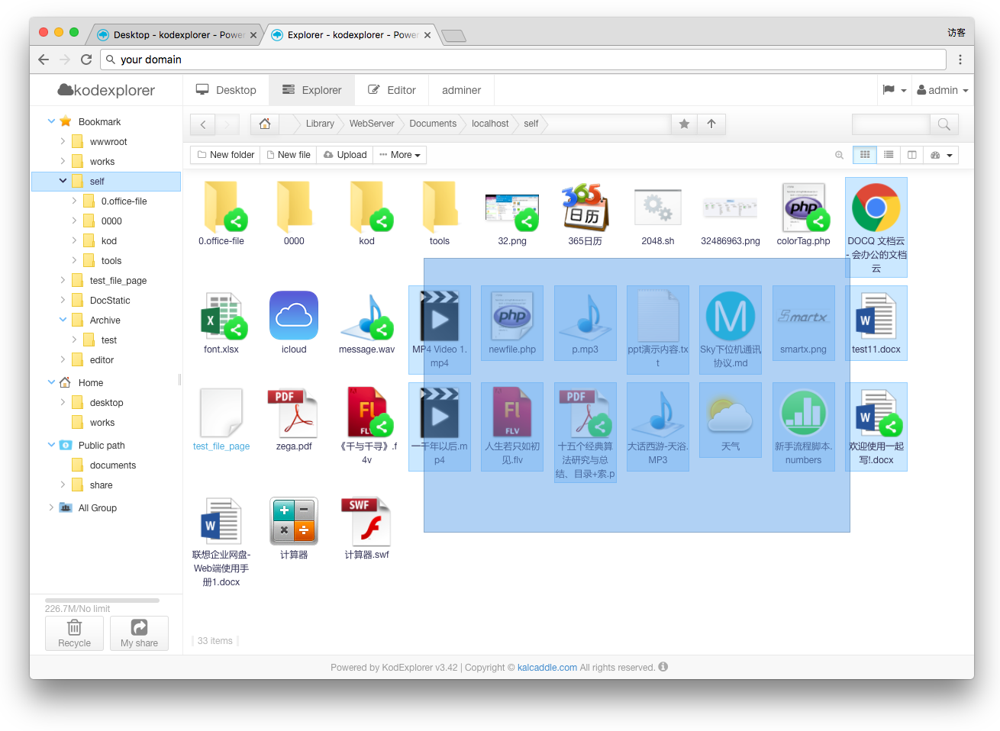
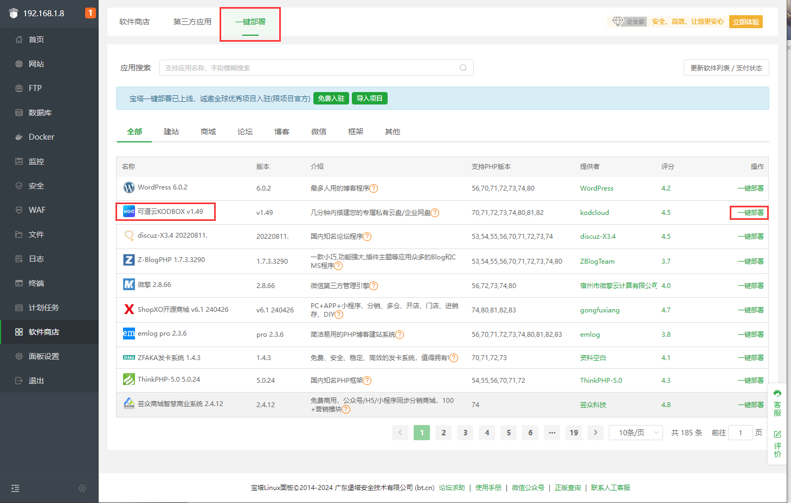
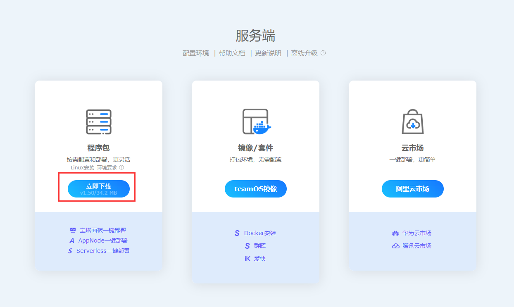

# 部署 可道云搭建简易 NAS

可道云 - KODBOX 是一个开源的基于PHP编写的功能丰富的文件管理系统，具有多语言支持、远程服务器文件操作、多用户支持、灵活的访问权限配置、剪贴板功能、键盘快捷键、文件树、排序功能、文件预览等多种功能。

- 支持40多种语言
- 文件管理：在远程服务器上进行文件和文件夹的所有操作（复制、剪切、粘贴、移动、删除、上传、创建文件夹/文件、重命名等）
- 多用户支持，自定义角色组
- 灵活配置访问权限、文件类型限制和用户界面等
- 剪贴板功能：复制、剪切、粘贴、清除
- 支持选择文件和文件夹（鼠标点击、Ctrl、Shift、单词和键盘快捷键）
- 键盘快捷键：删除、全选、复制、剪切、上/下/左/右/首页/尾页等
- 对所选文件和文件夹支持多种操作：移动、复制、剪切、删除、重命名、打开、压缩、删除、下载等
- 双击或单击设置打开文件和文件夹
- 文件树：允许同时打开和显示多个子文件夹
- 在客户端实现自然排序
- 列表、图标和分割视图
- 拖放移动/复制/克隆/删除文件
- 将文件或文件夹分享给他人
- 将文件夹添加到收藏夹
- 计算目录大小
- 图像文件缩略图
- 正规化：文件名和文件路径的UTF-8正规化等
- 多字符集支持，在各种情况下解决乱码问题；文件名和文件路径的净化器等
- 支持多个分块上传
- 使用HTML5支持的拖放进行后台文件上传；使用Chrome、Firefox和Edge进行文件夹上传
- 从URL（或列表）上传
- 直接提取到当前工作目录（您不想创建文件夹）
- 搜索：按文件名和文件内容搜索
- 根据名称排除文件
- 复制直接文件URL
- 创建/提取/预览存档（zip、rar、7z、tar、gzip、tgz）
- 快速查看，常见文件类型的预览；图像文件、文本文件、pdf、swf、文档文件等
- 依赖于Web浏览器功能的视频和音频播放器

## 准备部署

在部署可道云之前，需要先安装 LNMP 或者 宝塔 面板，可以参考文档进行部署。这里以安装了宝塔面板的AvaotaOS 部署为例。

### 宝塔面板一键部署

前往宝塔面板：软件商店 -> 一键部署 -> 可道云，点击部署即可。

### 手动部署

前往 https://kodcloud.com/download/ 下载程序包

然后上传部署即可。