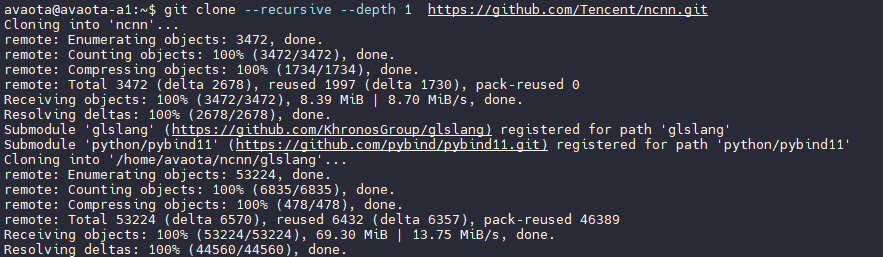
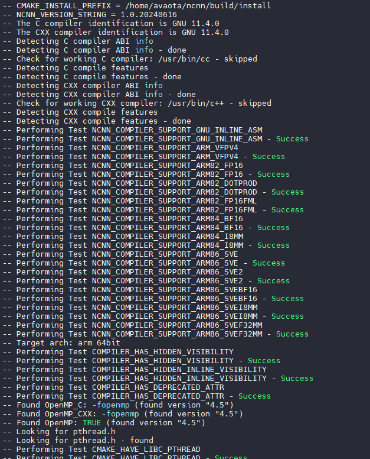
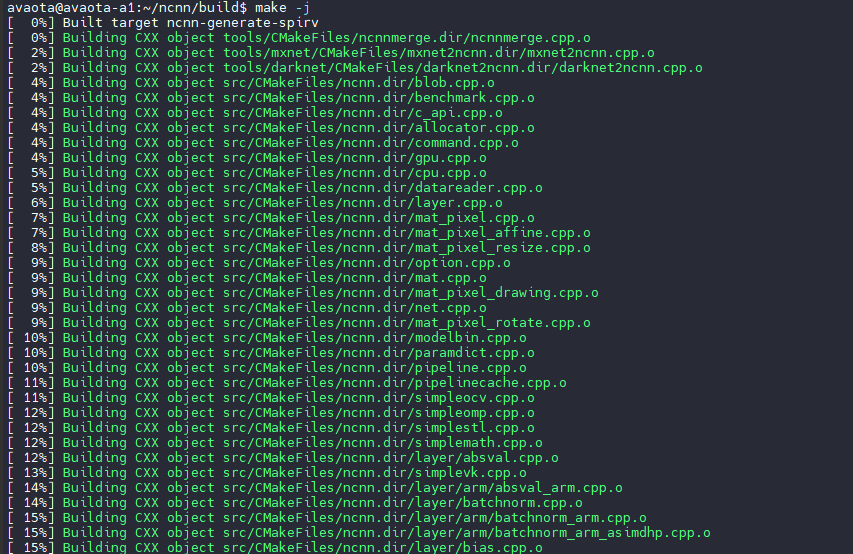
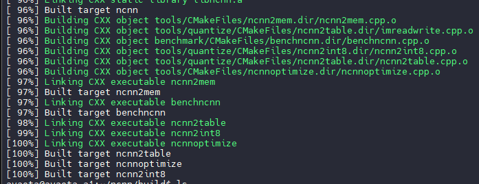

# 部署 ncnn 

ncnn 是一个为手机端极致优化的高性能神经网络前向计算框架。 ncnn 从设计之初深刻考虑手机端的部署和使用。 无第三方依赖，跨平台，手机端 cpu 的速度快于目前所有已知的开源框架。 基于 ncnn，开发者能够将深度学习算法轻松移植到手机端高效执行， 开发出人工智能 APP，将 AI 带到你的指尖。

## ncnn 源码下载

```
git clone --recursive --depth 1  https://github.com/Tencent/ncnn.git
```



## ncnn 编译

```
cd ncnn
mkdir build
cd build
cmake ..
```



开始编译

```
make -j6
```



编译完成后，会提示编译已完成



## 测试 ncnn

将测试使用的 `benchncnn` 复制到 `ncnn/benchmark` 文件夹内，直接运行测试


测试结果如下：

```
avaota@avaota-a1:~/ncnn/benchmark$ ./benchncnn
loop_count = 4
num_threads = 4
powersave = 2
gpu_device = -1
cooling_down = 1
          squeezenet  min =   16.49  max =   17.01  avg =   16.64
     squeezenet_int8  min =   18.11  max =   18.26  avg =   18.17
           mobilenet  min =   22.10  max =   22.19  avg =   22.16
      mobilenet_int8  min =   19.75  max =   19.96  avg =   19.81
        mobilenet_v2  min =   21.52  max =   22.08  avg =   21.80
        mobilenet_v3  min =   17.27  max =   17.48  avg =   17.40
          shufflenet  min =   12.48  max =   12.58  avg =   12.54
       shufflenet_v2  min =   11.47  max =   11.81  avg =   11.58
             mnasnet  min =   17.57  max =   17.63  avg =   17.60
     proxylessnasnet  min =   23.15  max =   23.51  avg =   23.34
     efficientnet_b0  min =   28.56  max =   28.88  avg =   28.68
   efficientnetv2_b0  min =   33.63  max =   34.17  avg =   33.82
        regnety_400m  min =   28.87  max =   29.00  avg =   28.93
           blazeface  min =    4.11  max =    4.15  avg =    4.13
           googlenet  min =   60.61  max =   61.63  avg =   61.10
      googlenet_int8  min =   59.67  max =   60.04  avg =   59.89
            resnet18  min =   46.53  max =   47.01  avg =   46.74
       resnet18_int8  min =   43.07  max =   43.77  avg =   43.53
             alexnet  min =   46.74  max =   48.82  avg =   48.18
               vgg16  min =  286.38  max =  292.93  avg =  289.49
          vgg16_int8  min =  313.20  max =  315.49  avg =  314.35
            resnet50  min =  105.36  max =  105.80  avg =  105.61
       resnet50_int8  min =  101.69  max =  102.31  avg =  101.99
      squeezenet_ssd  min =   59.38  max =   61.03  avg =   60.00
 squeezenet_ssd_int8  min =   56.39  max =   56.64  avg =   56.53
       mobilenet_ssd  min =   51.75  max =   52.23  avg =   51.94
  mobilenet_ssd_int8  min =   45.05  max =   45.67  avg =   45.37
      mobilenet_yolo  min =  119.79  max =  121.57  avg =  120.77
  mobilenetv2_yolov3  min =   80.17  max =   80.41  avg =   80.30
         yolov4-tiny  min =  110.66  max =  111.11  avg =  110.83
           nanodet_m  min =   33.79  max =   34.17  avg =   33.93
    yolo-fastest-1.1  min =   16.08  max =   16.24  avg =   16.17
      yolo-fastestv2  min =   14.55  max =   14.67  avg =   14.59
  vision_transformer  min = 2020.00  max = 2025.81  avg = 2022.37
          FastestDet  min =   13.77  max =   14.05  avg =   13.89
```

