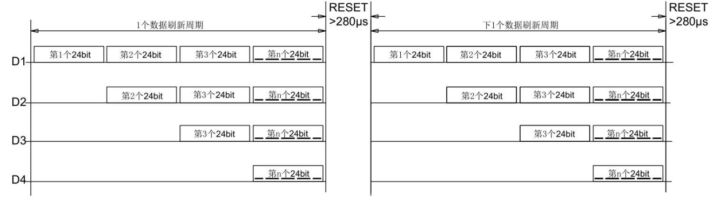

# WS2812 RGB LED

在 Avaota SBC 的开发板中，通常会有几个 WS2812 RGB LED 灯。例如 Avaota A1 的如下位置：


对于 AvaotaOS，提供了硬件的 LEDC（Light Emitting Diode Controller），发光二极管控制器作为WS2812 RGB LED 灯的控制器。每个 LED 的三基色均可实现 256 级亮度显示，因此整个 LED 可完成 256ˆ3（即 16777216）种颜色的全真色彩显示。模块支持最大1024颗外控 LED级联。

## WS2812 驱动介绍

LED 典型电路如图所示，其中 DI 表示控制数据输入脚，DO 表示控制数据输出脚。DI 端接收从控制器传过来的数据，每个 LED 内部的数据锁存器会存储 24bit 数据，剩余的数据经过内部整形处理电路整形放大后通过 DO 端口开始转发输出给下一个级联的 LED。因此，每经过一个LED，数据减少 24bit。


LED典型电路如上图所示，其中 DI 表示控制数据输入脚，DO 表示控制数据输出脚。DI 端接受从控制器传输过来的数据，每个 LED 内部的数据锁存器会存储 24bit (分别对应 R,G,B 三种颜色)数据，剩余的数据经过内部整形处理电路整形放大后通过 DO 端口开始转发输出给下一个级联的 LED 。因此，每经过一个 LED ，数据减少 24bit。




## WS2812 驱动配置说明

配置驱动，默认 Avaota OS 已经勾选该驱动。如果未勾选请配置

```
LED Drivers ->
	<*> LEDC Support for Allwinner SoCs
```


配置设备树，首先需要配置 PIO 节点，配置 LEDC 使用的 GPIO

```c
&pio {
	ledc_pins_a: ledc@0 {
		pins = "PH19";
		function = "ledc";
		drive-strength = <10>;
	};

	ledc_pins_b: ledc@1 {
		pins = "PH19";
		function = "gpio_in";
	};
};
```

然后配置 LEDC 模块的数值

```c
&ledc  {
	pinctrl-names = "default", "sleep";
	pinctrl-0 = <&ledc_pins_a>;
	pinctrl-1 = <&ledc_pins_b>;
	led_count = <4>;
	output_mode = "GRB";
	reset_ns = <84>;
	t1h_ns = <800>;
	t1l_ns = <320>;
	t0h_ns = <300>;
	t0l_ns = <800>;
	wait_time0_ns = <84>;
	wait_time1_ns = <84>;
	wait_data_time_ns = <600000>;
	status = "okay";
};
```

- `pinctrl-names`: 用于表示 0 和 1 的 pinctrl 哪个是默认和休眠状态。
- `pinctrl-0`: 引脚配置，这里是默认使用的时候配置。
- `pinctrl-1`: 同上，这里是休眠时的配置。
- `led_count`: LED 灯的数目，根据硬件配置。
- `output_mode`: LED 灯输出模式，根据 LED 灯的 datasheet 进行配置。
- `reset_ns`: LED 灯 reset 时间控制。
- `t1h_ns`: 1 码高电平时间，根据 LED 灯的 datasheet 进行配置。
- `t1l_ns`: 1 码低电平时间，根据 LED 灯的 datasheet 进行配置。
- `t0h_ns`: 0 码高电平时间，根据 LED 灯的 datasheet 进行配置。
- `t0l_ns`: 0 码低电平时间，根据 LED 灯的 datasheet 进行配置。
- `wait_time0_ns`: 两个 LED 数据之间的等待时间，根据 LED 灯的 datasheet 进行配置。
- `wait_time1_ns`: 帧数据之间的等待时间，根据 LED 灯的 datasheet 进行配置。
- `wait_data_time_ns`: 内部 FIFO 等待数据时间，超过时间触发异常中断。
- `status`: 设备状态。

### WS2812 使用说明

驱动会在 `/sys/class/leds` 注册每个LED对应的设备目录

```text
/sys/class/leds/sunxi_led0r // 红色
/sys/class/leds/sunxi_led0g // 绿色
/sys/class/leds/sunxi_led0b // 蓝色
```

其中 `0` 表示LED的编号，如果是 1 号 LED 则是

```text
/sys/class/leds/sunxi_led1r
/sys/class/leds/sunxi_led1g
/sys/class/leds/sunxi_led1b
```

需要调节第 0 个LED的颜色为白光且最亮，操作如下：

```text
echo 255 > /sys/class/leds/sunxi_led0r/brightness
echo 255 > /sys/class/leds/sunxi_led0g/brightness
echo 255 > /sys/class/leds/sunxi_led0b/brightness
```

### 实现七彩流水灯

#### C 语言实现

```c
#include <fcntl.h>
#include <stdint.h>
#include <stdio.h>
#include <stdlib.h>
#include <string.h>
#include <sys/times.h>
#include <sys/types.h>
#include <unistd.h>

// 使用RGB 分量合成颜色值
#define MERAGECOLOR(G, R, B) (((uint32_t)G << 16) | ((uint16_t)R << 8) | B)
#define PIXEL_NUM 4

int fd[PIXEL_NUM][3];// 存放文件描述符数组

void init_leds() {
    char path[100];

    // 初始化LED文件描述符
    for (int i = 0; i < PIXEL_NUM; ++i) {
        snprintf(path, sizeof(path), "/sys/class/leds/sunxi_led%d%c/brightness", i, 'r');
        fd[i][0] = open(path, O_WRONLY);
        if (fd[i][0] == -1) {
            printf("Failed to open file for LED %d, color %c\n", i, 'r');
        }
        snprintf(path, sizeof(path), "/sys/class/leds/sunxi_led%d%c/brightness", i, 'g');
        fd[i][1] = open(path, O_WRONLY);
        if (fd[i][1] == -1) {
            printf("Failed to open file for LED %d, color %c\n", i, 'g');
        }
        snprintf(path, sizeof(path), "/sys/class/leds/sunxi_led%d%c/brightness", i, 'b');
        fd[i][2] = open(path, O_WRONLY);
        if (fd[i][2] == -1) {
            printf("Failed to open file for LED %d, color %c\n", i, 'b');
        }
    }
}

void sunxi_set_led_brightness(int led_id, uint8_t r, uint8_t g, uint8_t b) {
    if (led_id < 0 || led_id >= PIXEL_NUM) {
        printf("Invalid LED ID\n");
        return;
    }

    dprintf(fd[led_id][0], "%d", r);
    dprintf(fd[led_id][1], "%d", g);
    dprintf(fd[led_id][2], "%d", b);
}

void close_leds() {
    // 关闭LED文件描述符
    for (int i = 0; i < PIXEL_NUM; ++i) {
        for (int j = 0; j < 3; ++j) {
            if (fd[i][j] != -1) {
                close(fd[i][j]);
            }
        }
    }
}

// 生成颜色
uint32_t WS281x_Wheel(uint8_t wheelPos) {
    wheelPos = 255 - wheelPos;
    if (wheelPos < 85) {
        return MERAGECOLOR(255 - wheelPos * 3, 0, wheelPos * 3);
    }
    if (wheelPos < 170) {
        wheelPos -= 85;
        return MERAGECOLOR(0, wheelPos * 3, 255 - wheelPos * 3);
    }
    wheelPos -= 170;
    return MERAGECOLOR(wheelPos * 3, 255 - wheelPos * 3, 0);
}

// 亮度设置
void WS281xLSet(uint32_t id, uint32_t rgb, float k) {
    uint8_t r, g, b;
    float h, s, v;
    uint8_t cmax, cmin, cdes;

    r = (uint8_t) (rgb >> 16);
    g = (uint8_t) (rgb >> 8);
    b = (uint8_t) (rgb);

    cmax = r > g ? r : g;
    if (b > cmax)
        cmax = b;
    cmin = r < g ? r : g;
    if (b < cmin)
        cmin = b;
    cdes = cmax - cmin;

    v = cmax / 255.0f;
    s = cmax == 0 ? 0 : cdes / (float) cmax;
    h = 0;

    if (cmax == r && g >= b)
        h = ((g - b) * 60.0f / cdes) + 0;
    else if (cmax == r && g < b)
        h = ((g - b) * 60.0f / cdes) + 360;
    else if (cmax == g)
        h = ((b - r) * 60.0f / cdes) + 120;
    else
        h = ((r - g) * 60.0f / cdes) + 240;

    v *= k;

    float f, p, q, t;
    float rf, gf, bf;
    int i = ((int) (h / 60) % 6);
    f = (h / 60) - i;
    p = v * (1 - s);
    q = v * (1 - f * s);
    t = v * (1 - (1 - f) * s);
    switch (i) {
        case 0:
            rf = v;
            gf = t;
            bf = p;
            break;
        case 1:
            rf = q;
            gf = v;
            bf = p;
            break;
        case 2:
            rf = p;
            gf = v;
            bf = t;
            break;
        case 3:
            rf = p;
            gf = q;
            bf = v;
            break;
        case 4:
            rf = t;
            gf = p;
            bf = v;
            break;
        case 5:
            rf = v;
            gf = p;
            bf = q;
            break;
        default:
            break;
    }

    r = (uint8_t) (rf * 255.0);
    g = (uint8_t) (gf * 255.0);
    b = (uint8_t) (bf * 255.0);

    sunxi_set_led_brightness(id, r, g, b);
}

// 测试 LEDC
int main() {
    int i = 0, j = 0, err;
    int mode = 0;
    uint8_t R = 0, G = 0, B = 0;

    init_leds();

    while (1) {
        for (j = 0; j < 256; j++) {
            for (i = 0; i < PIXEL_NUM; i++) {
                WS281xLSet(i, WS281x_Wheel(((i * 256 / PIXEL_NUM) + j) & 255), 0.1);
            }
            usleep(1000);
        }
        usleep(10000);
    }

    close_leds();

    return 1;
}
```

#### Python 实现

```python
import os
import time
import math

PIXEL_NUM = 4
fd = [[None, None, None] for _ in range(PIXEL_NUM)]  # 文件描述符数组

def init_leds():
    global fd
    path = ""

    # 初始化LED文件描述符
    for i in range(PIXEL_NUM):
        path = f"/sys/class/leds/sunxi_led{i}{'r'}/brightness"
        fd[i][0] = os.open(path, os.O_WRONLY)
        if fd[i][0] == -1:
            print(f"Failed to open file for LED {i}, color {'r'}")
        
        path = f"/sys/class/leds/sunxi_led{i}{'g'}/brightness"
        fd[i][1] = os.open(path, os.O_WRONLY)
        if fd[i][1] == -1:
            print(f"Failed to open file for LED {i}, color {'g'}")

        path = f"/sys/class/leds/sunxi_led{i}{'b'}/brightness"
        fd[i][2] = os.open(path, os.O_WRONLY)
        if fd[i][2] == -1:
            print(f"Failed to open file for LED {i}, color {'b'}")

def sunxi_set_led_brightness(led_id, r, g, b):
    if led_id < 0 or led_id >= PIXEL_NUM:
        print("Invalid LED ID")
        return

    os.write(fd[led_id][0], str(r).encode())
    os.write(fd[led_id][1], str(g).encode())
    os.write(fd[led_id][2], str(b).encode())

def close_leds():
    # 关闭LED文件描述符
    global fd
    for i in range(PIXEL_NUM):
        for j in range(3):
            if fd[i][j] is not None:
                os.close(fd[i][j])

def ws281x_wheel(wheel_pos):
    wheel_pos = 255 - wheel_pos
    if wheel_pos < 85:
        return merge_color(255 - wheel_pos * 3, 0, wheel_pos * 3)
    if wheel_pos < 170:
        wheel_pos -= 85
        return merge_color(0, wheel_pos * 3, 255 - wheel_pos * 3)
    wheel_pos -= 170
    return merge_color(wheel_pos * 3, 255 - wheel_pos * 3, 0)

def merge_color(r, g, b):
    return (r << 16) | (g << 8) | b

def ws281x_lset(id, rgb, k):
    r = (rgb >> 16) & 0xFF
    g = (rgb >> 8) & 0xFF
    b = rgb & 0xFF

    cmax = max(r, g, b)
    cmin = min(r, g, b)
    cdes = cmax - cmin

    v = cmax / 255.0
    s = cmax / 255.0 if cmax == 0 else cdes / cmax

    if cmax == r and g >= b:
        h = (g - b) * 60.0 / cdes + 0
    elif cmax == r and g < b:
        h = (g - b) * 60.0 / cdes + 360
    elif cmax == g:
        h = (b - r) * 60.0 / cdes + 120
    else:
        h = (r - g) * 60.0 / cdes + 240

    v *= k

    i = math.floor(h / 60) % 6
    f = h / 60 - i
    p = v * (1 - s)
    q = v * (1 - f * s)
    t = v * (1 - (1 - f) * s)

    if i == 0:
        rf, gf, bf = v, t, p
    elif i == 1:
        rf, gf, bf = q, v, p
    elif i == 2:
        rf, gf, bf = p, v, t
    elif i == 3:
        rf, gf, bf = p, q, v
    elif i == 4:
        rf, gf, bf = t, p, v
    else:
        rf, gf, bf = v, p, q

    r = int(rf * 255.0)
    g = int(gf * 255.0)
    b = int(bf * 255.0)

    sunxi_set_led_brightness(id, r, g, b)

def main():
    init_leds()
    try:
        while True:
            for j in range(256):
                for i in range(PIXEL_NUM):
                    ws281x_lset(i, ws281x_wheel(int((float(i) * 256.0 / float(PIXEL_NUM) + j)) & 255), 0.1)
                time.sleep(0.01)  # 控制LED变化速度
            time.sleep(0.1)
    finally:
        close_leds()

if __name__ == "__main__":
    main()
```

