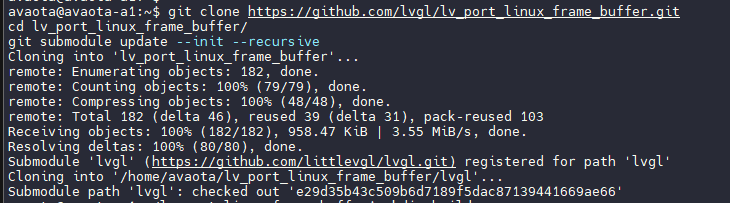

# SPI 屏幕驱动 LVGL 

LVGL 是一个免费的开源图形库，提供了创建嵌入式 GUI 所需的一切，具有易于使用的图形元素，美观的视觉效果和低内存占用，采用 MIT 许可协议，可以访问[LittlevGL](https://littlevgl.com/)获取更多资料。

- 强大的构建块：按钮、图表、列表、滑块、图像等。
- 高级图形引擎：动画、抗锯齿、不透明度、平滑滚动、混合模式等。
- 支持各种输入设备：触摸屏、鼠标、键盘、编码器、按钮等。
- 支持多显示器。
- 独立于硬件，可与任何微控制器和显示器一起使用。
- 可扩展以使用少量内存（64 kB 闪存、16 kB RAM）运行。
- 多语言支持，支持 UTF-8 处理、CJK、双向和阿拉伯语。
- 通过类 CSS 样式完全可定制的图形元素。
- 受 CSS 启发的强大布局：Flexbox 和 Grid。
- 支持操作系统、外部内存和 GPU，但不是必需的。
- 使用单个帧缓冲区也能平滑渲染。
- 用 C 编写并与 C++ 兼容。
- Micropython Binding 在 Micropython 中公开 LVGL API。
- 可以在 PC 上使用模拟器开发。
- 100 多个简单的例子。
- 在线和 PDF 格式的文档和API参考。

## LVGL 环境配置

LVGL 的编译需要 `libdrm` 同时推荐使用 `libsdl2`

```
sudo apt install libdrm-dev libsdl2-dev
```

## LVGL 源码获取

```
git clone https://github.com/lvgl/lv_port_linux_frame_buffer.git
cd lv_port_linux_frame_buffer/
git submodule update --init --recursive
```



## LVGL 编译

创建编译文件夹，开始编译

```
mkdir build
cd build 
cmake ..
make -j6
```


