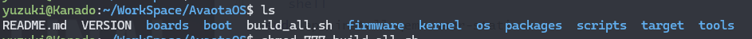

# 获取 SDK

在开发 AvaotaOS 前，需要获取 AvaotaOS 的源代码，地址如下：

- https://github.com/AvaotaSBC/AvaotaOS

## 获取源码

首先，使用 `mkdir` 命令工作目录：

```
mkdir WorkSpace
```

然后进入工作目录

```shell
cd WorkSpace
```

使用 `git` 命令获取源码

```c
git clone --depth=1 https://github.com/AvaotaSBC/AvaotaOS
```

下载完成后查看源码，进入 AvaotaOS 源码目录

```shell
cd AvaotaOS
```

查看源码：

```shell
ls
```



然后赋予执行权限：

```
chmod +x build_all.sh
```

### 演示

import AsciinemaWidget from '/src/components/AsciinemaWidget';

<AsciinemaWidget src={require('./assets/get-sdk/get-sdk.docx').default} rows={30} idleTimeLimit={1} preload={true} />