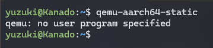

# 搭建开发环境

AvaotaOS 的开发环境需要 Linux 系统。这里使用的是 WSL2 下的 Ubuntu 22.04 Linux系统。

```shell
yuzuki@Kanado:~$ neofetch
            .-/+oossssoo+/-.               yuzuki@Kanado
        `:+ssssssssssssssssss+:`           -------------
      -+ssssssssssssssssssyyssss+-         OS: Ubuntu 22.04.4 LTS on Windows 10 x86_64
    .ossssssssssssssssssdMMMNysssso.       Kernel: 5.10.16.3-microsoft-standard-WSL2
   /ssssssssssshdmmNNmmyNMMMMhssssss/      Uptime: 19 mins
  +ssssssssshmydMMMMMMMNddddyssssssss+     Packages: 507 (dpkg)
 /sssssssshNMMMyhhyyyyhmNMMMNhssssssss/    Shell: bash 5.1.16
.ssssssssdMMMNhsssssssssshNMMMdssssssss.   Terminal: Windows Terminal
+sssshhhyNMMNyssssssssssssyNMMMysssssss+   CPU: AMD Ryzen 5 5600 (12) @ 3.493GHz
ossyNMMMNyMMhsssssssssssssshmmmhssssssso   GPU: e483:00:00.0 Microsoft Corporation Device 008e
ossyNMMMNyMMhsssssssssssssshmmmhssssssso   Memory: 142MiB / 25599MiB
+sssshhhyNMMNyssssssssssssyNMMMysssssss+
.ssssssssdMMMNhsssssssssshNMMMdssssssss.
 /sssssssshNMMMyhhyyyyhdNMMMNhssssssss/
  +sssssssssdmydMMMMMMMMddddyssssssss+
   /ssssssssssshdmNNNNmyNMMMMhssssss/
    .ossssssssssssssssssdMMMNysssso.
      -+sssssssssssssssssyyyssss+-
        `:+ssssssssssssssssss+:`
            .-/+oossssoo+/-.
```

## 下载需要的软件包

### 更新软件源，更新系统软件包

```shell
sudo apt-get update
sudo apt-get upgrade -y
```

### 安装开发依赖

```shell
sudo apt-get install build-essential subversion git libncurses5-dev zlib1g-dev gawk flex bison quilt libssl-dev xsltproc libxml-parser-perl mercurial bzr ecj cvs unzip lsof bc -y
sudo apt-get install gcc-arm-none-eabi cmake build-essential gcc-aarch64-linux-gnu mtools qemu-user-static bc pkg-config -y
sudo apt install mmdebstrap ubuntu-keyring automake autoconf gcc make pixz libconfuse2 libconfuse-common libconfuse-dev -y
```

### 安装相关工具

```shell
sudo apt-get install kconfig-frontends android-tools-mkbootimg python2 libpython3-dev 
```

### 增加架构支持

```shell
sudo dpkg --add-architecture i386
sudo apt-get update
```

### 安装相关工具

```shell
sudo apt install gcc-multilib 
sudo apt install libc6:i386 libstdc++6:i386 lib32z1
```

### 安装虚拟化工具

```shell
sudo apt install qemu-user-static
```

## 检查安装是否完成

运行命令`qemu-aarch64-static` 查看安装是否完成，如果安装完成则显示 `qemu: no user program specified`



### 演示

import AsciinemaWidget from '/src/components/AsciinemaWidget';

<AsciinemaWidget src={require('./assets/prepare-env/download_package.docx').default} rows={30} idleTimeLimit={1} preload={true} />