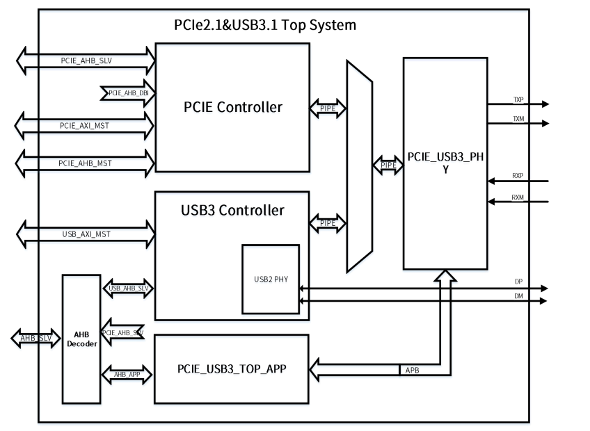
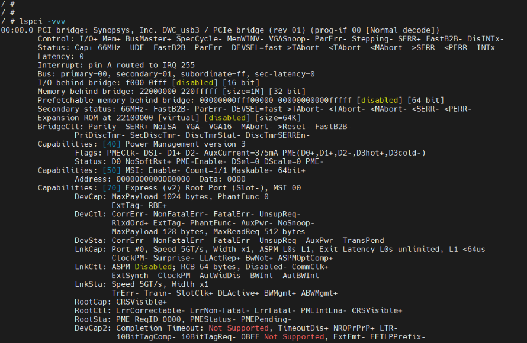

# PCIe - PCI Express 

`PCI Express`，简称`PCI-E`，官方简称`PCIe`，是计算机总线的一个重要分支，它沿用既有的PCI编程概念及信号标准，并且构建了更加高速的串行通信系统标准。目前这一标准由`PCI-SIG`组织制定和维护。
与PCI总线不同，PCIe总线使用端到端的连接方式，在一条链路上的两端只能各连接一个设备，这两个设备互为数据发送端和接收端，所以PCIe总线的物理链路的一个数据通路为一Lane，就有两组差分信号，及共4根信号线，
其高带宽就由多条lane组成，目前PCIe链路可以支持1、2、4、8、16和32个Lane，即x1、x2、x4、x8、x16、x32宽度的PCIe链路，每一个Lane上使用的总线频率与PCIe总线使用的版本相关。PCIe不断完善和发展的新版本支持的理论带宽可满足多种高带宽要求的场合。

## 模块配置

### 驱动配置

驱动位于

```
PCIe Drivers ->
	<*> Allwinner PCIe RC controller - Host mode         # PCIe HOST 模式
	<*> Allwinner PCIe EP controller - Endpoint mode     # PCIe EP 模式
```

部分平台使用 combophy，需要勾选 PHY 的驱动
```
PHY Drivers ->
	<*> Allwinner INNO COMBO PHY Driver                  # PCIe PHY
```

### 设备树配置

在设备树中配置如下:

在 SoC 的 `dtsi` 文件中提炼了内存基地址、中断控制、时钟等共性信息，是该类芯片所有平台的模块配置

```c
pcie: pcie@4800000 {
	compatible = "allwinner,sunxi-pcie-v210-rc";
	#address-cells = <3>;
	#size-cells = <2>;
	bus-range = <0x0 0xff>;
	reg = <0 0x04800000 0 0x480000>;
	reg-names = "dbi";
	device_type = "pci";
	ranges = <0x00000800 0 0x20000000 0x0 0x20000000 0 0x01000000
		  0x81000000 0 0x21000000 0x0 0x21000000 0 0x01000000
		  0x82000000 0 0x22000000 0x0 0x22000000 0 0x07000000>;
	num-lanes = <1>;
	phys = <&combophy PHY_TYPE_PCIE>;
	phy-names = "pcie-phy";
	interrupts = <GIC_SPI 107 IRQ_TYPE_LEVEL_HIGH>,
		     <GIC_SPI 106 IRQ_TYPE_LEVEL_HIGH>,
		     <GIC_SPI 98  IRQ_TYPE_LEVEL_HIGH>,
		     <GIC_SPI 99  IRQ_TYPE_LEVEL_HIGH>,
		     <GIC_SPI 100 IRQ_TYPE_LEVEL_HIGH>,
		     <GIC_SPI 101 IRQ_TYPE_LEVEL_HIGH>,
		     <GIC_SPI 102 IRQ_TYPE_LEVEL_HIGH>,
		     <GIC_SPI 103 IRQ_TYPE_LEVEL_HIGH>,
		     <GIC_SPI 104 IRQ_TYPE_LEVEL_HIGH>,
		     <GIC_SPI 105 IRQ_TYPE_LEVEL_HIGH>;
	interrupt-names = "msi", "sii", "edma-w0", "edma-w1", "edma-w2", "edma-w3",
			  "edma-r0", "edma-r1", "edma-r2", "edma-r3";
	#interrupt-cells = <1>;
	num-edma = <4>;
	max-link-speed = <2>;
	num-ib-windows = <8>;
	num-ob-windows = <8>;
	linux,pci-domain = <0>;
	resets = <&ccu RST_BUS_PCIE_USB3>;
	power-domains = <&pd1 A523_PCK_PCIE>;
	clocks = <&ccu CLK_USB3_REF>, <&ccu CLK_PLL_PERI0_200M>, <&dcxo24M>, <&ccu CLK_PCIE_AUX>;
	clock-names = "pclk_ref", "pclk_per", "hosc", "pclk_aux";
	status = "disabled";
};
```

- `compatible` 表征具体的设备,用于驱动和设备的绑定。
- `bus-range` PCIe RC模式的总线范围。
- `reg` 设备使用的地址。
- `rangs` PCIe的地址空间范围，包含：配置空间，IO空间和MEM空间。
- `num-lanes` 支持的最大lane数。
- `phy` 引用phy驱动的节点。
- `interrupts` 设备使用的中断。
- `num-edma` DMA读或写的通道数。
- `max-link-speed` 支持的最大Gen速率。
- `num-ib-windows` 支持的最大inbound窗口数。
- `num-ob-windows` 支持的最大outbound窗口数。
- `num-viewport` 可映射窗口的总对数。
- `linux,pci-domain` 设定PCIe域。
- `power-domains` 电源域。
- `clocks` 时钟控制源。
- `resets` 复位信号源。
- `busno` 总线号。

#### 使用 combophy 的平台

部分平台使用 combophy 复用 USB3.0 与 PCIe 的 SerDes PHY，框图如下



其中 `combophy`为`PCIe`的phy配置节点，同样体现在 `dtsi` 中：

```c
combophy: phy@4f00000 {
	compatible = "allwinner,inno-combphy";
	reg = <0x0 0x04f00000 0x0 0x80000>, /* Sub-System Application Registers */
	      <0x0 0x04f80000 0x0 0x80000>; /* Combo INNO PHY Registers */
	reg-names = "phy-ctl", "phy-clk";
	power-domains = <&pd1 A523_PCK_PCIE>;
	phy_refclk_sel = <0>; /* 0:internal clk; 1:external clk */
	resets = <&ccu RST_BUS_PCIE_USB3>;
	#phy-cells = <1>;
	status = "disabled";
};
```

- `reg` 设备使用的地址。
- `phy_refclk_sel` phy时钟的参考源：0表示内部时钟，1表示外部时钟。

在设备端，需要配置 PHY 的功能

```c
&combophy {
	phy_use_sel = <0>; /* 0:PCIE; 1:USB3 */
	status = "okay";
};
```

-  `phy_use_sel` phy 使用选择，0表示用于PCIE，1表示用于USB3。

同时配置 PCIe 的设备 `reset`，`wake` 等 IO

```c
&pcie {
	reset-gpios = <&pio PH 11 GPIO_ACTIVE_HIGH>;
	wake-gpios = <&pio PH 12 GPIO_ACTIVE_HIGH>;
	pcie3v3-supply = <&reg_bldo3>;
	clk-freq-100M;
	status = "okay";
};
```

- `reset-gpios` PCIe的复位引脚。

- `wake-gpios` PCIe的唤醒引脚。

- `pcie3v3-supply` 配置PCIe外设的3V3供电，可选项。

- `clk-freq-100M` 配置使用100M参考时钟的标志。

## 模块驱动

PCIe 驱动的源代码位于BSP独立仓库的 `drivers/pcie` 目录下，具体的路径如下所示：

```
.
├── Kconfig
├── Makefile
├── pcie-sunxi-dma.c
├── pcie-sunxi-dma.h
├── pcie-sunxi-ep.c
├── pcie-sunxi-plat.c
├── pcie-sunxi-rc.c
└── pcie-sunxi.h
```

## PCIe 使用案例

### NVMe SSD 固态硬盘

- NVMe SSD驱动为内核自有驱动，请在系统menuconfig的配置项中，打开如下配置：

```
CONFIG_BLK_DEV_NVME
```

- 系统启动过程，请注意有无： `pcie link up success` 字样，若无，说明 `PCIe link` 失败，请确认 `phy` 是否正常工作。
- 上述均完成之后，可验证PCIe RC 支持NVMe SSD 功能：


```
mkfs.ext4  /dev/nvme0n1
mkdir /mnt/nvme
mount -t ext4 /dev/nvme0n1 /mnt/nvme
```

  - SSD功能读写测试

```
time dd if=/dev/zero of=/mnt/nvme/a.txt bs=5M count=100
time dd of=/dev/null if=/mnt/nvme/a.txt bs=5M count=100
```
#### 日志分析

```
[5.649101] sunxi-pcie 4800000.pcie: host bridge /soc@3000000/pcie@4800000 ranges:
[5.657618] sunxi-pcie 4800000.pcie:      err 0x0020000000..0x0020ffffff -> 0x0020000000
[5.666702] sunxi-pcie 4800000.pcie:       IO 0x0021000000..0x0021ffffff -> 0x0021000000
[5.675781] sunxi-pcie 4800000.pcie:      MEM 0x0022000000..0x0028ffffff -> 0x0022000000
[5.890801] sunxi-pcie 4800000.pcie: pcie link up success
[5.896858] sunxi-pcie 4800000.pcie: PCIe speed of Gen2
[5.902780] sunxi-pcie 4800000.pcie: PCI host bridge to bus 0000:00
[5.909809] pci_bus 0000:00: root bus resource [bus 00-ff]
[5.915964] pci_bus 0000:00: root bus resource [??? 0x20000000-0x20ffffff flags 0x0]
[5.924650] pci_bus 0000:00: root bus resource [io  0x0000-0xffffff] (bus address [0x21000000-0x21ffffff])
[5.935476] pci_bus 0000:00: root bus resource [mem 0x22000000-0x28ffffff]
[5.943199] pci 0000:00:00.0: [16c3:abcd] type 01 class 0x060400
[5.949941] pci 0000:00:00.0: reg 0x38: [mem 0x00000000-0x0000ffff pref]
[5.957486] pci 0000:00:00.0: supports D1
[5.961979] pci 0000:00:00.0: PME# supported from D0 D1 D3hot
[5.972328] pci 0000:01:00.0: [1e4b:1202] type 00 class 0x010802
[5.979101] pci 0000:01:00.0: reg 0x10: [mem 0x00000000-0x00003fff 64bit]
[5.986940] pci 0000:01:00.0: PME# supported from D0 D3hot D3cold
[5.993819] pci 0000:01:00.0: 4.000 Gb/s available PCIe bandwidth, limited by 5.0 GT/s PCIe x1 link at 0000:00:00.0 (capable of 31.504 Gb/s with 8.0 GT/s PCIe x4 link)
[6.022335] pci 0000:00:00.0: BAR 8: assigned [mem 0x22000000-0x220fffff]
[6.029986] pci 0000:00:00.0: BAR 6: assigned [mem 0x22100000-0x2210ffff pref]
[6.038091] pci 0000:01:00.0: BAR 0: assigned [mem 0x22000000-0x22003fff 64bit]
[6.046299] pci 0000:00:00.0: PCI bridge to [bus 01-ff]
[6.052158] pci 0000:00:00.0:   bridge window [mem 0x22000000-0x220fffff]
[6.060098] nvme nvme0: pci function 0000:01:00.0
[6.065442] nvme 0000:01:00.0: enabling device (0000 -> 0002)
```

- log中解析出的ranges 表示资源配置信息，由dtsi文件配置，分别对应配置空间、IO空间和内存空间的资源划分。

```
[5.649101] sunxi-pcie 4800000.pcie: host bridge /soc@3000000/pcie@4800000 ranges:
[5.657618] sunxi-pcie 4800000.pcie:      err 0x0020000000..0x0020ffffff -> 0x0020000000
[5.666702] sunxi-pcie 4800000.pcie:       IO 0x0021000000..0x0021ffffff -> 0x0021000000
[5.675781] sunxi-pcie 4800000.pcie:      MEM 0x0022000000..0x0028ffffff -> 0x0022000000
```

- log中提示链路训练完成且成功。

```
[5.890801] sunxi-pcie 4800000.pcie: pcie link up success
[5.896858] sunxi-pcie 4800000.pcie: PCIe speed of Gen2
```

- 表示RC下可管理256条bus总线。

```
[5.902780] sunxi-pcie 4800000.pcie: PCI host bridge to bus 0000:00
[5.909809] pci_bus 0000:00: root bus resource [bus 00-ff]
```

- 00:00.0 表示总线0，地址0，功能0。type 01 表示桥设备。16c3:abcd 表示设备的vendor厂商号和device设备号。PME表示支持的功耗管理模式。

```
[5.943199] pci 0000:00:00.0: [16c3:abcd] type 01 class 0x060400
[5.949941] pci 0000:00:00.0: reg 0x38: [mem 0x00000000-0x0000ffff pref]
[5.957486] pci 0000:00:00.0: supports D1
[5.961979] pci 0000:00:00.0: PME# supported from D0 D1 D3hot
```

- 01:00.0 表示总线1，地址0，功能0。type 00 表示EP设备。1e4b:1202 表示设备的vendor厂商号和device设备号，PME表示支持的功耗管理模式。通过枚举信息可以查看EP需要的内存空间大小是0x00003fff，支持x4，受限于RC只是x1，带宽性能如何等信息。

```
[5.972328] pci 0000:01:00.0: [1e4b:1202] type 00 class 0x010802
[5.979101] pci 0000:01:00.0: reg 0x10: [mem 0x00000000-0x00003fff 64bit]
[5.986940] pci 0000:01:00.0: PME# supported from D0 D3hot D3cold
[5.993819] pci 0000:01:00.0: 4.000 Gb/s available PCIe bandwidth, limited by 5.0 GT/s PCIe x1 link at 0000:00:00.0 (capable of 31.504 Gb/s with 8.0 GT/s PCIe x4 link)
```

- 通过此log可以看到枚举后RC将SSD的BAR0内存空间映射到0x22000000-0x22003fff范围内，且是64bit。

```
[6.038091] pci 0000:01:00.0: BAR 0: assigned [mem 0x22000000-0x22003fff 64bit]
```

## PCIe 常用调试方法

### PCIe常用调试工具

#### lspci

| 选项 | 功能                                                         |
| ---- | ------------------------------------------------------------ |
| -v   | 显示PCIe设备的简略信息                                       |
| -vv  | 显示PCIe设备的详细信息                                       |
| -vvv | 显示PCIe设备所有可解析的信息                                 |
| -s   | 只显示指定的PCIe设备，需要输入总线、插槽和功能号             |
| -n   | 显示PCIe设备的相关表示符，包括总线、插槽、功能号、设备类标识符、制造商标识符等 |
| -vvv | 显示PCIe设备所有可解析的信息                                 |
| -d   | 显示指定的PCIe设备，需要输入制造商标识符、设备标识符         |
| -x   | 以16进制显示配置空间的前64字节                               |
| -xx  | 以16进制显示配置空间的前256字节                              |
| -xxx | 以16进制显示配置空间的整个4KB数据                            |



## PCIe通用排查手段

### 软件排查手段

- 检查`phy`配置是否正确，如是否`enable`，是否在menuconfig配置过等。

- 检查`pcie3v3-supply`配置是否正确，如确实需要对外设供电时，检查对应板级信息是否正确。

- 检查`reset-gpios`和`wake-gpios`配置是否正确，如确实需要对外设进行引脚控制时，检查对应板级信息是否正确。

### 硬件排查手段

- 检查`phy`供电是否正常，检查外设EP供电是否正常。

- 检查`phy`时钟波形是否正常。

## FAQ

### 链路训练失败

问题现象：

外设EP在位时，系统log显示错误提醒：`PCIe link failure !`。

问题分析：

外设供电异常或PCB走线问题。

排查步骤：

- 检测对外设EP的供电是否满足外设的要求。

- 排查外设EP的PCB走线是否异常：如连接点错误等。

- 排查功率是否够：如外接电源测试等。
