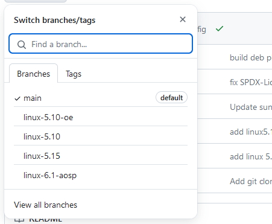

# 获取内核源码

## BSP 与 Kernel

传统的 Linux 内核开发过程中，通常会将 SoC 驱动代码、板级驱动代码、设备树文件 (dts) 等整合到内核源码树中进行管理。这种方式的优势在于所有代码都集中在一个地方，便于跟踪和管理，但缺点是当需要进行内核升级时，可能需要大幅修改这些驱动代码以适配新版本的内核，且不同的 SoC 和板级驱动代码耦合度较高，导致移植和适配工作较为繁琐。

而 AvaotaOS 主要使用的 BSP 独立仓库则采取了另一种方式，将 SoC 驱动代码、板级驱动代码、defconfig、SoC 级 dts 以及 ramfs 等内容独立出来，统一放在一个名为 bsp 的独立仓库中进行管理。这样做的优势在于降低了驱动代码与内核原生代码之间的耦合度，使得 BSP 模块能够更轻松地适配各种内核版本，从而方便产品进行内核升级。同时，由于这些内容被独立管理，也使得定制化和配置更加灵活和简单。

这样，不但保证了**主线内核的接口不会被轻易修改**，降低了**适配的难度**，也同时有助于提高团队的协作效率和开发速度。由于BSP模块被独立出来管理，不同团队成员可以专注于各自领域的开发工作，而无需频繁地进行代码整合和冲突解决。这种模块化的架构能够有效地减少团队成员之间的依赖性，提高并行开发的效率。

与传统的 Linux 内核开发相比，AvaotaOS 使用 BSP 独立仓库的方式能够更好地实现内核与驱动模块的解耦，提高了适配性和灵活性，使得产品内核升级变得更为便捷。

### BSP 仓库主线内核支持情况

| Kernel Source                                                | Kernel Type                    | Kernel Source                                                | Kernel Version          |
| ------------------------------------------------------------ | ------------------------------ | ------------------------------------------------------------ | ----------------------- |
| [Linux 5.10 LTS](https://github.com/AvaotaSBC/linux/tree/linux-5.10) | Linux LTS Kernel               | https://cdn.kernel.org/pub/linux/kernel/v5.x/                | linux-5.10.214          |
| [Linux 5.15 LTS](https://github.com/AvaotaSBC/linux/tree/linux-5.15) | Linux LTS Kernel               | https://cdn.kernel.org/pub/linux/kernel/v5.x/                | linux-5.15.153          |
| [Linux 6.1 AOSP](https://github.com/AvaotaSBC/linux/tree/linux-6.1-aosp) | Android Common Kernels         | https://android.googlesource.com/kernel/common/+/refs/heads/android14-6.1-2023-10 | android14-6.1-2023-10   |
| [openEuler-22.03-LTS-SP2](https://github.com/AvaotaSBC/linux/tree/linux-5.10-oe) | openEuler 22.03 LTS SP2 Kernel | https://gitee.com/openeuler/kernel.git                       | openEuler 22.03 LTS SP2 |

## 下载已经附有BSP的内核

在 https://github.com/AvaotaSBC/linux 中，提供多个分支提供内核下载。



这里如果需要下载 Linux 5.15 内核，则只需要如下命令

```
git clone https://github.com/AvaotaSBC/linux.git -b linux-5.15 --depth=1
```

import AsciinemaWidget from '/src/components/AsciinemaWidget';

<AsciinemaWidget src={require('./assets/post/01-get-kernel/kernel.docx').default} rows={30} idleTimeLimit={1} preload={true} />

## 自行准备主线内核打入 BSP 驱动

接下来将以主线内核 5.15.153 + BSP 作为例子，描述如何自行准备 AvaotaOS 使用的内核，并以 AvaotaOS 保持同步。

### 获取主线内核

主线内核的发布位于：https://kernel.org/


由于支持的内核版本为 5.15.153，需要前往内核打包Release页面下载，地址：https://cdn.kernel.org/pub/linux/kernel/v5.x/

找到 5.15.153 下载


使用命令下载

```
wget https://cdn.kernel.org/pub/linux/kernel/v5.x/linux-5.15.153.tar.xz
```


解压内核

```
tar xvf linux-5.15.153.tar.xz
```

之后文件夹如下所示


### 获取 BSP 驱动

Avaota SBC 使用的内核 BSP 驱动位于：

https://github.com/AvaotaSBC/linux


仓库中包括 `bsp` 驱动文件，`patches` 内核补丁，有一个 `init.sh` 作为内核源码合并的脚本。

获取 BSP 源码

```
git clone https://github.com/AvaotaSBC/linux.git --depth=1
```

### 合入 BSP 驱动

前往解压出来的Linux内核文件夹，拷贝 `bsp` 源码

```
cd linux-5.15.153
mv ../linux/bsp/ .
```

拷贝 patch

```
cp -ravf ../linux/patches/linux-5.15/*.patch .
```

打入补丁

```
git apply 0001-linux-5.15-add-bsp-support.patch
git apply 0002-dts-add-avaota-a1.patch
git apply 0003-dts-add-longanpi-4b.patch
```

复制设备树，配置文件

```
cp -ravf ../linux/patches/linux-5.15/overlays/* .
```

删除不需要的文件

```
rm -rf *.patch
```

### 演示

<AsciinemaWidget src={require('./assets/post/01-get-kernel/bsp.docx').default} rows={30} idleTimeLimit={1} preload={true} />

